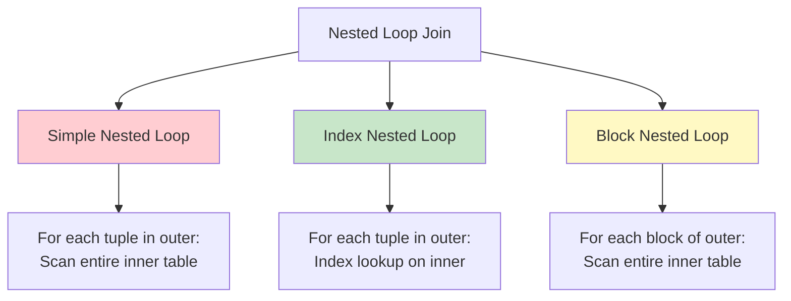
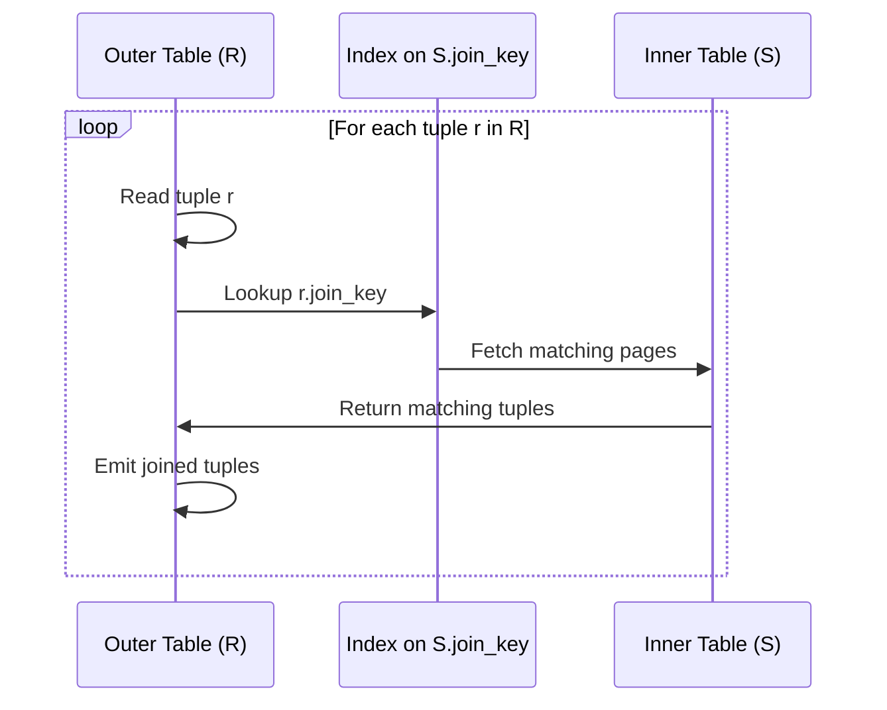
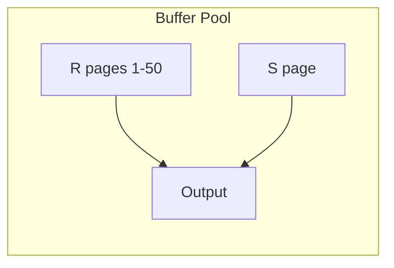

# Nested Loop Join

## Overview

Nested Loop Join is the simplest and most general join algorithm. It works by iterating over one table (the outer relation) and, for each tuple, scanning the other table (the inner relation) for matching tuples. It is the only join algorithm that works for **any join condition** (equi, non-equi, range, etc.), but it can be extremely slow without proper indexing.

## Detailed Explanation

### Variants of Nested Loop Join



### 1. Simple Nested Loop Join

The most basic form: for every tuple in the outer relation, scan the entire inner relation.

```python
# Pseudocode
for each tuple r in R:          # Outer loop
    for each tuple s in S:      # Inner loop (full scan each time)
        if r.join_key == s.join_key:
            emit (r, s)
```

**Cost Analysis:**
```
Let R have Nr tuples occupying Br pages
Let S have Ns tuples occupying Bs pages

I/O Cost: Br + (Nr × Bs)
  - Read R once: Br page reads
  - For each of Nr tuples in R, scan all of S: Nr × Bs page reads

Example:
  R = 1,000 tuples, 50 pages
  S = 100,000 tuples, 5,000 pages

  Cost = 50 + (1,000 × 5,000) = 5,000,050 page reads  ← TERRIBLE
```

**When to use:** Almost never in practice. Only when both tables are tiny (fit in memory).

### 2. Index Nested Loop Join

If there's an index on the inner table's join column, replace the full scan with an index lookup.

```python
# Pseudocode
for each tuple r in R:              # Outer loop
    lookup r.join_key in S's index  # Index lookup
    for each matching tuple s:      # May be multiple matches
        emit (r, s)
```

**Cost Analysis:**
```
I/O Cost: Br + Nr × (index_height + matching_pages)
  - Read R once: Br page reads
  - For each tuple in R: traverse index tree + read matching pages

Example (B+ tree index on S.student_id, height = 3):
  R = 1,000 tuples, 50 pages
  S = 100,000 tuples, 5,000 pages
  Each student has ~10 enrollments (1-2 pages per lookup)

  Cost = 50 + 1,000 × (3 + 2) = 5,050 page reads  ← 1000x better!
```



**Key insight:** The inner table is accessed via index, so we never scan it fully. This is extremely efficient when:
- The outer table is small
- The index is selective (few matches per lookup)
- The index is clustered (matching tuples on same pages)

### 3. Block Nested Loop Join

Instead of iterating per-tuple, iterate per **block (page)** of the outer relation. For each block of R, scan the entire inner relation S.

```python
# Pseudocode
for each block Br in R:         # Outer loop (per page)
    for each tuple r in Br:
        for each tuple s in S:  # Inner loop (full scan)
            if r.join_key == s.join_key:
                emit (r, s)
```

**Cost Analysis:**
```
I/O Cost: Br + (Br × Bs)
  - Read R once: Br page reads
  - For each page in R, scan S: Br × Bs page reads

Example:
  R = 1,000 tuples, 50 pages
  S = 100,000 tuples, 5,000 pages

  Cost = 50 + (50 × 5,000) = 250,050 page reads
  (vs 5,000,050 for simple nested loop — 20x better)
```

**With Buffer Optimization:**
If we have B buffer pages, we can load B-2 pages of R at once (leaving 1 for S's input and 1 for output):

```
Cost = Br + ⌈Br / (B-2)⌉ × Bs

With B = 52 buffers:
  Cost = 50 + ⌈50/50⌉ × 5,000 = 5,050 page reads
```



### Clustering and Nested Loop Performance

| Index Type | Pages per Lookup | Impact |
|------------|-----------------|--------|
| **Clustered index** | 1-2 pages | Very efficient — matching tuples are physically adjacent |
| **Unclustered index** | 1 page per tuple | Can be worse than table scan if many matches |
| **No index** | Full scan | Simple nested loop or block nested loop |

### Example: Real Query Execution

```sql
-- Query: Find all orders for customers in New York
SELECT o.order_id, o.amount
FROM customers c
JOIN orders o ON c.id = o.customer_id
WHERE c.city = 'New York';
```

**Optimizer's decision process:**

```
1. Estimate: ~500 customers in New York (out of 100,000)
2. Orders table has clustered index on customer_id
3. Each customer has ~20 orders

Option A: Index Nested Loop
  - Scan customers where city = 'New York': ~500 tuples
  - For each: index lookup on orders.customer_id → ~20 orders (1-2 pages)
  - Total: ~500 × 2 = 1,000 page reads + customer scan

Option B: Hash Join
  - Scan customers where city = 'New York': ~500 tuples (fits in memory)
  - Build hash table on customer_id
  - Scan orders table: 50,000 pages
  - Total: ~50,050 page reads

Winner: Index Nested Loop (1000 vs 50,050 page reads)
```

## Interview Questions

### Q1: When is nested loop join better than hash join?
**Answer:** Nested loop join (specifically index nested loop) is better when:
1. The outer relation is very small (highly selective filter)
2. There's an index on the inner relation's join column
3. The index is clustered (matching tuples are physically close)
4. The inner relation is very large (hash join would need to scan it entirely)

In the example above, 500 customers × 2 pages per lookup = 1,000 I/Os, vs. 50,000 I/Os to scan orders for hash join.

### Q2: What is the difference between clustered and unclustered index impact on nested loop?
**Answer:** With a **clustered index**, matching tuples are stored physically adjacent on disk, so one lookup typically reads 1-2 pages regardless of how many matching rows exist. With an **unclustered index**, each matching row may be on a different page. If a lookup returns 100 rows, you might need 100 random page reads. This makes unclustered index nested loop very expensive for low-selectivity lookups.

### Q3: How does block nested loop differ from simple nested loop?
**Answer:** Simple nested loop reads the inner table once per **tuple** of the outer table. Block nested loop reads the inner table once per **page (block)** of the outer table. Since a page holds many tuples, this reduces inner table scans by a factor equal to the page's tuple density. With enough buffer memory, the entire outer table fits in memory, and the inner table is scanned only once — making it equivalent to a hash join.

### Q4: Can nested loop join handle non-equi joins?
**Answer:** Yes, this is nested loop's key advantage. It can handle ANY join condition: `R.a < S.b`, `R.a BETWEEN S.low AND S.high`, or even complex predicates like `distance(R.loc, S.loc) < 10`. Hash join only works for equi-joins, and sort-merge works for range conditions but not arbitrary functions. Nested loop simply evaluates the condition for every combination.

### Q5: How do you optimize a slow nested loop join?
**Answer:**
1. **Add an index** on the inner table's join column (most impactful)
2. **Make the index clustered** if possible
3. **Increase buffer pool size** to enable block nested loop optimization
4. **Rewrite the query** to be more selective on the outer table
5. **Hint the optimizer** to use hash join instead (if appropriate)

## Common Mistakes

- ❌ **Assuming nested loop is always slow** — With proper indexing, it can be the fastest option
- ❌ **Ignoring the unclustered index penalty** — Many matches per lookup + unclustered index = random I/O disaster
- ❌ **Not considering buffer size** — Block nested loop with large buffers can rival hash join
- ❌ **Confusing outer/inner selection** — The optimizer should put the smaller/more selective table as the outer relation
- ❌ **Forgetting that nested loop is the only option for non-equi joins** — You can't use hash join for `R.a < S.b`

## Summary

| Variant | I/O Cost | When to Use |
|---------|----------|-------------|
| **Simple NL** | Br + Nr × Bs | Tiny tables only |
| **Index NL** | Br + Nr × (height + pages_per_match) | Index on inner join column |
| **Block NL** | Br + ⌈Br/(B-2)⌉ × Bs | No index, moderate buffer |

Nested loop join is the "always works" algorithm — it handles any join condition and requires no memory allocation. With proper indexing, it's often the best choice for selective queries.

## Cross-References

- [Hash Join](./hash-join.md) — the alternative for equi-joins
- [Sort-Merge Join](./sort-merge.md) — the alternative for sorted data
- [Join Algorithms Overview](./joins.md) — comparison of all join types
- [Buffer Management](../storage/buffer-management.md) — how buffer pool affects join performance
- [Cost Estimation](./cost-estimation.md) — how the optimizer estimates nested loop cost


## Cross References

- [Hash Join](hash-join.md)
- [Sort Merge](sort-merge.md)
- [Buffer Pool](../caching/buffer-pool.md)
- [Cache Performance](../../arch/memory-hierarchy/performance.md)
