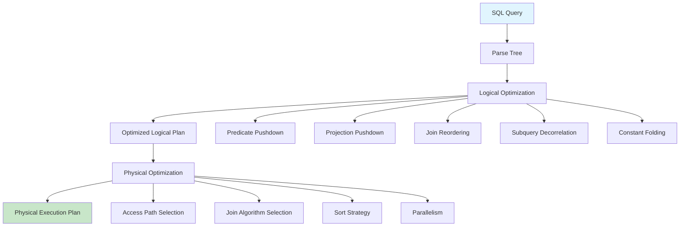
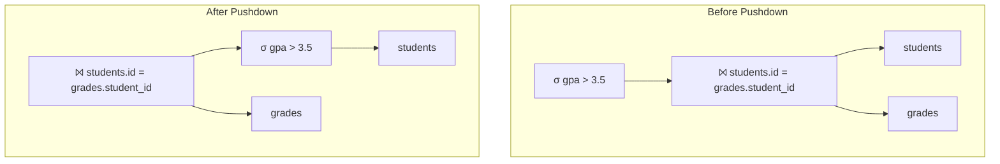
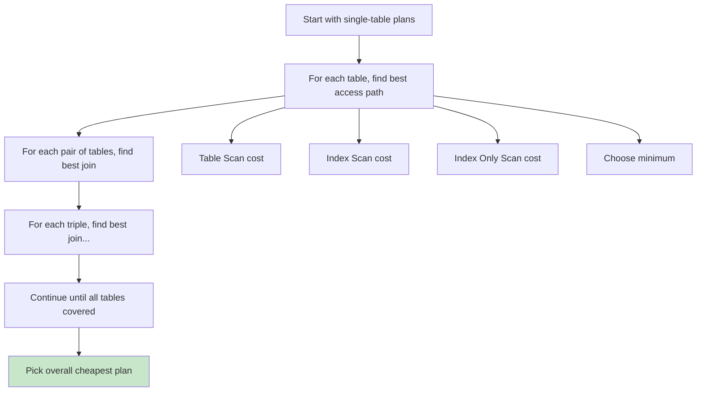

# Query Optimization

## Overview

Query Optimization is the process of finding the most efficient execution plan for a SQL query. Given that the same logical result can be computed in many different ways, the optimizer's job is to explore the space of possible plans and select the one with the lowest estimated cost (typically in terms of I/O, CPU, and memory).

This is arguably the most complex and important component of a DBMS. A good optimizer can make the difference between a query running in milliseconds vs. minutes.

## Detailed Explanation

### Two Types of Optimization



### Logical Optimization (Algebraic Transformation)

These transformations change the **structure** of the query without changing the result. They are based on relational algebra equivalences.

#### 1. Predicate Pushdown

Pushing WHERE conditions closer to the data source reduces the number of tuples flowing through the plan tree.

```sql
-- Original: Join first, then filter
SELECT s.name, g.grade
FROM students s JOIN grades g ON s.id = g.student_id
WHERE s.gpa > 3.5;

-- Optimized: Filter students first (fewer tuples to join)
SELECT s.name, g.grade
FROM (SELECT * FROM students WHERE gpa > 3.5) s
JOIN grades g ON s.id = g.student_id;
```



#### 2. Projection Pushdown

Only retrieve the columns needed, reducing data movement and memory usage.

```sql
-- Original: SELECT * fetches all columns
SELECT s.name FROM students s JOIN grades g ON s.id = g.student_id;

-- Optimized: Only fetch name and id from students, grade and student_id from grades
```

#### 3. Constant Folding

Pre-evaluate constant expressions at compile time.

```sql
-- Before: Expression evaluated for every row
SELECT * FROM students WHERE gpa > (2 + 1.5);

-- After: Folded to constant
SELECT * FROM students WHERE gpa > 3.5;
```

#### 4. Subquery Decorrelation

Convert correlated subqueries into joins, which are often more efficient.

```sql
-- Correlated subquery (executes inner query for each outer row)
SELECT * FROM students s
WHERE EXISTS (SELECT 1 FROM enrollments e WHERE e.student_id = s.id);

-- Decorrelated to semi-join
SELECT DISTINCT s.* FROM students s
JOIN enrollments e ON e.student_id = s.id;
```

#### 5. Join Reordering

The order in which tables are joined significantly impacts performance. For N tables, there are N! possible orderings and many possible tree shapes.

```sql
-- With 3 tables, the optimizer considers:
-- (A ⨝ B) ⨝ C
-- (A ⨝ C) ⨝ B
-- (B ⨝ C) ⨝ A
-- A ⨝ (B ⨝ C)
-- A ⨝ (C ⨝ B)
-- B ⨝ (A ⨝ C)
-- etc.
```

For large numbers of tables, exhaustive search is impractical. Systems use:
- **Dynamic programming** (PostgreSQL, System R) — O(3^N) plans
- **Greedy algorithms** — faster but may miss optimal
- **Genetic algorithms** (PostgreSQL's GEQO for >12 tables)

### Physical Optimization

Physical optimization decides **how** to execute each logical operation.

#### Access Path Selection

For each table access, the optimizer chooses:

| Access Method | When Used | Cost |
|--------------|-----------|------|
| **Full Table Scan** | No useful index, large portion of table | Sequential I/O |
| **Index Scan** | Highly selective predicate on indexed column | Random I/O per row |
| **Index Only Scan** | All needed columns in index | No table access |
| **Bitmap Index Scan** | Multiple index conditions (OR) | Bitmap AND/OR then fetch |

**Example:**
```sql
-- If there's an index on students(gpa):
SELECT * FROM students WHERE gpa > 3.5;

-- Optimizer chooses based on selectivity:
-- If < 15% of rows match → Index Scan
-- If > 15% of rows match → Sequential Scan (cheaper due to fewer random I/Os)
```

#### Join Algorithm Selection

| Algorithm | Best For | Memory | Notes |
|-----------|----------|--------|-------|
| **Nested Loop** | Small inner table, indexed join | O(1) | Simple, works always |
| **Hash Join** | Large tables, equi-join | O(inner size) | Build hash on smaller table |
| **Sort-Merge** | Pre-sorted data, range joins | O(N) for sort | Good for non-equi joins |

### Cost Model

The optimizer uses a **cost model** to estimate the cost of each plan. Key factors:

```
Total Cost = I/O Cost + CPU Cost + Memory Cost

I/O Cost:
  - Sequential read: 1 unit per page
  - Random read: 4-10 units per page (due to seek time)
  - Write: 2x read cost (for recovery)

CPU Cost:
  - Per-tuple processing: small constant
  - Comparison: small constant
  - Hash computation: small constant
```

**Example cost estimation for Hash Join:**
```
Cost(Hash Join R ⨝ S) = 
    Cost(Build Phase): |R| (read R and build hash table)
  + Cost(Probe Phase): |S| (read S and probe hash table)
  + Cost(If no memory): 2 * |R| (partition R to disk) + 2 * |S| (partition S)
```

### Statistics the Optimizer Uses

| Statistic | Description | Used For |
|-----------|-------------|----------|
| **Cardinality** | Number of tuples in a table | Estimating result sizes |
| **Number of pages** | Physical pages occupied | I/O cost estimation |
| **Column histogram** | Distribution of values | Selectivity estimation |
| **NDV (Number of Distinct Values)** | Distinct values in a column | Join output size estimation |
| **NULL count** | Number of NULLs | Predicate selectivity |
| **Min/Max values** | Range of values | Range query estimation |

### Selectivity Estimation

Selectivity = fraction of tuples that satisfy a predicate.

```sql
-- Equality: sel = 1 / NDV (assuming uniform distribution)
WHERE department = 'CS'  -- If 10 departments: sel = 0.1

-- Range: sel = (high - value) / (high - low)
WHERE gpa > 3.5  -- If gpa in [0, 4]: sel = 0.5/4 = 0.125

-- AND: sel_combined = sel1 * sel2 (assuming independence)
WHERE gpa > 3.5 AND dept = 'CS'  -- sel = 0.125 * 0.1 = 0.0125

-- OR: sel_combined = sel1 + sel2 - sel1 * sel2
WHERE gpa > 3.5 OR dept = 'CS'  -- sel = 0.125 + 0.1 - 0.0125 = 0.2125
```

### The System R Optimization Algorithm

The classic algorithm from IBM's System R (1979), still used in modern databases:



**Key insight:** The algorithm uses **dynamic programming**. For N tables:
1. Find best plan for each single table
2. Find best plan for each pair (using results from step 1)
3. Find best plan for each triple (using results from step 2)
4. ...until all N tables are covered

This avoids re-computing sub-problems and reduces complexity from factorial to exponential.

## Example: Full Optimization Walkthrough

```sql
SELECT s.name, c.course_name
FROM students s
JOIN enrollments e ON s.id = e.student_id
JOIN courses c ON e.course_id = c.id
WHERE s.gpa > 3.5 AND c.dept = 'CS';
```

**Step 1: Logical Optimization**
```
Push predicates:
  - σ(gpa > 3.5) on students
  - σ(dept = 'CS') on courses

After pushdown:
  π(s.name, c.course_name)
    ⨝(e.course_id = c.id)
      ⨝(s.id = e.student_id)
        σ(gpa > 3.5)[students]
        enrollments
        σ(dept = 'CS')[courses]
```

**Step 2: Physical Optimization — Consider join orders:**

| Order | Est. Cost | Reasoning |
|-------|-----------|-----------|
| (students ⨝ enrollments) ⨝ courses | 450 | students filtered to ~1000 rows first |
| students ⨝ (enrollments ⨝ courses) | 800 | enrollments × courses is large |
| (courses ⨝ enrollments) ⨝ students | 380 | courses filtered to ~50 rows, good start |

**Chosen plan:** courses → enrollments → students (lowest cost)

## Interview Questions

### Q1: What is the difference between logical and physical optimization?
**Answer:** Logical optimization transforms the query's relational algebra expression using equivalence rules (e.g., pushing predicates down, reordering joins) without considering how data is stored. Physical optimization chooses concrete algorithms and access methods (e.g., hash join vs. sort-merge join, index scan vs. table scan) based on the physical storage layout and available indexes. Logical optimization reduces the size of intermediate results; physical optimization minimizes I/O and CPU for each operation.

### Q2: Why might the optimizer choose a suboptimal plan?
**Answer:** Several reasons:
1. **Stale statistics** — `ANALYZE` hasn't been run recently, so cardinality estimates are wrong
2. **Correlated columns** — Optimizer assumes independence between columns (e.g., city and zip code), leading to underestimates
3. **Parameter sniffing** — Plan cached for an atypical parameter value
4. **Cost model inaccuracies** — Assumptions about I/O speed don't match reality
5. **Search space limitations** — For many tables, optimizer uses heuristics instead of exhaustive search

### Q3: What is the difference between a logical and physical query plan?
**Answer:** A logical plan describes *what* operations to perform (scan, filter, join, project) using relational algebra. A physical plan describes *how* to perform each operation (B-tree index scan, hash join, sort-merge join). The optimizer transforms logical plans into physical plans. For example, a logical "join" becomes a physical "hash join on students.id = enrollments.student_id with students as the build side."

### Q4: How does predicate pushdown improve performance?
**Answer:** By filtering rows early (closer to the data source), fewer tuples flow through subsequent operations like joins and sorts. If a table has 1M rows but a predicate filters to 1000, pushing the predicate before a join means the join processes 1000 rows instead of 1M. This reduces I/O (fewer pages to read), CPU (fewer comparisons), and memory (smaller intermediate results).

### Q5: How many possible join orderings exist for N tables?
**Answer:** For N tables, there are N! orderings of tables and for each ordering, multiple tree shapes (left-deep, right-deep, bushy). The total number of plans is the **Catalan number** related to binary tree shapes multiplied by N!. For practical purposes:
- 3 tables: ~12 plans
- 5 tables: ~1,000 plans
- 10 tables: ~17 billion plans
- 15 tables: astronomical

This is why optimizers use dynamic programming (System R style) or heuristics for many tables.

## Common Mistakes

- ❌ **Assuming the optimizer always finds the best plan** — It uses estimates and heuristics, not actual data
- ❌ **Ignoring statistics** — Run `ANALYZE` after major data changes; stale stats cause bad plans
- ❌ **Writing overly complex queries** — The optimizer has limited search budget; simpler queries have better optimization potential
- ❌ **Not understanding that rewriting SQL can help** — Sometimes manually applying optimizations (like replacing subqueries with joins) yields better plans
- ❌ **Confusing logical and physical plans** — The EXPLAIN output shows the *physical* plan, not the logical one

## Summary

| Aspect | Details |
|--------|---------|
| **Goal** | Find the execution plan with lowest estimated cost |
| **Two phases** | Logical (algebraic transformations) + Physical (algorithm selection) |
| **Key technique** | Dynamic programming (System R algorithm) |
| **Relies on** | Table/column statistics, cost model |
| **Limitations** | Stale stats, correlated columns, search space explosion |

Query optimization is a deep topic that bridges database theory and practice. Understanding it helps you write better SQL and debug performance issues.

## Cross-References

- [Cost Estimation](./cost-estimation.md) — detailed cost model explanation
- [Execution Plans](./execution-plans.md) — reading EXPLAIN output
- [Join Algorithms](./joins.md) — the algorithms the optimizer chooses between
- [Parsing](./parsing.md) — the phase before optimization
- [Indexing](../indexing/) — access paths the optimizer considers


## Cross References

- [Execution Plans](../dbms/query-processing/execution-plans.md)
- [Cost Estimation](../dbms/query-processing/cost-estimation.md)
- [Indexing](../dbms/indexing/README.md)
- [Query Cache](../dbms/caching/query-cache.md)
