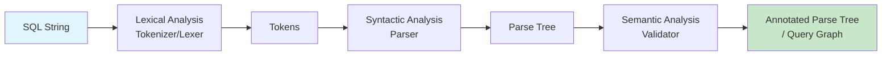
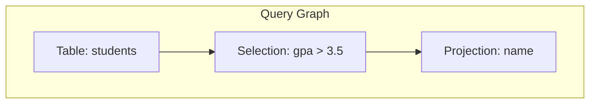

# SQL Parsing

## Overview

Parsing is the first phase of query processing. It takes the raw SQL string and transforms it into a structured internal representation (parse tree or abstract syntax tree) that the rest of the query processing pipeline can work with. Without parsing, the DBMS would have no way to understand what the user is asking.

Parsing is analogous to the front-end of a compiler: it validates syntax, resolves names, and produces a tree structure that represents the query's meaning.

## Detailed Explanation

### The Parsing Pipeline



### Phase 1: Lexical Analysis (Tokenization)

The lexer breaks the SQL string into **tokens** — the smallest meaningful units.

```sql
SELECT name FROM students WHERE gpa > 3.5;
```

**Tokens produced:**

| Token | Type |
|-------|------|
| `SELECT` | Keyword |
| `name` | Identifier |
| `FROM` | Keyword |
| `students` | Identifier |
| `WHERE` | Keyword |
| `gpa` | Identifier |
| `>` | Operator |
| `3.5` | Numeric Literal |
| `;` | Delimiter |

The lexer also handles:
- **Whitespace** (ignored)
- **Comments** (`-- single line`, `/* multi-line */`)
- **String literals** (`'hello'`)
- **Quoted identifiers** (`` `table` `` in MySQL, `"Table"` in PostgreSQL)

### Phase 2: Syntactic Analysis (Parsing)

The parser uses a **context-free grammar** (typically LALR or LL) to check if the token stream forms a valid SQL statement. It produces a **parse tree** (concrete syntax tree).

**Grammar rules (simplified):**
```
query       → SELECT select_list FROM table_name WHERE condition
select_list → column_name (',' column_name)* | '*'
condition   → column_name comparison_op literal
comparison_op → '=' | '>' | '<' | '>=' | '<=' | '<>' | '!='
```

**Parse Tree for `SELECT name FROM students WHERE gpa > 3.5`:**

```
        Query
       /  |  \
    SELECT FROM WHERE
      |     |      |
   name  students  Condition
                   /   |   \
                 gpa   >   3.5
```

### Phase 3: Semantic Analysis / Validation

After building the parse tree, the system validates **meaning** (not just syntax):

| Check | Description | Example Error |
|-------|-------------|---------------|
| **Table existence** | Referenced tables must exist | `ERROR: relation "students" does not exist` |
| **Column existence** | Columns must exist in referenced tables | `ERROR: column "naem" does not exist` |
| **Type checking** | Operands must be compatible types | `ERROR: operator does not exist: text > integer` |
| **Ambiguity resolution** | Ambiguous column names resolved via table aliases | `ERROR: column reference "id" is ambiguous` |
| **Permission check** | User must have SELECT privilege | `ERROR: permission denied for table students` |

### Abstract Syntax Tree (AST) vs Parse Tree

Most modern DBMSes convert the parse tree into a more compact **Abstract Syntax Tree (AST)** that removes syntactic sugar and focuses on the logical structure.

```
Parse Tree (Concrete):          AST (Abstract):
      Query                        SelectStmt
    /  |  \  \                    /     |     \
SELECT FROM WHERE  ;          columns  from  predicate
  |     |      |               [name] [students] [gpa > 3.5]
name students Condition
              / | \
            gpa > 3.5
```

### Query Graph Model

After parsing, many systems convert the AST into a **query graph** — a normalized internal representation used by the optimizer.



## Example: Parsing in PostgreSQL

PostgreSQL's parser is generated using **Bison** (a YACC-compatible parser generator). The grammar file is `gram.y` in the source code.

```sql
-- This query:
SELECT s.name, g.grade
FROM students s
JOIN grades g ON s.id = g.student_id
WHERE s.gpa > 3.5
ORDER BY g.grade DESC;

-- Produces a parse tree with these nodes:
-- RangeVar (students, alias s)
-- JoinExpr (type=INNER)
--   - left: RangeVar (students, alias s)
--   - right: RangeVar (grades, alias g)
--   - quals: s.id = g.student_id
-- TargetList: [s.name, g.grade]
-- WhereClause: s.gpa > 3.5
-- SortClause: [g.grade DESC]
```

### Example: MySQL Parser

MySQL uses a Bison-generated LALR(1) parser (the lexer is hand-written). Key files:
- `sql/sql_lex.cc` — hand-written lexer
- `sql/sql_yacc.yy` — Bison grammar (generates `sql_yacc.cc`)

## Parsing Edge Cases

### Nested Subqueries
```sql
SELECT name FROM students
WHERE id IN (SELECT student_id FROM enrollments WHERE course = 'CS101');
```
The parser must handle nested query structures and correctly scope table references.

### CTEs (Common Table Expressions)
```sql
WITH active AS (
    SELECT * FROM students WHERE status = 'active'
)
SELECT * FROM active WHERE gpa > 3.0;
```
CTEs introduce named subqueries that must be resolved during semantic analysis.

### Window Functions
```sql
SELECT name, RANK() OVER (PARTITION BY dept ORDER BY gpa DESC) as rank
FROM students;
```
The parser must handle the complex `OVER` clause syntax with `PARTITION BY` and `ORDER BY`.

## Interview Questions

### Q1: What is the difference between a parse tree and an abstract syntax tree?
**Answer:** A parse tree (concrete syntax tree) faithfully represents every grammar rule applied during parsing, including syntactic details like parentheses and commas. An AST strips away syntactic sugar and keeps only the semantically meaningful structure. ASTs are more compact and easier for the optimizer to work with. For example, `1 + 2 * 3` in a parse tree would show both the addition and multiplication rules; the AST would just show `Add(1, Mul(2, 3))`.

### Q2: What happens if you have a syntax error in SQL?
**Answer:** The parser detects it during syntactic analysis and raises an error immediately. The query never reaches the optimizer or execution engine. The error message typically includes the position of the error and what token was expected. For example: `ERROR: syntax error at or near "SELCT" LINE 1: SELCT * FROM users;`.

### Q3: How does the parser handle ambiguous column names?
**Answer:** During semantic analysis, if a column name appears in multiple tables (e.g., `id` in both `students` and `grades`), the system requires the user to qualify it with a table name or alias (`s.id`). If not qualified, the parser raises an ambiguity error. Some systems (like MySQL) have specific precedence rules but will still warn.

### Q4: Can two different SQL queries produce the same parse tree?
**Answer:** No — two syntactically different queries will produce different parse trees. However, they may produce the same **logical query plan** (relational algebra expression) after translation and optimization. For example, `SELECT * FROM t WHERE x = 5 AND y = 10` and `SELECT * FROM t WHERE y = 10 AND x = 5` have different parse trees but equivalent logical plans.

### Q5: What role does the parser play in SQL injection prevention?
**Answer:** The parser itself doesn't prevent SQL injection — that's the job of parameterized queries/prepared statements. However, the parser ensures that user-supplied values in parameterized queries are treated as **literal values**, not as SQL syntax. When a parameter is bound, it's never re-parsed as SQL, which is the fundamental defense against injection.

## Common Mistakes

- ❌ **Confusing lexer with parser** — Lexer handles tokens; parser handles grammar/structure
- ❌ **Assuming the parser optimizes** — Parser only validates syntax; optimization is a separate phase
- ❌ **Ignoring semantic analysis** — Syntactically valid queries can still be semantically wrong (wrong types, missing tables)
- ❌ **Not understanding that parsing happens once** — For prepared statements, parsing happens once; only execution repeats
- ❌ **Confusing parse tree with execution plan** — The parse tree is a structural representation; the execution plan describes *how* to execute

## Summary

| Component | Input | Output | Purpose |
|-----------|-------|--------|---------|
| **Lexer** | SQL string | Token stream | Break text into meaningful units |
| **Parser** | Token stream | Parse tree / AST | Validate syntax, build structure |
| **Semantic Analyzer** | Parse tree | Annotated tree / Query graph | Validate meaning, resolve names |

Parsing is the gateway to query processing. It ensures the SQL is well-formed and meaningful before the optimizer spends any effort on finding the best execution plan. Understanding parsing helps you write correct SQL and understand error messages.

## Cross-References

- [Query Optimization](./optimization.md) — what happens after parsing
- [Execution Plans](./execution-plans.md) — the final output of optimization
- [Query Processing Overview](./README.md) — the full pipeline
- [SQL Injection](../../interview/system-design/hld/security-design.md) — how parsing interacts with security
