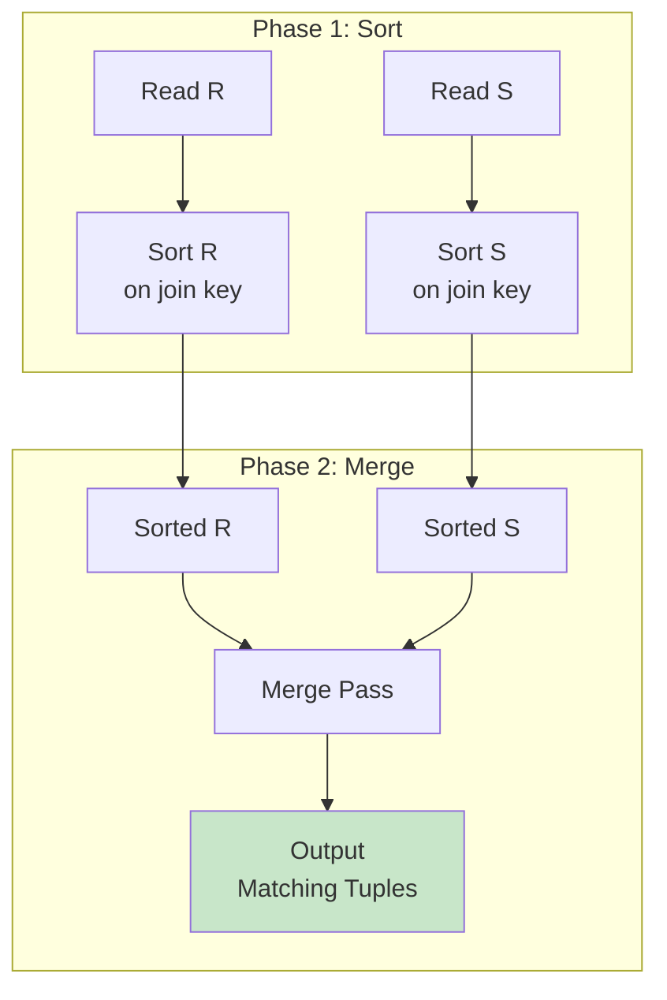
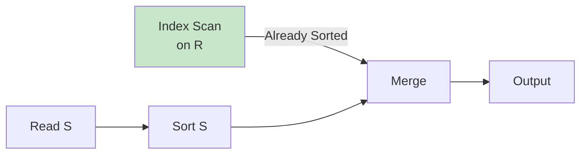

# Sort-Merge Join

## Overview

Sort-Merge Join is a join algorithm that works by sorting both relations on the join key and then merging them in a single pass. It is particularly efficient when the data is **already sorted** (e.g., due to a clustered index or a previous sort operation) and is one of the few algorithms that handles **non-equi joins** (like range joins) efficiently.

## Detailed Explanation

### The Algorithm



**Pseudocode:**
```python
# Phase 1: SORT
sorted_R = external_sort(R, join_key)  # If not already sorted
sorted_S = external_sort(S, join_key)

# Phase 2: MERGE
r = next(sorted_R)
s = next(sorted_S)

while r is not null and s is not null:
    if r.join_key == s.join_key:
        # Found a match! Save the current s position
        s_mark = s
        # Output all (r, s') where s' has the same join key
        while r is not null and r.join_key == s_mark.join_key:
            s = s_mark  # Reset s to the start of matching group
            while s is not null and s.join_key == r.join_key:
                emit (r, s)
                s = next(sorted_S)
            r = next(sorted_R)
        # s is already positioned past the matching group from the inner loop;
        # no extra next() needed here (it would skip a tuple)
    elif r.join_key < s.join_key:
        r = next(sorted_R)
    else:
        s = next(sorted_S)
```

### Step-by-Step Example

```sql
-- Join students and grades on student_id
-- R (students): [(1, Alice), (3, Charlie), (2, Bob)]
-- S (grades):   [(2, A), (1, B), (3, A), (2, A+)]
```

**Phase 1: Sort**
```
Sorted R: [(1, Alice), (2, Bob), (3, Charlie)]
Sorted S: [(1, B), (2, A), (2, A+), (3, A)]
```

**Phase 2: Merge**
```
Step 1: r=(1, Alice), s=(1, B)     → Match! Emit (Alice, B)
Step 2: r=(2, Bob),   s=(2, A)     → Match! Emit (Bob, A)
Step 3: r=(2, Bob),   s=(2, A+)    → Match! Emit (Bob, A+)
Step 4: r=(3, Charlie), s=(3, A)   → Match! Emit (Charlie, A)
Done!
```

### Cost Analysis

```
Sort Phase:
  External sort on R: 2 × Br × (⌈log_{B-1}(Br/B)⌉ + 1) I/Os
  External sort on S: 2 × Bs × (⌈log_{B-1}(Bs/B)⌉ + 1) I/Os
  
  (Each pass reads and writes the data; number of passes depends on memory)

Merge Phase:
  Br + Bs I/Os (one sequential scan of each sorted relation)

Total I/O: Sort_R + Sort_S + Br + Bs

If already sorted:
  Total I/O: Br + Bs  ← Best case!
```

**Example (already sorted):**
```
R = 100 pages, S = 1,000 pages
Cost = 100 + 1,000 = 1,100 page reads

Compare to hash join: also 1,100 page reads
Compare to nested loop: 100 + 100 × 1,000 = 100,100 page reads
```

**Example (not sorted, B=10 buffers):**
```
R = 100 pages, S = 1,000 pages, B = 10 buffer pages

Sort R: 
  Pass 0: Create ⌈100/10⌉ = 10 sorted runs of 10 pages each
  Pass 1: Merge 10 runs (fits in memory: 10 runs × 1 page + 1 output = 11 ≈ B)
  I/O: 2 × 100 × 2 = 400

Sort S:
  Pass 0: Create ⌈1000/10⌉ = 100 sorted runs of 10 pages each
  Pass 1: Merge ⌊(10-1)⌋ = 9 runs at a time → ⌈100/9⌉ = 12 passes
  Actually: merge in multiple passes
  Pass 0: 100 runs
  Pass 1: ⌈100/9⌉ = 12 runs
  Pass 2: ⌈12/9⌉ = 2 runs
  Pass 3: 1 run (done)
  I/O: 2 × 1000 × 4 = 8,000

Total: 400 + 8,000 + 100 + 1,000 = 9,500 page reads
```

### Sort-Merge for Non-Equi Joins

Sort-merge handles **range joins** efficiently:

```sql
-- Range join: match students with scholarships based on GPA range
SELECT s.name, sc.scholarship_name
FROM students s
JOIN scholarships sc ON s.gpa BETWEEN sc.min_gpa AND sc.max_gpa;
```

```python
# Merge with range condition
while r is not null and s is not null:
    if r.gpa >= s.min_gpa and r.gpa <= s.max_gpa:
        emit (r, s)
        # Advance the smaller key
        if r.gpa <= s.max_gpa:
            r = next(R)
        else:
            s = next(S)
    elif r.gpa < s.min_gpa:
        r = next(R)
    else:
        s = next(S)
```

**Why hash join can't do this:** Hash join only works for equality because you hash the key and look up the exact bucket. For range conditions, you'd need to check every bucket.

### Sort-Merge for Set Operations

Sort-merge naturally implements set operations:

```sql
-- UNION (merge two sorted streams, skip duplicates)
-- INTERSECT (output only matching values)
-- EXCEPT (output values in R not in S)
```

```python
# INTERSECT
while r is not null and s is not null:
    if r.value == s.value:
        emit r
        r = next(R)
        s = next(S)
    elif r.value < s.value:
        r = next(R)
    else:
        s = next(S)
```

### Duplicate Handling

When multiple tuples share the same join key, the merge phase must handle the cross product:

```
R: [(1, A), (1, B)]  -- Two tuples with key 1
S: [(1, X), (1, Y)]  -- Two tuples with key 1

Output: (A, X), (A, Y), (B, X), (B, Y)  -- 2×2 = 4 tuples
```

The algorithm must "back up" in S for each matching tuple in R, which requires either:
- Marking the start position in S
- Buffering matching tuples

### Sort-Merge Join with Pipelining

If one input is already sorted (e.g., from an index scan), only the other needs sorting:



**This halves the sort cost.**

### Hybrid Sort-Merge

Some systems implement a hybrid approach:
1. If the build relation fits in memory, sort it in memory
2. If the probe relation is already sorted (index), just merge
3. Otherwise, use external sort for both

## Interview Questions

### Q1: When is sort-merge join preferred over hash join?
**Answer:** Sort-merge is preferred when:
1. **Data is already sorted** — e.g., from a clustered index scan or previous ORDER BY. Cost is just Br + Bs vs. hash join's Br + Bs + hash table overhead
2. **Non-equi joins** — `R.a BETWEEN S.low AND S.high` can't use hash join
3. **Result needs to be sorted** — If the query has ORDER BY on the join key, the sort is "free"
4. **Memory is very tight** — Grace hash join requires memory for hash table; sort-merge can work with minimal memory by sorting to disk

### Q2: What is the time complexity of sort-merge join?
**Answer:** 
- **If already sorted:** O(N + M) for the merge phase
- **If not sorted:** O(N log N + M log M) for sorting + O(N + M) for merging
- The dominant cost is the sorting phase

This is comparable to hash join's O(N + M), but hash join has lower constant factors for equi-joins.

### Q3: How does sort-merge handle duplicate keys?
**Answer:** When multiple tuples share the same join key, the merge phase must produce the cross product. For example, if R has 3 tuples with key=5 and S has 2 tuples with key=5, the output is 6 tuples. The algorithm must "mark" the start of the matching group in S and reset to it for each matching tuple in R. This requires either random access (backing up) or buffering.

### Q4: Can sort-merge join handle `NULL = NULL`?
**Answer:** No, and it shouldn't. SQL semantics say `NULL ≠ NULL`. The merge phase should skip NULL values entirely — if either r.join_key or s.join_key is NULL, advance the pointer without emitting a match.

### Q5: What is the space complexity of sort-merge join?
**Answer:** The merge phase itself needs O(1) space (just two pointers). The sort phase needs O(B) space for the buffer pool during external sorting. If both relations are already sorted, the total space is O(1) — no additional memory needed beyond the input buffers. This makes sort-merge very memory-efficient.

## Common Mistakes

- ❌ **Assuming sort-merge is always slower than hash join** — For pre-sorted data, it's often faster
- ❌ **Not considering the ORDER BY benefit** — If the query already needs sorted output, sort-merge is "free"
- ❌ **Forgetting that sort-merge handles non-equi joins** — It's the go-to for range joins
- ❌ **Ignoring the duplicate handling complexity** — The merge phase is more complex than it appears
- ❌ **Not realizing that the sort phase dominates the cost** — If data is already sorted, sort-merge is very cheap

## Summary

| Aspect | Details |
|--------|---------|
| **Time (sorted)** | O(N + M) |
| **Time (unsorted)** | O(N log N + M log M) |
| **Space** | O(1) for merge, O(B) for sort |
| **Join types** | Equi-join, range join, set operations |
| **Best when** | Data pre-sorted, non-equi join, result needs sorting |
| **Worst when** | Data unsorted and hash join is possible |

Sort-Merge Join is a versatile algorithm that shines when data is already sorted or when the join condition is non-equi. It's a staple of every major DBMS.

## Cross-References

- [Hash Join](./hash-join.md) — the alternative for equi-joins in memory
- [Nested Loop Join](./nested-loop.md) — the simple alternative
- [Join Algorithms Overview](./joins.md) — comparison of all join types
- [External Sorting](../storage/file-organization.md) — how sorting to disk works
- [Buffer Management](../storage/buffer-management.md) — memory management during sort
- [Cost Estimation](./cost-estimation.md) — how sort-merge cost is estimated
