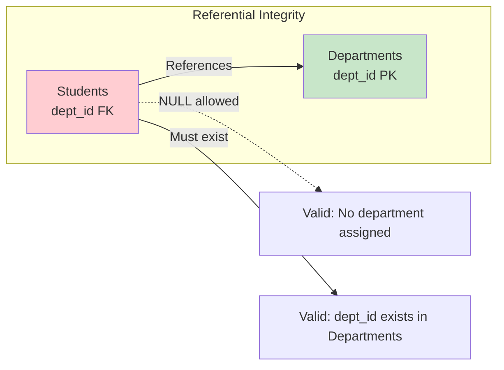
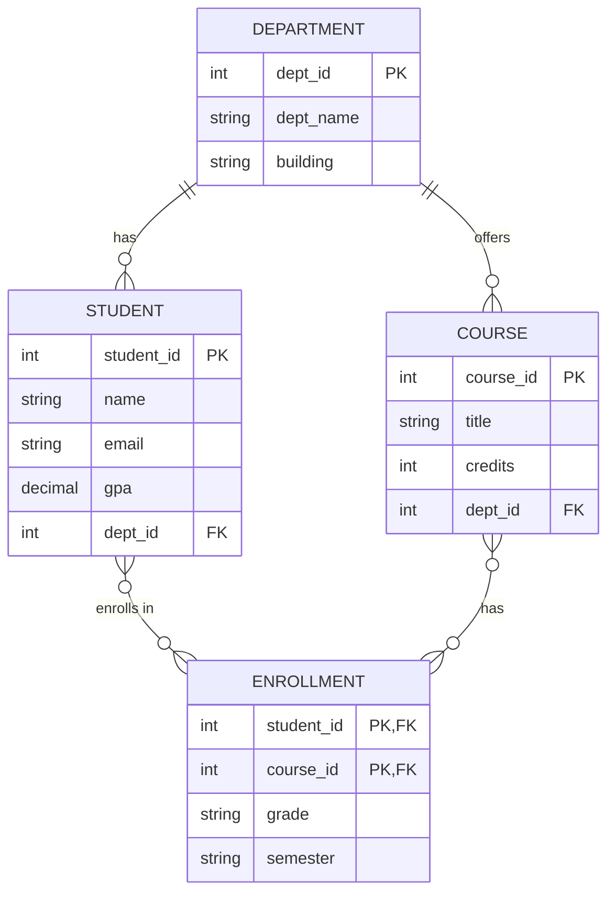

# The Relational Model

## Overview

The **Relational Model**, proposed by **E.F. Codd** in 1970, is the foundation of modern database systems. It organizes data into **relations** (tables) consisting of **tuples** (rows) and **attributes** (columns). Despite being over 50 years old, it remains the dominant model for structured data storage.

## Core Concepts

### Relation (Table)

A relation is a two-dimensional structure with:
- **Columns (Attributes)**: Each has a name and a data type (domain)
- **Rows (Tuples)**: Each represents a single record
- **No duplicate rows**: Every tuple must be uniquely identifiable
- **Order doesn't matter**: Neither row order nor column order is significant

```sql
CREATE TABLE Students (
    student_id  INT PRIMARY KEY,
    name        VARCHAR(100) NOT NULL,
    email       VARCHAR(255) UNIQUE,
    gpa         DECIMAL(3,2) CHECK (gpa BETWEEN 0.00 AND 4.00),
    dept_id     INT REFERENCES Departments(dept_id)
);
```

### Degree and Cardinality

- **Degree**: Number of attributes (columns) in a relation
- **Cardinality**: Number of tuples (rows) in a relation


### Attribute Types

| Type | Description | Example |
|---|---|---|
| **Simple** | Cannot be further divided | `name`, `age` |
| **Composite** | Can be split into sub-parts | `address` → `street`, `city`, `zip` |
| **Single-valued** | Holds one value per tuple | `student_id` |
| **Multi-valued** | Can hold multiple values | `phone_numbers` (violates 1NF) |
| **Derived** | Computed from other attributes | `age` derived from `dob` |
| **Stored** | Physically stored | `dob` |

### Domain

A domain is the set of all permissible values for an attribute. For example:
- `gpa` domain: real numbers between 0.00 and 4.00
- `gender` domain: {`M`, `F`, `Other`}
- `email` domain: valid email format strings

## Relational Integrity Constraints

### 1. Domain Constraint
Every attribute value must belong to its defined domain.

```sql
-- Violation: 'five' is not in the domain of DECIMAL
INSERT INTO Students VALUES (104, 'Dave', 'dave@uni.edu', 'five', 10);
-- ERROR: invalid input syntax for type numeric
```

### 2. Key Constraint
Every relation must have a **key** — a minimal set of attributes that uniquely identifies each tuple.

### 3. Entity Integrity Constraint
**Primary key** attributes cannot be `NULL`.

```sql
-- Violation: student_id is PK, cannot be NULL
INSERT INTO Students VALUES (NULL, 'Eve', 'eve@uni.edu', 3.70, 20);
-- ERROR: null value in column "student_id" violates not-null constraint
```

### 4. Referential Integrity Constraint
A **foreign key** must either:
- Match a primary key value in the referenced table, OR
- Be `NULL` (if the FK column allows NULLs)

```sql
-- If dept_id 99 doesn't exist in Departments table:
INSERT INTO Students VALUES (105, 'Frank', 'frank@uni.edu', 3.60, 99);
-- ERROR: insert or update violates foreign key constraint
```



## Relational Algebra vs Relational Calculus

| Aspect | Relational Algebra | Relational Calculus |
|---|---|---|
| Type | Procedural | Non-procedural (declarative) |
| Approach | Specifies *how* to get data | Specifies *what* data to get |
| Basis | Set theory + algebra | Predicate logic (first-order logic) |
| Variants | Standard operators | Tuple Relational Calculus (TRC), Domain Relational Calculus (DRC) |
| Foundation of | SQL execution plans | SQL query semantics |

See: [Relational Algebra](relational-algebra.md), [Relational Calculus](relational-calculus.md)

## Null Values in the Relational Model

SQL uses **three-valued logic**: `TRUE`, `FALSE`, and `UNKNOWN` (NULL).

```sql
-- NULL comparisons
SELECT * FROM Students WHERE gpa = NULL;    -- Returns NOTHING!
SELECT * FROM Students WHERE gpa IS NULL;   -- Correct way

-- NULL in arithmetic
SELECT gpa + 1 FROM Students;  -- NULL + 1 = NULL

-- NULL in aggregates
SELECT COUNT(gpa) FROM Students;   -- Excludes NULLs
SELECT COUNT(*) FROM Students;     -- Counts all rows
```

### NULL Truth Table

| Expression | TRUE | FALSE | NULL |
|---|---|---|---|
| `TRUE AND X` | TRUE | FALSE | NULL |
| `FALSE AND X` | FALSE | FALSE | FALSE |
| `NULL AND NULL` | — | — | NULL |
| `TRUE OR X` | TRUE | TRUE | TRUE |
| `FALSE OR X` | TRUE | FALSE | NULL |
| `NOT NULL` | — | — | NULL |

## Schema Diagram Convention



## Interview Questions

### Beginner

**Q1: What is a relation in the relational model?**
A: A relation is a set of tuples, where each tuple is an ordered set of attribute values. In practice, it corresponds to a table. A relation has a fixed schema (set of attributes with domains) and contains no duplicate tuples.

**Q2: What is the difference between a relation and a table?**
A: In theory, a relation is a mathematical concept — a subset of the Cartesian product of domains, with no duplicates and no ordering. In practice (SQL), a table can have duplicates and row order may matter. SQL bags (multisets) differ from true relations (sets).

**Q3: What is the difference between a super key and a candidate key?**
A: A **super key** is any set of attributes that uniquely identifies tuples. A **candidate key** is a *minimal* super key — no proper subset of it is also a super key. A table can have multiple candidate keys; one is chosen as the primary key.

### Intermediate

**Q4: Can a foreign key reference a non-primary key?**
A: Yes. A foreign key can reference any candidate key (a column or set of columns with a UNIQUE constraint), not just the primary key. Example: `Students.email` (UNIQUE) can be referenced by another table.

**Q5: Explain the difference between Entity Integrity and Referential Integrity.**
A: **Entity Integrity**: Primary key columns cannot contain NULL values. This ensures every tuple is uniquely identifiable. **Referential Integrity**: Foreign key values must either match an existing value in the referenced table's candidate key or be NULL. This maintains consistency across related tables.

**Q6: What happens when you try to delete a row that is referenced by a foreign key?**
A: By default, the delete is rejected (RESTRICT/NO ACTION). You can specify:
- `ON DELETE CASCADE`: Delete all referencing rows too
- `ON DELETE SET NULL`: Set FK to NULL in referencing rows
- `ON DELETE SET DEFAULT`: Set FK to its default value

### Advanced / FAANG-Level

**Q7: How does the relational model handle many-to-many relationships?**
A: Via a **junction/bridge table** with composite primary key consisting of both foreign keys. Example: `Enrollment(student_id, course_id, grade)` bridges Students and Courses. The composite PK enforces uniqueness of (student, course) pairs.

**Q8: Discuss the limitations of the relational model. What problems led to NoSQL?**
A: Limitations:
1. **Impedance mismatch**: Object-oriented code vs tabular data
2. **Schema rigidity**: ALTER TABLE on billion-row tables is expensive
3. **Horizontal scaling**: JOINs across shards are costly
4. **Sparse data**: Tables waste space when many attributes are NULL
5. **Hierarchical/graph data**: Recursive CTEs are slower than native graph traversals
6. **Write-heavy workloads**: B-tree maintenance, WAL overhead
7. **Schema-on-read**: JSON/XML data requires parsing before querying

NoSQL addressed these but sacrificed JOINs, ad-hoc queries, and ACID in many cases.

## Common Mistakes

- Confusing NULL with empty string or zero — NULL means "unknown"
- Assuming row/column order matters in a relation
- Not understanding that a table with duplicates is a *bag*, not a *relation*
- Confusing super keys with candidate keys
- Forgetting that composite keys require ALL columns to be non-NULL

## Summary

| Concept | Description |
|---|---|
| Relation | A set of tuples with a fixed schema |
| Tuple | A single row in a relation |
| Attribute | A named column with a domain |
| Super Key | Any attribute set that uniquely identifies tuples |
| Candidate Key | Minimal super key |
| Primary Key | Chosen candidate key (NOT NULL, UNIQUE) |
| Foreign Key | References a candidate key in another relation |
| Integrity | Domain, Key, Entity, Referential |

## Cross-References

- [Keys in Detail](keys.md) — All key types explained
- [ER Diagrams](er-diagrams.md) — Conceptual database design
- [Relational Algebra](relational-algebra.md) — Procedural query language
- [Relational Calculus](relational-calculus.md) — Declarative query language
- [Normalization](../normalization/README.md) — Eliminating redundancy using functional dependencies
- [SQL DDL](../sql/ddl.md) — Defining schemas in SQL


## Cross References

- [ER Diagrams](../dbms/relational-model/er-diagrams.md)
- [Keys](../dbms/relational-model/keys.md)
- [Relational Algebra](../dbms/relational-model/relational-algebra.md)
- [SQL DDL](../dbms/sql/ddl.md)
