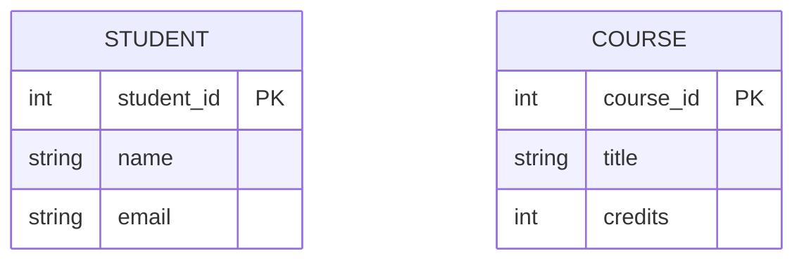
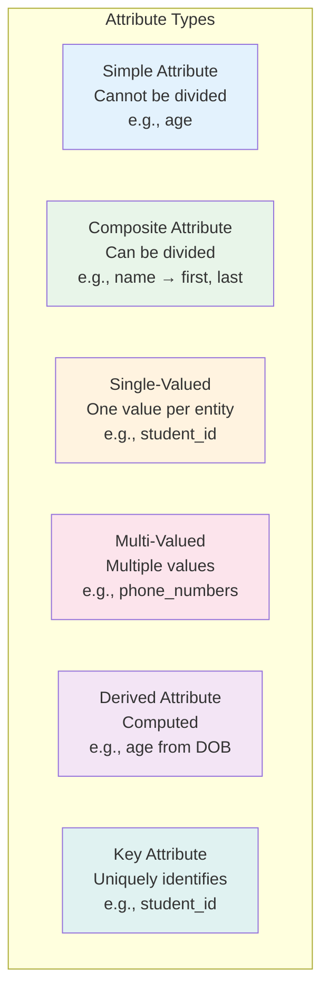
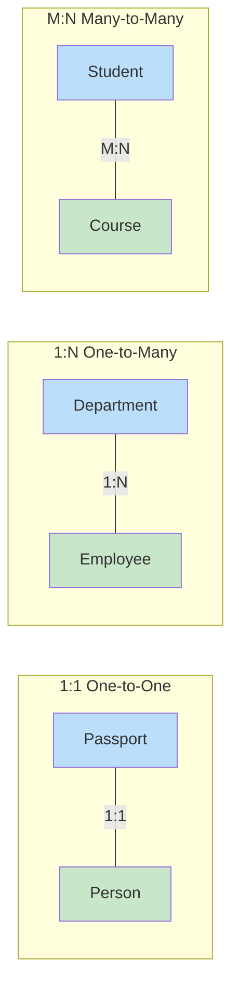
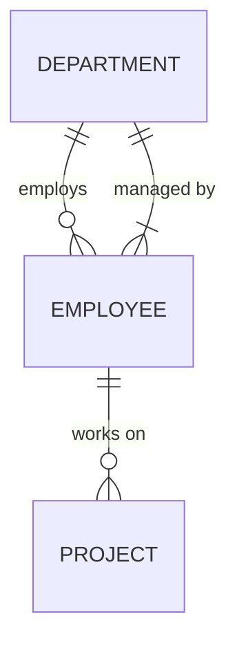
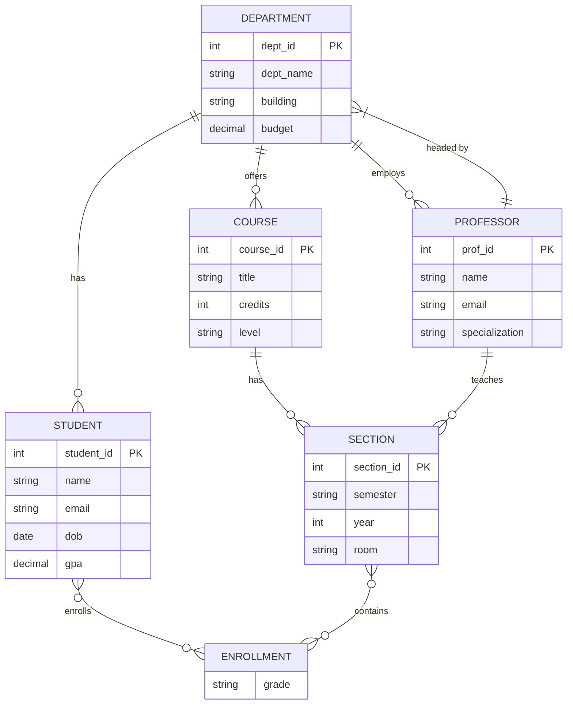
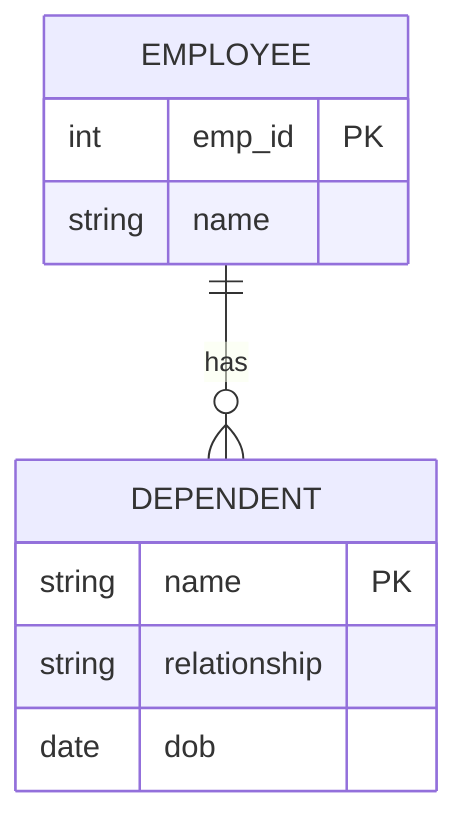
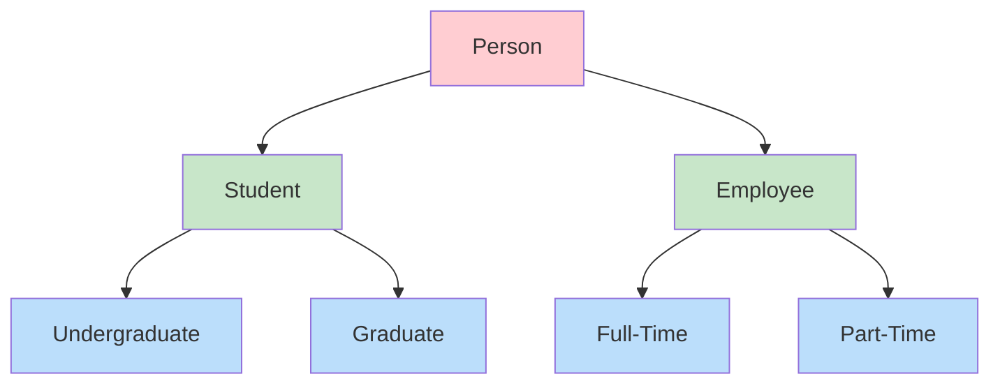
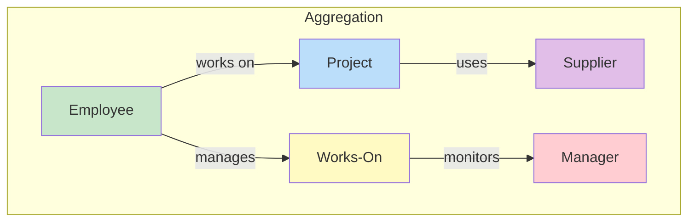

# ER Diagrams (Entity-Relationship Diagrams)

## Overview

**Entity-Relationship (ER) Diagrams** are a visual representation of the logical structure of a database. Proposed by **Peter Chen in 1976**, they model entities, their attributes, and relationships between entities. ER diagrams serve as the blueprint before converting to a relational schema.

## Components of an ER Diagram

### 1. Entity

An **entity** is a real-world object with an independent existence.

- **Strong Entity**: Has its own primary key (e.g., `Student`, `Course`)
- **Weak Entity**: Depends on a strong entity for identification (e.g., `Dependent` of an `Employee`)



### 2. Attributes



**ER Notation:**

| Symbol | Meaning |
|---|---|
| Rectangle | Strong entity |
| Double rectangle | Weak entity |
| Ellipse | Attribute |
| Double ellipse | Multi-valued attribute |
| Dashed ellipse | Derived attribute |
| Underlined attribute | Key attribute |

### 3. Relationship

A **relationship** is an association between two or more entities.

**Relationship Degree:**
- **Unary (Recursive)**: Entity relates to itself (e.g., Employee supervises Employee)
- **Binary**: Between two entities (most common)
- **Ternary**: Among three entities

### 4. Cardinality Ratios



### 5. Participation Constraints

- **Total Participation (double line)**: Every entity must participate in the relationship
  - Example: Every employee MUST belong to a department
- **Partial Participation (single line)**: Some entities may not participate
  - Example: Not every employee manages a department



In the above:
- `||--o{` means 1-to-many with partial participation on the "many" side
- `}|--||` means many-to-1 with total participation on the "many" side

## Complete ER Diagram Example: University Database



## Weak Entity Example

A **weak entity**:
- Has no primary key of its own
- Identified by its **partial key** + the **owner entity's key**
- Has **total participation** with the identifying relationship



In the converted relational model:
```sql
CREATE TABLE Dependent (
    emp_id      INT,
    name        VARCHAR(100),
    relationship VARCHAR(50),
    dob         DATE,
    PRIMARY KEY (emp_id, name),  -- Partial key + owner's key
    FOREIGN KEY (emp_id) REFERENCES Employee(emp_id) ON DELETE CASCADE
);
```

## ER to Relational Model Conversion

### Rule 1: Strong Entity → Table

Each strong entity becomes a table with all simple attributes. Composite attributes are flattened. The key attribute becomes the primary key.

```
STUDENT(student_id, name, email, dob, gpa)
```

### Rule 2: Weak Entity → Table

Partial key + owner's FK = composite PK.

```
DEPENDENT(emp_id, name, relationship, dob)
  PK: (emp_id, name)
  FK: emp_id → EMPLOYEE(emp_id)
```

### Rule 3: 1:1 Relationship → FK in one table

Add FK to the table with total participation (or either if both partial). If both have total participation, merge into one table.

```sql
-- Employee manages Department (1:1, total on Department side)
ALTER TABLE Department ADD COLUMN manager_id INT REFERENCES Employee(emp_id);
```

### Rule 4: 1:N Relationship → FK on the N-side

```sql
-- Department has many Employees
ALTER TABLE Employee ADD COLUMN dept_id INT REFERENCES Department(dept_id);
```

### Rule 5: M:N Relationship → New junction table

```sql
-- Student enrolls in Course (M:N)
CREATE TABLE Enrollment (
    student_id INT REFERENCES Student(student_id),
    course_id  INT REFERENCES Course(course_id),
    grade      CHAR(2),
    PRIMARY KEY (student_id, course_id)
);
```

### Rule 6: Multi-valued Attribute → Separate table

```sql
-- Employee has multiple phone numbers
CREATE TABLE EmployeePhone (
    emp_id  INT REFERENCES Employee(emp_id),
    phone   VARCHAR(20),
    PRIMARY KEY (emp_id, phone)
);
```

### Rule 7: Derived Attribute → Usually not stored

```sql
-- 'age' is derived from 'dob'
-- Don't store age; compute it:
SELECT name, TIMESTAMPDIFF(YEAR, dob, CURDATE()) AS age FROM Student;
```

## Enhanced ER (EER) Model

### Specialization / Generalization



**Specialization** = Top-down: Person → Student, Employee
**Generalization** = Bottom-up: Student, Employee → Person

**Constraints:**
- **Disjoint (d)**: An entity can be in at most one subclass (Student XOR Employee)
- **Overlapping (o)**: An entity can be in multiple subclasses (Student AND Employee)
- **Total**: Every entity in superclass must belong to a subclass
- **Partial**: Some entities may not belong to any subclass

### Converting Specialization to Relations

**Approach 1: Single table (all attributes)**
```sql
CREATE TABLE Person (
    person_id   INT PRIMARY KEY,
    name        VARCHAR(100),
    type        VARCHAR(20),  -- 'student', 'employee'
    gpa         DECIMAL(3,2), -- NULL for employees
    salary      DECIMAL(10,2) -- NULL for students
);
```

**Approach 2: Separate tables per subclass**
```sql
CREATE TABLE Person (person_id INT PK, name VARCHAR(100));
CREATE TABLE Student (person_id INT PK FK, gpa DECIMAL(3,2));
CREATE TABLE Employee (person_id INT PK FK, salary DECIMAL(10,2));
```

**Approach 3: One table per entity (including superclass)**
```sql
CREATE TABLE Person (person_id INT PK, name VARCHAR(100));
CREATE TABLE Student (person_id INT PK FK, name VARCHAR(100), gpa DECIMAL(3,2));
CREATE TABLE Employee (person_id INT PK FK, name VARCHAR(100), salary DECIMAL(10,2));
```

## Aggregation in ER Model

**Aggregation** allows relationships to have relationships. It treats a relationship as a higher-level entity.



## Interview Questions

### Beginner

**Q1: What is the difference between an entity and an attribute?**
A: An **entity** represents a real-world object with independent existence (Student, Course). An **attribute** describes a property of an entity (name, age). The test: if it can have its own relationships, it's an entity; if it only describes something, it's an attribute.

**Q2: What is the difference between a strong entity and a weak entity?**
A: A **strong entity** has its own primary key and exists independently. A **weak entity** has no primary key — it's identified by a partial key combined with the owner entity's key. Weak entities have total participation with their identifying relationship. Example: `Dependent` (weak) depends on `Employee` (strong).

**Q3: When do you create a junction table?**
A: When you have a many-to-many (M:N) relationship. The junction table contains FKs to both related tables, forming a composite PK. Example: `Enrollment(student_id, course_id, grade)` for the Student-Course M:N relationship.

### Intermediate

**Q4: Convert this ER scenario to relational schema: A library has Members who borrow Books. Each borrowing has a date and due date. A member can borrow the same book multiple times.**
A:
```sql
CREATE TABLE Member (
    member_id INT PRIMARY KEY,
    name VARCHAR(100),
    email VARCHAR(255),
    join_date DATE
);

CREATE TABLE Book (
    book_id INT PRIMARY KEY,
    isbn VARCHAR(20),
    title VARCHAR(200),
    author VARCHAR(100)
);

CREATE TABLE Borrowing (
    borrowing_id INT PRIMARY KEY,  -- Surrogate key since same member can borrow same book
    member_id INT REFERENCES Member(member_id),
    book_id INT REFERENCES Book(book_id),
    borrow_date DATE NOT NULL,
    due_date DATE NOT NULL,
    return_date DATE  -- NULL if not yet returned
);
```

**Q5: Explain total vs partial participation with examples.**
A: **Total participation**: Every instance of the entity must participate in the relationship. Example: Every employee MUST work in a department. In ER: double line from Employee to Department. **Partial participation**: Some instances may not participate. Example: Not every employee manages a department. In ER: single line from Employee to Manages.

**Q6: How do you handle multi-valued attributes in the relational model?**
A: Create a separate table with the multi-valued attribute and a FK to the parent entity. Example:
```sql
CREATE TABLE StudentPhone (
    student_id INT REFERENCES Student(student_id),
    phone VARCHAR(20),
    PRIMARY KEY (student_id, phone)
);
```

### Advanced / FAANG-Level

**Q7: Design an ER diagram for an e-commerce system supporting: users, products, orders, reviews, wishlists, and product categories with hierarchy.**
A: Key entities and relationships:
- **User** (user_id, name, email, ...)
- **Product** (product_id, name, price, stock, category_id FK)
- **Category** (category_id, name, parent_category_id FK) — self-referencing for hierarchy
- **Order** (order_id, user_id FK, order_date, status, total)
- **OrderItem** (order_id FK, product_id FK, quantity, price) — junction for Order-Product M:N
- **Review** (review_id, user_id FK, product_id FK, rating, comment, date)
- **Wishlist** (user_id FK, product_id FK, added_date) — junction for User-Product M:N

Key decisions:
- Order has 1:N with OrderItem (composite PK on OrderItem)
- Review has unique constraint on (user_id, product_id) — one review per user per product
- Category is self-referencing: parent_category_id → Category(category_id)
- Wishlist is a pure M:N junction with added_date

**Q8: Discuss the trade-offs of different specialization mapping strategies.**
A:

| Strategy | Pros | Cons |
|---|---|---|
| Single table | Simple queries, no JOINs, easy polymorphism | Many NULLs, wasted space, unclear schema |
| Separate tables | Clean schema, no NULLs | JOINs needed for superclass queries, more tables |
| Table per concrete class | Each class self-contained | Duplicated columns, hard to query across types |
| Table per class with shared PK | Clean, normalized, supports polymorphic queries | Multiple JOINs, complex inserts |

In practice: Single table for simple hierarchies (user types), separate tables for complex ones (payment methods with different attributes).

## Common Mistakes

- Treating multi-valued attributes as comma-separated strings instead of separate tables
- Confusing entity vs attribute — if it has its own relationships, it's an entity
- Not identifying weak entities correctly — they depend on an owner, not just have a FK
- Missing total participation constraints — leads to orphaned records
- Converting M:N relationships without creating a junction table
- Using composite natural keys in junction tables when surrogate keys would be better for performance

## Summary

| Component | Purpose | ER Notation |
|---|---|---|
| Strong Entity | Independent real-world object | Rectangle |
| Weak Entity | Depends on owner entity | Double rectangle |
| Attribute | Property of entity | Ellipse |
| Relationship | Association between entities | Diamond |
| 1:1, 1:N, M:N | Cardinality ratios | Lines with symbols |
| Total/Partial | Participation constraint | Double/Single line |
| Specialization | Subclass hierarchy | Triangle |

## Cross-References

- [Relational Model](README.md) — Converting ER to relations
- [Keys](keys.md) — Identifying keys in ER design
- [Relational Algebra](relational-algebra.md) — Querying converted schemas
- [SQL DDL](../sql/ddl.md) — Implementing schemas in SQL
- [Normalization](../normalization/README.md) — Refining converted schemas


## Cross References

- [Keys](../dbms/relational-model/keys.md)
- [Relational Algebra](../dbms/relational-model/relational-algebra.md)
- [1NF](../dbms/normalization/1nf.md)
