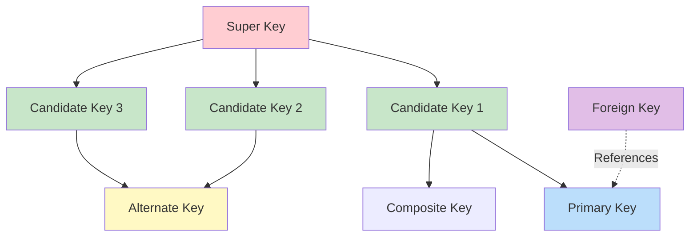
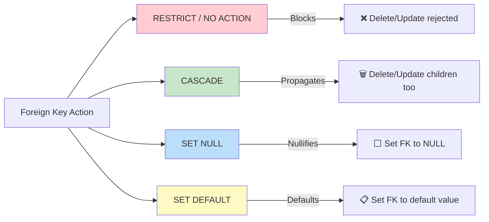

# Keys in the Relational Model

## Overview

**Keys** are fundamental to the relational model — they ensure each tuple in a relation can be uniquely identified and that relationships between tables remain consistent. Understanding keys is critical for schema design, normalization, and interview questions.

## Key Hierarchy



## 1. Super Key

A **super key** is any set of one or more attributes that, taken collectively, can uniquely identify a tuple in a relation.

For a relation with `n` attributes, there are **2ⁿ - 1** possible super keys.

```sql
-- Students table: (student_id, email, name, phone)
-- Super keys include:
-- {student_id}
-- {email}
-- {student_id, email}
-- {student_id, name}
-- {student_id, email, name}
-- {student_id, email, name, phone}
-- ... any combination containing at least one candidate key
```

### Example

Given `R(A, B, C)` with functional dependencies: `{A} → {B, C}`, `{B} → {C}`

- Candidate keys: `{A}` only. Derivation:
  - `{A}` determines `{B, C}` → determines everything → candidate key
  - `{B}` determines only `{C}`, not `{A}` → NOT a candidate key
- Super keys: `{A}`, `{A,B}`, `{A,C}`, `{A,B,C}` (4 = 2²)

## 2. Candidate Key

A **candidate key** is a *minimal* super key — removing any attribute from it would destroy its uniqueness property.

**Properties of a candidate key:**
- **Uniqueness**: No two tuples have the same value
- **Minimality**: No proper subset is also a super key
- **Non-null**: Candidate key attributes should not be NULL

```sql
-- Student table with two candidate keys:
CREATE TABLE Students (
    student_id  INT,           -- Candidate key 1
    email       VARCHAR(255),  -- Candidate key 2
    name        VARCHAR(100),
    phone       VARCHAR(20),
    UNIQUE (student_id),
    UNIQUE (email)
);
```

## 3. Primary Key

The **primary key** is the candidate key chosen by the database designer to be the main identifier for tuples.

**Rules:**
- Must be UNIQUE
- Must be NOT NULL (entity integrity)
- Only ONE per table
- Should be stable (values shouldn't change frequently)
- Should be simple (single attribute preferred)

```sql
CREATE TABLE Employees (
    emp_id      INT PRIMARY KEY,      -- Simple primary key
    email       VARCHAR(255) UNIQUE,  -- Alternate key
    name        VARCHAR(100) NOT NULL
);

-- Composite primary key:
CREATE TABLE Enrollments (
    student_id  INT,
    course_id   INT,
    semester    VARCHAR(10),
    grade       CHAR(2),
    PRIMARY KEY (student_id, course_id, semester)
);
```

## 4. Alternate Key

Any candidate key that is NOT chosen as the primary key. It still enforces uniqueness.

```sql
CREATE TABLE Users (
    user_id     INT PRIMARY KEY,      -- Primary key
    username    VARCHAR(50) UNIQUE,   -- Alternate key
    email       VARCHAR(255) UNIQUE,  -- Alternate key
    phone       VARCHAR(20) UNIQUE    -- Alternate key
);
-- user_id is the PK; username, email, phone are alternate keys
```

## 5. Foreign Key

A **foreign key** is an attribute (or set of attributes) in one relation that references the primary key (or candidate key) of another relation. It establishes and enforces a link between the two tables.

```sql
CREATE TABLE Orders (
    order_id    INT PRIMARY KEY,
    customer_id INT NOT NULL,
    order_date  DATE,
    total       DECIMAL(10,2),
    FOREIGN KEY (customer_id) REFERENCES Customers(customer_id)
        ON DELETE RESTRICT
        ON UPDATE CASCADE
);
```

### Foreign Key Actions



```sql
-- CASCADE: Deleting a department deletes all its students
CREATE TABLE Students (
    student_id INT PRIMARY KEY,
    dept_id    INT,
    FOREIGN KEY (dept_id) REFERENCES Departments(dept_id)
        ON DELETE CASCADE
        ON UPDATE CASCADE
);

-- SET NULL: Deleting a department sets students' dept_id to NULL
CREATE TABLE Students (
    student_id INT PRIMARY KEY,
    dept_id    INT,
    FOREIGN KEY (dept_id) REFERENCES Departments(dept_id)
        ON DELETE SET NULL
);
```

## 6. Composite Key

A key consisting of **two or more attributes**. Can be a composite primary key, composite candidate key, or composite foreign key.

```sql
-- Composite primary key
CREATE TABLE FlightManifest (
    flight_no   VARCHAR(10),
    flight_date DATE,
    passenger_id INT,
    seat_no     VARCHAR(5),
    PRIMARY KEY (flight_no, flight_date, passenger_id)
);

-- Composite foreign key referencing composite PK
CREATE TABLE TicketChanges (
    change_id   INT PRIMARY KEY,
    flight_no   VARCHAR(10),
    flight_date DATE,
    passenger_id INT,
    change_type VARCHAR(20),
    FOREIGN KEY (flight_no, flight_date, passenger_id)
        REFERENCES FlightManifest(flight_no, flight_date, passenger_id)
);
```

## 7. Surrogate Key

An artificial key with no business meaning, typically an auto-incrementing integer or UUID. Used when no natural key exists or for performance.

```sql
-- Surrogate key (auto-increment)
CREATE TABLE Products (
    product_id  SERIAL PRIMARY KEY,       -- Surrogate key
    sku         VARCHAR(50) UNIQUE,       -- Natural key
    name        VARCHAR(200),
    price       DECIMAL(10,2)
);

-- UUID surrogate key (PostgreSQL)
CREATE TABLE Events (
    event_id    UUID DEFAULT gen_random_uuid() PRIMARY KEY,
    event_name  VARCHAR(200),
    created_at  TIMESTAMP DEFAULT NOW()
);
```

### Surrogate vs Natural Key

| Aspect | Surrogate Key | Natural Key |
|---|---|---|
| Meaning | No business meaning | Has real-world meaning |
| Stability | Never changes | May change (e.g., SSN) |
| Size | Usually small (INT, UUID) | Can be large (VARCHAR) |
| Joins | Fast (indexed integers) | Slower if string-based |
| Uniqueness | Guaranteed by DB | Depends on business rules |
| Example | `user_id SERIAL` | `email`, `SSN` |

## 8. Compound Key vs Composite Key

Often confused, but:
- **Composite key**: Multiple columns form a key, each column may not be a key alone
- **Compound key**: Each column is itself a key (or part of another key)

```sql
-- Composite: (student_id, course_id) — neither alone is a key
-- Compound: (student_id, professor_id) where both are keys in their own tables
```

## Functional Dependencies and Keys

Keys are determined by **Functional Dependencies (FDs)**:

`X → Y` means "X functionally determines Y" — for every valid instance, if two tuples agree on X, they must agree on Y.

```
Given R(A, B, C, D):
  A → B, C, D    (A determines all → A is a candidate key)
  B → C           (B determines C only → not a candidate key)

Candidate keys: {A}
Super keys: {A}, {A,B}, {A,C}, {A,D}, {A,B,C}, {A,B,D}, {A,C,D}, {A,B,C,D}
```

### Finding Candidate Keys Algorithm

1. Find attributes that appear **only on the left side** of FDs → must be in every key
2. Find attributes that appear **only on the right side** → never in any key
3. Compute closure of step 1 attributes. If it includes all attributes, that's the only candidate key.
4. Otherwise, try adding remaining attributes one at a time.

## Interview Questions

### Beginner

**Q1: What is the difference between a primary key and a unique key?**
A: Both enforce uniqueness. Differences:
- Primary key: only ONE per table, NOT NULL by default
- Unique key: multiple allowed per table, allows one NULL (in most RDBMS)
- Primary key automatically creates a clustered index (in most DBs)

**Q2: Can a table have no primary key?**
A: Physically, yes — SQL allows tables without PKs. But in the relational model, every relation must have at least one candidate key. Tables without PKs can have duplicate rows, making them bags not relations, and can cause issues with replication and ORM frameworks.

**Q3: What is a composite key? Give an example.**
A: A key made of two or more columns. Example: In an `Enrollment` table, `(student_id, course_id)` forms a composite primary key because a student can enroll in multiple courses, and a course has multiple students, but each (student, course) pair is unique.

### Intermediate

**Q4: A table has attributes A, B, C, D with FDs: A→B, B→C, A→D. Find all candidate keys.**
A:
- A appears only on the left → must be in key
- Closure of {A}: {A}⁺ = {A, B, C, D} (A→B, then B→C, then A→D)
- {A} determines everything → {A} is the only candidate key
- Super keys: {A}, {A,B}, {A,C}, {A,D}, {A,B,C}, {A,B,D}, {A,C,D}, {A,B,C,D}

**Q5: When would you choose a surrogate key over a natural key?**
A: Choose surrogate when:
- No stable natural key exists (names change, emails change)
- Natural key is large (composite of 3+ VARCHAR columns) — hurts join performance
- Business rules for uniqueness may change
- ORMs work better with integer PKs
- Distributed systems need UUIDs to avoid collision

Choose natural when:
- The key is small, stable, and meaningful (country_code, currency_code)
- You want to enforce business uniqueness at the DB level

**Q6: Explain referential integrity violations with examples.**
A: Four types of violation:
1. **Insert violation**: Inserting a child row with FK value not in parent
2. **Delete violation**: Deleting a parent row referenced by children (unless CASCADE)
3. **Update violation**: Updating PK in parent when children reference it
4. **NULL violation**: If FK is NOT NULL and referenced row is deleted

### Advanced / FAANG-Level

**Q7: Design a key strategy for a distributed database with 100M+ records.**
A: Considerations:
- **Avoid auto-increment**: Creates hotspots in distributed systems
- **UUID v7**: Time-sortable, globally unique, no coordination needed
- **Snowflake IDs**: 64-bit, time-ordered, embeds machine ID (Twitter's approach)
- **ULID**: Like UUID but lexicographically sortable
- **Shard-aware keys**: Encode shard key in the ID for routing
- Trade-offs: UUID (16 bytes) vs INT (4 bytes) — 4x storage + index size

**Q8: How do keys affect index performance in B+ trees?**
A: Primary key determines the **clustering index** — data is physically sorted on disk by PK. This makes PK range scans extremely fast (sequential I/O). Secondary indexes store (indexed_value, PK) pairs, requiring a lookup through the PK to get full rows. Large PKs (composite, VARCHAR) bloat secondary indexes. This is why integer surrogate keys are preferred for OLTP.

## Common Mistakes

- Using `AUTO_INCREMENT` as a surrogate key without a UNIQUE constraint on the natural key — allows duplicate business records
- Making too many columns part of a composite PK — bloats secondary indexes
- Not adding NOT NULL to candidate keys that should never be null
- Confusing UNIQUE constraint with PRIMARY KEY (NULL handling differs)
- Using mutable values as primary keys (email, phone) — update cascades are expensive
- Forgetting that foreign keys require indexes on the referencing column for join performance

## Summary

| Key Type | Purpose | Nulls Allowed | Count per Table |
|---|---|---|---|
| Super Key | Uniquely identifies tuples | No (if used as PK) | Many |
| Candidate Key | Minimal super key | No | One or more |
| Primary Key | Main tuple identifier | No | Exactly one |
| Alternate Key | Unused candidate key | No (UNIQUE) | Zero or more |
| Foreign Key | Cross-table reference | Yes (if nullable) | Zero or more |
| Composite Key | Multi-attribute key | No | Varies |
| Surrogate Key | Artificial identifier | No | At most one |

## Cross-References

- [Relational Model](README.md) — Foundation concepts
- [ER Diagrams](er-diagrams.md) — Identifying keys during design
- [Normalization](../normalization/README.md) — Keys drive normal forms
- [B+ Tree Index](../indexing/b-plus-tree.md) — How PKs affect storage
- [Clustered vs Non-Clustered](../indexing/clustered-vs-nonclustered.md) — PK and index organization
- [SQL DDL](../sql/ddl.md) — Defining keys in SQL


## Cross References

- [ER Diagrams](er-diagrams.md)
- [Indexing](../indexing/README.md)
- [Normalization](../normalization/README.md)
