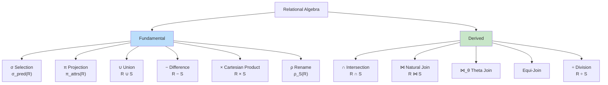
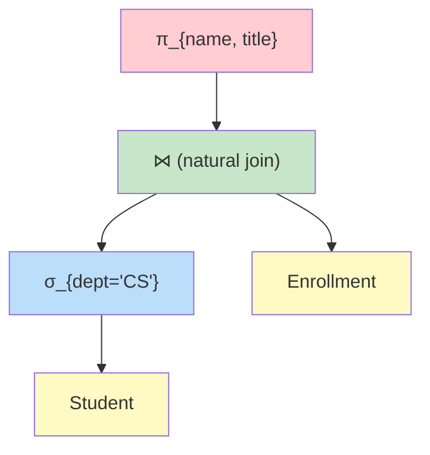

# Relational Algebra

## Overview

**Relational Algebra** is a **procedural query language** that takes one or more relations as input and produces a new relation as output. Proposed by E.F. Codd, it forms the theoretical foundation of SQL. Every SQL query can be expressed in relational algebra, and query optimizers internally convert SQL to relational algebra trees before optimization.

## Fundamental Operations

### 1. Selection (σ) — sigma

Selects rows that satisfy a predicate. Equivalent to SQL `WHERE`.

**Notation:** `σ_predicate(R)`

```sql
-- SQL equivalent:
SELECT * FROM Students WHERE gpa > 3.5;

-- Relational Algebra:
σ_{gpa > 3.5}(Students)
```

Properties:
- **Commutative**: `σ_{c1}(σ_{c2}(R)) = σ_{c2}(σ_{c1}(R))`
- Can be decomposed: `σ_{c1 AND c2}(R) = σ_{c1}(σ_{c2}(R))`

### 2. Projection (π) — pi

Selects columns (attributes). Eliminates duplicates (returns a set). Equivalent to SQL `SELECT DISTINCT`.

**Notation:** `π_{attribute_list}(R)`

```sql
-- SQL equivalent:
SELECT DISTINCT name, gpa FROM Students;

-- Relational Algebra:
π_{name, gpa}(Students)
```

Properties:
- `π_{A}(π_{A,B}(R)) = π_{A}(R)` — projecting fewer columns on already projected is redundant
- Distributes over union: `π_{A}(R ∪ S) = π_{A}(R) ∪ π_{A}(S)`

### 3. Union (∪)

Combines tuples from two relations. **Both relations must be union-compatible** (same number of attributes, same domains).

**Notation:** `R ∪ S`

```sql
-- SQL equivalent:
SELECT name FROM Students UNION SELECT name FROM Alumni;
```

### 4. Set Difference (−)

Returns tuples in R but not in S. Relations must be union-compatible.

**Notation:** `R − S`

```sql
-- Students who are not TAs:
SELECT student_id FROM Students
EXCEPT
SELECT student_id FROM TeachingAssistants;
```

### 5. Cartesian Product (×)

Pairs every tuple of R with every tuple of S. If R has `m` tuples and S has `n` tuples, result has `m × n` tuples.

**Notation:** `R × S`

```sql
-- Usually not used directly; combined with selection for joins
SELECT * FROM Students CROSS JOIN Courses;
```

### 6. Rename (ρ)

Renames a relation or its attributes.

**Notation:** `ρ_{S(B1, B2, ...)}(R)` — renames R to S, attributes to B1, B2, ...

```sql
-- SQL equivalent:
SELECT student_id AS sid, name AS student_name FROM Students;
```

## Derived Operations

### 7. Intersection (∩)

Returns tuples common to both relations. Must be union-compatible.

**Notation:** `R ∩ S = R − (R − S)`

```sql
-- SQL:
SELECT student_id FROM Students INTERSECT SELECT student_id FROM Athletes;
```

### 8. Natural Join (⋈)

Joins on **common attribute names**, eliminating duplicate columns. The most "intelligent" join.

**Notation:** `R ⋈ S`

```sql
-- If R(A, B, C) and S(C, D, E), natural join on C:
SELECT R.A, R.B, R.C, S.D, S.E FROM R NATURAL JOIN S;

-- Relational Algebra:
R ⋈ S
-- Equivalent to:
π_{A,B,R.C,D,E}(σ_{R.C = S.C}(R × S))
```

### 9. Theta Join (⋈_θ)

Joins two relations with an arbitrary predicate θ (not just equality).

**Notation:** `R ⋈_θ S`

```sql
-- Students with GPA higher than the department average:
SELECT * FROM Students S JOIN Departments D ON S.gpa > D.avg_gpa;

-- Relational Algebra:
σ_{S.gpa > D.avg_gpa}(Students × Departments)
```

### 10. Equi-Join

A theta join where θ uses only equality (=). Natural join is a special equi-join.

```sql
-- Equi-join on specific columns:
SELECT * FROM Students S JOIN Enrollments E ON S.student_id = E.student_id;
```

### 11. Division (÷)

The "for all" operator. R ÷ S returns tuples in R that are associated with **every** tuple in S.

**Notation:** `R ÷ S`

Example: Find students who have taken **ALL** courses.

```sql
-- Students who took every course in the 'Core' set:
-- R = Enrollments(student_id, course_id)
-- S = Core_Courses(course_id)
-- R ÷ S = students who took all core courses

-- SQL equivalent:
SELECT DISTINCT E.student_id
FROM Enrollments E
WHERE NOT EXISTS (
    SELECT course_id FROM Core_Courses
    EXCEPT
    SELECT E2.course_id FROM Enrollments E2
    WHERE E2.student_id = E.student_id
);
```

## Complete Operator Reference



## Expression Trees

Relational algebra expressions are represented as **expression trees** where:
- Leaf nodes are base relations
- Internal nodes are operators
- Evaluation is bottom-up



**Reading the tree**: "Take Students, filter for CS department, join with Enrollment, then project name and title."

## Equivalence Rules (Query Optimization)

Query optimizers use these rules to find cheaper execution plans:

1. **Cascade of σ**: `σ_{c1 AND c2}(R) ≡ σ_{c1}(σ_{c2}(R))`
2. **Commutativity of σ**: `σ_{c1}(σ_{c2}(R)) ≡ σ_{c2}(σ_{c1}(R))`
3. **Cascade of π**: `π_{L1}(π_{L2}(R)) ≡ π_{L1}(R)` where L1 ⊆ L2
4. **Commutativity of ⋈**: `R ⋈ S ≡ S ⋈ R`
5. **Commutativity of ×**: `R × S ≡ S × R`
6. **Associativity of ⋈**: `(R ⋈ S) ⋈ T ≡ R ⋈ (S ⋈ T)`
7. **σ commutes with ⋈** (when σ involves only one operand):
   `σ_{c}(R ⋈ S) ≡ σ_{c}(R) ⋈ S` (if c uses only R's attributes)
8. **Push σ before ×**: `σ_{c}(R × S) ≡ σ_{c}(R) × S` (if c uses only R)
9. **σ distributes over ∪, ∩, −**
10. **π distributes over ∪**: `π_{L}(R ∪ S) ≡ π_{L}(R) ∪ π_{L}(S)`

### Optimization Example

**Original query:** "Find names of CS students who enrolled in CS101"

```
π_{name}(σ_{dept='CS' AND course='CS101'}(Student ⋈ Enrollment))
```

**Optimized plan (push selections down):**

```
π_{name}(σ_{dept='CS'}(Student) ⋈ σ_{course='CS101'}(Enrollment))
```

This filters early, reducing the size of inputs to the join.

## SQL to Relational Algebra Translation

| SQL Clause | Relational Algebra |
|---|---|
| `SELECT` | π (projection) |
| `WHERE` | σ (selection) |
| `FROM` | × (cross join) or ⋈ (natural join) |
| `JOIN ... ON` | ⋈_θ (theta join) |
| `UNION` | ∪ |
| `INTERSECT` | ∩ |
| `EXCEPT` | − |
| `DISTINCT` | π (eliminates duplicates) |
| `GROUP BY + HAVING` | γ (grouping operator) |
| `ORDER BY` | τ (sorting — not standard RA) |

### Translation Example

```sql
SELECT S.name, COUNT(E.course_id) AS num_courses
FROM Students S
JOIN Enrollments E ON S.student_id = E.student_id
WHERE S.gpa > 3.0
GROUP BY S.student_id, S.name
HAVING COUNT(E.course_id) > 3
ORDER BY num_courses DESC;
```

Relational algebra (simplified):
```
τ_{num_courses DESC}(
    γ_{S.student_id, S.name; COUNT(E.course_id)→num_courses}(
        σ_{gpa > 3.0}(Student) ⋈ Enrollment
    )
    where num_courses > 3
)
```

## Interview Questions

### Beginner

**Q1: What is relational algebra and why is it important?**
A: Relational algebra is a procedural query language with operations that take relations as input and produce relations as output. It's important because: (1) it's the theoretical foundation of SQL, (2) query optimizers convert SQL to relational algebra trees for optimization, (3) understanding it helps write better SQL.

**Q2: What is the difference between selection and projection?**
A: **Selection (σ)** filters rows based on a condition — it's horizontal (chooses which tuples). **Projection (π)** selects specific columns — it's vertical (chooses which attributes). Selection reduces cardinality (rows), projection reduces degree (columns).

**Q3: Why must relations be union-compatible for union, intersection, and difference?**
A: Because these set operations require tuples to be comparable. Two relations are union-compatible if they have the same number of attributes and corresponding attributes have the same domain. Without this, it's meaningless to combine or compare tuples.

### Intermediate

**Q4: Express "Find all students who have taken every course offered by the CS department" in relational algebra.**
A:
```
Let R = π_{student_id, course_id}(Enrollment)
Let S = π_{course_id}(σ_{dept='CS'}(Course))
Result = R ÷ S
```
The division operator returns student_ids that appear with every course_id in S.

**Q5: Prove that σ_{c1 AND c2}(R) ≡ σ_{c1}(σ_{c2}(R)).**
A: A tuple t is in σ_{c1 AND c2}(R) iff t ∈ R AND c1(t) AND c2(t). A tuple t is in σ_{c1}(σ_{c2}(R)) iff t ∈ σ_{c2}(R) AND c1(t), which means t ∈ R AND c2(t) AND c1(t). Both conditions are identical (AND is commutative), so the expressions are equivalent.

**Q6: How does the query optimizer use relational algebra equivalences?**
A: The optimizer:
1. Parses SQL into a relational algebra expression tree
2. Applies equivalence rules to generate alternative trees
3. Estimates cost of each plan using statistics (cardinality, selectivity)
4. Selects the cheapest plan

Key optimizations: push selections down (filter early), reorder joins (smaller tables first), convert Cartesian products + selections to joins, eliminate redundant projections.

### Advanced / FAANG-Level

**Q7: Explain why relational algebra is relationally complete and what that means.**
A: A query language is **relationally complete** if it can express every query that can be formulated in relational calculus (first-order predicate calculus). Relational algebra is relationally complete because its operators (σ, π, ∪, −, ×) can express any safe relational calculus expression. However, it cannot express transitive closure or aggregation — these require extensions.

**Q8: Discuss the difference between bag (multiset) algebra and set algebra. How does SQL's bag semantics affect optimization?**
A: Standard relational algebra uses **sets** (no duplicates). SQL uses **bags** (multisets — duplicates allowed). This affects:
- **π doesn't eliminate duplicates** in bag algebra (SQL SELECT without DISTINCT)
- **σ commutes** in both
- **Union** adds multiplicities in bags: if t appears 3 times in R and 2 times in S, R ∪ S has t 5 times
- Optimization: bag algebra allows more rewrites since duplicate elimination is avoided
- Some equivalences don't hold: `π_A(R) ≠ π_A(π_{A,B}(R))` in bag algebra

## Common Mistakes

- Confusing θ-join with natural join — natural join only equates common attribute names
- Forgetting that projection eliminates duplicates (in set algebra)
- Not realizing division is the "for all" operator
- Pushing projections too aggressively before joins (might eliminate needed columns)
- Assuming bag and set algebra have the same equivalences

## Summary

| Operator | Symbol | SQL Equivalent | Purpose |
|---|---|---|---|
| Selection | σ | WHERE | Filter rows |
| Projection | π | SELECT | Choose columns |
| Union | ∪ | UNION | Combine sets |
| Difference | − | EXCEPT | Subtract sets |
| Cartesian Product | × | CROSS JOIN | Pair all tuples |
| Rename | ρ | AS | Rename relation/attributes |
| Intersection | ∩ | INTERSECT | Common tuples |
| Natural Join | ⋈ | NATURAL JOIN | Join on common names |
| Theta Join | ⋈_θ | JOIN ... ON | Join with predicate |
| Division | ÷ | NOT EXISTS (EXCEPT) | For all |

## Cross-References

- [Relational Model](README.md) — Foundation concepts
- [Relational Calculus](relational-calculus.md) — Declarative equivalent
- [SQL](../sql/README.md) — Practical implementation
- [Query Optimization](../indexing/tuning.md) — How optimizers use RA equivalences


## Cross References

- [Relational Calculus](../dbms/relational-model/relational-calculus.md)
- [Query Processing](../dbms/query-processing/README.md)
- [SQL DML](../dbms/sql/dml.md)
