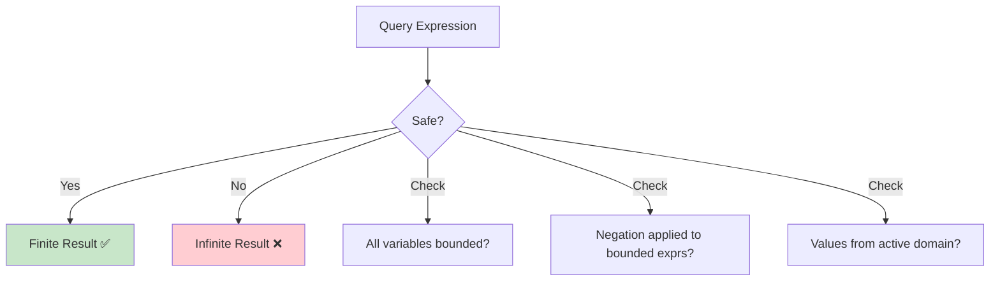
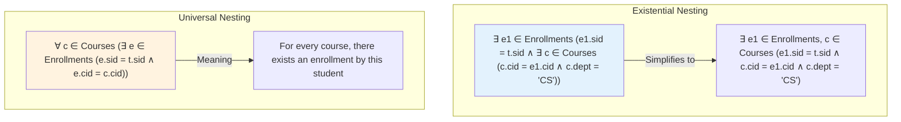

# Relational Calculus

## Overview

**Relational Calculus** is a **non-procedural (declarative) query language** — you describe *what* you want, not *how* to get it. It's based on **first-order predicate logic** and comes in two variants:

1. **Tuple Relational Calculus (TRC)**: Variables range over tuples
2. **Domain Relational Calculus (DRC)**: Variables range over attribute values (domains)

Both are **relationally complete** — they can express the same queries as relational algebra. SQL is based on relational calculus (specifically, a mix of TRC and DRC).

## Tuple Relational Calculus (TRC)

### Syntax

```
{ t | P(t) }
```

Where:
- `t` is a tuple variable
- `P(t)` is a well-formed formula (predicate) using `t`

### Predicate Building Blocks

| Construct | Meaning | Example |
|---|---|---|
| `t ∈ R` | t is a tuple in relation R | `t ∈ Students` |
| `t.A` | Attribute A of tuple t | `t.gpa` |
| `t.A op s.B` | Comparison of attributes | `t.gpa > s.min_gpa` |
| `∃ t ∈ R` | There exists a tuple t in R | `∃ e ∈ Enrollments` |
| `∀ t ∈ R` | For all tuples t in R | `∀ e ∈ Enrollments` |
| `¬` | Logical NOT | `¬(t.gpa < 2.0)` |
| `∧` | Logical AND | `t.gpa > 3.5 ∧ t.dept = 'CS'` |
| `∨` | Logical OR | `t.dept = 'CS' ∨ t.dept = 'Math'` |
| `⇒` | Implies | `t.dept = 'CS' ⇒ t.gpa > 3.0` |

### Examples

**Q1: Find all students with GPA > 3.5**

```
{ t | t ∈ Students ∧ t.gpa > 3.5 }
```

SQL equivalent:
```sql
SELECT * FROM Students WHERE gpa > 3.5;
```

**Q2: Find names of students enrolled in 'CS101'**

```
{ t.name | t ∈ Students ∧ ∃ e ∈ Enrollments (e.student_id = t.student_id ∧ e.course_id = 'CS101') }
```

SQL:
```sql
SELECT S.name FROM Students S
WHERE EXISTS (SELECT 1 FROM Enrollments E WHERE E.student_id = S.student_id AND E.course_id = 'CS101');
```

**Q3: Find students enrolled in ALL CS courses (division)**

```
{ t | t ∈ Students ∧ ∀ c ∈ Courses (c.dept = 'CS' ⇒ ∃ e ∈ Enrollments (e.student_id = t.student_id ∧ e.course_id = c.course_id)) }
```

SQL:
```sql
SELECT S.* FROM Students S
WHERE NOT EXISTS (
    SELECT C.course_id FROM Courses C WHERE C.dept = 'CS'
    EXCEPT
    SELECT E.course_id FROM Enrollments E WHERE E.student_id = S.student_id
);
```

**Q4: Find students NOT enrolled in any course**

```
{ t | t ∈ Students ∧ ¬(∃ e ∈ Enrollments (e.student_id = t.student_id)) }
```

SQL:
```sql
SELECT * FROM Students S
WHERE NOT EXISTS (SELECT 1 FROM Enrollments E WHERE E.student_id = S.student_id);
```

## Domain Relational Calculus (DRC)

### Syntax

```
{ <x1, x2, ..., xn> | P(x1, x2, ..., xn) }
```

Where:
- `x1, x2, ..., xn` are domain variables (range over attribute values)
- `P` is a predicate

### Examples

**Q1: Find all students with GPA > 3.5**

```
{ <id, name, email, gpa> | <id, name, email, gpa> ∈ Students ∧ gpa > 3.5 }
```

**Q2: Find names of students enrolled in 'CS101'**

```
{ <name> | ∃ id, cid, grade (<id, name, email, gpa> ∈ Students ∧ <id, cid, grade> ∈ Enrollments ∧ cid = 'CS101') }
```

**Q3: Find students and their enrolled course titles**

```
{ <name, title> | ∃ sid, email, gpa, cid, grade, credits, dept (
    <sid, name, email, gpa> ∈ Students ∧
    <sid, cid, grade> ∈ Enrollments ∧
    <cid, title, credits, dept> ∈ Courses
) }
```

## TRC vs DRC

| Aspect | TRC | DRC |
|---|---|---|
| Variable ranges over | Tuples | Individual domain values |
| Notation | `{ t \| P(t) }` | `{ <x1,...,xn> \| P(x1,...,xn) }` |
| More intuitive for | Column-oriented queries | Value-oriented queries |
| SQL correspondence | Correlated subqueries | Scalar variables in WHERE |
| Relationally complete | Yes | Yes |

## Safety of Expressions

Not all relational calculus expressions are **safe** (finite result). Unsafe expressions can produce infinite results.

### Unsafe Example

```
{ t | t ∈ Students }  -- Safe: finite result

{ t | ¬(t ∈ Students) }  -- UNSAFE: infinite tuples not in Students
```

### Safe Expression Rules

An expression is safe if all values in the result appear in values from the input relations. Formalized via **active domain**: the set of all values appearing in the database.

A safe TRC expression restricts:
1. Every tuple variable is bound to a specific relation
2. Negation is applied only to bounded sub-expressions
3. All values in the result come from the active domain



## Existential (∃) vs Universal (∀) Quantifiers

### Existential (∃) — "There exists"

"Find at least one" — equivalent to `EXISTS` in SQL.

```
-- Students who have at least one enrollment:
{ t | t ∈ Students ∧ ∃ e ∈ Enrollments (e.student_id = t.student_id) }
```

### Universal (∀) — "For all"

"Must satisfy for every" — often converted using the equivalence:
`∀x P(x) ≡ ¬∃x ¬P(x)`

```
-- Students enrolled in every course:
{ t | t ∈ Students ∧ ∀ c ∈ Courses (∃ e ∈ Enrollments (e.student_id = t.student_id ∧ e.course_id = c.course_id)) }
```

### Converting ∀ to ∃

```
∀ c ∈ Courses (P(c))
≡ ¬(∃ c ∈ Courses (¬P(c)))
```

In SQL:
```sql
-- "For all" using NOT EXISTS
WHERE NOT EXISTS (
    SELECT 1 FROM Courses C WHERE NOT EXISTS (
        SELECT 1 FROM Enrollments E
        WHERE E.student_id = S.student_id AND E.course_id = C.course_id
    )
)
```

## Quantifier Nesting



## Equivalence: RA ⟺ RC

Every relational algebra expression has an equivalent relational calculus expression and vice versa (Codd's theorem — both are relationally complete).

| Relational Algebra | Relational Calculus |
|---|---|
| `σ_{c}(R)` | `{ t \| t ∈ R ∧ c(t) }` |
| `π_{A}(R)` | `{ t.A \| t ∈ R }` |
| `R ∪ S` | `{ t \| t ∈ R ∨ t ∈ S }` |
| `R − S` | `{ t \| t ∈ R ∧ ¬(t ∈ S) }` |
| `R × S` | `{ <t,s> \| t ∈ R ∧ s ∈ S }` |
| `R ⋈ S` | `{ <t,s> \| t ∈ R ∧ s ∈ S ∧ t.common = s.common }` |
| `R ÷ S` | `{ t \| ∀ s ∈ S (∃ r ∈ R (r = t ∘ s)) }` |

## SQL ↔ TRC ↔ RA Translation

```
SQL:   SELECT name FROM Students WHERE gpa > 3.5
TRC:   { t.name | t ∈ Students ∧ t.gpa > 3.5 }
RA:    π_{name}(σ_{gpa > 3.5}(Students))
```

```
SQL:   SELECT S.name FROM Students S JOIN Enrollments E ON S.sid = E.sid WHERE E.cid = 'CS101'
TRC:   { S.name | S ∈ Students ∧ ∃ E ∈ Enrollments (E.sid = S.sid ∧ E.cid = 'CS101') }
RA:    π_{name}(Students ⋈ σ_{cid='CS101'}(Enrollments))
```

## Interview Questions

### Beginner

**Q1: What is the difference between relational algebra and relational calculus?**
A: **Relational algebra** is procedural — specifies *how* to compute the result (step-by-step operations). **Relational calculus** is declarative — specifies *what* the result should satisfy (logical conditions). Both are relationally complete and can express the same queries. SQL is closer to relational calculus.

**Q2: What does "relationally complete" mean?**
A: A query language is relationally complete if it can express every query expressible in relational calculus. Equivalently, it can handle selection, projection, union, difference, and Cartesian product. SQL is relationally complete (it can express all safe relational calculus queries).

**Q3: What is the difference between ∃ and ∀ in relational calculus?**
A: **∃ (existential)**: "There exists at least one" — returns TRUE if at least one tuple satisfies the condition. **∀ (universal)**: "For all" — returns TRUE only if every tuple satisfies the condition. In SQL: ∃ maps to `EXISTS`, ∀ maps to `NOT EXISTS (... WHERE NOT ...)`.

### Intermediate

**Q4: Convert "Find students who have taken all 300-level courses" to TRC.**
A:
```
{ t | t ∈ Students ∧ ∀ c ∈ Courses (c.course_id LIKE '%3__' ⇒ ∃ e ∈ Enrollments (e.student_id = t.student_id ∧ e.course_id = c.course_id)) }
```

Using the ∀-to-∃ conversion:
```
{ t | t ∈ Students ∧ ¬(∃ c ∈ Courses (c.course_id LIKE '%3__' ∧ ¬(∃ e ∈ Enrollments (e.student_id = t.student_id ∧ e.course_id = c.course_id)))) }
```

**Q5: Why must relational calculus expressions be "safe"? Give an example of an unsafe expression.**
A: Unsafe expressions can return infinite results. Example:
```
{ t | ¬(t ∈ Students) }
```
This asks for all tuples NOT in Students — there are infinitely many such tuples (any combination of values). A safe version:
```
{ t | t ∈ Students ∧ ¬(t.gpa > 3.5) }
```
This is safe because all results come from the Students relation (finite, bounded).

**Q6: Express the division operator in both TRC and DRC.**
A: "Find students who enrolled in all courses in set C"

TRC:
```
{ t | t ∈ Students ∧ ∀ c ∈ C (∃ e ∈ Enrollments (e.student_id = t.student_id ∧ e.course_id = c.course_id)) }
```

DRC:
```
{ <sid, name, email, gpa> | <sid, name, email, gpa> ∈ Students ∧ ∀ cid (<cid> ∈ C ⇒ ∃ grade (<sid, cid, grade> ∈ Enrollments)) }
```

### Advanced / FAANG-Level

**Q7: Prove that relational algebra and relational calculus are equivalent (Codd's theorem sketch).**
A: Codd's theorem has two directions:
1. **RA → RC**: Every RA expression can be translated to RC. This is constructive — each operator has a direct RC translation (shown in the equivalence table above).
2. **RC → RA**: Every safe RC expression can be translated to RA. This is harder and uses structural induction on the formula:
   - Atomic formulas translate to selection/projection
   - Conjunction (∧) translates to intersection or natural join
   - Disjunction (∨) translates to union
   - Negation (¬) translates to set difference
   - Quantifiers translate using join + projection + difference

The proof assumes finite relations and safe expressions (active domain restriction).

**Q8: How does SQL's handling of NULLs break the assumptions of relational calculus?**
A: Standard relational calculus uses two-valued logic (TRUE/FALSE). SQL uses three-valued logic (TRUE/FALSE/UNKNOWN) due to NULLs. This causes:
- `¬(NULL > 5)` = `¬UNKNOWN` = `UNKNOWN`, not TRUE
- `t.name = NULL` is always UNKNOWN (must use `IS NULL`)
- De Morgan's laws don't hold: `NOT (A AND B)` ≠ `(NOT A) OR (NOT B)` when NULLs are involved
- Quantifier semantics change: `∀x P(x)` over a set containing NULL may behave unexpectedly

This is why SQL requires careful NULL handling with `IS NULL`, `COALESCE`, and `IS DISTINCT FROM`.

## Common Mistakes

- Confusing ∃ with ∀ — "find all students who took all courses" requires ∀, not ∃
- Writing unsafe expressions that produce infinite results
- Not converting ∀ to ∃ when translating to SQL (SQL has no `FOR ALL` keyword)
- Forgetting that relational calculus describes *what*, not *how* — you can't reason about performance
- Using `=` for NULL comparison instead of `IS NULL` in SQL translations

## Summary

| Concept | TRC | DRC |
|---|---|---|
| Variable type | Tuple | Domain value |
| Notation | `{ t \| P(t) }` | `{ <x1,...,xn> \| P(...) }` |
| Quantifiers | ∃, ∀ on tuple variables | ∃, ∀ on domain variables |
| Safety requirement | Yes | Yes |
| Relationally complete | Yes | Yes |

| Quantifier | Meaning | SQL Equivalent |
|---|---|---|
| ∃ | There exists | `EXISTS` |
| ∀ | For all | `NOT EXISTS (... WHERE NOT ...)` |
| ¬∃ | There does not exist | `NOT EXISTS` |
| ¬∀ | Not for all | `EXISTS (... WHERE NOT ...)` |

## Cross-References

- [Relational Algebra](relational-algebra.md) — Procedural equivalent
- [Relational Model](README.md) — Foundation concepts
- [SQL Subqueries](../sql/subqueries.md) — SQL implementation of calculus concepts
- [SQL Joins](../sql/joins.md) — Practical join implementation
