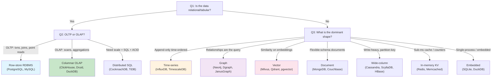
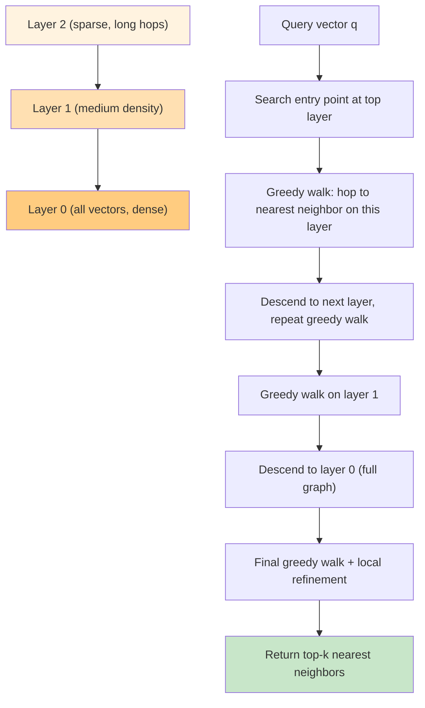
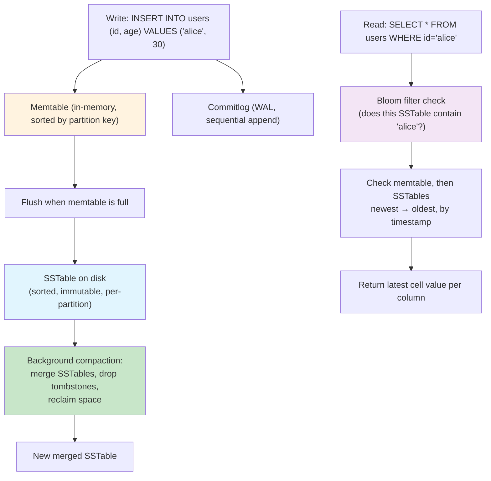

# Specialized Databases

## Overview

Most production systems run a **polyglot persistence** stack: a relational DB as source of truth, plus purpose-built stores that nail one specific workload that the RDBMS does poorly. This page covers the specialized families you reach for when the data shape, query pattern, or latency target falls outside what a general-purpose SQL engine can do well — time-series, graph, vector, columnar, embedded, in-memory, document, and wide-column databases, plus a decision framework for choosing among them.

As Kleppmann argues in *Designing Data-Intensive Applications*, the right question is rarely "which database is best" — it is "which data model and storage engine best matches this workload." Specialized databases exist because **no single storage engine wins on every axis**: row stores dominate OLTP point writes, column stores dominate OLAP scans, log-structured stores dominate append-heavy ingest, and graph stores dominate multi-hop traversals.

## The Decision Framework

Picking a database starts from the workload, not the vendor. The tree below encodes the three-question test from [Types of Databases](./types-of-databases.md): *is the data tabular, do you need horizontal scale, and is there one dominant access pattern?*



The same data can be modeled in several stores; the question is which store makes the **hot path** cheap. A user table fits PostgreSQL perfectly even if you also store friendships as a graph in Neo4j — the friendship traversal is the hot path that justifies the second store.

### Specialized Database Type Comparison

| Family | Data shape | Dominant query | Storage engine | Examples | Weakness |
|---|---|---|---|---|---|
| **Time-series** | `(timestamp, tags, value)` tuples | Range scan by time, downsampling | LSM / columnar hybrids | InfluxDB, TimescaleDB, QuestDB, kdb+ | Not for mutable records |
| **Graph** | Nodes + edges (property graph or RDF) | Multi-hop traversal, pattern match | Adjacency lists / index-free adjacency | Neo4j, Dgraph, JanusGraph, Neptune | Poor for bulk scans |
| **Vector** | Dense float vectors + metadata | Approximate nearest neighbor (ANN) | HNSW / IVF / PQ indexes | Milvus, Qdrant, Weaviate, Pinecone, pgvector | Not a primary store; needs filtering |
| **Columnar OLAP** | Wide tables, billions of rows | Aggregate few columns over many rows | PAX columnar + vectorized execution | ClickHouse, Druid, DuckDB, Snowflake | Bad for point updates |
| **Embedded** | Single-process tables | Local SQL / analytics | B-tree or columnar in-process | SQLite, DuckDB, LMDB | No concurrency across processes |
| **In-memory** | Key → opaque value / structures | Sub-ms lookup | Hash table / skip list | Redis, Memcached | RAM-bound; durability is secondary |
| **Document** | JSON/BSON trees | Read/write one document by ID | B-tree or LSM | MongoDB, Couchbase, CouchDB | Joins / cross-doc txns awkward |
| **Wide-column** | Partition key + sorted cells | Lookup by partition key, range within | LSM with memtable + SSTables | Cassandra, ScyllaDB, HBase | No ad-hoc joins |

## Time-Series Databases

A time-series is an ordered sequence of `(timestamp, tags, value)` points — server metrics, IoT sensor reads, stock ticks, application traces. The workload is **append-heavy, write-skewed to recent data, and read by time range**, often with downsampling (`avg_over_time`, rate, percentile). Generic RDBMSs work for modest volume but choke at millions of points per second because they treat each insert as a transactional row update with full WAL + index maintenance.

### InfluxDB: TSM and the Line Protocol

InfluxDB's storage engine is **TSM** (Time-Structured Merge Tree), a log-structured store purpose-built for the time-series shape. Writes arrive via the **line protocol**, a compact text format:

```
cpu,host=server01,region=us-west usage_idle=78.3,usage_user=21.7 1697000000000000000
└────┬────┘ └────┬────┘ └────┬────┘ └──────────┬───────────┘ └──────┬──────┘
measurement   tag set   tag set       field set              timestamp
```

- **Measurement** — like a table name (`cpu`, `mem`, `http_req`).
- **Tags** — indexed dimensions (`host`, `region`) used in `WHERE` and `GROUP BY`.
- **Fields** — the actual numeric values; **not indexed** by default.
- **Timestamp** — nanosecond precision; the primary sort key.

The TSM engine keeps writes in an in-memory memtable, flushes to read-only **TSM files** (each holding a sorted run of `series_key → timestamp → values`), and merges them in a levels-style compaction. Crucially, **tags are dictionary-encoded and series keys are sorted**, so queries like `SELECT mean(cpu) FROM cpu WHERE host='server01' AND time > now() - 1h` touch only the relevant series.

InfluxDB also enforces **retention policies** (drop data older than N days) and **continuous queries** (precompute downsamples), so disk doesn't fill with raw 1-second metrics forever.

### TimescaleDB: Hypertables on Postgres

TimescaleDB is a PostgreSQL extension that adds the **hypertable** abstraction — a single logical table that is automatically partitioned by time into **chunks**, each chunk being a regular Postgres table. Writes hit the current chunk; queries are planned across chunks in parallel.

```sql
CREATE TABLE conditions (
  time        TIMESTAMPTZ NOT NULL,
  location    TEXT        NOT NULL,
  temperature DOUBLE PRECISION,
  humidity    DOUBLE PRECISION
);
SELECT create_hypertable('conditions', 'time', chunk_time_interval => INTERVAL '1 day');
```

Because it is Postgres underneath, you keep full SQL, ACID, JOINs, and the entire extension ecosystem (PostGIS, pg_stat_statements). The trade-off: you inherit Postgres's row-store overhead, so peak write throughput is lower than InfluxDB's TSM at very high cardinality. TimescaleDB's **columnar compression** (ordering by `time` then by a segment-by column) closes much of the storage gap.

### Time-Series Database Comparison

| System | Storage model | Query language | Cardinality handling | Strength | Limitation |
|---|---|---|---|---|---|
| **InfluxDB 2.x** | TSM (LSM variant) | Flux / InfluxQL | Series keys; struggles at >1M series | Highest write throughput | Proprietary engine; Flux is being deprecated |
| **TimescaleDB** | Postgres hypertables + columnar compression | SQL | Native Postgres indexes | Full SQL + ACID + extensions | Row-store overhead at extreme scale |
| **QuestDB** | Columnar, SIMD | SQL (Postgres wire) | Good | Very high ingest, low-latency reads | Smaller ecosystem |
| **Prometheus** | Custom TSDB (chunked gorilla) | PromQL | Label-based, scrape model | Native to metrics/observability | Not a general DB; pull-only |
| **kdb+/q** | Columnar, in-memory | q | Excellent | Decades-fast financial analytics | Proprietary, expensive, steep curve |

## Graph Databases

When **the relationship is the query**, graph databases win. Social networks, fraud rings, dependency graphs, recommendation, and identity resolution all involve traversing variable-depth connections — exactly what recursive SQL JOINs do badly.

A graph store models two primitives: **nodes** (entities with labels and properties) and **edges** (directed, typed relationships with their own properties). The defining implementation trick is **index-free adjacency**: each node physically stores pointers to its neighbors, so traversing one hop is \\(O(\text{degree})\\) — no index lookup, no JOIN. As Petrov explains in *Database Internals*, this is the property that makes multi-hop traversals on graphs asymptotically cheaper than the equivalent recursive CTE on a relational store.

### Neo4j: Property Graph and Cypher

Neo4j is the canonical property-graph database. Its data model:

```
(:Person {name:"Alice", age:30})-[:KNOWS {since:2020}]->(:Person {name:"Bob"})
```

The **Cypher** query language expresses graph patterns declaratively:

```cypher
// Friends of friends not already known to Alice
MATCH (a:Person {name:"Alice"})-[:KNOWS]->(friend)-[:KNOWS]->(fof)
WHERE NOT (a)-[:KNOWS]->(fof) AND a <> fof
RETURN DISTINCT fof.name, count(friend) AS mutuals
ORDER BY mutuals DESC LIMIT 5;
```

Under the hood, Neo4j stores fixed-size **node records** (9 bytes: pointer to first relationship + first property + labels) and **relationship records** (33 bytes: source, target, type, and doubly-linked list pointers to the next relationship of each endpoint). This on-disk adjacency list is what makes `(:Person)-[:KNOWS*2]->()` scale — every hop is a pointer chase, not an index seek.

### Dgraph and the RDF Model

Dgraph takes a different shape: it stores data as **RDF triples** `(subject, predicate, object)` and queries them with **GraphQL+-** (a GraphQL variant with graph-traversal extensions). Every predicate is its own sharded posting list, so reading the neighbors of a node is a single shard lookup. Dgraph is designed to be horizontally distributed from day one, where Neo4j's clustering has historically been read-replica-leaning.

### JanusGraph

JanusGraph is a **graph layer on top of a pluggable storage backend** (Cassandra, HBase, Bigtable, ScyllaDB) and index backend (Elasticsearch, Solr, Lucene). This separation lets you scale storage and search independently, but means you inherit the operational complexity of two systems. It uses the Apache TinkerPop **Gremlin** traversal language.

### Graph Database Comparison

| System | Model | Query language | Storage | Distribution | Best for |
|---|---|---|---|---|---|
| **Neo4j** | Property graph | Cypher | Native adjacency lists | Causal cluster (read replicas + leader) | General graph, OLTP-style traversals |
| **Dgraph** | RDF triples | GraphQL+- | Sharded posting lists | Horizontally sharded by predicate | Distributed graphs, GraphQL-friendly APIs |
| **JanusGraph** | Property graph | Gremlin (TinkerPop) | Pluggable (Cassandra/HBase/Bigtable) | Inherited from backend | Very large graphs on existing big-data infra |
| **Amazon Neptune** | Property graph + RDF | Gremlin / SPARQL | Managed AWS storage | Managed cluster | AWS-native, multi-model |
| **TigerGraph** | Property graph | GSQL | Native, MPP | Distributed | Real-time deep-link analytics |

## Vector Databases

Modern retrieval — semantic search, RAG over LLMs, recommendation by embedding — works on **dense vectors**: fixed-length float arrays produced by an embedding model. A query is itself a vector, and the database must return the \\(k\\) nearest neighbors by some distance metric (cosine, L2, dot product). Exact nearest neighbor is \\(O(N)\\) and infeasible at billion scale, so vector DBs use **approximate nearest neighbor (ANN)** algorithms that trade recall for ~1000× speedup.

### ANN Index Algorithms

The four dominant index families, summarized from the Milvus docs and Kleppmann's discussion of locality-sensitive hashing:

| Algorithm | Structure | Build cost | Query cost | Recall | Best for |
|---|---|---|---|---|---|
| **Flat (brute force)** | None — linear scan | \\(O(1)\\) | \\(O(N)\\) | 100% | Small datasets (<100K), exact ground truth |
| **IVF** (inverted file) | K-means clusters → inverted lists | \\(O(N \cdot k)\\) | \\(O(N / \text{nlist})\\) | 90–99% | Medium datasets, tunable recall |
| **HNSW** (hierarchical NSW) | Multi-layer proximity graph | \\(O(N \log N)\\) | \\(O(\log N)\\) | 95–99% | Default for most production vector DBs |
| **PQ** (product quantization) | Sub-vector codebooks → compressed codes | \\(O(N)\\) | \\(O(N)\\) compressed | 80–95% | Billion-scale, memory-constrained |
| **ANNOY** (random projection trees) | Forest of binary trees | \\(O(N \log N)\\) | \\(O(\log N)\\) | 90–97% | Read-only, static datasets (Spotify) |
| **HNSW+PQ** (hybrid) | HNSW graph with PQ-compressed vectors | \\(O(N \log N)\\) | \\(O(\log N)\\) | 90–97% | Billion-scale with fast queries |

The dominant choice in production is **HNSW** — a multi-layer skip-list-like graph where the top layer is sparse (long hops for fast traversal) and each lower layer is denser, until the bottom layer contains every node. Search descends layer by layer, doing a greedy walk toward the query.



HNSW has two key tunables: `M` (max neighbors per node, controlling memory and recall) and `efConstruction` / `efSearch` (candidate-list size during build and search — higher = better recall, slower). Memory cost is roughly \\(O(M \cdot N)\\) for the graph plus \\(O(d \cdot N)\\) for the raw vectors, where \\(d\\) is the embedding dimension.

### Vector Database Products

| Product | Index types | Deployment | Distinguishing feature |
|---|---|---|---|
| **Milvus** | FLAT, IVF, HNSW, ANNOY, PQ, DiskANN | Self-hosted / Zilliz Cloud | Widest index choice; separates storage and compute |
| **Qdrant** | HNSW + scalar filters | Self-hosted / Cloud | Rust-native; strong filtered ANN (payload filtering inside the graph) |
| **Weaviate** | HNSW + hybrid (BM25 + vector) | Self-hosted / Cloud | Built-in module system for embedding models and vectorizers |
| **Pinecone** | Proprietary (graph + quantization) | Fully managed SaaS | Managed-only; extreme scale with no ops |
| **pgvector** | IVFFlat, HNSW | Postgres extension | Embeddings inside your OLTP store; ACID joins with relational data |
| **Chroma** | HNSW | Embedded / server | Lightweight, popular for local LLM apps |

pgvector is the standout for **modest-scale RAG**: storing embeddings next to the source rows means you `JOIN` similarity results against your relational schema in one transaction, with no separate cluster to operate. The trade-off is throughput — Postgres is not built for billion-vector ANN.

## Columnar Databases (OLAP)

Columnar stores were covered in depth in [Column Stores](./storage/column-stores.md); here we focus on the systems built on them: **ClickHouse** and **Apache Druid**.

### ClickHouse: MergeTree

ClickHouse stores each table as a set of **MergeTree parts** — on-disk columnar files sorted by a user-chosen `ORDER BY` key. Inserts write a new part; a background merge tree combines parts into larger ones (similar to an LSM but on sorted columnar data, not logs).

```sql
CREATE TABLE events (
  ts        DateTime,
  user_id   UInt64,
  event     LowCardinality(String),
  props     Map(String, String)
)
ENGINE = MergeTree
PARTITION BY toYYYYMM(ts)
ORDER BY (event, user_id, ts);
```

The `ORDER BY` key defines the on-disk sort, which is the primary index: queries with a prefix of this key in `WHERE` skip irrelevant granules via a **sparse primary index** (one entry per 8192 rows by default). Each column is independently compressed (LZ4 by default) and each part carries **skip indexes** (min/max, bloom filter, set) that prune granules at query time.

ClickHouse's execution engine is **vectorized**: every operator processes batches of columnar values in tight loops that the compiler auto-vectorizes with SIMD. This is why ClickHouse routinely scans billions of rows per second per node.

### Apache Druid

Druid targets **real-time analytics on event streams**. Its segments are columnar, time-partitioned, and immutable; each segment also carries a **bitmap inverted index** over string columns, so filtered aggregations (`WHERE country='US' AND browser='Chrome'`) are answered by bitmap AND rather than a scan. Druid ingests from Kafka/Kinesis in real time and serves sub-second group-by queries over the resulting datasets.

### ClickHouse vs Druid

| Aspect | ClickHouse | Druid |
|---|---|---|
| **Best workload** | Broad OLAP, large scans, joins | Real-time event analytics, sub-second dashboards |
| **Primary index** | Sparse sorted primary index | Bitmap inverted index + time partitioning |
| **Ingest** | Bulk inserts, batches | Real-time streaming from Kafka/Kinesis |
| **Joins** | Supported (hash, merge) | Limited; denormalize at ingest |
| **Updates** | `ALTER ... UPDATE` (async, expensive) | Not supported (re-ingest) |
| **Concurrency** | Tuned for few heavy queries | Tuned for many concurrent dashboard queries |

## Embedded Databases

An **embedded** database runs in the host process — no separate server, no IPC, no network. The host links a library and calls into it directly. This removes a network round-trip on every operation and makes the database portable to any environment that can run the host binary.

### SQLite: B-tree + WAL + MVCC

SQLite is the most-deployed database in the world (every Android and iOS device, every browser, most desktop apps). Its design, summarized in the SQLite docs and Hellerstein's *Architecture of a Database System*:

- **Storage**: B-trees (one per table and per index), pages of 4 KB by default.
- **Concurrency**: a single writer at a time per database file, but the **WAL** mode allows readers to proceed concurrently with the writer (readers see the committed snapshot, not the in-progress write).
- **Transactions**: full ACID via a rollback journal or WAL; durability is configurable (`PRAGMA synchronous`).
- **MVCC**: WAL mode effectively gives snapshot isolation — each reader sees a consistent snapshot as of its transaction start.

SQLite's limitation is **no built-in clustering**: one file, one writer. It is the right choice when the database lives on the same machine as the application and you don't need horizontal scale — which is the overwhelming majority of applications.

### DuckDB: Columnar Vectorized, In-Process OLAP

DuckDB is "SQLite for analytics." It is a single-process columnar engine designed to run SQL directly over Parquet, CSV, and Arrow files without copying data into a server. Its design borrows heavily from MonetDB: **vectorized execution** over compressed columnar chunks, with tight integration with Apache Arrow for zero-copy interchange.

```sql
-- Query a 50GB Parquet file without loading it into a server
SELECT l_returnflag, l_linestatus,
       sum(l_quantity) AS sum_qty,
       avg(l_extendedprice) AS avg_price
FROM read_parquet('lineitem/*.parquet')
GROUP BY l_returnflag, l_linestatus
ORDER BY l_returnflag, l_linestatus;
```

DuckDB's killer use cases are **in-process analytics** (a Python notebook analyzing a local dataset, an application computing aggregates over its own data) and **embedded OLAP in tools** (dbt local runs, evidence.dev, Observable).

## In-Memory Databases

When working set fits in RAM and sub-millisecond latency is the target, in-memory key-value stores dominate. Two designs dominate: **Redis** (rich data structures, single-threaded event loop, optional persistence) and **Memcached** (dumb bytes, multi-threaded, no persistence).

### Redis

Redis is technically a **data-structure server**: strings, lists, sets, sorted sets, hashes, bitmaps, hyperloglogs, streams, and geospatial indexes — each with atomic O(1)-or-O(log N) operations. This makes Redis suitable far beyond a cache: rate limiters (`INCR` with TTL), leaderboards (`ZADD`/`ZREVRANGE`), pub/sub (`PUBLISH`/`SUBSCRIBE`), streams (`XADD`/`XRANGE`), distributed locks (`SET NX PX` with the Redlock algorithm).

Redis persistence is **optional and secondary**: RDB snapshots (point-in-time forks via `BGSAVE`), AOF (append-only command log with fsync policies), or both. The single-threaded model means throughput is bounded by one core; Redis 6+ adds I/O threading to offload socket reads/writes while keeping command execution serial.

### Memcached

Memcached is intentionally minimal: a giant distributed hash table mapping `key → bytes`, with LRU eviction and a slab allocator to limit fragmentation. It is multi-threaded and **always volatile** — no persistence, no replication (clients hash to a node; if the node dies, that data is gone). For pure caching workloads where the source of truth lives elsewhere, this simplicity is a feature.

### Redis vs Memcached

| Aspect | Redis | Memcached |
|---|---|---|
| **Data model** | Rich (strings, lists, sets, hashes, streams, etc.) | Bytes only |
| **Threading** | Single-threaded execution (I/O threaded since v6) | Multi-threaded |
| **Persistence** | RDB + AOF | None |
| **Replication** | Built-in (primary/replica, sentinel, cluster) | None |
| **Max object size** | 512 MB | 1 MB (default) |
| **Use case** | Cache + counters + locks + pub/sub + streams | Pure cache |

## Document Databases

Document databases store **self-describing documents** (JSON, BSON) rather than normalized rows. The motivation is the impedance mismatch between object graphs and relational tables: a blog post with nested comments, tags, and metadata is one JSON document, not four joined tables.

### MongoDB

MongoDB stores BSON documents in **collections**, each indexed by one or more B-tree indexes (the `_id` index is mandatory). Writes go through a **WiredTiger** storage engine — a B-tree + MVCC + checkpointing design that gives snapshot isolation by default. Sharding is built-in: a `shard key` partitions documents across `mongos` routers and shard replicas.

MongoDB's strength is **flexible schema + developer ergonomics**: the document model matches REST/GraphQL APIs naturally, and aggregation pipelines (`$match`, `$group`, `$lookup`) cover most analytics without leaving the database. Its weakness is **cross-document transactions** (supported since 4.0 but slower than single-doc operations) and **joins** (`$lookup` exists but is not cheap).

### Couchbase

Couchbase combines a **memcached-compatible KV layer** with a **document layer** (JSON over a managed bucket) and a **SQL-over-JSON query layer** (N1QL). It is designed as a one-stop replacement for "Memcached + MongoDB + a query layer," with built-in sharding (vBuckets) and cross-datacenter replication (XDCR).

## Wide-Column Stores

Wide-column stores (Cassandra, HBase, ScyllaDB, Bigtable) sit between key-value and tabular: data is organized as a **partition key → sorted set of cells**, where each cell is a `(column name, timestamp, value)`. The model was popularized by Google's Bigtable paper and is covered in detail in [Column-Family Stores](./nosql/column-family.md).

### Cassandra Data Layout

Cassandra's data model is a **partitioned, replicated, log-structured column family**:

```
Row key (partition key):  "user:alice"
  ┌─────────────────────────────────────────────────────────┐
  │ cell: name="email",   ts=1697000000, value="a@x.com"    │
  │ cell: name="age",     ts=1697000000, value=30           │
  │ cell: name="age",     ts=1696000000, value=29  (tombstone-marked after compaction) │
  │ cell: name="friend:bob", ts=1697000000, value=1         │
  └─────────────────────────────────────────────────────────┘
```



Key properties:

- **Partition key** determines which node holds the data (via consistent hashing).
- **Clustering columns** (the rest of the `PRIMARY KEY`) determine sort order **within** a partition, enabling efficient range scans.
- **Writes are cheap** — append to commitlog + memtable, return immediately. No B-tree rebalance, no read-modify-write.
- **Reads are more expensive** — must consult memtable + multiple SSTables, using bloom filters and key offsets to prune.
- **Tunable consistency** — each query specifies `ONE`, `QUORUM`, or `ALL` for read/write replicas, letting you trade latency for correctness per query.

### Cassandra vs ScyllaDB vs HBase

| Aspect | Cassandra | ScyllaDB | HBase |
|---|---|---|---|
| **Implementation** | Java (JVM) | C++ (seastar shard-per-core) | Java (HDFS-backed) |
| **Compatibility** | CQL native | CQL-compatible (drop-in client) | HBase API |
| **Storage** | LSM (SSTables + commitlog) | LSM (sharded, shard-per-core) | LSM on HDFS |
| **Concurrency model** | Thread-per-request | Shard-per-core, async | Thread-per-request |
| **Strength** | Mature ecosystem, broad adoption | 5–10× throughput of Cassandra per node | Strong consistency, Hadoop integration |
| **Weakness** | JVM GC pauses, tuning surface | Smaller ecosystem than Cassandra | Operational complexity (HDFS + ZK) |

## Hybrid and Specialty Models

Beyond the eight primary families, several niche stores are worth knowing:

- **Ledger databases** (Amazon QLDB, Hyperledger Fabric) provide **tamper-evident** append-only journals with cryptographic verification of every revision — useful for audit trails where provable immutability matters.
- **Temporal databases** extend the relational model with **valid-time** and **transaction-time** dimensions, so you can query "what did we believe the balance was on date X" vs. "what is the balance as-of date Y." SQL:2011 added temporal table support; most RDBMSs now implement it.
- **Spatial / geospatial databases** (PostGIS, MongoDB Geo, Elasticsearch geo) extend a general store with R-trees or Z-order curves for `ST_Contains`, `ST_Distance`, and bounding-box queries. PostGIS on Postgres is the dominant choice because spatial workloads usually also need joins and transactions.
- **Hybrid search** (vector + BM25 in one store) is increasingly the default for RAG — Weaviate, Elasticsearch 8+, OpenSearch, and pgvector all support combining lexical and semantic scores.

## Use-Case-to-Database Decision Framework

| If your workload is… | Reach for… | Because |
|---|---|---|
| Server metrics, IoT telemetry, monitoring | InfluxDB / TimescaleDB / Prometheus | Append-heavy, time-bucket queries, downsampling |
| Fraud rings, friend-of-friend, recommendation | Neo4j / Dgraph / JanusGraph | Index-free adjacency makes multi-hop traversals cheap |
| Semantic search / RAG at <10M vectors | pgvector | Joins with relational data, single DB to operate |
| Semantic search / RAG at >100M vectors | Milvus / Qdrant / Pinecone | Sharded HNSW, dedicated ANN infrastructure |
| Aggregations over billions of rows | ClickHouse / Druid / DuckDB | Columnar scans + vectorized execution |
| Sub-ms cache, counters, rate limits, locks | Redis | Single-threaded in-memory with rich data structures |
| Pure cache with no durability | Memcached | Multi-threaded, minimal overhead |
| Flexible-schema application data | MongoDB / Couchbase | Document model matches modern API shapes |
| Write-heavy event log at Cassandra scale | Cassandra / ScyllaDB | LSM + consistent hashing = cheap writes, linear scale |
| Single-process local storage | SQLite | No server, ACID, deployed everywhere |
| In-process analytics on local files | DuckDB | Columnar vectorized, reads Parquet/CSV/Arrow directly |
| Tamper-evident audit log | QLDB | Cryptographic verification of every revision |

The honest answer in most interviews is **polyglot persistence**: PostgreSQL as source of truth, Redis for cache, ClickHouse or Druid for analytics, Elasticsearch or a vector DB for search, and CDC (debezium, pgoutput) moving data between them. Each store pays for itself only when its workload is genuinely different from what the others do.

## Interview Questions

### Q1: Why does InfluxDB use a different storage engine (TSM) than a generic LSM tree?

Time-series data is **append-only, immutable after write, and queried by time range**. A general LSM treats keys uniformly; TSM is specialized for the `(series_key, timestamp)` shape: writes are batched by series, the on-disk format sorts by series then timestamp, and compaction can apply **downsampling** (rolling raw points up into 1m / 1h / 1d aggregates) as part of the merge. This collapses the "raw → downsampled → retention" lifecycle into the storage engine rather than requiring separate ETL.

### Q2: When would you choose TimescaleDB over InfluxDB, and vice versa?

Choose **TimescaleDB** when you want to keep your time-series data **in the same system as your relational data** — full SQL, JOINs with business tables, PostGIS for spatial joins, mature operational tooling. Choose **InfluxDB** when you need **maximum write throughput at high cardinality** and can tolerate Flux/InfluxQL instead of SQL, or when you want a purpose-built metrics system that already integrates with Telegraf, Grafana, and the observability stack.

### Q3: Explain index-free adjacency and why it matters.

Index-free adjacency means each node physically stores pointers to its neighbors (in Neo4j, the node record holds a pointer to its first relationship, and each relationship record holds doubly-linked-list pointers to the next relationship of each endpoint). Traversing one hop is a **pointer chase** — \\(O(\text{degree})\\), no index lookup, no JOIN. In a relational store, the same traversal is a JOIN that consults a B-tree index per hop, which is \\(O(\log N)\\) per hop and gets dramatically worse as hop count grows. This is why graph databases beat recursive SQL CTEs by orders of magnitude on multi-hop traversals.

### Q4: How does HNSW achieve \\(O(\log N)\\) search, and what are its tunables?

HNSW builds a **multi-layer proximity graph**: the top layer is sparse (a few "hub" nodes with long-range edges for fast traversal), each lower layer is denser, and the bottom layer contains every vector. Search starts at the entry point on the top layer, does a **greedy walk** toward the query (repeatedly moving to the neighbor closest to the query), then descends to the next layer and repeats, until it reaches the bottom layer where it does a final greedy walk + local refinement and returns the top-k. The skip-list-like structure gives \\(O(\log N)\\) average search. The key tunables are `M` (max neighbors per node — higher = better recall, more memory) and `efConstruction` / `efSearch` (candidate-list size during build and search — higher = better recall, slower). Memory is \\(O(M \cdot N)\\) for the graph plus \\(O(d \cdot N)\\) for the vectors.

### Q5: Why is ClickHouse faster than PostgreSQL for `SELECT count(*), avg(price) FROM events WHERE ts > now() - INTERVAL 1 day GROUP BY user_id`?

Three compounding reasons. **(1) Columnar I/O**: ClickHouse reads only `ts`, `user_id`, and `price`, skipping every other column — Postgres reads whole rows. **(2) Compression**: same-type columns compress 10–100× with LZ4 + dictionary encoding, so the scan touches far fewer bytes. **(3) Vectorized execution**: each operator processes batches of 8192 values in tight SIMD-friendly loops, amortizing function-call overhead and letting the compiler auto-vectorize. A scan of a billion-row table can complete in seconds on ClickHouse where Postgres would take minutes or fail.

### Q6: When is SQLite the wrong choice, and when is it the right one?

**Right choice** when the database lives **on the same machine as the application** and you don't need horizontal scale — mobile apps, desktop apps, browsers, single-server web apps with modest write concurrency, edge/IoT devices, configuration stores, test databases. **Wrong choice** when you need **multiple writers across processes or machines**, **high write concurrency** (single writer per database file), or **horizontal scaling** — at that point you want PostgreSQL or a distributed SQL store. SQLite's WAL mode gives concurrent readers + one writer, which is enough for most web apps at small-to-medium scale.

### Q7: Why would you use Cassandra instead of PostgreSQL for a write-heavy event log?

Cassandra is optimized for **append-heavy writes at massive scale** via LSM trees + consistent hashing: writes are sequential appends to a commitlog + memtable (no B-tree rebalance, no read-modify-write), and the partition key spreads the load across nodes linearly. PostgreSQL's B-tree has to update an index per write and coordinate MVCC snapshots, which bottlenecks at very high write rates. The trade-off: Cassandra gives up **ad-hoc joins and strong consistency** — you query by partition key, and consistency is tunable per query (`ONE` / `QUORUM` / `ALL`). For an append-only log queried by time + entity ID, that's the right trade; for relational reporting, it isn't.

### Q8: How do you choose between pgvector and a dedicated vector database like Milvus?

Use **pgvector** when (a) your vector count is below ~10M, (b) you want embeddings **in the same transactional store** as the source rows so similarity results JOIN directly with relational data, and (c) you don't want to operate another cluster. Use **Milvus / Qdrant / Pinecone** when (a) you have hundreds of millions or billions of vectors, (b) you need sharded HNSW with dedicated ANN infrastructure, (c) you need filtered ANN at scale (Qdrant's payload filtering inside the graph), or (d) you need multiple index types (IVF, PQ, DiskANN) for different recall/latency trade-offs. A common production path is to **start with pgvector** and migrate to a dedicated vector DB only when vector count or query load outgrows it.

## Common Mistakes

- ❌ **Using a vector DB as a primary store** — vector DBs are retrieval indexes, not source-of-truth systems; keep metadata and source rows in your RDBMS.
- ❌ **Treating Redis as durable** — RDB/AOF persistence reduces but does not eliminate data loss risk; if losing the cache is fatal, it isn't a cache anymore.
- ❌ **Picking Cassandra for relational workloads** — Cassandra's data model is "query-first": you design tables around the queries you will run. Ad-hoc joins don't exist; this breaks teams used to SQL.
- ❌ **Forgetting retention / downsampling in time-series** — raw 1-second metrics at scale will fill disk and starve queries; plan retention and continuous downsampling from day one.
- ❌ **Using HNSW with `M` and `efSearch` left at defaults for a billion-vector dataset** — defaults are recall-leaning; at scale you need to tune for your recall/latency target and consider DiskANN or PQ compression.
- ❌ **Confusing column-family (Cassandra) with columnar (ClickHouse)** — they share the word "column" but are opposites: Cassandra is row-partitioned for writes, ClickHouse is column-partitioned for scans. See the warning in [Column Stores](./storage/column-stores.md).

## Summary

| Aspect | Details |
|---|---|
| **Core principle** | Match the storage engine to the workload — no single engine wins on every axis |
| **Time-series** | TSM / hypertables; append-heavy, time-bucket queries, downsampling |
| **Graph** | Index-free adjacency; pointer-chase traversals beat recursive JOINs |
| **Vector** | HNSW is the default ANN index; PQ for compression, IVF for tunable recall |
| **Columnar** | Columnar I/O + compression + vectorized execution = fast OLAP scans |
| **Embedded** | SQLite (B-tree + WAL) for OLTP, DuckDB (columnar vectorized) for OLAP |
| **In-memory** | Redis (rich structures) vs Memcached (dumb bytes) — pick on feature need |
| **Document / wide-column** | Flexible schema (MongoDB) vs partition-key writes-at-scale (Cassandra) |
| **Decision framework** | Three questions: tabular? OLTP or OLAP? one dominant access pattern? |

Specialized databases are not replacements for the relational default — they are **complements** that take specific workloads off the RDBMS's critical path. The skill is recognizing when a workload is genuinely specialized enough to justify the operational cost of a second store.

## References

- Martin Kleppmann, *Designing Data-Intensive Applications*, Ch. 3 (Storage and Retrieval) — B-trees, LSM-trees, columnar storage.
- Alex Petrov, *Database Internals* — storage engines, replication, transaction internals.
- Joseph M. Hellerstein, Michael Stonebraker, James Hamilton, *Architecture of a Database System* — the classical RDBMS architecture that specialized stores extend.
- InfluxDB docs — TSM engine, line protocol, retention policies: https://docs.influxdata.com/
- TimescaleDB docs — hypertables, compression, continuous aggregates: https://docs.timescale.com/
- Neo4j docs — property graph model, Cypher, storage format: https://neo4j.com/docs/
- Milvus docs — index types (FLAT, IVF, HNSW, ANNOY, DiskANN, PQ): https://milvus.io/docs/index.md
- ClickHouse docs — MergeTree engine, primary index, vectorized execution: https://clickhouse.com/docs/
- DuckDB docs — in-process columnar engine, Arrow integration: https://duckdb.org/docs/
- pgvector — HNSW and IVFFlat indexes for Postgres: https://github.com/pgvector/pgvector

## Cross-References

- [Types of Databases](./types-of-databases.md) — the broader family map this page extends
- [NoSQL Overview](./nosql/README.md) — key-value, document, wide-column, graph deep dives
- [Graph Databases](./nosql/graph.md) — Cypher and Neo4j internals
- [Column-Family Stores](./nosql/column-family.md) — Cassandra / HBase data model
- [Column Stores](./storage/column-stores.md) — columnar storage internals
- [LSM Trees](./internals/lsm-trees.md) — the engine behind Cassandra / InfluxDB / RocksDB
- [Storage Engines](./internals/storage-engine.md) — B-tree vs LSM comparison
- [Vector Databases](../llm/llm-serving/vector-databases.md) — embeddings and RAG
