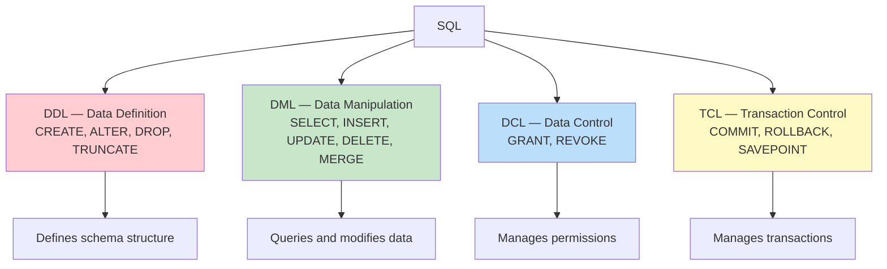
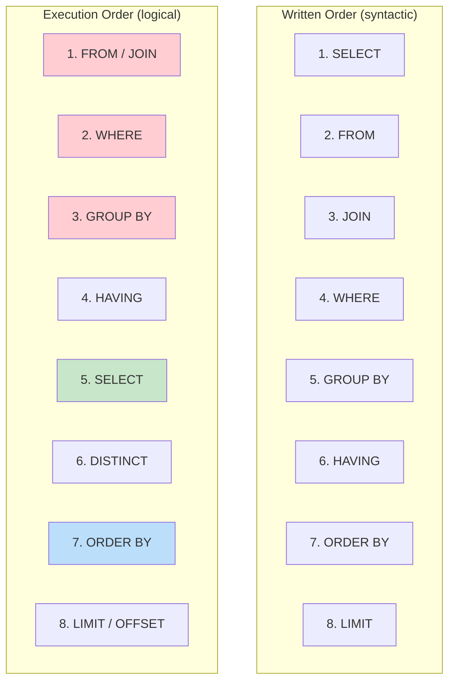

# SQL — Structured Query Language

## Overview

**SQL (Structured Query Language)** is the standard language for managing relational databases. Originally developed at IBM in the 1970s (as SEQUEL), it was standardized by ANSI/ISO and is now supported by every major RDBMS. SQL is both a **data definition language (DDL)** and a **data manipulation language (DML)**, covering schema creation, data operations, access control, and transaction management.

## SQL Standards Evolution

| Standard | Year | Key Features |
|---|---|---|
| SQL-86 | 1986 | Basic SQL, SELECT, JOIN |
| SQL-92 | 1992 | JOIN syntax, CASE, CAST, subqueries |
| SQL:1999 | 1999 | CTEs, triggers, regular expressions, OLAP |
| SQL:2003 | 2003 | Window functions, XML, MERGE |
| SQL:2006 | 2006 | XML enhancements |
| SQL:2008 | 2008 | TRUNCATE, FETCH FIRST, simplified syntax |
| SQL:2011 | 2011 | Temporal databases |
| SQL:2016 | 2016 | JSON support, row pattern matching |
| SQL:2023 | 2023 | Property graph queries, JSON enhancements |

## SQL Sublanguages



### DDL (Data Definition Language)

Defines and modifies database structure (schema).

```sql
CREATE TABLE Employees (
    emp_id      INT PRIMARY KEY AUTO_INCREMENT,
    name        VARCHAR(100) NOT NULL,
    email       VARCHAR(255) UNIQUE,
    salary      DECIMAL(10,2) DEFAULT 50000.00,
    dept_id     INT,
    hire_date   DATE,
    FOREIGN KEY (dept_id) REFERENCES Departments(dept_id)
);

ALTER TABLE Employees ADD COLUMN phone VARCHAR(20);
ALTER TABLE Employees MODIFY COLUMN name VARCHAR(150);
ALTER TABLE Employees DROP COLUMN phone;

DROP TABLE Employees;     -- Removes table and data
TRUNCATE TABLE Employees; -- Removes all data, keeps structure
```

### DML (Data Manipulation Language)

Queries and modifies data.

```sql
-- INSERT
INSERT INTO Employees (name, email, salary, dept_id, hire_date)
VALUES ('Alice', 'alice@co.com', 75000, 10, '2024-01-15');

-- UPDATE
UPDATE Employees SET salary = salary * 1.10 WHERE dept_id = 10;

-- DELETE
DELETE FROM Employees WHERE emp_id = 101;

-- SELECT (the most complex DML statement)
SELECT name, salary FROM Employees WHERE salary > 60000 ORDER BY salary DESC;
```

### DCL (Data Control Language)

```sql
GRANT SELECT, INSERT ON Employees TO hr_team;
REVOKE INSERT ON Employees FROM hr_team;
GRANT ALL PRIVILEGES ON DATABASE company TO admin;
```

### TCL (Transaction Control Language)

```sql
BEGIN TRANSACTION;
UPDATE Accounts SET balance = balance - 100 WHERE account_id = 1;
UPDATE Accounts SET balance = balance + 100 WHERE account_id = 2;
COMMIT;

-- Or rollback on error:
ROLLBACK;

-- Savepoints:
SAVEPOINT sp1;
-- ... some operations ...
ROLLBACK TO sp1;
```

## SQL Query Execution Order

This is critical for understanding SQL — the logical order of operations differs from the written (syntactic) order:



**Why this matters:**
- You can't use column aliases defined in `SELECT` in the `WHERE` clause (WHERE executes before SELECT)
- You CAN use aliases in `ORDER BY` (executes after SELECT)
- Aggregate functions in `HAVING` can reference aliases in some databases (MySQL) but not others (PostgreSQL)

### Example showing execution order

```sql
SELECT department, AVG(salary) AS avg_salary    -- Step 5
FROM Employees                                   -- Step 1
WHERE hire_date > '2020-01-01'                   -- Step 2
GROUP BY department                              -- Step 3
HAVING AVG(salary) > 60000                       -- Step 4
ORDER BY avg_salary DESC                         -- Step 7
LIMIT 10;                                        -- Step 8
```

## SQL Data Types

| Category | Types | Example |
|---|---|---|
| Numeric | INT, BIGINT, DECIMAL(p,s), FLOAT, REAL | `salary DECIMAL(10,2)` |
| String | VARCHAR(n), CHAR(n), TEXT, CLOB | `name VARCHAR(100)` |
| Date/Time | DATE, TIME, TIMESTAMP, INTERVAL | `hire_date DATE` |
| Binary | BLOB, BYTEA, VARBINARY | `photo BLOB` |
| Boolean | BOOLEAN | `is_active BOOLEAN` |
| JSON | JSON, JSONB (PostgreSQL) | `metadata JSON` |
| Array | INT[], VARCHAR[] (PostgreSQL) | `tags VARCHAR(50)[]` |
| UUID | UUID (PostgreSQL) | `id UUID` |

## Set Operations

```sql
-- UNION: Combines results, removes duplicates
SELECT name FROM Students UNION SELECT name FROM Alumni;

-- UNION ALL: Combines results, keeps duplicates (faster)
SELECT name FROM Students UNION ALL SELECT name FROM Alumni;

-- INTERSECT: Common rows
SELECT student_id FROM Enrollments
INTERSECT
SELECT student_id FROM Scholarships;

-- EXCEPT/MINUS: Rows in first but not second
SELECT student_id FROM Students
EXCEPT
SELECT student_id FROM Exclusions;
```

## Aggregate Functions

```sql
SELECT
    department,
    COUNT(*) AS total_employees,
    COUNT(DISTINCT manager_id) AS num_managers,
    AVG(salary) AS avg_salary,
    MIN(salary) AS min_salary,
    MAX(salary) AS max_salary,
    SUM(salary) AS total_salary,
    STDDEV(salary) AS salary_stddev
FROM Employees
GROUP BY department
HAVING COUNT(*) > 5;
```

### NULL Handling in Aggregates

```sql
-- COUNT(*) counts all rows including NULLs
-- COUNT(column) excludes NULLs
-- SUM, AVG, MIN, MAX ignore NULLs

SELECT
    COUNT(*) AS total,        -- 100
    COUNT(bonus) AS with_bonus,  -- 85 (15 NULLs excluded)
    AVG(bonus) AS avg_bonus   -- Average of 85 non-NULL values
FROM Employees;
```

## Interview Questions

### Beginner

**Q1: What is the difference between DELETE, TRUNCATE, and DROP?**
A:
- **DELETE**: DML — removes rows one by one, can have WHERE clause, can be rolled back, fires triggers
- **TRUNCATE**: DDL — removes all rows at once, faster, cannot have WHERE, minimal logging, resets auto-increment
- **DROP**: DDL — removes the entire table structure and data

**Q2: What is the difference between WHERE and HAVING?**
A: **WHERE** filters individual rows before grouping. **HAVING** filters groups after GROUP BY. WHERE cannot use aggregate functions; HAVING can.

```sql
-- WHERE: filter rows before grouping
SELECT dept, AVG(salary) FROM Employees WHERE hire_date > '2020-01-01' GROUP BY dept;

-- HAVING: filter groups after grouping
SELECT dept, AVG(salary) FROM Employees GROUP BY dept HAVING AVG(salary) > 60000;
```

**Q3: What is the difference between UNION and UNION ALL?**
A: **UNION** combines results and removes duplicate rows (slower). **UNION ALL** combines results and keeps duplicates (faster). Use UNION ALL when you know there are no duplicates or don't care about them.

### Intermediate

**Q4: Explain the difference between INNER JOIN, LEFT JOIN, RIGHT JOIN, and FULL OUTER JOIN.**
A: See [Joins](joins.md) for detailed coverage.

**Q5: What is the difference between RANK(), DENSE_RANK(), and ROW_NUMBER()?**
A: See [Window Functions](window-functions.md) for detailed coverage.

**Q6: Write a query to find the second highest salary.**
A: Multiple approaches:
```sql
-- Using subquery
SELECT MAX(salary) FROM Employees WHERE salary < (SELECT MAX(salary) FROM Employees);

-- Using LIMIT/OFFSET
SELECT DISTINCT salary FROM Employees ORDER BY salary DESC LIMIT 1 OFFSET 1;

-- Using window function
SELECT salary FROM (
    SELECT salary, DENSE_RANK() OVER (ORDER BY salary DESC) AS rnk
    FROM Employees
) ranked WHERE rnk = 2;

-- Using correlated subquery
SELECT DISTINCT salary FROM Employees E1
WHERE 2 = (SELECT COUNT(DISTINCT salary) FROM Employees E2 WHERE E2.salary >= E1.salary);
```

### Advanced / FAANG-Level

**Q7: Design a query to find running totals, year-over-year growth, and top-N per group — all in one query.**
A:
```sql
SELECT
    department,
    employee_name,
    salary,
    hire_date,
    SUM(salary) OVER (PARTITION BY department ORDER BY hire_date) AS running_total,
    salary - LAG(salary) OVER (PARTITION BY department ORDER BY hire_date) AS yoy_change,
    ROW_NUMBER() OVER (PARTITION BY department ORDER BY salary DESC) AS dept_rank
FROM Employees;
```

**Q8: How would you implement pivot/unpivot operations in SQL?**
A: Standard SQL doesn't have PIVOT, but:
```sql
-- Pivot: rows to columns (conditional aggregation)
SELECT
    student_id,
    MAX(CASE WHEN course = 'Math' THEN grade END) AS math_grade,
    MAX(CASE WHEN course = 'Science' THEN grade END) AS science_grade,
    MAX(CASE WHEN course = 'English' THEN grade END) AS english_grade
FROM Enrollments
GROUP BY student_id;

-- PostgreSQL: crosstab extension
SELECT * FROM crosstab(
    'SELECT student_id, course, grade FROM Enrollments ORDER BY 1, 2'
) AS ct(student_id TEXT, math TEXT, science TEXT, english TEXT);
```

## Common Mistakes

- Using `=` for NULL comparison instead of `IS NULL`
- Forgetting GROUP BY when using aggregates with non-aggregate columns
- Using column aliases in WHERE (not yet defined at that point)
- Not understanding that JOIN + WHERE ≠ LEFT JOIN + WHERE (NULL handling)
- Using `SELECT *` in production queries (wastes bandwidth, breaks with schema changes)
- Confusing UNION with UNION ALL (performance impact)

## Cross-References

- [DDL](ddl.md) — Schema definition
- [DML](dml.md) — Data manipulation
- [Joins](joins.md) — Combining tables
- [Subqueries](subqueries.md) — Nested queries
- [Views](views.md) — Virtual tables
- [Window Functions](window-functions.md) — Advanced analytics
- [CTEs](ctes.md) — Readable complex queries
- [Stored Procedures](stored-procedures.md) — Server-side logic
- [Triggers](triggers.md) — Automatic actions
- [Indexes](indexes.md) — Performance optimization


## Cross References

- [DDL](ddl.md)
- [DML](dml.md)
- [Joins](joins.md)
- [Query Processing](../query-processing/README.md)
