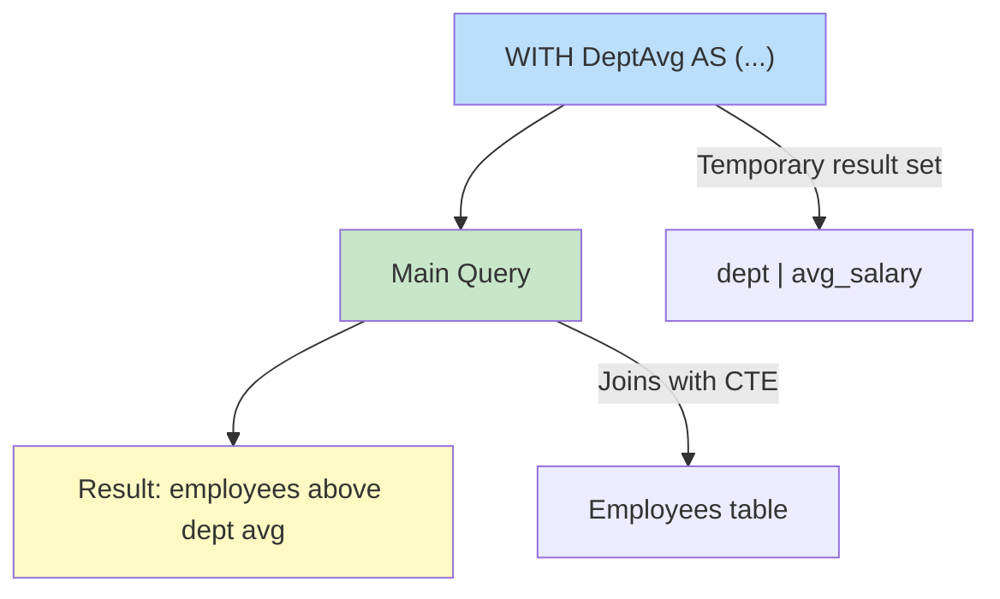
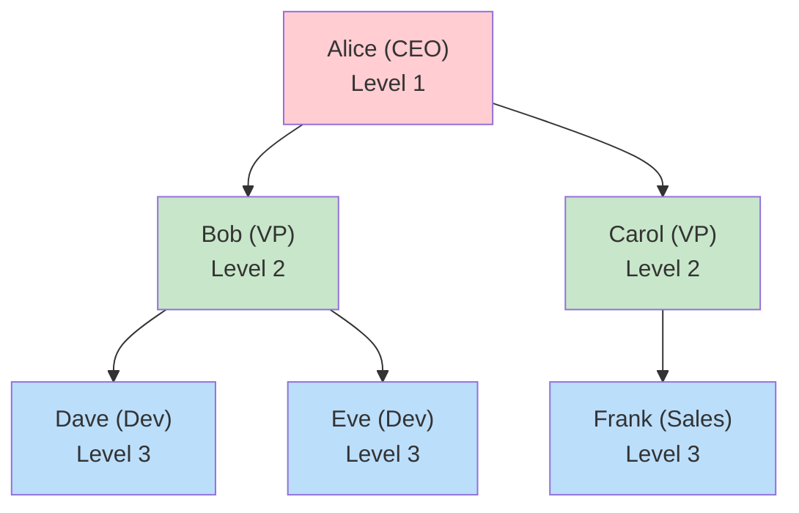
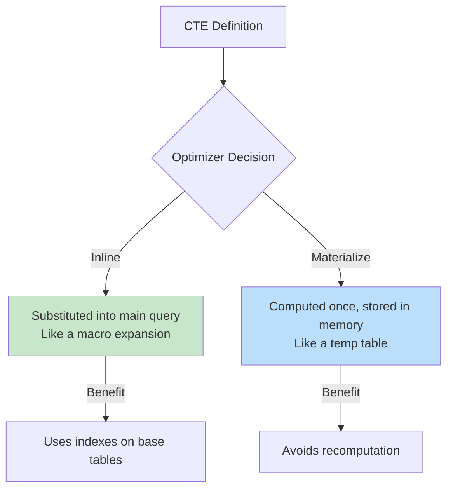

# SQL Common Table Expressions (CTEs)

## Overview

A **Common Table Expression (CTE)** is a temporary named result set defined within a `WITH` clause that exists only for the duration of a single query. CTEs improve readability, enable recursion, and replace complex subqueries. Introduced in SQL:1999, they are supported by all major databases.

## Basic CTE Syntax

```sql
WITH cte_name (column_aliases) AS (
    -- CTE query definition
    SELECT ...
)
-- Main query that references the CTE
SELECT ... FROM cte_name;
```

## Simple CTE

```sql
-- Find employees earning above department average
WITH DeptAvg AS (
    SELECT department, AVG(salary) AS avg_salary
    FROM Employees
    GROUP BY department
)
SELECT E.name, E.salary, D.avg_salary
FROM Employees E
JOIN DeptAvg D ON E.department = D.department
WHERE E.salary > D.avg_salary;
```



## Multiple CTEs

```sql
WITH
HighEarners AS (
    SELECT * FROM Employees WHERE salary > 100000
),
DeptCounts AS (
    SELECT department, COUNT(*) AS emp_count
    FROM Employees
    GROUP BY department
),
TopDepts AS (
    SELECT department FROM DeptCounts WHERE emp_count > 10
)
SELECT H.name, H.salary, H.department
FROM HighEarners H
JOIN TopDepts T ON H.department = T.department;
```

**Execution**: CTEs are evaluated in order. Later CTEs can reference earlier ones (but not vice versa in most databases).

## CTE vs Subquery vs Temp Table

| Aspect | CTE | Subquery | Temp Table |
|---|---|---|---|
| Readability | Excellent (named) | Poor when nested | Good |
| Reusable in query | Yes (multiple refs) | No (must duplicate) | Yes |
| Recursive | Yes | No | No |
| Materialized | Usually not (inlined) | Usually not | Yes (stored) |
| Scope | Single statement | Single statement | Session/transaction |
| Index support | No (optimizer may inline) | No | Yes |

## Recursive CTEs

Recursive CTEs reference themselves, enabling hierarchical/recursive queries. They have two parts joined by `UNION ALL`:

1. **Anchor member**: Base case (non-recursive)
2. **Recursive member**: Recursive case (references the CTE)

### Syntax

```sql
WITH RECURSIVE cte_name AS (
    -- Anchor: base case
    SELECT ... FROM table WHERE condition

    UNION ALL

    -- Recursive: references cte_name
    SELECT ... FROM table JOIN cte_name ON condition
)
SELECT * FROM cte_name;
```

### Example: Employee Hierarchy

```sql
-- Find all reports of a manager (org chart)
WITH RECURSIVE OrgChart AS (
    -- Anchor: the top manager
    SELECT emp_id, name, manager_id, 1 AS level, name::TEXT AS path
    FROM Employees
    WHERE emp_id = 1  -- Starting manager

    UNION ALL

    -- Recursive: find direct reports
    SELECT E.emp_id, E.name, E.manager_id, OC.level + 1,
           OC.path || ' → ' || E.name
    FROM Employees E
    JOIN OrgChart OC ON E.manager_id = OC.emp_id
)
SELECT * FROM OrgChart ORDER BY level, name;
```



### Example: Generate Series

```sql
-- Generate numbers 1 to 10
WITH RECURSIVE Numbers AS (
    SELECT 1 AS n
    UNION ALL
    SELECT n + 1 FROM Numbers WHERE n < 10
)
SELECT * FROM Numbers;

-- Generate date series
WITH RECURSIVE DateSeries AS (
    SELECT DATE '2024-01-01' AS dt
    UNION ALL
    SELECT dt + INTERVAL '1 day' FROM DateSeries WHERE dt < '2024-12-31'
)
SELECT dt FROM DateSeries;
```

### Example: Path Finding in Graph

```sql
-- Find all paths from node A to node F
WITH RECURSIVE Paths AS (
    -- Anchor: start node
    SELECT start_node, end_node,
           start_node || ' → ' || end_node AS path,
           1 AS depth
    FROM Edges
    WHERE start_node = 'A'

    UNION ALL

    -- Recursive: extend path
    SELECT P.start_node, E.end_node,
           P.path || ' → ' || E.end_node,
           P.depth + 1
    FROM Paths P
    JOIN Edges E ON P.end_node = E.start_node
    WHERE P.depth < 10  -- Prevent infinite loops
    AND P.path NOT LIKE '%' || E.end_node || '%'  -- No cycles
)
SELECT * FROM Paths WHERE end_node = 'F';
```

### Example: Bill of Materials (BOM)

```sql
-- Find all components needed to build a product
WITH RECURSIVE BOM AS (
    -- Anchor: direct components of the product
    SELECT component_id, quantity, 1 AS level
    FROM ProductComponents
    WHERE product_id = 100

    UNION ALL

    -- Recursive: sub-components
    SELECT PC.component_id, B.quantity * PC.quantity, B.level + 1
    FROM BOM B
    JOIN ProductComponents PC ON PC.product_id = B.component_id
)
SELECT component_id, SUM(quantity) AS total_quantity
FROM BOM
GROUP BY component_id;
```

## CTE Materialization

### Inlining vs Materialization



- **PostgreSQL**: Usually inlines CTEs (SQL 12+ with `MATERIALIZED`/`NOT MATERIALIZED` hints)
- **MySQL 8.0+**: Materializes CTEs by default (can be expensive)
- **SQL Server**: May inline or materialize depending on complexity

```sql
-- PostgreSQL 12+: Force materialization
WITH cte AS MATERIALIZED (
    SELECT * FROM LargeTable WHERE condition
)
SELECT * FROM cte;

-- PostgreSQL 12+: Force inlining
WITH cte AS NOT MATERIALIZED (
    SELECT * FROM LargeTable WHERE condition
)
SELECT * FROM cte;
```

## Data-Modifying CTEs (DML in CTEs)

PostgreSQL supports INSERT/UPDATE/DELETE in CTEs.

```sql
-- Delete and return deleted rows
WITH Deleted AS (
    DELETE FROM Employees
    WHERE hire_date < '2020-01-01'
    RETURNING *
)
INSERT INTO EmployeeArchive SELECT * FROM Deleted;

-- Update and return changes
WITH Updated AS (
    UPDATE Employees SET salary = salary * 1.10
    WHERE department = 'Engineering'
    RETURNING emp_id, name, salary AS new_salary
)
SELECT * FROM Updated;

-- Insert multiple related records atomically
WITH NewOrder AS (
    INSERT INTO Orders (customer_id, order_date, total)
    VALUES (101, NOW(), 500)
    RETURNING order_id
)
INSERT INTO OrderItems (order_id, product_id, quantity)
SELECT order_id, 201, 2 FROM NewOrder;
```

## Chained CTEs (CTE Pipeline)

```sql
WITH
-- Step 1: Filter active employees
ActiveEmps AS (
    SELECT * FROM Employees WHERE is_active = true
),
-- Step 2: Calculate department stats (uses Step 1)
DeptStats AS (
    SELECT department, AVG(salary) AS avg_salary, COUNT(*) AS headcount
    FROM ActiveEmps
    GROUP BY department
),
-- Step 3: Rank departments (uses Step 2)
RankedDepts AS (
    SELECT *, RANK() OVER (ORDER BY avg_salary DESC) AS salary_rank
    FROM DeptStats
)
-- Final: Join everything
SELECT A.name, A.salary, R.avg_salary, R.salary_rank
FROM ActiveEmps A
JOIN RankedDepts R ON A.department = R.department
WHERE R.salary_rank <= 3;
```

## Interview Questions

### Beginner

**Q1: What is a CTE and why use one?**
A: A CTE (WITH clause) defines a named temporary result set for use in a single query. Benefits: (1) improves readability by breaking complex queries into logical steps, (2) enables recursion for hierarchical data, (3) can be referenced multiple times without rewriting, (4) replaces deeply nested subqueries.

**Q2: What is the difference between a CTE and a subquery?**
A: A CTE is defined at the top of the query with a name and can be referenced multiple times. A subquery is inline and must be duplicated if needed multiple times. CTEs are more readable and support recursion; subqueries don't.

**Q3: Can a CTE reference another CTE?**
A: Yes, if the referenced CTE is defined earlier in the WITH clause. CTEs are evaluated in order. A CTE cannot reference a CTE defined after it (no forward references).

### Intermediate

**Q4: Explain recursive CTEs with an example.**
A: A recursive CTE references itself. It has two parts: (1) Anchor — the base case (non-recursive), (2) Recursive — joins with the CTE to extend results. They're joined by UNION ALL. Example: traversing an employee hierarchy from CEO down to all reports.

```sql
WITH RECURSIVE Hierarchy AS (
    SELECT emp_id, name, manager_id, 1 AS level
    FROM Employees WHERE manager_id IS NULL  -- Anchor: CEO
    UNION ALL
    SELECT E.emp_id, E.name, E.manager_id, H.level + 1
    FROM Employees E JOIN Hierarchy H ON E.manager_id = H.emp_id
)
SELECT * FROM Hierarchy;
```

**Q5: How do you prevent infinite recursion in a recursive CTE?**
A: Methods:
1. **WHERE termination condition**: `WHERE depth < 10` or `WHERE n < 1000`
2. **Cycle detection**: `WHERE path NOT LIKE '%' || new_node || '%'`
3. **Database limits**: Most databases have a `max_recursive_iterations` setting (PostgreSQL: 100 by default)
4. **MAXRECURSION hint** (SQL Server): `OPTION (MAXRECURSION 100)`

**Q6: When does a CTE get materialized vs inlined?**
A: PostgreSQL 12+: CTEs are inlined by default unless they contain volatile functions, are recursive, or have MATERIALIZED hint. MySQL 8.0: CTEs are materialized by default. SQL Server: depends on complexity. Inlining allows predicate pushdown and index usage; materialization avoids recomputation.

### Advanced / FAANG-Level

**Q7: Use a CTE to find the median salary per department without PERCENTILE_CONT.**
A:
```sql
WITH RankedSalaries AS (
    SELECT department, salary,
        ROW_NUMBER() OVER (PARTITION BY department ORDER BY salary) AS rn,
        COUNT(*) OVER (PARTITION BY department) AS cnt
    FROM Employees
)
SELECT department, AVG(salary) AS median_salary
FROM RankedSalaries
WHERE rn IN (FLOOR((cnt + 1) / 2.0), CEIL((cnt + 1) / 2.0))
GROUP BY department;
```

**Q8: Implement a graph shortest path using recursive CTEs.**
A:
```sql
WITH RECURSIVE ShortestPath AS (
    -- Anchor: start node
    SELECT 'A' AS node, 0 AS distance, ARRAY['A'] AS path

    UNION ALL

    -- Recursive: extend path
    SELECT E.to_node,
           SP.distance + E.weight,
           SP.path || E.to_node
    FROM ShortestPath SP
    JOIN Edges E ON SP.node = E.from_node
    WHERE E.to_node != ALL(SP.path)  -- No cycles
    AND SP.distance + E.weight < COALESCE(
        (SELECT MIN(distance) FROM ShortestPath WHERE node = E.to_node),
        2147483647
    )
)
SELECT * FROM ShortestPath WHERE node = 'F' ORDER BY distance LIMIT 1;
```

Note: Recursive CTEs for shortest path are not efficient (they explore all paths). For production, use Dijkstra in application code or a graph database.

## Common Mistakes

- Not using RECURSIVE keyword for recursive CTEs (required in PostgreSQL/MySQL, not SQL Server)
- Forgetting UNION ALL in recursive CTEs (UNION would eliminate duplicates and prevent infinite loops in some cases, but UNION ALL is correct for recursion)
- Not having a termination condition in recursive CTEs
- Referencing a CTE from a different statement (CTEs only exist within their statement)
- Assuming CTEs are always materialized (they may be inlined)
- Using CTEs when a simple JOIN or subquery would be clearer

## Summary

| CTE Type | Use Case | Supports Recursion | Scope |
|---|---|---|---|
| Simple CTE | Readability, reuse | No | Single statement |
| Recursive CTE | Hierarchies, series, graphs | Yes | Single statement |
| Multiple CTEs | Complex pipelines | Each can be recursive | Single statement |
| Data-Modifying CTE | DML with chaining | No | Single statement |

## Cross-References

- [SQL Overview](README.md) — SQL fundamentals
- [Subqueries](subqueries.md) — Alternative to CTEs
- [Window Functions](window-functions.md) — Often combined with CTEs
- [Views](views.md) — Permanent CTE-like constructs
- [Stored Procedures](stored-procedures.md) — Persistent procedural logic
