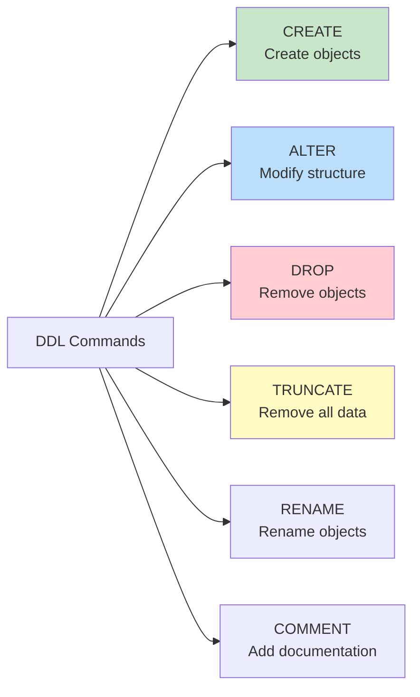
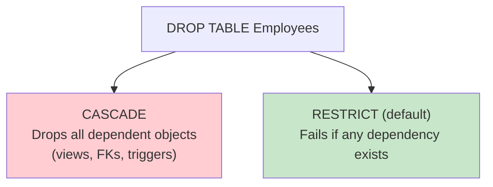

# DDL — Data Definition Language

## Overview

**DDL (Data Definition Language)** consists of SQL commands that define, modify, and remove database structures (schemas). DDL operations affect the *metadata* (structure) of the database, not the data itself (except TRUNCATE). DDL commands are **auto-committed** in most databases — they cannot be rolled back.

## DDL Commands



## CREATE TABLE

```sql
CREATE TABLE Employees (
    -- Primary Key
    emp_id      INT PRIMARY KEY AUTO_INCREMENT,

    -- NOT NULL constraint
    first_name  VARCHAR(50) NOT NULL,
    last_name   VARCHAR(50) NOT NULL,

    -- UNIQUE constraint
    email       VARCHAR(255) NOT NULL UNIQUE,

    -- CHECK constraint
    salary      DECIMAL(10,2) CHECK (salary >= 0),

    -- DEFAULT value
    hire_date   DATE DEFAULT (CURRENT_DATE),

    -- Foreign Key with actions
    dept_id     INT,
    manager_id  INT,

    -- Composite CHECK
    CONSTRAINT chk_salary CHECK (salary >= 0 AND salary <= 1000000),

    -- Named Foreign Keys
    CONSTRAINT fk_dept FOREIGN KEY (dept_id)
        REFERENCES Departments(dept_id)
        ON DELETE SET NULL
        ON UPDATE CASCADE,

    CONSTRAINT fk_manager FOREIGN KEY (manager_id)
        REFERENCES Employees(emp_id)
        ON DELETE SET NULL,

    -- Unique composite constraint
    CONSTRAINT uq_name UNIQUE (first_name, last_name, dept_id)
);
```

### Constraints Summary

| Constraint | Purpose | Can Be Composite |
|---|---|---|
| PRIMARY KEY | Unique identifier, NOT NULL | Yes |
| FOREIGN KEY | Referential integrity | Yes |
| UNIQUE | No duplicate values | Yes |
| NOT NULL | Disallow NULL | No (per column) |
| CHECK | Custom validation rule | Yes (across columns) |
| DEFAULT | Value when none provided | No |

### CREATE TABLE AS SELECT

```sql
-- Create a table from a query result
CREATE TABLE HighEarners AS
SELECT emp_id, first_name, last_name, salary
FROM Employees
WHERE salary > 100000;

-- Creates table without data (structure only)
CREATE TABLE EmployeeBackup AS
SELECT * FROM Employees WHERE 1 = 0;
```

### CREATE INDEX

```sql
-- Single column index
CREATE INDEX idx_emp_email ON Employees(email);

-- Composite index
CREATE INDEX idx_emp_dept_name ON Employees(dept_id, last_name);

-- Unique index
CREATE UNIQUE INDEX idx_emp_email_unique ON Employees(email);

-- Partial index (PostgreSQL)
CREATE INDEX idx_active_emp ON Employees(dept_id)
WHERE is_active = true;

-- Covering index (includes extra columns)
CREATE INDEX idx_salary_cover ON Employees(dept_id, salary)
INCLUDE (first_name, last_name);
```

## ALTER TABLE

### Adding Columns

```sql
ALTER TABLE Employees ADD COLUMN phone VARCHAR(20);
ALTER TABLE Employees ADD COLUMN address TEXT DEFAULT 'N/A';
ALTER TABLE Employees ADD COLUMN created_at TIMESTAMP DEFAULT CURRENT_TIMESTAMP;
```

### Modifying Columns

```sql
-- MySQL
ALTER TABLE Employees MODIFY COLUMN phone VARCHAR(30);
ALTER TABLE Employees MODIFY COLUMN salary DECIMAL(12,2) NOT NULL;

-- PostgreSQL
ALTER TABLE Employees ALTER COLUMN phone TYPE VARCHAR(30);
ALTER TABLE Employees ALTER COLUMN salary SET NOT NULL;
ALTER TABLE Employees ALTER COLUMN salary SET DEFAULT 0;
ALTER TABLE Employees ALTER COLUMN salary DROP DEFAULT;
```

### Dropping Columns

```sql
ALTER TABLE Employees DROP COLUMN phone;
ALTER TABLE Employees DROP COLUMN IF EXISTS temp_field;
```

### Adding/Dropping Constraints

```sql
-- Add constraint
ALTER TABLE Employees ADD CONSTRAINT chk_email CHECK (email LIKE '%@%.%');
ALTER TABLE Employees ADD CONSTRAINT fk_dept2 FOREIGN KEY (dept_id) REFERENCES Departments(dept_id);

-- Drop constraint
ALTER TABLE Employees DROP CONSTRAINT chk_email;
ALTER TABLE Employees DROP CONSTRAINT IF EXISTS fk_dept2;

-- Add/drop primary key (rare in practice)
ALTER TABLE Employees DROP PRIMARY KEY;
ALTER TABLE Employees ADD PRIMARY KEY (emp_id);
```

### Rename

```sql
-- Rename table
ALTER TABLE Employees RENAME TO Staff;
RENAME TABLE Employees TO Staff;  -- MySQL shorthand

-- Rename column (MySQL 8.0+, PostgreSQL)
ALTER TABLE Employees RENAME COLUMN name TO full_name;
```

## DROP

```sql
-- Drop table
DROP TABLE Employees;
DROP TABLE IF EXISTS Employees;

-- Drop with cascade (removes dependent objects)
DROP TABLE Employees CASCADE;  -- PostgreSQL
DROP TABLE Employees RESTRICT; -- Fails if referenced

-- Drop other objects
DROP INDEX idx_emp_email;
DROP VIEW EmployeeView;
DROP SCHEMA hr CASCADE;
DROP DATABASE company;
```

### DROP Behavior with Dependencies



## TRUNCATE

```sql
TRUNCATE TABLE Employees;

-- With identity reset (PostgreSQL)
TRUNCATE TABLE Employees RESTART IDENTITY;

-- Cascade to dependent tables (PostgreSQL)
TRUNCATE TABLE Employees CASCADE;
```

### TRUNCATE vs DELETE

| Aspect | TRUNCATE | DELETE |
|---|---|---|
| Type | DDL | DML |
| WHERE clause | Not allowed | Allowed |
| Speed | Very fast (deallocates pages) | Row-by-row (slower) |
| Logging | Minimal (page deallocation) | Full row logging |
| Triggers | Does NOT fire | Fires DELETE triggers |
| Rollback | Usually not allowed | Always allowed |
| Auto-increment | Resets to start | Continues from last |
| Space | Reclaims immediately | May not reclaim |

## Schema Objects

### Views

```sql
CREATE VIEW ActiveEmployees AS
SELECT emp_id, first_name, last_name, salary, dept_id
FROM Employees
WHERE is_active = true;

-- Materialized view (PostgreSQL)
CREATE MATERIALIZED VIEW DeptSummary AS
SELECT dept_id, COUNT(*) AS emp_count, AVG(salary) AS avg_salary
FROM Employees
GROUP BY dept_id;
```

### Sequences

```sql
-- PostgreSQL
CREATE SEQUENCE emp_id_seq START 1000 INCREMENT 1;
SELECT nextval('emp_id_seq');

-- MySQL auto-increment
ALTER TABLE Employees AUTO_INCREMENT = 1000;
```

### Schemas

```sql
CREATE SCHEMA hr;
CREATE TABLE hr.Employees (...);
CREATE TABLE finance.Transactions (...);

-- Set default schema
SET search_path TO hr, public;  -- PostgreSQL
USE hr;  -- MySQL
```

## Transaction Control in DDL

Most DDL commands are **auto-committed**:

| Database | DDL Transactional? |
|---|---|
| MySQL | No — auto-committed, cannot rollback |
| PostgreSQL | Yes — DDL can be rolled back within a transaction |
| SQL Server | No — auto-committed |
| Oracle | No — auto-committed (implicit commit) |

```sql
-- PostgreSQL: DDL is transactional
BEGIN;
CREATE TABLE test (id INT);
INSERT INTO test VALUES (1);
ROLLBACK;  -- Both CREATE and INSERT are rolled back!

-- MySQL: DDL is NOT transactional
BEGIN;
CREATE TABLE test (id INT);
ROLLBACK;  -- Table still exists!
```

## Interview Questions

### Beginner

**Q1: What is DDL and what are its main commands?**
A: DDL defines database structure. Main commands: CREATE (create tables, indexes, views), ALTER (modify structure), DROP (remove objects), TRUNCATE (remove all data), RENAME.

**Q2: What is the difference between DROP and TRUNCATE?**
A: DROP removes the entire table structure and data. TRUNCATE removes all rows but keeps the table structure intact. TRUNCATE is faster because it deallocates data pages rather than deleting rows individually.

**Q3: What are the different types of constraints?**
A: PRIMARY KEY (unique + not null), FOREIGN KEY (referential integrity), UNIQUE (no duplicates), NOT NULL (no nulls), CHECK (custom validation), DEFAULT (fallback value).

### Intermediate

**Q4: Can you rollback a CREATE TABLE statement?**
A: It depends on the database. In PostgreSQL, yes — DDL is transactional. In MySQL, Oracle, and SQL Server, no — DDL commands are auto-committed.

**Q5: What happens when you DROP a table that is referenced by a foreign key?**
A: With RESTRICT (default), the DROP fails. With CASCADE, the table is dropped along with all dependent foreign key constraints (but NOT the referencing tables, just the constraints). In MySQL, you may need to disable foreign key checks: `SET FOREIGN_KEY_CHECKS = 0;`

**Q6: Explain the difference between DELETE and TRUNCATE in terms of logging.**
A: DELETE logs each row removal in the transaction log (full ACID compliance), allowing rollback. TRUNCATE logs only page deallocation (minimal logging), making it much faster but often non-rollbackable. DELETE triggers fire for each row; TRUNCATE triggers do not fire.

### Advanced / FAANG-Level

**Q7: You need to add a NOT NULL column to a table with 100M rows in production. How?**
A: Step-by-step approach (zero-downtime):
1. Add column with DEFAULT value and NULL allowed: `ALTER TABLE t ADD col INT DEFAULT 0;`
2. Backfill existing rows in batches: `UPDATE t SET col = computed_value WHERE id BETWEEN x AND y;` (batched)
3. Once all rows are backfilled, add NOT NULL constraint: `ALTER TABLE t ALTER COLUMN col SET NOT NULL;`

In PostgreSQL 11+, adding a column with a non-volatile DEFAULT is instant (metadata-only change). In MySQL 8.0, `ALTER TABLE ... ALGORITHM=INSTANT` supports this for some operations.

**Q8: Design the DDL for a multi-tenant SaaS application with shared database, shared schema.**
A:
```sql
-- Tenant isolation via tenant_id on every table
CREATE TABLE tenants (
    tenant_id UUID PRIMARY KEY DEFAULT gen_random_uuid(),
    name VARCHAR(200) NOT NULL,
    plan VARCHAR(50) DEFAULT 'free',
    created_at TIMESTAMP DEFAULT NOW()
);

CREATE TABLE users (
    user_id UUID PRIMARY KEY DEFAULT gen_random_uuid(),
    tenant_id UUID NOT NULL REFERENCES tenants(tenant_id),
    email VARCHAR(255) NOT NULL,
    name VARCHAR(200),
    UNIQUE (tenant_id, email)  -- Email unique within tenant
);

-- Row-Level Security (PostgreSQL)
ALTER TABLE users ENABLE ROW LEVEL SECURITY;
CREATE POLICY tenant_isolation ON users
    USING (tenant_id = current_setting('app.tenant_id')::UUID);

-- Every query automatically filtered by tenant
-- SET app.tenant_id = 'xxx'; then SELECT * FROM users; only shows that tenant's data
```

## Common Mistakes

- Not adding constraints during CREATE TABLE and trying to add them later (harder with existing data)
- Using TRUNCATE when you need triggers to fire (use DELETE instead)
- Dropping columns without checking for dependent views, stored procedures, or application code
- Not understanding that DDL is auto-committed in most databases
- Creating indexes on every column "just in case" — hurts write performance
- Using `SELECT *` in CREATE TABLE AS SELECT — schema changes propagate unexpectedly

## Summary

| Command | Purpose | Rollback? | Fires Triggers? |
|---|---|---|---|
| CREATE | Define new objects | DB-dependent | No |
| ALTER | Modify structure | DB-dependent | No |
| DROP | Remove objects | DB-dependent | No |
| TRUNCATE | Remove all data | Usually no | No |
| RENAME | Change name | DB-dependent | No |

## Cross-References

- [DML](dml.md) — Data manipulation commands
- [Indexes](indexes.md) — Creating and managing indexes
- [Views](views.md) — Creating virtual tables
- [Normalization](../normalization/README.md) — Schema design principles
- [Transactions](../transactions/README.md) — Transaction control with DDL


## Cross References

- [DML](dml.md)
- [ER Diagrams](../relational-model/er-diagrams.md)
- [Normalization](../normalization/README.md)
