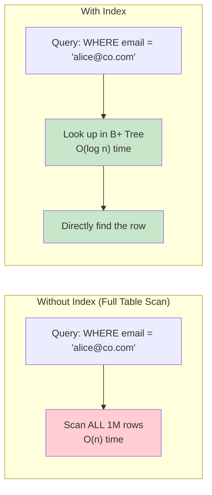
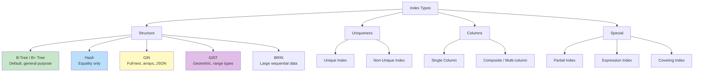
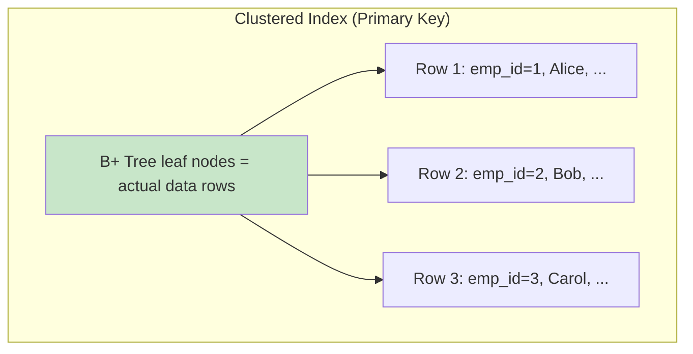
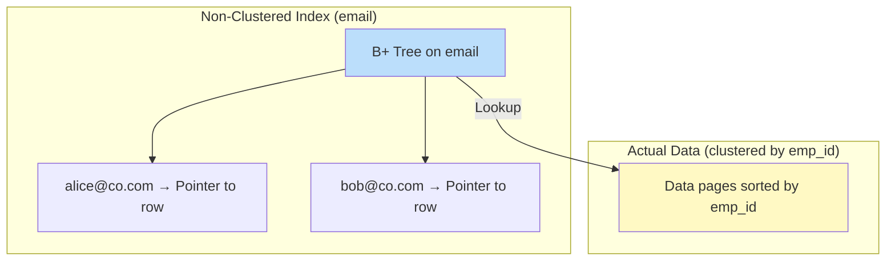
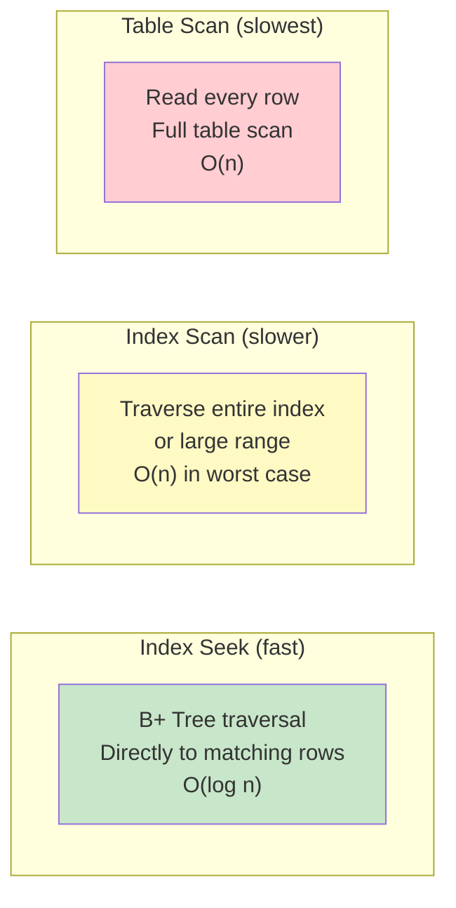

# SQL Indexes

## Overview

An **index** is a data structure that improves the speed of data retrieval operations on a table at the cost of additional storage and write overhead. Indexes work like a book's index — instead of scanning every page (row), the database looks up the index to find the exact location.

## How Indexes Work



## Types of Indexes



## Creating Indexes

### Basic Index Creation

```sql
-- Single column index
CREATE INDEX idx_emp_email ON Employees(email);

-- Multi-column (composite) index
CREATE INDEX idx_emp_dept_salary ON Employees(department, salary);

-- Unique index (enforces uniqueness)
CREATE UNIQUE INDEX idx_emp_email_unique ON Employees(email);

-- Descending index
CREATE INDEX idx_emp_hire_date_desc ON Employees(hire_date DESC);

-- Include columns (covering index - PostgreSQL)
CREATE INDEX idx_emp_dept_covering ON Employees(department)
INCLUDE (name, salary);
```

### Partial Index

Index only a subset of rows (PostgreSQL, SQLite).

```sql
-- Only index active employees
CREATE INDEX idx_active_emp ON Employees(department)
WHERE is_active = true;

-- Only index recent orders
CREATE INDEX idx_recent_orders ON Orders(customer_id, order_date)
WHERE order_date > '2024-01-01';
```

Benefits: smaller index, faster maintenance, only indexes relevant rows.

### Expression Index

Index the result of an expression or function.

```sql
-- Index on lowercase email (for case-insensitive search)
CREATE INDEX idx_emp_email_lower ON Employees(LOWER(email));

-- Index on computed value
CREATE INDEX idx_emp_year ON Employees(EXTRACT(YEAR FROM hire_date));

-- Usage: uses the index
SELECT * FROM Employees WHERE LOWER(email) = 'alice@co.com';
```

### Concurrent Index Creation

```sql
-- PostgreSQL: Build index without locking writes
CREATE INDEX CONCURRENTLY idx_emp_salary ON Employees(salary);

-- Regular CREATE INDEX locks the table for writes during build
-- CONCURRENTLY allows reads and writes during build (slower but non-blocking)
```

## Index-Only Scan

When the index contains all columns needed by the query, the database can satisfy the query entirely from the index without accessing the table (heap).

```sql
-- Create covering index
CREATE INDEX idx_salary_cover ON Employees(department, salary);

-- This query can use index-only scan
SELECT salary FROM Employees WHERE department = 'Engineering';

-- This query CANNOT (needs 'name' which isn't in the index)
SELECT name, salary FROM Employees WHERE department = 'Engineering';
```

## Clustered vs Non-Clustered Indexes

### Clustered Index

The table data is physically sorted by the clustered index key. There can be **only one** clustered index per table.



### Non-Clustered Index

A separate structure that contains the indexed columns and a pointer to the actual data row (or the clustered index key).



| Aspect | Clustered | Non-Clustered |
|---|---|---|
| Count per table | 1 | Many (up to 999 in SQL Server) |
| Physical order | Matches index order | Separate structure |
| Speed | Faster (no extra lookup) | Slower (pointer lookup) |
| Leaf nodes | Actual data rows | Index keys + pointers |
| Default in MySQL | Primary key (InnoDB) | Secondary indexes |

## Index Selection (When to Create)

### Create Index On:

```sql
-- Columns in WHERE clauses
CREATE INDEX idx_emp_dept ON Employees(department);
-- SELECT * FROM Employees WHERE department = 'Engineering';

-- Columns in JOIN conditions
CREATE INDEX idx_order_customer ON Orders(customer_id);
-- SELECT * FROM Orders O JOIN Customers C ON O.customer_id = C.customer_id;

-- Columns in ORDER BY
CREATE INDEX idx_emp_salary ON Employees(salary);
-- SELECT * FROM Employees ORDER BY salary DESC;

-- Columns in GROUP BY
CREATE INDEX idx_emp_dept ON Employees(department);
-- SELECT department, COUNT(*) FROM Employees GROUP BY department;

-- Columns with high selectivity (many unique values)
-- email, phone → high selectivity → good for index
-- gender, is_active → low selectivity → poor for index
```

### Don't Create Index On:

- Small tables (full scan is faster)
- Columns rarely used in WHERE/JOIN/ORDER BY
- Columns with very low cardinality (boolean, status with 3 values)
- Tables with heavy write loads (index maintenance overhead)
- Columns frequently updated

## Index Scan vs Index Seek



- **Index Seek**: Direct lookup using index (best)
- **Index Scan**: Reads through index sequentially (acceptable for ranges)
- **Table Scan**: Reads every row without using index (worst)

## Impact on DML Operations

| Operation | Without Index | With 1 Index | With 5 Indexes |
|---|---|---|---|
| SELECT (indexed column) | Slow (full scan) | Fast (index seek) | Fast (index seek) |
| INSERT | Fast | Moderate (update index) | Slower (update 5 indexes) |
| UPDATE (indexed column) | Fast | Moderate (update index) | Slower (update 5 indexes) |
| DELETE | Fast | Moderate (update index) | Slower (update 5 indexes) |

**Rule of thumb**: Each index adds ~5-10% overhead to write operations.

## Index Hints

Force the optimizer to use a specific index.

```sql
-- MySQL
SELECT * FROM Employees USE INDEX (idx_emp_dept) WHERE department = 'Engineering';
SELECT * FROM Employees FORCE INDEX (idx_emp_salary) WHERE salary > 50000;
SELECT * FROM Employees IGNORE INDEX (idx_emp_dept) WHERE department = 'Engineering';

-- SQL Server
SELECT * FROM Employees WITH (INDEX(idx_emp_dept)) WHERE department = 'Engineering';

-- PostgreSQL (pg_hint_plan extension)
/*+ IndexScan(Employees idx_emp_dept) */
SELECT * FROM Employees WHERE department = 'Engineering';
```

## Managing Indexes

```sql
-- View indexes on a table
-- PostgreSQL
SELECT * FROM pg_indexes WHERE tablename = 'Employees';

-- MySQL
SHOW INDEX FROM Employees;

-- SQL Server
EXEC sp_helpindex 'Employees';

-- Index usage statistics (PostgreSQL)
SELECT schemaname, tablename, indexname, idx_scan, idx_tup_read, idx_tup_fetch
FROM pg_stat_user_indexes
WHERE tablename = 'Employees';

-- Rebuild index (PostgreSQL)
REINDEX INDEX idx_emp_email;
REINDEX TABLE Employees;

-- Rebuild index (MySQL)
ALTER TABLE Employees DROP INDEX idx_emp_email, ADD INDEX idx_emp_email(email);
-- or
OPTIMIZE TABLE Employees;

-- Drop unused index
DROP INDEX IF EXISTS idx_emp_email;
```

## Interview Questions

### Beginner

**Q1: What is an index and why use one?**
A: An index is a data structure (usually B+ Tree) that speeds up data retrieval by providing a quick lookup path to rows. Like a book index — instead of reading every page, you look up the index for the exact page number. Trade-off: faster reads, slower writes (index must be maintained).

**Q2: What is the difference between clustered and non-clustered indexes?**
A: A clustered index determines the physical order of data in the table — there can be only one. A non-clustered index is a separate structure with pointers to the data. Clustered index leaf nodes are data pages; non-clustered leaf nodes contain index keys + row locators.

**Q3: When should you NOT create an index?**
A: On small tables, columns rarely used in queries, columns with low cardinality (few unique values), tables with heavy write loads, or columns frequently updated.

### Intermediate

**Q4: What is a covering index?**
A: An index that contains all columns needed by a query, allowing an index-only scan without accessing the table. Example: `CREATE INDEX idx ON Employees(department, salary)` covers `SELECT salary FROM Employees WHERE department = 'Engineering'` but not `SELECT name, salary ...`.

**Q5: Explain composite index column order.**
A: Column order matters. A composite index on (A, B, C) can satisfy:
- `WHERE A = ?` ✅
- `WHERE A = ? AND B = ?` ✅
- `WHERE A = ? AND B = ? AND C = ?` ✅
- `WHERE B = ?` ❌ (can't skip leading column)
- `WHERE A = ? AND C = ?` ✅ for A only (C can't skip B)

Rule: Most selective column first, or match query patterns.

**Q6: How does an index affect INSERT performance?**
A: Each INSERT must update the table and all indexes. With 5 indexes, each INSERT performs 6 writes (1 table + 5 indexes). For bulk loads, dropping indexes, loading data, and recreating indexes is often faster.

### Advanced / FAANG-Level

**Q7: You have a query `SELECT * FROM orders WHERE status = 'pending' AND created_at > '2024-01-01' ORDER BY total DESC LIMIT 10`. Design the optimal index.**
A: The optimal index depends on selectivity:
- If `status = 'pending'` is selective (few pending orders): `CREATE INDEX idx ON orders(status, total DESC) INCLUDE (created_at)` — seek on status, scan in total order, filter by created_at
- If `created_at` is selective: `CREATE INDEX idx ON orders(created_at, status, total DESC)` — seek on date range, filter by status, order by total
- Best with LIMIT: `CREATE INDEX idx ON orders(status, created_at, total DESC)` — seek on status, filter by date, already ordered by total for LIMIT

Test with EXPLAIN to verify the optimizer uses the index.

**Q8: Explain index-only scans, and how INCLUDE columns work.**
A: In a regular index, leaf nodes contain (index_key, row_pointer). To get non-indexed columns, the DB must follow the pointer to the heap (random I/O). With INCLUDE columns, the index leaf stores (index_key, included_columns, row_pointer). Queries that need only indexed + included columns get an index-only scan (no heap access).

```sql
-- Regular index: needs heap lookup for 'name'
CREATE INDEX idx ON Employees(department, salary);
SELECT department, salary, name FROM Employees WHERE department = 'Engineering';
-- Two lookups: index → heap

-- Covering index: no heap lookup
CREATE INDEX idx ON Employees(department, salary) INCLUDE (name);
SELECT department, salary, name FROM Employees WHERE department = 'Engineering';
-- One lookup: index only
```

INCLUDE columns are not part of the B+ tree ordering — they're only stored in leaf nodes, so they don't increase tree height or affect seek performance.

## Common Mistakes

- Creating indexes on every column "just in case" (write performance suffers)
- Not considering index column order for composite indexes
- Ignoring EXPLAIN output (not verifying indexes are actually used)
- Creating redundant indexes (idx(A) + idx(A,B) — the second covers the first)
- Not using CONCURRENTLY for index creation on production tables
- Forgetting to drop unused indexes
- Assuming the optimizer always picks the best index (sometimes hints are needed)

## Summary

| Index Type | Best For | Limitation |
|---|---|---|
| B+ Tree (default) | Range queries, sorting, equality | Standard overhead |
| Hash | Equality only | No range support |
| GIN | Full-text, arrays, JSONB | Slower updates |
| GiST | Geometric, range, full-text | Complex maintenance |
| BRIN | Large sequential data (time series) | Only for naturally ordered data |
| Partial | Queries with consistent WHERE clause | Only covers matching rows |
| Expression | Queries using functions on columns | Must match expression exactly |
| Covering | Queries needing only indexed columns | Larger index size |

## Cross-References

- [B+ Tree](../indexing/b-plus-tree.md) — How B+ tree indexes work internally
- [Hash Index](../indexing/hash-index.md) — Hash-based indexing
- [Clustered vs Non-Clustered](../indexing/clustered-vs-nonclustered.md) — Detailed comparison
- [Covering Index](../indexing/covering-index.md) — Deep dive into covering indexes
- [Composite Index](../indexing/composite-index.md) — Multi-column index strategies
- [Query Tuning](../indexing/tuning.md) — Using indexes for optimization
- [DDL](ddl.md) — Creating indexes


## Cross References

- [Indexing](../indexing/README.md)
- [B+ Tree](../indexing/b-plus-tree.md)
- [Query Optimization](../query-processing/optimization.md)
- [Covering Index](../indexing/covering-index.md)
