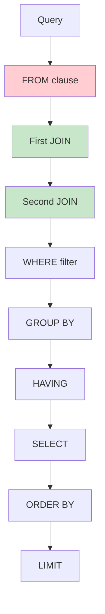
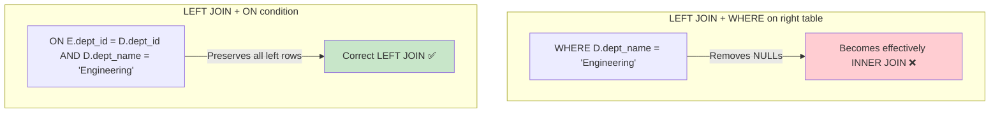
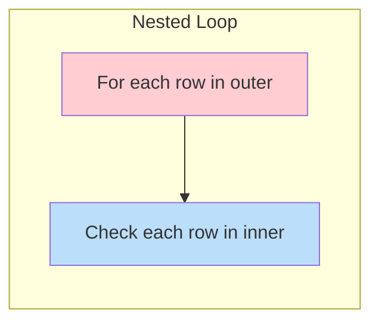
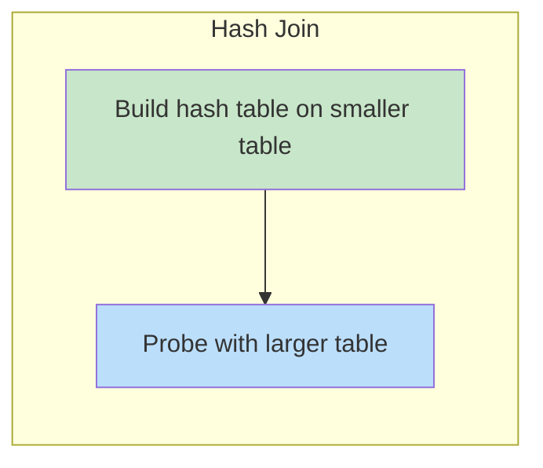
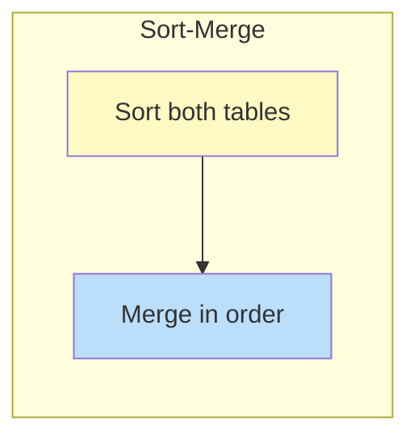

# SQL Joins

## Overview

**Joins** combine rows from two or more tables based on a related column. They are the most powerful feature of relational databases, enabling queries across normalized data. Understanding join types, their behavior with NULLs, and performance implications is essential for interviews.

## Visual Join Guide

```mermaid
graph TD
    subgraph "INNER JOIN"
        I1[A ∩ B<br/>Only matching rows from both]
    end
    subgraph "LEFT JOIN"
        L1[A + (A ∩ B)<br/>All from A, matching from B]
    end
    subgraph "RIGHT JOIN"
        R1[(A ∩ B) + B<br/>Matching from A, all from B]
    end
    subgraph "FULL OUTER JOIN"
        F1[A + B<br/>All rows from both]
    end
    subgraph "CROSS JOIN"
        C1[A × B<br/>Every combination]
    end

    style I1 fill:#bbdefb
    style L1 fill:#c8e6c9
    style R1 fill:#fff9c4
    style F1 fill:#e1bee7
    style C1 fill:#ffcdd2
```

## Sample Data

```sql
-- Employees table
CREATE TABLE Employees (emp_id INT, name VARCHAR(50), dept_id INT);
INSERT INTO Employees VALUES
(1, 'Alice', 10),
(2, 'Bob', 20),
(3, 'Carol', 10),
(4, 'Dave', NULL);  -- No department

-- Departments table
CREATE TABLE Departments (dept_id INT, dept_name VARCHAR(50));
INSERT INTO Departments VALUES
(10, 'Engineering'),
(20, 'Science'),
(30, 'Marketing');  -- No employees
```

## 1. INNER JOIN

Returns only rows that have matching values in **both** tables.

```sql
SELECT E.name, D.dept_name
FROM Employees E
INNER JOIN Departments D ON E.dept_id = D.dept_id;
```

| name | dept_name |
|---|---|
| Alice | Engineering |
| Bob | Science |
| Carol | Engineering |

**Excluded**: Dave (NULL dept_id — no match), Marketing (no employees)

## 2. LEFT JOIN (LEFT OUTER JOIN)

Returns **all rows from the left table** and matching rows from the right. Non-matching right rows are NULL.

```sql
SELECT E.name, D.dept_name
FROM Employees E
LEFT JOIN Departments D ON E.dept_id = D.dept_id;
```

| name | dept_name |
|---|---|
| Alice | Engineering |
| Bob | Science |
| Carol | Engineering |
| Dave | NULL |

**Key insight**: LEFT JOIN preserves all left-table rows. Use it when you want "all X, even those without Y."

## 3. RIGHT JOIN (RIGHT OUTER JOIN)

Returns **all rows from the right table** and matching rows from the left.

```sql
SELECT E.name, D.dept_name
FROM Employees E
RIGHT JOIN Departments D ON E.dept_id = D.dept_id;
```

| name | dept_name |
|---|---|
| Alice | Engineering |
| Carol | Engineering |
| Bob | Science |
| NULL | Marketing |

## 4. FULL OUTER JOIN

Returns **all rows from both tables**. Non-matching rows from either side get NULLs.

```sql
SELECT E.name, D.dept_name
FROM Employees E
FULL OUTER JOIN Departments D ON E.dept_id = D.dept_id;
```

| name | dept_name |
|---|---|
| Alice | Engineering |
| Bob | Science |
| Carol | Engineering |
| Dave | NULL |
| NULL | Marketing |

**MySQL note**: MySQL doesn't support FULL OUTER JOIN directly. Use:
```sql
SELECT E.name, D.dept_name FROM Employees E LEFT JOIN Departments D ON E.dept_id = D.dept_id
UNION
SELECT E.name, D.dept_name FROM Employees E RIGHT JOIN Departments D ON E.dept_id = D.dept_id;
```

## 5. CROSS JOIN

Returns the **Cartesian product** — every row from A combined with every row from B. No ON clause.

```sql
SELECT E.name, D.dept_name
FROM Employees E
CROSS JOIN Departments D;
-- 4 employees × 3 departments = 12 rows
```

Use cases: generating combinations, calendar tables, test data.

## 6. SELF JOIN

A table joined with **itself**. Requires aliases.

```sql
-- Find employees and their managers
SELECT E.name AS employee, M.name AS manager
FROM Employees E
LEFT JOIN Employees M ON E.manager_id = M.emp_id;
```

```sql
-- Find pairs of employees in the same department
SELECT E1.name AS emp1, E2.name AS emp2, E1.dept_id
FROM Employees E1
INNER JOIN Employees E2 ON E1.dept_id = E2.dept_id AND E1.emp_id < E2.emp_id;
```

## 7. NATURAL JOIN

Automatically joins on **columns with the same name** in both tables.

```sql
-- Automatically joins on dept_id (common column)
SELECT name, dept_name FROM Employees NATURAL JOIN Departments;
```

**Warning**: Dangerous in production — if a new column with the same name is added to either table, the join behavior changes silently. Always use explicit JOIN ... ON.

## 8. USING Clause

A shorthand when join columns have the **same name** in both tables.

```sql
-- Equivalent to: ON Employees.dept_id = Departments.dept_id
SELECT name, dept_name
FROM Employees
JOIN Departments USING (dept_id);
```

The USING clause eliminates the duplicate column from the result (only one `dept_id` appears).

## Join with Multiple Conditions

```sql
-- Composite join condition
SELECT O.order_id, P.product_name, OI.quantity
FROM Orders O
JOIN OrderItems OI ON O.order_id = OI.order_id
JOIN Products P ON OI.product_id = P.product_id
WHERE O.order_date > '2024-01-01';

-- Join with OR condition
SELECT E.name, D.dept_name
FROM Employees E
LEFT JOIN Departments D ON E.dept_id = D.dept_id OR E.backup_dept_id = D.dept_id;
```

## Join Execution Order



**Key insight**: In INNER JOINs, the order doesn't matter for the result (but matters for performance). In OUTER JOINs, order matters — LEFT JOIN is not commutative.

## Left Join vs Inner Join: The WHERE Trap

```sql
-- LEFT JOIN: preserves all employees
SELECT E.name, D.dept_name
FROM Employees E
LEFT JOIN Departments D ON E.dept_id = D.dept_id;

-- LEFT JOIN + WHERE on right table = effectively INNER JOIN!
SELECT E.name, D.dept_name
FROM Employees E
LEFT JOIN Departments D ON E.dept_id = D.dept_id
WHERE D.dept_name = 'Engineering';
-- This excludes Dave (NULL dept_name) and any other non-matches

-- Correct: filter in ON clause to preserve left rows
SELECT E.name, D.dept_name
FROM Employees E
LEFT JOIN Departments D ON E.dept_id = D.dept_id AND D.dept_name = 'Engineering';
```



## Semi-Join and Anti-Join

### Semi-Join (IN / EXISTS)

Returns rows from the left table where a match exists in the right, but doesn't include right-table columns.

```sql
-- Semi-join: Employees who have at least one order
SELECT E.name FROM Employees E
WHERE EXISTS (SELECT 1 FROM Orders O WHERE O.emp_id = E.emp_id);

-- Equivalent (but less efficient in some databases)
SELECT DISTINCT E.name FROM Employees E
WHERE E.emp_id IN (SELECT emp_id FROM Orders);
```

### Anti-Join (NOT IN / NOT EXISTS)

Returns rows from the left table where NO match exists in the right.

```sql
-- Anti-join: Employees with no orders
SELECT E.name FROM Employees E
WHERE NOT EXISTS (SELECT 1 FROM Orders O WHERE O.emp_id = E.emp_id);

-- Equivalent (but beware NULLs with NOT IN!)
SELECT E.name FROM Employees E
WHERE E.emp_id NOT IN (SELECT emp_id FROM Orders WHERE emp_id IS NOT NULL);
```

**NULL trap with NOT IN**:
```sql
-- If subquery returns any NULL, NOT IN returns EMPTY result!
SELECT * FROM Employees WHERE dept_id NOT IN (10, 20, NULL);
-- Returns NOTHING because NULL comparison is UNKNOWN
-- Fix: filter NULLs in subquery
```

## Join Algorithms

### Nested Loop Join

- **Time**: O(n × m)
- **Best for**: Small tables, no index on join column

### Hash Join

- **Time**: O(n + m)
- **Best for**: Equi-joins on large tables, no index

### Sort-Merge Join

- **Time**: O(n log n + m log m)
- **Best for**: Pre-sorted data, range joins

## Interview Questions

### Beginner

**Q1: What is the difference between INNER JOIN and LEFT JOIN?**
A: INNER JOIN returns only matching rows from both tables. LEFT JOIN returns all rows from the left table, with NULLs for non-matching right rows. If there's no match in a LEFT JOIN, the left row still appears; in INNER JOIN, it's excluded.

**Q2: When would you use CROSS JOIN?**
A: When you need every combination of rows from two tables — generating pairs, creating calendar/date scaffolding, or test data. Example: CROSS JOIN between products and regions to ensure every product-region combination exists.

**Q3: What is a SELF JOIN?**
A: A table joined with itself using aliases. Common use: finding hierarchical relationships (employee-manager), finding duplicates, or comparing rows within the same table.

### Intermediate

**Q4: Explain the difference between NOT IN and NOT EXISTS with NULLs.**
A: NOT IN with NULLs in the subquery returns an **empty result** because any comparison with NULL is UNKNOWN. NOT EXISTS handles NULLs correctly because it evaluates the correlated condition per row.
```sql
-- Dangerous: if Orders.emp_id has NULLs
SELECT * FROM Employees WHERE emp_id NOT IN (SELECT emp_id FROM Orders);
-- Safe alternative
SELECT * FROM Employees E WHERE NOT EXISTS (SELECT 1 FROM Orders O WHERE O.emp_id = E.emp_id);
```

**Q5: What's the difference between filtering in ON vs WHERE with LEFT JOIN?**
A: In LEFT JOIN, conditions in ON are part of the join — non-matching left rows are preserved with NULLs. Conditions in WHERE filter the final result, which can eliminate NULL rows, effectively converting LEFT JOIN to INNER JOIN. Always put right-table filters in ON for LEFT JOINs.

**Q6: How do you implement FULL OUTER JOIN in MySQL?**
A: MySQL doesn't support FULL OUTER JOIN. Use UNION of LEFT and RIGHT JOINs:
```sql
SELECT E.name, D.dept_name FROM Employees E LEFT JOIN Departments D ON E.dept_id = D.dept_id
UNION
SELECT E.name, D.dept_name FROM Employees E RIGHT JOIN Departments D ON E.dept_id = D.dept_id;
```

### Advanced / FAANG-Level

**Q7: You have a 100M-row Orders table and a 1M-row Customers table. The query `SELECT * FROM Orders O JOIN Customers C ON O.customer_id = C.customer_id WHERE C.country = 'US'` is slow. How do you optimize?**
A: Optimization strategy:
1. **Filter early**: Push the country filter before the join if possible
2. **Index**: Ensure `Customers(customer_id)` has a primary key index and `Orders(customer_id)` has an index
3. **Check join order**: The optimizer should put Customers (smaller, filtered) as the build table in a hash join
4. **Covering index**: `CREATE INDEX ON Orders(customer_id) INCLUDE (order_id, order_date, total)` avoids table lookups
5. **Partition**: If Orders is partitioned by date, add a date filter to enable partition pruning
6. **Statistics**: `ANALYZE TABLE` to ensure the optimizer has correct cardinality estimates
7. **Materialized view**: If this query runs frequently, pre-compute the result

**Q8: Design a query to find "gaps" in a sequence of IDs using joins.**
A:
```sql
-- Find missing IDs between 1 and max(id)
SELECT L.id + 1 AS gap_start,
       (SELECT MIN(id) - 1 FROM Sequences WHERE id > L.id) AS gap_end
FROM Sequences L
LEFT JOIN Sequences R ON L.id + 1 = R.id
WHERE R.id IS NULL
AND L.id < (SELECT MAX(id) FROM Sequences);

-- Simpler with window functions
SELECT id + 1 AS gap_start,
       LEAD(id) OVER (ORDER BY id) - 1 AS gap_end
FROM (
    SELECT id, LEAD(id) OVER (ORDER BY id) AS next_id
    FROM Sequences
) t
WHERE next_id - id > 1;
```

## Common Mistakes

- Using NATURAL JOIN in production (column name changes break queries silently)
- Filtering right-table columns in WHERE instead of ON with LEFT JOIN
- Forgetting that NOT IN with NULLs returns empty result
- Not using table aliases with self-joins (ambiguous column names)
- Assuming INNER JOIN order doesn't affect performance (it does — smaller table first is usually better)
- Using CROSS JOIN accidentally (missing ON clause) and getting millions of rows

## Summary

| Join Type | Left Rows | Right Rows | NULL Behavior |
|---|---|---|---|
| INNER | Only matching | Only matching | Excluded |
| LEFT | All | Only matching | Right-side NULLs for non-matches |
| RIGHT | Only matching | All | Left-side NULLs for non-matches |
| FULL | All | All | Both sides can have NULLs |
| CROSS | All | All | N/A (Cartesian product) |
| SELF | All (aliased) | All (aliased) | Depends on join type |

## Cross-References

- [SQL Overview](README.md) — SQL fundamentals
- [DML](dml.md) — Data manipulation
- [Subqueries](subqueries.md) — Nested queries as alternatives to joins
- [Indexes](indexes.md) — Optimizing join performance
- [Query Tuning](../indexing/tuning.md) — Join algorithm selection
