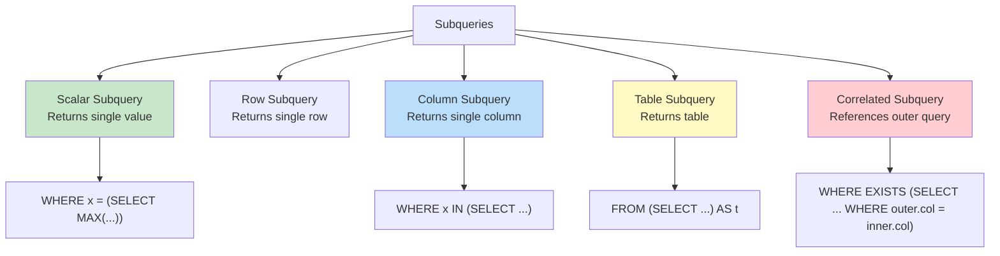

# SQL Subqueries

## Overview

A **subquery** (inner query or nested query) is a SELECT statement embedded within another SQL statement. Subqueries can appear in WHERE, HAVING, FROM, or SELECT clauses. They are one of the most versatile SQL features, enabling complex data retrieval without joins.

## Types of Subqueries



## Scalar Subquery

Returns a **single value** (one row, one column). Can be used wherever a single value is expected.

```sql
-- Compare with a scalar
SELECT name, salary
FROM Employees
WHERE salary > (SELECT AVG(salary) FROM Employees);

-- In SELECT clause
SELECT name, salary,
    salary - (SELECT AVG(salary) FROM Employees) AS diff_from_avg
FROM Employees;

-- In HAVING
SELECT department, AVG(salary) AS avg_sal
FROM Employees
GROUP BY department
HAVING AVG(salary) > (SELECT AVG(salary) FROM Employees);
```

## Column Subquery (Multi-row)

Returns a **single column** with multiple rows. Used with IN, ANY, ALL.

```sql
-- IN subquery
SELECT name FROM Employees
WHERE dept_id IN (SELECT dept_id FROM Departments WHERE location = 'NYC');

-- NOT IN (beware NULLs!)
SELECT name FROM Employees
WHERE dept_id NOT IN (SELECT dept_id FROM Departments WHERE location = 'NYC');

-- ANY (at least one)
SELECT name FROM Employees
WHERE salary > ANY (SELECT salary FROM Employees WHERE dept_id = 10);
-- Returns employees whose salary is greater than the LOWEST salary in dept 10

-- ALL (every one)
SELECT name FROM Employees
WHERE salary > ALL (SELECT salary FROM Employees WHERE dept_id = 10);
-- Returns employees whose salary is greater than the HIGHEST salary in dept 10
```

## Table Subquery (Derived Table)

Returns a **table** (multiple rows and columns). Used in the FROM clause.

```sql
-- Derived table
SELECT dept_name, avg_salary
FROM (
    SELECT department, AVG(salary) AS avg_salary
    FROM Employees
    GROUP BY department
) AS dept_stats
JOIN Departments D ON dept_stats.department = D.dept_name
WHERE avg_salary > 70000;

-- Derived table with LIMIT
SELECT name, salary
FROM (SELECT name, salary FROM Employees ORDER BY salary DESC LIMIT 10) AS top_10;
```

## Correlated Subquery

A subquery that **references columns from the outer query**. Executed once for each row of the outer query.

```sql
-- Employees earning more than their department average
SELECT E.name, E.salary, E.department
FROM Employees E
WHERE E.salary > (
    SELECT AVG(E2.salary)
    FROM Employees E2
    WHERE E2.department = E.department  -- Correlated: references outer E.department
);

-- EXISTS: correlated subquery
SELECT name FROM Employees E
WHERE EXISTS (
    SELECT 1 FROM Orders O WHERE O.emp_id = E.emp_id
);

-- NOT EXISTS: anti-join
SELECT name FROM Employees E
WHERE NOT EXISTS (
    SELECT 1 FROM Orders O WHERE O.emp_id = E.emp_id
);

-- Correlated subquery in SELECT
SELECT name, salary,
    (SELECT COUNT(*) FROM Orders O WHERE O.emp_id = E.emp_id) AS order_count
FROM Employees E;
```

### Correlated vs Non-Correlated

| Aspect | Non-Correlated | Correlated |
|---|---|---|
| Reference to outer | No | Yes |
| Execution | Once | Once per outer row |
| Can run independently | Yes | No |
| Performance | Usually faster | Can be slow (N+1 problem) |
| Example | `WHERE salary > (SELECT AVG(...))` | `WHERE salary > (SELECT AVG(...) WHERE dept = outer.dept)` |

## Subquery vs JOIN

Many subqueries can be rewritten as JOINs and vice versa.

```sql
-- Subquery approach
SELECT name FROM Employees
WHERE dept_id IN (SELECT dept_id FROM Departments WHERE location = 'NYC');

-- JOIN approach
SELECT DISTINCT E.name FROM Employees E
JOIN Departments D ON E.dept_id = D.dept_id
WHERE D.location = 'NYC';

-- EXISTS approach (often most efficient)
SELECT name FROM Employees E
WHERE EXISTS (SELECT 1 FROM Departments D WHERE D.dept_id = E.dept_id AND D.location = 'NYC');
```

### When to Use Which

| Use Case | Preferred Approach |
|---|---|
| Need columns from both tables | JOIN |
| Only checking existence | EXISTS |
| Checking membership in a list | IN subquery |
| Need "for all" semantics | NOT EXISTS |
| Aggregation before filtering | Subquery in FROM |
| Simple scalar comparison | Scalar subquery |

## Subquery in INSERT

```sql
INSERT INTO HighEarners (emp_id, name, salary)
SELECT emp_id, name, salary FROM Employees WHERE salary > 100000;
```

## Subquery in UPDATE

```sql
UPDATE Employees
SET salary = salary * 1.10
WHERE dept_id IN (SELECT dept_id FROM Departments WHERE budget > 1000000);
```

## Subquery in DELETE

```sql
DELETE FROM Employees
WHERE dept_id IN (SELECT dept_id FROM Departments WHERE is_closed = true);
```

## Common Table Expressions (CTEs) as Subquery Alternative

CTEs (WITH clause) make subqueries more readable. See [CTEs](ctes.md) for detailed coverage.

```sql
-- Instead of nested subqueries:
WITH DeptAvg AS (
    SELECT department, AVG(salary) AS avg_salary
    FROM Employees
    GROUP BY department
)
SELECT E.name, E.salary, D.avg_salary
FROM Employees E
JOIN DeptAvg D ON E.department = D.department
WHERE E.salary > D.avg_salary;
```

## Interview Questions

### Beginner

**Q1: What is a subquery?**
A: A SELECT statement nested inside another SQL statement. It can appear in WHERE (filtering), FROM (derived table), SELECT (scalar), or HAVING clauses. The inner query executes first (for non-correlated) and its result is used by the outer query.

**Q2: What is the difference between IN and EXISTS?**
A: IN checks if a value exists in a set returned by the subquery. EXISTS checks if the subquery returns any rows. IN materializes the subquery result; EXISTS short-circuits on the first match. For large subquery results, EXISTS is often faster because it stops at the first match.

**Q3: What is a correlated subquery?**
A: A subquery that references a column from the outer query. It's re-evaluated for each row of the outer query. Example: finding employees whose salary is above their department's average — the subquery references the outer row's department.

### Intermediate

**Q4: When is EXISTS faster than IN?**
A: EXISTS is typically faster when:
- The subquery result set is large
- The outer table is small (fewer correlated evaluations)
- An index exists on the correlated column
- You only need to check existence, not retrieve values

IN is faster when:
- The subquery result set is small and can be materialized
- The outer table is large
- No good index exists for the correlated approach

**Q5: Rewrite this correlated subquery as a JOIN:**
```sql
SELECT name FROM Employees E
WHERE salary > (SELECT AVG(salary) FROM Employees E2 WHERE E2.dept_id = E.dept_id);
```
A:
```sql
SELECT E.name
FROM Employees E
JOIN (SELECT dept_id, AVG(salary) AS avg_sal FROM Employees GROUP BY dept_id) D
ON E.dept_id = D.dept_id
WHERE E.salary > D.avg_sal;
```

**Q6: What happens if a scalar subquery returns multiple rows?**
A: The database throws an error. A scalar subquery must return exactly one row and one column. If it can return multiple rows, use IN, ANY, or ALL instead. If you expect one row but multiple could exist, add LIMIT 1 or aggregate.

### Advanced / FAANG-Level

**Q7: Optimize this query that uses a correlated subquery:**
```sql
SELECT name, (SELECT COUNT(*) FROM Orders O WHERE O.emp_id = E.emp_id) AS order_count
FROM Employees E;
```
A: The correlated subquery executes once per employee (N+1 problem). Optimizations:
```sql
-- Option 1: LEFT JOIN with GROUP BY
SELECT E.name, COUNT(O.order_id) AS order_count
FROM Employees E
LEFT JOIN Orders O ON E.emp_id = O.emp_id
GROUP BY E.emp_id, E.name;

-- Option 2: Window function
SELECT name, COUNT(order_id) OVER (PARTITION BY emp_id) AS order_count
FROM Employees E
LEFT JOIN Orders O ON E.emp_id = O.emp_id;

-- Option 3: Lateral join (PostgreSQL)
SELECT E.name, O.order_count
FROM Employees E
LEFT JOIN LATERAL (
    SELECT COUNT(*) AS order_count FROM Orders O WHERE O.emp_id = E.emp_id
) O ON true;
```

**Q8: Explain how the query optimizer handles subqueries (decorrelation/unnesting).**
A: Modern optimizers transform correlated subqueries into joins (decorrelation):
1. **EXISTS → Semi-join**: `WHERE EXISTS (SELECT 1 FROM B WHERE B.id = A.id)` → Semi-join
2. **NOT EXISTS → Anti-join**: `WHERE NOT EXISTS (...)` → Anti-join
3. **Scalar correlated → LEFT JOIN + aggregation**: Moves to FROM clause
4. **IN subquery → Hash/merge semi-join**: Materializes subquery, builds hash table

If decorrelation fails (complex predicates, LIMIT in subquery), the optimizer falls back to the correlated execution (nested loop).

## Common Mistakes

- Using `=` with a subquery that returns multiple rows (use IN instead)
- NOT IN with NULLs returning empty results
- Correlated subqueries without indexes on the correlated column (N+1 problem)
- Forgetting that scalar subqueries must return exactly one row
- Using subqueries when a simple JOIN would be clearer and faster
- Not aliasing derived tables (required in most databases)

## Summary

| Subquery Type | Returns | Used In | Execution |
|---|---|---|---|
| Scalar | One value | WHERE, SELECT, HAVING | Once (or per row if correlated) |
| Column | One column, multiple rows | WHERE (IN, ANY, ALL) | Once |
| Table | Multiple rows/columns | FROM (derived table) | Once |
| Correlated | Depends on outer query | WHERE, SELECT | Once per outer row |

## Cross-References

- [Joins](joins.md) — Alternative to subqueries
- [CTEs](ctes.md) — Readable subquery alternative
- [Window Functions](window-functions.md) — Alternative to correlated subqueries
- [Indexes](indexes.md) — Optimizing subquery performance
- [Query Tuning](../indexing/tuning.md) — Subquery optimization


## Cross References

- [SQL Joins](../dbms/sql/joins.md)
- [CTEs](../dbms/sql/ctes.md)
- [Query Optimization](../dbms/query-processing/optimization.md)
- [Relational Calculus](../dbms/relational-model/relational-calculus.md)
