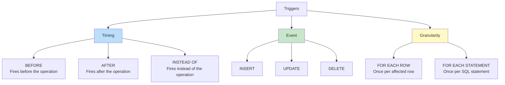
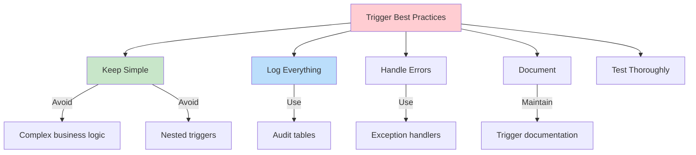

# SQL Triggers

## Overview

A **Trigger** is a special type of stored procedure that automatically executes (fires) in response to specific events on a table or view. Triggers are used for auditing, enforcing complex business rules, maintaining derived data, and implementing cascading actions that go beyond foreign key constraints.

## Types of Triggers



## MySQL Triggers

### Basic Trigger

```sql
-- Audit log: track all salary changes
DELIMITER //

CREATE TRIGGER trg_salary_audit
BEFORE UPDATE ON Employees
FOR EACH ROW
BEGIN
    IF OLD.salary != NEW.salary THEN
        INSERT INTO SalaryAudit (emp_id, old_salary, new_salary, changed_at, changed_by)
        VALUES (OLD.emp_id, OLD.salary, NEW.salary, NOW(), CURRENT_USER());
    END IF;
END //

DELIMITER ;
```

### BEFORE vs AFTER

```sql
-- BEFORE trigger: can modify NEW values
DELIMITER //
CREATE TRIGGER trg_normalize_email
BEFORE INSERT ON Employees
FOR EACH ROW
BEGIN
    SET NEW.email = LOWER(TRIM(NEW.email));
    SET NEW.created_at = IFNULL(NEW.created_at, NOW());
END //
DELIMITER ;

-- AFTER trigger: for logging/auditing (cannot modify NEW)
DELIMITER //
CREATE TRIGGER trg_order_notification
AFTER INSERT ON Orders
FOR EACH ROW
BEGIN
    INSERT INTO NotificationQueue (user_id, type, message, created_at)
    VALUES (NEW.customer_id, 'new_order',
            CONCAT('Order #', NEW.order_id, ' placed successfully'),
            NOW());
END //
DELIMITER ;
```

### INSERT Trigger

```sql
DELIMITER //
CREATE TRIGGER trg_init_employee
BEFORE INSERT ON Employees
FOR EACH ROW
BEGIN
    -- Auto-generate employee ID
    SET NEW.emp_id = IFNULL(NEW.emp_id, UUID());
    -- Set default values
    SET NEW.status = IFNULL(NEW.status, 'active');
    SET NEW.created_at = NOW();
    -- Validate
    IF NEW.salary < 0 THEN
        SIGNAL SQLSTATE '45000' SET MESSAGE_TEXT = 'Salary cannot be negative';
    END IF;
END //
DELIMITER ;
```

### UPDATE Trigger

```sql
DELIMITER //
CREATE TRIGGER trg_track_changes
BEFORE UPDATE ON Employees
FOR EACH ROW
BEGIN
    -- Prevent updating certain columns
    IF OLD.emp_id != NEW.emp_id THEN
        SIGNAL SQLSTATE '45000' SET MESSAGE_TEXT = 'Cannot change employee ID';
    END IF;

    -- Auto-set modified timestamp
    SET NEW.modified_at = NOW();

    -- Track what changed
    IF OLD.department != NEW.department THEN
        INSERT INTO DepartmentChanges (emp_id, old_dept, new_dept, changed_at)
        VALUES (OLD.emp_id, OLD.department, NEW.department, NOW());
    END IF;
END //
DELIMITER ;
```

### DELETE Trigger

```sql
DELIMITER //
CREATE TRIGGER trg_archive_deleted
BEFORE DELETE ON Employees
FOR EACH ROW
BEGIN
    -- Archive before deleting
    INSERT INTO EmployeeArchive (emp_id, name, email, department, salary, deleted_at)
    VALUES (OLD.emp_id, OLD.name, OLD.email, OLD.department, OLD.salary, NOW());
END //
DELIMITER ;
```

## PostgreSQL Triggers

PostgreSQL separates trigger creation into two steps: (1) create a trigger function, (2) attach it to a table.

### Trigger Function

```sql
-- Generic audit trigger function
CREATE OR REPLACE FUNCTION audit_trigger_func()
RETURNS TRIGGER AS $$
BEGIN
    IF TG_OP = 'INSERT' THEN
        INSERT INTO audit_log (table_name, operation, row_data, changed_at)
        VALUES (TG_TABLE_NAME, 'INSERT', to_jsonb(NEW), NOW());
        RETURN NEW;
    ELSIF TG_OP = 'UPDATE' THEN
        INSERT INTO audit_log (table_name, operation, row_data, old_data, changed_at)
        VALUES (TG_TABLE_NAME, 'UPDATE', to_jsonb(NEW), to_jsonb(OLD), NOW());
        RETURN NEW;
    ELSIF TG_OP = 'DELETE' THEN
        INSERT INTO audit_log (table_name, operation, old_data, changed_at)
        VALUES (TG_TABLE_NAME, 'DELETE', to_jsonb(OLD), NOW());
        RETURN OLD;
    END IF;
END;
$$ LANGUAGE plpgsql;
```

### Attach Trigger to Table

```sql
-- AFTER trigger on Employees
CREATE TRIGGER trg_employees_audit
AFTER INSERT OR UPDATE OR DELETE ON Employees
FOR EACH ROW EXECUTE FUNCTION audit_trigger_func();

-- BEFORE trigger
CREATE TRIGGER trg_employees_validate
BEFORE INSERT OR UPDATE ON Employees
FOR EACH ROW EXECUTE FUNCTION validate_employee_func();

-- Trigger on specific columns
CREATE TRIGGER trg_salary_change
AFTER UPDATE OF salary ON Employees
FOR EACH ROW EXECUTE FUNCTION log_salary_change();
```

### Special Variables in PostgreSQL Triggers

| Variable | Description |
|---|---|
| `NEW` | New row data (INSERT/UPDATE) |
| `OLD` | Old row data (UPDATE/DELETE) |
| `TG_OP` | Operation: 'INSERT', 'UPDATE', 'DELETE' |
| `TG_TABLE_NAME` | Name of the table |
| `TG_WHEN` | 'BEFORE', 'AFTER', 'INSTEAD OF' |
| `TG_LEVEL` | 'ROW' or 'STATEMENT' |

## SQL Server Triggers

```sql
-- DML Trigger
CREATE TRIGGER trg_Employee_Audit
ON Employees
AFTER INSERT, UPDATE, DELETE
AS
BEGIN
    SET NOCOUNT ON;

    -- Handle INSERT
    IF EXISTS (SELECT 1 FROM inserted) AND NOT EXISTS (SELECT 1 FROM deleted)
    BEGIN
        INSERT INTO AuditLog (action, emp_id, details, action_date)
        SELECT 'INSERT', i.emp_id, 'New employee added', GETDATE()
        FROM inserted i;
    END

    -- Handle DELETE
    IF EXISTS (SELECT 1 FROM deleted) AND NOT EXISTS (SELECT 1 FROM inserted)
    BEGIN
        INSERT INTO AuditLog (action, emp_id, details, action_date)
        SELECT 'DELETE', d.emp_id, 'Employee removed', GETDATE()
        FROM deleted d;
    END

    -- Handle UPDATE
    IF EXISTS (SELECT 1 FROM inserted) AND EXISTS (SELECT 1 FROM deleted)
    BEGIN
        INSERT INTO AuditLog (action, emp_id, details, action_date)
        SELECT 'UPDATE', i.emp_id,
               'Salary changed from ' + CAST(d.salary AS VARCHAR) + ' to ' + CAST(i.salary AS VARCHAR),
               GETDATE()
        FROM inserted i
        JOIN deleted d ON i.emp_id = d.emp_id
        WHERE i.salary != d.salary;
    END
END;
GO

-- DDL Trigger (fires on schema changes)
CREATE TRIGGER trg_PreventTableDrop
ON DATABASE
FOR DROP_TABLE
AS
BEGIN
    RAISERROR ('Table dropping is not allowed!', 16, 1);
    ROLLBACK;
END;
GO

-- Logon Trigger
CREATE TRIGGER trg_AuditLogon
ON ALL SERVER
FOR LOGON
AS
BEGIN
    INSERT INTO master.dbo.LoginAudit (login_name, login_time, host_name)
    VALUES (ORIGINAL_LOGIN(), GETDATE(), HOST_NAME());
END;
GO
```

## INSTEAD OF Triggers

Fires **instead of** the actual operation. Commonly used to make views updatable.

```sql
-- Make a complex view updatable
CREATE VIEW EmployeeSummary AS
SELECT E.emp_id, E.name, D.dept_name, E.salary
FROM Employees E
JOIN Departments D ON E.dept_id = D.dept_id;

-- PostgreSQL
CREATE OR REPLACE FUNCTION update_employee_summary()
RETURNS TRIGGER AS $$
BEGIN
    UPDATE Employees SET name = NEW.name, salary = NEW.salary
    WHERE emp_id = OLD.emp_id;
    RETURN NEW;
END;
$$ LANGUAGE plpgsql;

CREATE TRIGGER trg_update_summary
INSTEAD OF UPDATE ON EmployeeSummary
FOR EACH ROW EXECUTE FUNCTION update_employee_summary();
```

## Mutating Table Problem (Oracle)

In Oracle, a row-level trigger cannot query or modify the table that fired the trigger (mutating table error).

```sql
-- This causes ORA-04091 in Oracle:
CREATE TRIGGER trg_check_salary
BEFORE UPDATE ON Employees
FOR EACH ROW
BEGIN
    -- ERROR: mutating table
    SELECT MAX(salary) INTO max_sal FROM Employees;
    IF NEW.salary > max_sal * 1.5 THEN
        RAISE_APPLICATION_ERROR(-20001, 'Salary increase too large');
    END IF;
END;

-- Solution: Use statement-level trigger + package variable
-- Or use a compound trigger (Oracle 11g+)
```

## Best Practices



1. **Keep triggers simple**: Complex logic belongs in stored procedures
2. **Avoid nested triggers**: Trigger A fires trigger B fires trigger C — hard to debug
3. **Handle errors**: Prevent silent failures
4. **Document**: Maintain a list of all triggers and their purposes
5. **Test thoroughly**: Triggers fire on every operation, including bulk imports
6. **Use AFTER over BEFORE** when possible: AFTER triggers run after the operation succeeds
7. **Avoid triggers for referential integrity**: Use foreign keys instead

## Managing Triggers

```sql
-- View triggers
-- PostgreSQL
SELECT * FROM information_schema.triggers WHERE event_object_table = 'Employees';

-- MySQL
SHOW TRIGGERS LIKE 'Employees';

-- Disable trigger
-- PostgreSQL
ALTER TABLE Employees DISABLE TRIGGER trg_salary_audit;

-- MySQL
ALTER TABLE Employees DISABLE TRIGGER trg_salary_audit;

-- SQL Server
DISABLE TRIGGER trg_Employee_Audit ON Employees;

-- Drop trigger
DROP TRIGGER IF EXISTS trg_salary_audit ON Employees;

-- Enable trigger
ALTER TABLE Employees ENABLE TRIGGER trg_salary_audit;
```

## Interview Questions

### Beginner

**Q1: What is a trigger?**
A: A trigger is a stored procedure that automatically executes when a specific event (INSERT, UPDATE, DELETE) occurs on a table. Triggers fire without explicit invocation — they're "triggered" by the DML operation. Used for auditing, validation, and maintaining derived data.

**Q2: What is the difference between BEFORE and AFTER triggers?**
A: **BEFORE** triggers fire before the operation executes — they can modify NEW values or prevent the operation entirely. **AFTER** triggers fire after the operation succeeds — they're used for logging, auditing, and side effects. BEFORE can abort; AFTER cannot.

**Q3: What are OLD and NEW in triggers?**
A: **OLD** refers to the row data before the operation (UPDATE/DELETE). **NEW** refers to the row data after the operation (INSERT/UPDATE). In BEFORE triggers, you can modify NEW. In AFTER triggers, NEW is read-only.

### Intermediate

**Q4: What is a mutating table error and how do you solve it?**
A: In Oracle, a row-level trigger cannot query the same table that fired it (the table is "mutating"). Solutions: (1) Use a statement-level trigger instead, (2) Use a compound trigger with a collection to buffer changes, (3) Use a temporary table to store intermediate data.

**Q5: How can triggers affect performance?**
A: Triggers add overhead to every DML operation. They fire for each row (row-level), so bulk operations (INSERT 1M rows) fire 1M triggers. Optimization: use statement-level triggers when possible, keep trigger logic minimal, avoid triggers on high-write tables where possible.

**Q6: Can you control the order in which triggers fire?**
A: It depends on the database. SQL Server allows `sp_settriggerorder` to specify first/last trigger. PostgreSQL and MySQL don't guarantee trigger execution order — if order matters, combine logic into a single trigger.

### Advanced / FAANG-Level

**Q7: Design an audit system using triggers that tracks all changes to sensitive tables.**
A:
```sql
-- Generic audit table
CREATE TABLE audit_log (
    audit_id BIGSERIAL PRIMARY KEY,
    table_name TEXT NOT NULL,
    operation TEXT NOT NULL,  -- INSERT, UPDATE, DELETE
    row_id TEXT,
    old_data JSONB,
    new_data JSONB,
    changed_by TEXT DEFAULT CURRENT_USER,
    changed_at TIMESTAMP DEFAULT NOW(),
    client_addr INET DEFAULT inet_client_addr()
);

-- Reusable trigger function
CREATE OR REPLACE FUNCTION universal_audit()
RETURNS TRIGGER AS $$
DECLARE
    row_id_val TEXT;
BEGIN
    -- Get primary key value
    IF TG_OP = 'DELETE' THEN
        row_id_val := OLD.id::TEXT;
    ELSE
        row_id_val := NEW.id::TEXT;
    END IF;

    INSERT INTO audit_log (table_name, operation, row_id, old_data, new_data)
    VALUES (
        TG_TABLE_NAME,
        TG_OP,
        row_id_val,
        CASE WHEN TG_OP IN ('UPDATE','DELETE') THEN to_jsonb(OLD) END,
        CASE WHEN TG_OP IN ('INSERT','UPDATE') THEN to_jsonb(NEW) END
    );

    RETURN COALESCE(NEW, OLD);
END;
$$ LANGUAGE plpgsql;

-- Attach to sensitive tables
CREATE TRIGGER audit_employees AFTER INSERT OR UPDATE OR DELETE
    ON Employees FOR EACH ROW EXECUTE FUNCTION universal_audit();
CREATE TRIGGER audit_salaries AFTER INSERT OR UPDATE OR DELETE
    ON Salaries FOR EACH ROW EXECUTE FUNCTION universal_audit();
```

**Q8: How would you implement event sourcing using triggers?**
A: Triggers can capture every state change as an event:
```sql
CREATE TABLE events (
    event_id BIGSERIAL PRIMARY KEY,
    aggregate_id TEXT NOT NULL,
    event_type TEXT NOT NULL,
    event_data JSONB NOT NULL,
    version INT NOT NULL,
    created_at TIMESTAMP DEFAULT NOW()
);

CREATE OR REPLACE FUNCTION emit_event()
RETURNS TRIGGER AS $$
DECLARE
    current_version INT;
BEGIN
    SELECT COALESCE(MAX(version), 0) INTO current_version
    FROM events WHERE aggregate_id = NEW.id::TEXT;

    INSERT INTO events (aggregate_id, event_type, event_data, version)
    VALUES (
        NEW.id::TEXT,
        CASE TG_OP
            WHEN 'INSERT' THEN 'EmployeeCreated'
            WHEN 'UPDATE' THEN 'EmployeeUpdated'
        END,
        jsonb_build_object('old', to_jsonb(OLD), 'new', to_jsonb(NEW)),
        current_version + 1
    );

    RETURN NEW;
END;
$$ LANGUAGE plpgsql;
```

## Common Mistakes

- Making triggers too complex (business logic belongs in application code)
- Not handling errors in triggers (causes silent failures)
- Forgetting that triggers fire for bulk operations too (performance impact)
- Using triggers for referential integrity (use foreign keys instead)
- Not documenting triggers (hidden side effects are dangerous)
- Nesting triggers (A fires B fires C — impossible to debug)
- Not testing triggers with NULL values and edge cases

## Summary

| Trigger Type | Timing | Can Modify NEW | Use Case |
|---|---|---|---|
| BEFORE INSERT/UPDATE | Before operation | Yes | Validation, defaults |
| AFTER INSERT/UPDATE/DELETE | After operation | No | Auditing, logging |
| INSTEAD OF | Replaces operation | N/A | Updatable views |

## Cross-References

- [Stored Procedures](stored-procedures.md) — Trigger functions are procedures
- [DDL](ddl.md) — Creating triggers
- [DML](dml.md) — Operations that fire triggers
- [Transactions](../transactions/README.md) — Trigger behavior in transactions
