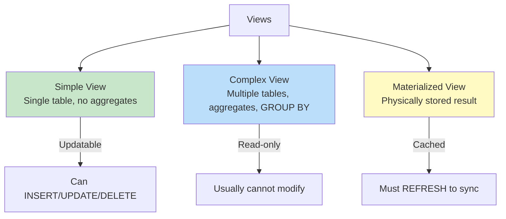
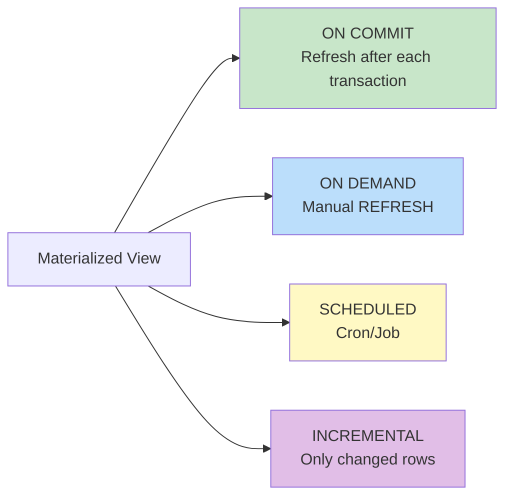

# SQL Views

## Overview

A **View** is a virtual table defined by a SELECT query. It doesn't store data physically — instead, it dynamically retrieves data from underlying base tables whenever queried. Views provide abstraction, security, and code reuse.

## Types of Views



## Creating Views

### Simple View

```sql
CREATE VIEW ActiveEmployees AS
SELECT emp_id, first_name, last_name, salary, dept_id
FROM Employees
WHERE is_active = true;

-- Using the view
SELECT * FROM ActiveEmployees WHERE salary > 70000;
```

### Complex View (Read-Only)

```sql
CREATE VIEW DeptStatistics AS
SELECT
    D.dept_name,
    COUNT(E.emp_id) AS emp_count,
    AVG(E.salary) AS avg_salary,
    MIN(E.salary) AS min_salary,
    MAX(E.salary) AS max_salary
FROM Departments D
LEFT JOIN Employees E ON D.dept_id = E.dept_id
GROUP BY D.dept_name;

-- Usage
SELECT * FROM DeptStatistics WHERE emp_count > 10;
```

### View with JOINs

```sql
CREATE VIEW EmployeeDetails AS
SELECT
    E.emp_id,
    E.first_name || ' ' || E.last_name AS full_name,
    E.email,
    D.dept_name,
    M.first_name AS manager_name
FROM Employees E
LEFT JOIN Departments D ON E.dept_id = D.dept_id
LEFT JOIN Employees M ON E.manager_id = M.emp_id;
```

### View with CHECK OPTION

```sql
-- Prevents inserts/updates that would make the row invisible to the view
CREATE VIEW NYCEmployees AS
SELECT * FROM Employees WHERE location = 'NYC'
WITH CHECK OPTION;

-- This succeeds:
INSERT INTO NYCEmployees (first_name, last_name, location)
VALUES ('Alice', 'Smith', 'NYC');

-- This fails (violates CHECK OPTION):
INSERT INTO NYCEmployees (first_name, last_name, location)
VALUES ('Bob', 'Jones', 'LA');
```

### Cascaded vs Local CHECK OPTION

```sql
-- LOCAL: Only checks the current view's WHERE condition
CREATE VIEW V1 AS SELECT * FROM Employees WHERE salary > 50000 WITH LOCAL CHECK OPTION;
CREATE VIEW V2 AS SELECT * FROM V1 WHERE department = 'Engineering' WITH LOCAL CHECK OPTION;
-- V2 only checks department = 'Engineering', not salary > 50000

-- CASCADED (default): Checks all underlying view conditions
CREATE VIEW V2 AS SELECT * FROM V1 WHERE department = 'Engineering' WITH CASCADED CHECK OPTION;
-- V2 checks both department = 'Engineering' AND salary > 50000
```

## Modifying Views

```sql
-- Replace existing view
CREATE OR REPLACE VIEW ActiveEmployees AS
SELECT emp_id, first_name, last_name, salary, dept_id, hire_date
FROM Employees
WHERE is_active = true;

-- Drop view
DROP VIEW ActiveEmployees;
DROP VIEW IF EXISTS ActiveEmployees;

-- Drop multiple views
DROP VIEW IF EXISTS ActiveEmployees, DeptStatistics, EmployeeDetails;
```

## Updatable Views

A view is **updatable** (allows INSERT/UPDATE/DELETE) if it:
- References exactly **one base table**
- Has **no aggregates**, GROUP BY, HAVING, DISTINCT
- Has **no set operations** (UNION, INTERSECT, EXCEPT)
- Has **no subquery in SELECT** (in most databases)
- Does **not contain computed columns** (in some databases)

```sql
-- Updatable simple view
CREATE VIEW JuniorEmployees AS
SELECT emp_id, first_name, last_name, salary, dept_id
FROM Employees
WHERE experience_years < 3;

-- UPDATE through view
UPDATE JuniorEmployees SET salary = salary * 1.10 WHERE dept_id = 10;

-- INSERT through view
INSERT INTO JuniorEmployees (first_name, last_name, salary, dept_id)
VALUES ('Alice', 'Smith', 55000, 10);
-- Note: if experience_years has no default, this may fail

-- DELETE through view
DELETE FROM JuniorEmployees WHERE emp_id = 101;
```

## Materialized Views

A **materialized view** physically stores the query result on disk. It must be refreshed to reflect changes in the underlying tables.

```sql
-- PostgreSQL
CREATE MATERIALIZED VIEW DeptSummary AS
SELECT
    dept_id,
    COUNT(*) AS emp_count,
    AVG(salary) AS avg_salary
FROM Employees
GROUP BY dept_id
WITH DATA;  -- Populate immediately

-- Refresh (update the stored data)
REFRESH MATERIALIZED VIEW DeptSummary;

-- Refresh without blocking reads (PostgreSQL)
REFRESH MATERIALIZED VIEW CONCURRENTLY DeptSummary;
-- Requires a UNIQUE index on the view

-- Query the materialized view (reads stored data, not live)
SELECT * FROM DeptSummary WHERE avg_salary > 70000;

-- Create index on materialized view
CREATE UNIQUE INDEX idx_dept_summary ON DeptSummary(dept_id);
CREATE INDEX idx_avg_salary ON DeptSummary(avg_salary);
```

### Materialized View vs Regular View

| Aspect | Regular View | Materialized View |
|---|---|---|
| Storage | No (virtual) | Yes (physical) |
| Freshness | Always current | Stale until refreshed |
| Performance | Same as underlying query | Fast (pre-computed) |
| Write overhead | None | Refresh cost |
| Use case | Security, abstraction | Expensive aggregations, reporting |

### Refresh Strategies



## Views for Security

```sql
-- Hide sensitive columns
CREATE VIEW PublicEmployeeInfo AS
SELECT emp_id, first_name, last_name, department, job_title
FROM Employees;
-- salary, ssn, bank_account are hidden

-- Row-level security via views
CREATE VIEW DeptEmployees AS
SELECT * FROM Employees
WHERE dept_id = (SELECT dept_id FROM Employees WHERE emp_id = current_user_id());

-- Grant access only to the view
GRANT SELECT ON PublicEmployeeInfo TO readonly_role;
REVOKE SELECT ON Employees FROM readonly_role;
```

## Indexed Views (SQL Server)

SQL Server supports **indexed views** (materialized views with clustered indexes):

```sql
-- Create view with SCHEMABINDING
CREATE VIEW dbo.DeptSummary WITH SCHEMABINDING AS
SELECT
    dept_id,
    COUNT_BIG(*) AS emp_count,
    SUM(salary) AS total_salary
FROM dbo.Employees
GROUP BY dept_id;

-- Create clustered index (makes it materialized)
CREATE UNIQUE CLUSTERED INDEX idx_dept_summary ON dbo.DeptSummary(dept_id);

-- Now queries on DeptSummary use the materialized data
-- The engine automatically maintains the index on INSERT/UPDATE/DELETE
```

## Nested Views

```sql
-- View based on another view
CREATE VIEW SeniorEngineers AS
SELECT * FROM EmployeeDetails
WHERE department = 'Engineering' AND experience_years > 5;
```

**Warning**: Nested views are hard to debug and optimize. Keep view nesting to 1-2 levels maximum.

## Interview Questions

### Beginner

**Q1: What is a view and why use one?**
A: A view is a named SELECT query stored in the database. It acts as a virtual table. Uses: (1) simplify complex queries, (2) security — hide sensitive columns/rows, (3) abstraction — decouple applications from schema changes, (4) code reuse — define once, use everywhere.

**Q2: Can you update data through a view?**
A: It depends. Simple views (single table, no aggregates, no DISTINCT, no GROUP BY) are usually updatable. Complex views with joins, aggregates, or computed columns are typically read-only. Some databases allow INSTEAD OF triggers to make any view updatable.

**Q3: What is the difference between a view and a table?**
A: A table physically stores data. A view stores only the query definition and retrieves data dynamically from base tables. Views don't use additional storage (except materialized views). Views always reflect current data; they're a "window" into the base tables.

### Intermediate

**Q4: When would you use a materialized view instead of a regular view?**
A: When the view query is expensive (complex joins, aggregations on large tables) and is queried frequently. Trade-off: faster reads vs. refresh overhead and stale data. Use cases: dashboards, reporting, data warehouses where real-time freshness isn't critical.

**Q5: Explain WITH CHECK OPTION.**
A: It prevents INSERT or UPDATE operations through a view that would produce rows not visible in the view. Example: a view showing only 'NYC' employees — WITH CHECK OPTION prevents inserting an 'LA' employee through the view.

**Q6: How do views interact with indexes?**
A: Regular views don't have their own indexes — queries use indexes on the underlying base tables. Materialized views can be indexed (SQL Server indexed views, PostgreSQL materialized views). The optimizer may "expand" the view definition and use base table indexes.

### Advanced / FAANG-Level

**Q7: Design a view-based multi-tenant security architecture.**
A:
```sql
-- Tenant-aware view with row-level filtering
CREATE VIEW TenantUsers AS
SELECT * FROM Users
WHERE tenant_id = current_setting('app.current_tenant_id')::INT;

-- Grant access only to the view
GRANT SELECT, INSERT, UPDATE, DELETE ON TenantUsers TO app_role;
REVOKE ALL ON Users FROM app_role;

-- For materialized tenant-specific data (analytics)
CREATE MATERIALIZED VIEW TenantAnalytics AS
SELECT
    tenant_id,
    COUNT(*) AS user_count,
    DATE_TRUNC('month', created_at) AS month
FROM Users
GROUP BY tenant_id, DATE_TRUNC('month', created_at);

-- PostgreSQL Row-Level Security (more robust alternative)
ALTER TABLE Users ENABLE ROW LEVEL SECURITY;
CREATE POLICY tenant_policy ON Users
    USING (tenant_id = current_setting('app.current_tenant_id')::INT);
```

**Q8: How would you implement a view that supports incremental materialization?**
A:
```sql
-- Track changes using a change log
CREATE TABLE ChangeLog (
    change_id SERIAL PRIMARY KEY,
    table_name VARCHAR(50),
    row_id INT,
    change_type VARCHAR(10),  -- INSERT, UPDATE, DELETE
    changed_at TIMESTAMP DEFAULT NOW()
);

-- Trigger to log changes
CREATE TRIGGER log_employee_changes
AFTER INSERT OR UPDATE OR DELETE ON Employees
FOR EACH ROW EXECUTE FUNCTION log_change();

-- Incremental refresh function
CREATE OR REPLACE FUNCTION refresh_dept_summary_incremental()
RETURNS void AS $$
BEGIN
    -- Only recompute affected departments
    UPDATE DeptSummary ds
    SET emp_count = (SELECT COUNT(*) FROM Employees WHERE dept_id = ds.dept_id),
        avg_salary = (SELECT AVG(salary) FROM Employees WHERE dept_id = ds.dept_id)
    WHERE ds.dept_id IN (
        SELECT DISTINCT row_id::INT FROM ChangeLog
        WHERE table_name = 'Employees' AND changed_at > ds.last_refreshed
    );
END;
$$ LANGUAGE plpgsql;
```

## Common Mistakes

- Creating overly complex nested views (hard to debug and optimize)
- Not realizing views don't store data — querying a view is just running the underlying query
- Assuming views are always updatable
- Forgetting to refresh materialized views (stale data)
- Using SELECT * in view definitions — adding a column to the base table changes the view
- Not using WITH SCHEMABINDING in SQL Server (allows schema changes that break the view)

## Summary

| View Type | Storage | Updatable | Refresh | Use Case |
|---|---|---|---|---|
| Simple View | None | Usually yes | N/A (live) | Security, abstraction |
| Complex View | None | Usually no | N/A (live) | Query simplification |
| Materialized | Physical | No | Manual/scheduled | Performance, reporting |
| Indexed (SQL Server) | Physical | Yes (auto-maintained) | Automatic | High-performance reads |

## Cross-References

- [DDL](ddl.md) — Creating views
- [DML](dml.md) — Querying views
- [Subqueries](subqueries.md) — Alternative to views
- [CTEs](ctes.md) — Temporary view-like constructs
- [Normalization](../normalization/README.md) — Views can present denormalized data


## Cross References

- [CTEs](../dbms/sql/ctes.md)
- [Stored Procedures](../dbms/sql/stored-procedures.md)
- [Triggers](../dbms/sql/triggers.md)
