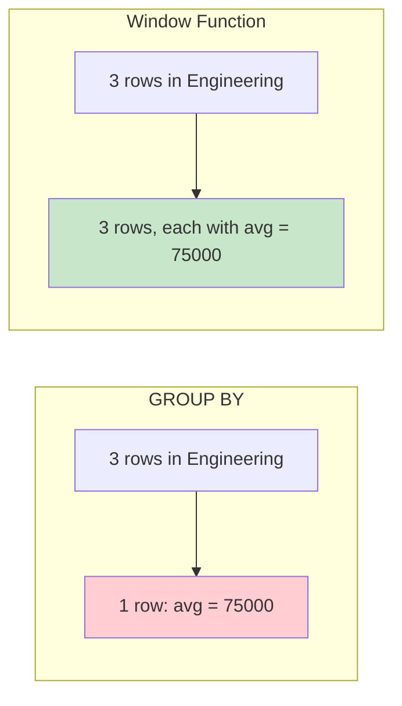

# SQL Window Functions

## Overview

**Window functions** perform calculations across a set of rows related to the current row, without collapsing them into a single output row (unlike GROUP BY). They "look through a window" of related rows while preserving individual row detail. Introduced in SQL:2003, they are essential for analytics and ranking queries.

## Syntax

```sql
function_name(args) OVER (
    [PARTITION BY partition_columns]
    [ORDER BY sort_columns [ASC|DESC]]
    [frame_clause]
)
```

- **PARTITION BY**: Divides rows into groups (like GROUP BY, but doesn't collapse)
- **ORDER BY**: Defines the order within each partition
- **frame_clause**: Defines which rows in the partition to include

## Window Function vs GROUP BY

```sql
-- GROUP BY: collapses rows
SELECT department, AVG(salary) FROM Employees GROUP BY department;
-- Result: one row per department

-- Window function: preserves all rows
SELECT name, department, salary,
    AVG(salary) OVER (PARTITION BY department) AS dept_avg
FROM Employees;
-- Result: all employee rows, each with department average
```



## Ranking Functions

### ROW_NUMBER()

Assigns a unique sequential integer to each row within a partition.

```sql
SELECT name, department, salary,
    ROW_NUMBER() OVER (PARTITION BY department ORDER BY salary DESC) AS row_num
FROM Employees;

-- Result:
-- name    | department   | salary | row_num
-- Alice   | Engineering  | 90000  | 1
-- Bob     | Engineering  | 80000  | 2
-- Carol   | Engineering  | 75000  | 3
-- Dave    | Science      | 85000  | 1
-- Eve     | Science      | 70000  | 2
```

### RANK()

Assigns a rank with **gaps** for ties.

```sql
SELECT name, salary,
    RANK() OVER (ORDER BY salary DESC) AS rnk
FROM Employees;
-- If two employees tie for rank 2, next is rank 4 (gap)
```

### DENSE_RANK()

Assigns a rank **without gaps** for ties.

```sql
SELECT name, salary,
    DENSE_RANK() OVER (ORDER BY salary DESC) AS dense_rnk
FROM Employees;
-- If two employees tie for rank 2, next is rank 3 (no gap)
```

### Ranking Comparison

```sql
SELECT name, salary,
    ROW_NUMBER() OVER (ORDER BY salary DESC) AS row_num,
    RANK()       OVER (ORDER BY salary DESC) AS rnk,
    DENSE_RANK() OVER (ORDER BY salary DESC) AS dense_rnk
FROM (VALUES ('A', 90000), ('B', 80000), ('C', 80000), ('D', 70000)) AS t(name, salary);
```

| name | salary | row_num | rnk | dense_rnk |
|---|---|---|---|---|
| A | 90000 | 1 | 1 | 1 |
| B | 80000 | 2 | 2 | 2 |
| C | 80000 | 3 | 2 | 2 |
| D | 70000 | 4 | 4 | 3 |

### NTILE(n)

Divides rows into `n` approximately equal groups (buckets).

```sql
SELECT name, salary,
    NTILE(4) OVER (ORDER BY salary DESC) AS quartile
FROM Employees;
-- Quartile 1 = top 25%, Quartile 4 = bottom 25%
```

## Aggregate Window Functions

All standard aggregates work as window functions.

```sql
SELECT
    name, department, salary,
    SUM(salary) OVER () AS company_total,
    SUM(salary) OVER (PARTITION BY department) AS dept_total,
    AVG(salary) OVER (PARTITION BY department) AS dept_avg,
    COUNT(*) OVER (PARTITION BY department) AS dept_count,
    MIN(salary) OVER (PARTITION BY department) AS dept_min,
    MAX(salary) OVER (PARTITION BY department) AS dept_max
FROM Employees;
```

## Value / Offset Functions

### LAG()

Access data from a **previous** row.

```sql
SELECT name, salary,
    LAG(salary) OVER (ORDER BY salary) AS prev_salary,
    salary - LAG(salary) OVER (ORDER BY salary) AS diff
FROM Employees;

-- With default value and offset
SELECT name, hire_date, salary,
    LAG(salary, 2, 0) OVER (PARTITION BY department ORDER BY hire_date) AS salary_2_ago
FROM Employees;
-- LAG(column, offset, default)
```

### LEAD()

Access data from the **next** row.

```sql
SELECT name, salary,
    LEAD(salary) OVER (ORDER BY salary) AS next_salary,
    LEAD(salary) OVER (ORDER BY salary) - salary AS diff
FROM Employees;
```

### FIRST_VALUE()

Get the **first** value in the window frame.

```sql
SELECT name, department, salary,
    FIRST_VALUE(name) OVER (PARTITION BY department ORDER BY salary DESC) AS highest_paid
FROM Employees;
```

### LAST_VALUE()

Get the **last** value in the window frame.

```sql
-- CAREFUL: default frame is ROWS BETWEEN UNBOUNDED PRECEDING AND CURRENT ROW
-- To get the actual last value, specify the full frame:
SELECT name, department, salary,
    LAST_VALUE(salary) OVER (
        PARTITION BY department
        ORDER BY salary
        ROWS BETWEEN UNBOUNDED PRECEDING AND UNBOUNDED FOLLOWING
    ) AS dept_max_salary
FROM Employees;
```

### NTH_VALUE()

Get the **nth** value in the window frame.

```sql
SELECT name, department, salary,
    NTH_VALUE(salary, 2) OVER (
        PARTITION BY department
        ORDER BY salary DESC
        ROWS BETWEEN UNBOUNDED PRECEDING AND UNBOUNDED FOLLOWING
    ) AS second_highest
FROM Employees;
```

## Window Frame Clause

The frame defines which rows are included in the window for each row.

### Frame Types

```sql
-- ROWS: Physical offset (specific number of rows)
ROWS BETWEEN 2 PRECEDING AND CURRENT ROW
ROWS BETWEEN UNBOUNDED PRECEDING AND CURRENT ROW  -- explicit ROWS frame (default is RANGE)
ROWS BETWEEN CURRENT ROW AND UNBOUNDED FOLLOWING
ROWS BETWEEN 1 PRECEDING AND 1 FOLLOWING  -- sliding window of 3

-- RANGE: Logical offset (based on ORDER BY values)
RANGE BETWEEN INTERVAL '30' DAY PRECEDING AND CURRENT ROW
RANGE BETWEEN UNBOUNDED PRECEDING AND CURRENT ROW

-- GROUPS: Groups of identical ORDER BY values
GROUPS BETWEEN 1 PRECEDING AND CURRENT ROW
```

### Default Frame

```sql
-- If ORDER BY is specified:
-- Default frame: RANGE BETWEEN UNBOUNDED PRECEDING AND CURRENT ROW
-- This means "all rows from the start of partition up to and including the current row"

-- If ORDER BY is NOT specified:
-- Default frame: ROWS BETWEEN UNBOUNDED PRECEDING AND UNBOUNDED FOLLOWING
-- This means "all rows in the partition" (entire partition)
```

### Practical Frame Examples

```sql
-- 3-day moving average
SELECT date, revenue,
    AVG(revenue) OVER (
        ORDER BY date
        ROWS BETWEEN 2 PRECEDING AND CURRENT ROW
    ) AS moving_avg_3d
FROM DailyRevenue;

-- Running total
SELECT date, revenue,
    SUM(revenue) OVER (ORDER BY date) AS running_total
FROM DailyRevenue;

-- Percentage of total
SELECT name, salary,
    salary * 100.0 / SUM(salary) OVER () AS pct_of_total
FROM Employees;

-- Year-to-date total
SELECT month, revenue,
    SUM(revenue) OVER (
        PARTITION BY year
        ORDER BY month
        ROWS BETWEEN UNBOUNDED PRECEDING AND CURRENT ROW
    ) AS ytd_total
FROM MonthlyRevenue;
```

### Frame Semantics Deep Dive: why the frame mode changes the *answer*

The three modes do not just pick different row sets — they pick different
answers to the same query, and the difference is exactly ties. Over
salaries `(100, 100, 200)` with `BETWEEN 1 PRECEDING AND CURRENT ROW`:

- **ROWS** counts physical rows. Frames are (1, 2, 2) rows: the previous
  row plus current, regardless of values.
- **RANGE** counts *peers within a value range* — all rows whose ORDER BY
  value falls in `[current - 1, current]`. Frames become (2, 2, 1): both
  `100`s fall in each other's range and always travel together; the `200`
  is alone. This is also why a running `SUM ... ORDER BY ts` (default
  RANGE frame) aggregates *all same-timestamp rows together* instead of
  one at a time — the running total "jumps" at ties. That is usually what
  you want for event-time correctness and usually *not* what you expect.
- **GROUPS** counts peer *groups*. `GROUPS BETWEEN 1 PRECEDING AND CURRENT
  ROW` over the same data yields (2, 2, 3): the previous distinct value's
  whole group plus all current peers — the only mode that means "the
  previous *value*, all its copies," and the right choice for time-series
  with duplicated timestamps.

The **EXCLUDE** clause (SQL standard, PostgreSQL 11+, DuckDB, SQLite)
removes part of the frame from the aggregate — the canonical use is
`EXCLUDE CURRENT ROW` to compute "average of everyone *else*" per row:

```sql
SELECT name, salary,
  ROUND(AVG(salary) OVER (ORDER BY department
         ROWS BETWEEN UNBOUNDED PRECEDING AND UNBOUNDED FOLLOWING
         EXCLUDE CURRENT ROW), 2) AS peers_avg
FROM Employees;   -- each row sees the whole partition minus itself
```

`EXCLUDE GROUP` removes the current row *and its peers* (ties),
`EXCLUDE TIES` removes only the peers, keeping the current row —
cohort-vs-self comparisons without self-joins.

### Frame choice = performance choice

Engines implement frames in two regimes, and picking the cheaper one is a
genuine optimization skill:

- **Running aggregates**: frames that only ever *extend* forward
  (`UNBOUNDED PRECEDING..CURRENT ROW` in ROWS/RANGE with no lower re-reads)
  allow the engine to keep a running sum and O(1) per row — the whole
  window clause costs one sorted scan.
- **Recomputation frames**: sliding frames (`2 PRECEDING..1 FOLLOWING`)
  that add and *drop* rows per step either maintain a removable buffer
  (sum/min/max can subtract/evict; average can subtract) or re-aggregate
  the whole frame per row — engines that cannot evict (and aggregate
  functions that cannot invert, like `MIN` under removal, or
  `string_agg`) degenerate to O(n·frame). SQL Server exposes this directly
  as the difference between its fast "window spool" plans and the
  slower re-seek plans visible in `EXPLAIN`'s `Window Spool` operators.

Rule of thumb: make the frame `ROWS` when ties don't matter, `RANGE`/
`GROUPS` when they do, keep the lower bound `UNBOUNDED PRECEDING` when the
metric is cumulative, and prefer *invertible* aggregates for sliding
windows.

## How Window Functions Execute (and Why They Sort)

Window functions are the clearest case of *syntax implying a plan shape*:

1. **Partition-by-sort.** The executor sorts (or hash-partitions, then
   sorts within) input rows by `(PARTITION BY..., ORDER BY...)`. This is
   the dominant cost — O(n log n) plus a spill risk on large partitions
   (see [Execution Plans](../query-processing/execution-plans.md)). The
   planner reuses one sort for all functions sharing the same window
   specification; each distinct `PARTITION/ORDER` combination adds another
   sort stage. That is the concrete reason to use the WINDOW clause to
   standardize window specs wherever semantics allow.
2. **Buffer + emit.** A `WindowAgg` operator reads each partition into
   memory (or a tuplestore on disk when the partition exceeds
   `work_mem`), then emits rows with computed frame values. Peak memory is
   *partition-sized* — one giant partition (a NULL partition key, a
   single tenant) is the classic OOM generator, the same failure shape as
   the skew problems in [Adaptive Query Execution](../advanced/adaptive-query-execution.md).
3. **Pipelining is broken.** Window functions are pipeline breakers: no
   row can leave before its partition is fully read (a frame may reach
   `UNBOUNDED FOLLOWING`). Streaming engines therefore re-emit revised
   rows or restrict supported window types — the batch/streaming contrast
   in [Stream Processing](../../data-engineering/stream-processing.md).
4. **Parallel and distributed engines** split by partition: Postgres
   parallelizes only the sort below the window node; Spark/Trino
   partition-and-exchange by the partition key (watch for the shuffle) and
   warn on skew. Writing `PARTITION BY` well is writing *distribution*
   well at scale.

## Named Windows (WINDOW Clause)

Define reusable window specifications.

```sql
SELECT name, department, salary,
    ROW_NUMBER() OVER dept_window AS row_num,
    RANK() OVER dept_window AS rnk,
    SUM(salary) OVER dept_window AS running_total
FROM Employees
WINDOW dept_window AS (PARTITION BY department ORDER BY salary DESC);
```

## Common Interview Patterns

### Top-N per Group

```sql
-- Top 3 earners per department
SELECT * FROM (
    SELECT name, department, salary,
        ROW_NUMBER() OVER (PARTITION BY department ORDER BY salary DESC) AS rn
    FROM Employees
) ranked
WHERE rn <= 3;
```

### Running Total / Cumulative Sum

```sql
SELECT date, amount,
    SUM(amount) OVER (ORDER BY date) AS running_total
FROM Transactions;
```

### Year-over-Year Growth

```sql
SELECT year, revenue,
    LAG(revenue) OVER (ORDER BY year) AS prev_year,
    (revenue - LAG(revenue) OVER (ORDER BY year)) * 100.0 /
    LAG(revenue) OVER (ORDER BY year) AS yoy_growth_pct
FROM YearlyRevenue;
```

### Gap and Islands

```sql
-- Find consecutive login streaks (islands)
SELECT user_id, MIN(login_date) AS streak_start, MAX(login_date) AS streak_end,
    COUNT(*) AS streak_length
FROM (
    SELECT user_id, login_date,
        login_date - INTERVAL '1 day' * ROW_NUMBER() OVER (PARTITION BY user_id ORDER BY login_date) AS grp
    FROM Logins
) t
GROUP BY user_id, grp;
```

### Percentile / Median

```sql
-- Median salary per department
SELECT DISTINCT department,
    PERCENTILE_CONT(0.5) WITHIN GROUP (ORDER BY salary) OVER (PARTITION BY department) AS median_salary
FROM Employees;

-- Alternative using ROW_NUMBER
SELECT department, AVG(salary) AS median
FROM (
    SELECT department, salary,
        ROW_NUMBER() OVER (PARTITION BY department ORDER BY salary) AS rn,
        COUNT(*) OVER (PARTITION BY department) AS cnt
    FROM Employees
) t
WHERE rn IN (FLOOR((cnt + 1) / 2.0), CEIL((cnt + 1) / 2.0))
GROUP BY department;
```

## Interview Questions

### Beginner

**Q1: What is the difference between GROUP BY and window functions?**
A: GROUP BY collapses rows into summary rows (one per group). Window functions compute a value for each row while keeping all rows. GROUP BY reduces rows; window functions preserve them.

**Q2: What is the difference between ROW_NUMBER, RANK, and DENSE_RANK?**
A: ROW_NUMBER assigns unique sequential numbers (no ties). RANK assigns the same rank to ties, with gaps (1,2,2,4). DENSE_RANK assigns the same rank to ties, without gaps (1,2,2,3).

**Q3: What does PARTITION BY do in a window function?**
A: It divides the result set into partitions (groups). The window function is applied independently within each partition. It's like GROUP BY for window functions — but doesn't collapse rows.

### Intermediate

**Q4: What is the default window frame and why does it matter?**
A: With ORDER BY: `RANGE BETWEEN UNBOUNDED PRECEDING AND CURRENT ROW`. Without ORDER BY: `ROWS BETWEEN UNBOUNDED PRECEDING AND UNBOUNDED FOLLOWING`. This matters for LAST_VALUE — with the default frame and ORDER BY, LAST_VALUE returns the current row's value (not the actual last). Always specify the frame explicitly for LAST_VALUE.

**Q5: Write a query to find the second highest salary per department.**
A:
```sql
SELECT * FROM (
    SELECT name, department, salary,
        DENSE_RANK() OVER (PARTITION BY department ORDER BY salary DESC) AS rnk
    FROM Employees
) ranked
WHERE rnk = 2;
```

**Q6: How do you calculate a running total that resets each month?**
A:
```sql
SELECT date, revenue,
    SUM(revenue) OVER (
        PARTITION BY DATE_TRUNC('month', date)
        ORDER BY date
        ROWS BETWEEN UNBOUNDED PRECEDING AND CURRENT ROW
    ) AS monthly_running_total
FROM DailyRevenue;
```

### Advanced / FAANG-Level

**Q7: Explain the difference between ROWS, RANGE, and GROUPS frame types.**
A:
- **ROWS**: Physical row count. `ROWS BETWEEN 2 PRECEDING AND CURRENT ROW` = exactly 3 rows regardless of values.
- **RANGE**: Logical value range. `RANGE BETWEEN 100 PRECEDING AND CURRENT ROW` = all rows where value is within 100 of current row. Ties (same ORDER BY value) are all included.
- **GROUPS**: Count of distinct ORDER BY value groups. `GROUPS BETWEEN 1 PRECEDING AND CURRENT ROW` = current group plus one group before.

Key difference: ROWS is deterministic, RANGE depends on data values, GROUPS depends on distinct value groups.

**Q8: Optimize a query that uses 10 window functions on a 100M-row table.**
A: Strategies:
1. **Single pass**: If multiple window functions share the same PARTITION BY and ORDER BY, they execute in one pass. Group them with a named WINDOW clause.
2. **Reduce data first**: Filter rows before the window function (CTE or subquery)
3. **Materialized intermediate results**: For very complex calculations, materialize intermediate results
4. **Index on partition/order columns**: Helps with sorting
5. **Avoid unnecessary frames**: Use ROWS instead of RANGE when possible (deterministic, faster)
6. **Parallel execution**: Ensure the database can parallelize window function computation

## Common Mistakes

- Forgetting that window functions execute after WHERE, GROUP BY, HAVING
- Using LAST_VALUE without specifying the frame (default frame gives wrong results)
- Confusing ROW_NUMBER with RANK (ROW_NUMBER never has ties)
- Not understanding that PARTITION BY doesn't reduce rows
- Using window functions in WHERE directly (wrap in subquery/CTE first)
- Overusing window functions when GROUP BY would be simpler and faster

## Summary

| Function | Purpose | Ties Handling |
|---|---|---|
| ROW_NUMBER | Unique sequential number | No ties (unique) |
| RANK | Rank with gaps | Same rank, with gaps |
| DENSE_RANK | Rank without gaps | Same rank, no gaps |
| NTILE | Divide into n buckets | Approximate equal size |
| LAG | Previous row value | N/A |
| LEAD | Next row value | N/A |
| FIRST_VALUE | First in frame | N/A |
| LAST_VALUE | Last in frame | N/A |
| NTH_VALUE | Nth in frame | N/A |
| Aggregates | SUM, AVG, COUNT, MIN, MAX | Over window |

## Cross-References

- [SQL Overview](README.md) — SQL fundamentals
- [CTEs](ctes.md) — Combining CTEs with window functions
- [Subqueries](subqueries.md) — Window functions in subqueries
- [Indexes](indexes.md) — Indexing for window function performance
- [Query Tuning](../indexing/tuning.md) — Optimizing analytical queries
