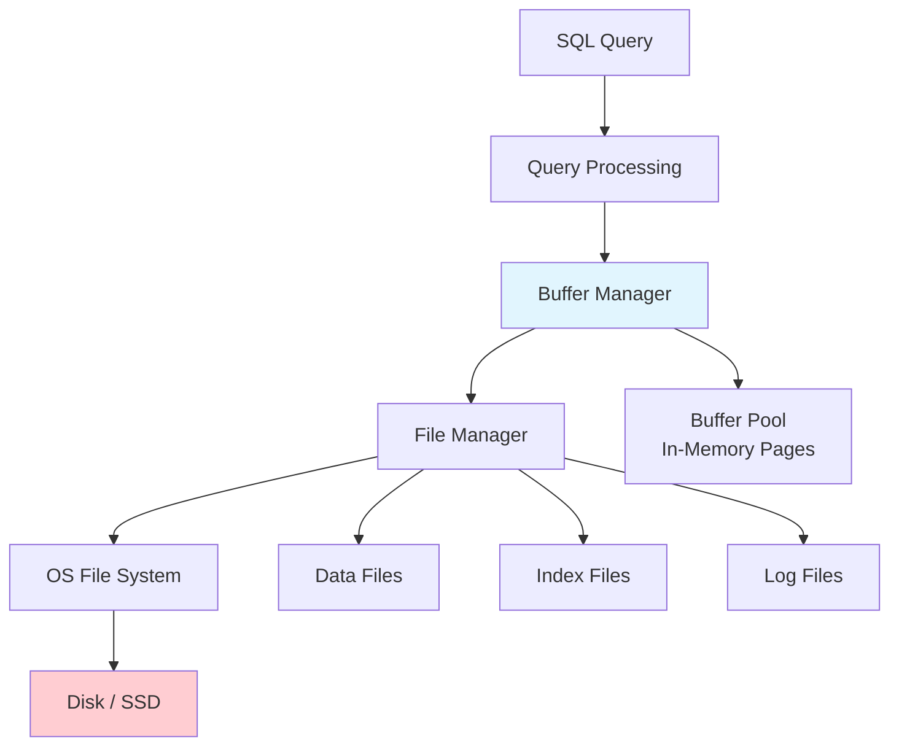

# Storage & File Organization

## Overview

The storage layer is the foundation of any DBMS. It manages how data is physically stored on disk, how it's organized into files and pages, and how the system efficiently reads and writes data. Understanding storage internals is essential for performance tuning, capacity planning, and system design interviews.

## Detailed Explanation

### The Storage Hierarchy



### Key Abstractions

| Layer | Component | Responsibility |
|-------|-----------|---------------|
| **Application** | SQL Interface | User queries |
| **Query Processing** | Parser, Optimizer, Executor | Query execution |
| **Buffer Manager** | Buffer Pool | Caching pages in memory |
| **File Manager** | File Organization | Managing data files on disk |
| **OS** | File System | Block-level I/O |
| **Hardware** | Disk / SSD | Physical storage |

### Disk vs. Memory

Understanding the performance gap is critical:

```
Operation                  Latency         Throughput
─────────────────────────────────────────────────────
L1 Cache access           0.5 ns          -
L2 Cache access           7 ns            -
RAM access                100 ns          10 GB/s
SSD random read           100 μs          500 MB/s
HDD random read           10 ms           100 MB/s
HDD sequential read       1 ms            200 MB/s
```

**Key insight:** Random disk I/O is 10,000-100,000x slower than memory access. The entire purpose of buffer management and file organization is to minimize disk I/O.

### Pages and Blocks

The fundamental unit of I/O is a **page** (also called **block**):

```
Typical page size: 4 KB, 8 KB, or 16 KB

Page Structure:
┌─────────────────────────────────┐
│ Page Header                     │  (page ID, LSN, checksum, etc.)
├─────────────────────────────────┤
│ Tuple Pointers (Slot Directory) │  (offsets to tuples)
├─────────────────────────────────┤
│ Free Space                      │
├─────────────────────────────────┤
│ Tuple Data                      │  (actual row data)
└─────────────────────────────────┘
```

| DBMS | Default Page Size |
|------|------------------|
| PostgreSQL | 8 KB |
| MySQL (InnoDB) | 16 KB |
| SQL Server | 8 KB |
| Oracle | 8 KB |
| SQLite | 4 KB |

## Topics in This Section

### 1. [File Organization](./file-organization.md)
How tables are stored in files: heap files, sorted files, and hashed files.

### 2. [Buffer Management](./buffer-management.md)
How the buffer pool caches pages in memory, replacement policies, and dirty page handling.

### 3. [Record Formats](./record-formats.md)
How individual rows (tuples) are stored within a page: fixed-length, variable-length, and slotted page format.

### 4. [Column Stores](./column-stores.md)
The alternative to row-oriented storage: storing data column-by-column for analytical workloads.

## Interview Focus Areas

1. **Why is sequential I/O faster than random I/O?** — Disk seek time, rotational latency
2. **What is a page and why is it the I/O unit?** — Balance between overhead and waste
3. **How does the buffer pool work?** — Caching, replacement, dirty pages
4. **Row store vs. column store?** — OLTP vs. OLAP trade-offs

## Cross-References

- [Query Processing](../query-processing/) — how queries access stored data
- [Buffer Pool](./buffer-management.md) — in-memory caching
- [Indexing](../indexing/) — data structures built on stored data
- [WAL](../internals/wal.md) — write-ahead logging for durability


## Cross References

- [Buffer Management](../dbms/storage/buffer-management.md)
- [File Organization](../dbms/storage/file-organization.md)
- [Storage Overview](../storage/overview.md)
- [File Systems (OS)](../os/filesystems/README.md)
