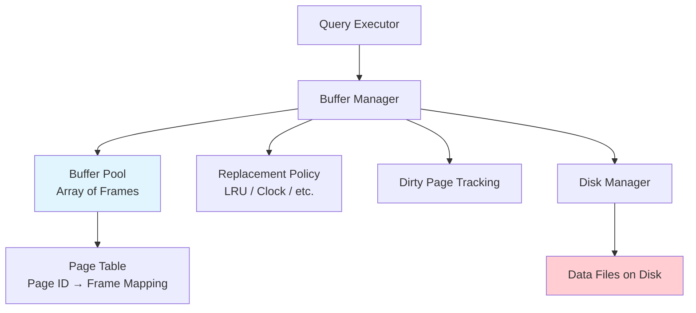
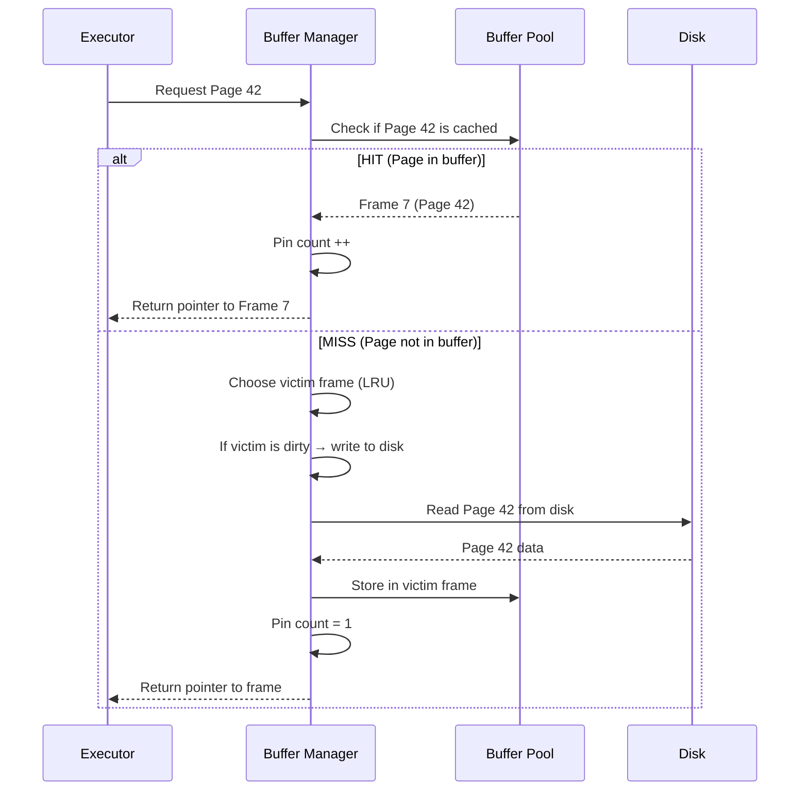
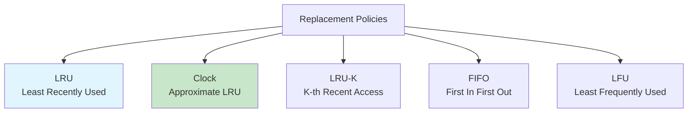
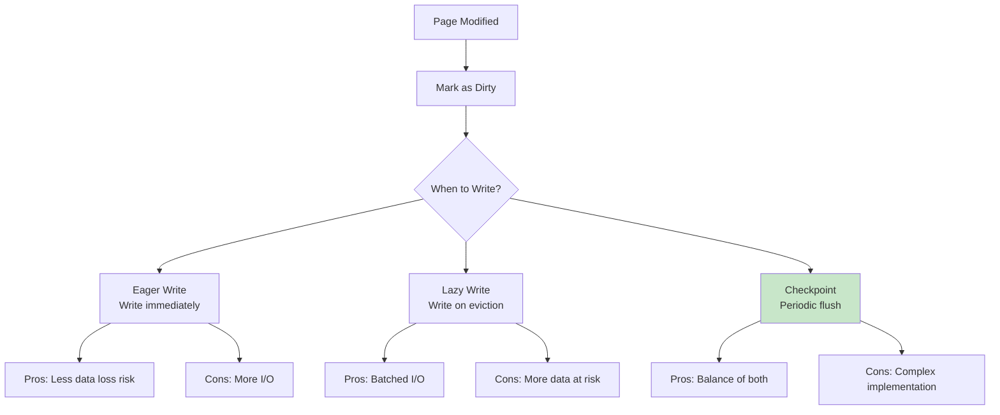
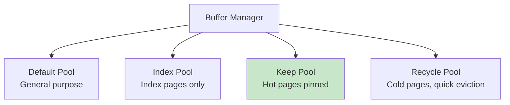

# Buffer Management

## Overview

The Buffer Manager is one of the most critical components of a DBMS. It manages an in-memory cache (the **buffer pool**) of disk pages, minimizing expensive disk I/O. Every database operation — scans, inserts, joins, sorts — goes through the buffer manager. Understanding buffer management is essential for performance tuning and system design interviews.

## Detailed Explanation

### The Buffer Pool Architecture



### Key Concepts

| Concept | Description |
|---------|-------------|
| **Buffer Pool** | Array of memory frames, each holding one disk page |
| **Frame** | A slot in the buffer pool that can hold one page |
| **Page Table** | Hash map from page ID to frame number |
| **Pin Count** | Number of active references to a page |
| **Dirty Bit** | Whether a page has been modified since being read from disk |
| **Replacement Policy** | Algorithm for choosing which frame to evict |

### Page Request Flow



### Pinning and Unpinning

Pages are **pinned** when in use and **unpinned** when the operation is done:

```python
# Pseudocode for page access
def get_page(page_id):
    frame = buffer_pool.lookup(page_id)
    if frame:  # HIT
        frame.pin_count += 1
        return frame
    else:  # MISS
        victim = replacement_policy.choose_victim()
        if victim.is_dirty:
            write_to_disk(victim)
        read_from_disk(page_id, victim)
        victim.page_id = page_id
        victim.pin_count = 1
        victim.is_dirty = False
        return victim

def unpin_page(page_id, is_dirty):
    frame = buffer_pool.lookup(page_id)
    frame.pin_count -= 1
    if is_dirty:
        frame.is_dirty = True
    if frame.pin_count == 0:
        replacement_policy.mark_available(frame)
```

**Key rule:** A page with pin_count > 0 **cannot be evicted**. This prevents replacing a page that's actively being used.

### Replacement Policies



#### LRU (Least Recently Used)

Evict the page that was accessed longest ago.

```
Buffer Pool (4 frames):
Frame 0: Page 1 (accessed at t=1)  ← Victim (oldest access)
Frame 1: Page 3 (accessed at t=3)
Frame 2: Page 2 (accessed at t=5)
Frame 3: Page 5 (accessed at t=7)

Request Page 7 → Evict Frame 0 (Page 1), load Page 7
```

**Problem — Sequential Flooding:**
A sequential scan of a large table evicts ALL other pages, including frequently accessed pages:
```
Scan 1M-row table → loads every page sequentially
LRU evicts all other hot pages
After scan: buffer pool full of pages that won't be accessed again
```

#### Clock Algorithm (Approximate LRU)

Each frame has a **reference bit**. On access, the bit is set to 1. The clock hand sweeps through frames:
- If reference bit = 1 → set to 0, move on
- If reference bit = 0 → evict this frame

```
Clock hand position: Frame 2
Frame 0: [Page 1] ref=1
Frame 1: [Page 3] ref=0  ← Evict this!
Frame 2: [Page 2] ref=1  ← Clock hand
Frame 3: [Page 5] ref=1

Sweep: Frame 2 → ref=1→0, Frame 3 → ref=1→0, Frame 0 → ref=1→0, Frame 1 → ref=0→EVICT
```

**Advantage:** Much cheaper than true LRU (no timestamp tracking), nearly as effective.

#### LRU-K

Tracks the **K-th most recent access time** instead of the most recent. For K=2, evict the page whose second-to-last access was longest ago. This better distinguishes between one-time scans and repeatedly accessed pages.

### Dirty Page Handling

When a page is modified, it's marked **dirty** in the buffer pool. Dirty pages must eventually be written to disk.



**Checkpoint Process:**
1. Pause modifications briefly
2. Flush all dirty pages to disk (or mark them for background flush)
3. Write checkpoint record to WAL
4. Resume operations

### Buffer Pool Tuning

**Key parameters:**

| Parameter | Description | Typical Value |
|-----------|-------------|---------------|
| **pool_size** | Number of frames in buffer pool | 60-80% of RAM |
| **page_size** | Size of each page | 4KB - 16KB |
| **replacement_policy** | LRU, Clock, etc. | Clock (PostgreSQL), LRU (MySQL) |

**PostgreSQL:**
```sql
-- Set buffer pool size (in 8KB pages)
-- shared_buffers has postmaster context — must use ALTER SYSTEM + restart, not SET
ALTER SYSTEM SET shared_buffers = '4GB';  -- 4GB buffer pool (requires restart)

-- Check hit ratio
SELECT 
    sum(heap_blks_hit) / (sum(heap_blks_hit) + sum(heap_blks_read)) as hit_ratio
FROM pg_statio_user_tables;
```

**MySQL:**
```sql
-- Set buffer pool size
SET GLOBAL innodb_buffer_pool_size = 8 * 1024 * 1024 * 1024;  -- 8GB

-- Check hit ratio
SHOW ENGINE INNODB STATUS;  -- Look for "Buffer pool hit rate"
```

### Buffer Pool Hit Ratio

The most important metric for buffer pool effectiveness:

```
Hit Ratio = Buffer Hits / (Buffer Hits + Buffer Misses)

Target: > 99% for OLTP workloads
< 95% → Increase buffer pool size or optimize queries
```

**Example:**
```
Buffer Hits: 999,000
Buffer Misses: 1,000
Hit Ratio: 999,000 / 1,000,000 = 99.9%  ← Excellent
```

### Multiple Buffer Pools

Some databases support separate buffer pools for different purposes:



**Oracle example:**
```sql
ALTER SYSTEM SET db_keep_cache_size = 2G;
ALTER TABLE hot_customers STORAGE (BUFFER_POOL KEEP);
```

### Double Buffering Problem

The OS has its own file cache, creating a double-buffering problem:

```
Disk → OS File Cache → Database Buffer Pool → Query

Page is cached TWICE:
  1. In OS file cache (when file is read)
  2. In DB buffer pool (when DB reads it)
```

**Solutions:**
- **Direct I/O** — Bypass OS cache, read directly into DB buffer pool
- **O_DIRECT flag** — Linux flag for unbuffered file I/O
- Most databases use direct I/O in production

## Interview Questions

### Q1: What is the buffer pool and why is it important?
**Answer:** The buffer pool is an in-memory cache of disk pages. It's important because disk I/O is 10,000-100,000x slower than memory access. By keeping frequently accessed pages in memory, the buffer pool dramatically reduces the number of disk reads needed. A well-sized buffer pool with a >99% hit ratio means most queries never touch disk.

### Q2: What is sequential flooding and how do you mitigate it?
**Answer:** Sequential flooding occurs when a large sequential scan evicts all other pages from the buffer pool using LRU. Since the scan accesses pages in order, LRU always evicts the least recently used page — which happens to be the page that was most recently used by other queries.

**Mitigations:**
1. **LRU-K** — Tracks K-th recent access, so one-time scans don't affect the history
2. **Clock with sweep** — Approximate LRU that's more resistant to scans
3. **Scan-resistant algorithms** — ARC (Adaptive Replacement Cache), 2Q
4. **Separate buffer pools** — Dedicated pool for sequential scans

### Q3: What is the difference between pin count and dirty bit?
**Answer:** 
- **Pin count**: Number of active references to a page. A page with pin_count > 0 cannot be evicted. It's incremented when an operation starts using the page and decremented when done.
- **Dirty bit**: Indicates whether the page has been modified in memory. If set, the page must be written to disk before eviction (or during checkpoint).

A page can be pinned (in use) and dirty (modified) simultaneously. It can only be evicted when pin_count = 0.

### Q4: How does the buffer manager handle a page fault?
**Answer:** When a requested page is not in the buffer pool (cache miss):
1. Choose a victim frame using the replacement policy (e.g., LRU/Clock)
2. If the victim is pinned (pin_count > 0), skip it and choose another
3. If the victim is dirty, write it to disk first
4. Read the requested page from disk into the victim frame
5. Update the page table with the new mapping
6. Set pin_count = 1, dirty = false

### Q5: Why do databases use direct I/O instead of OS file cache?
**Answer:** Without direct I/O, data is cached twice — once in the OS file cache and once in the DB buffer pool. This wastes memory and can cause unpredictable behavior (the OS might evict pages the DB needs). Direct I/O gives the database full control over caching policy, avoiding double buffering and ensuring the buffer pool uses all available memory efficiently.

## Common Mistakes

- ❌ **Setting buffer pool too small** — Leads to high miss ratio and excessive disk I/O
- ❌ **Setting buffer pool too large** — Can cause OS swapping, which is worse than disk I/O
- ❌ **Not monitoring hit ratio** — Always check `>99%` for OLTP workloads
- ❌ **Ignoring sequential flooding** — Large scans can destroy buffer pool effectiveness
- ❌ **Forgetting about dirty pages** — Too many dirty pages at checkpoint causes I/O spikes

## Summary

| Concept | Key Point |
|---------|-----------|
| **Buffer Pool** | In-memory cache of disk pages |
| **Page Table** | Maps page IDs to buffer frames |
| **Pin Count** | Prevents eviction of in-use pages |
| **Dirty Bit** | Tracks modified pages needing disk write |
| **Replacement Policy** | LRU/Clock for choosing eviction victims |
| **Hit Ratio** | Target >99% for OLTP |

The buffer manager is the critical layer between the query executor and disk storage. Proper tuning and understanding of buffer management is essential for database performance.

## Cross-References

- [File Organization](./file-organization.md) — how data is organized on disk
- [Record Formats](./record-formats.md) — how tuples are stored within pages
- [Query Cache](../caching/query-cache.md) — higher-level query result caching
- [WAL](../internals/wal.md) — write-ahead logging and dirty page flushing
- [Cost Estimation](../query-processing/cost-estimation.md) — how buffer hits affect cost estimates
