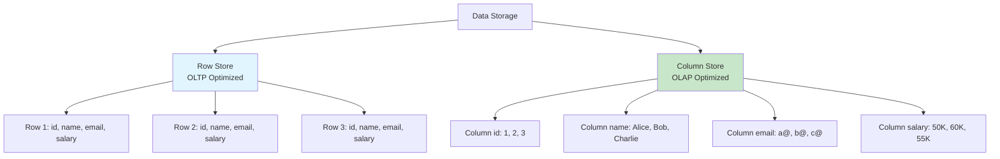
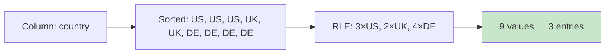
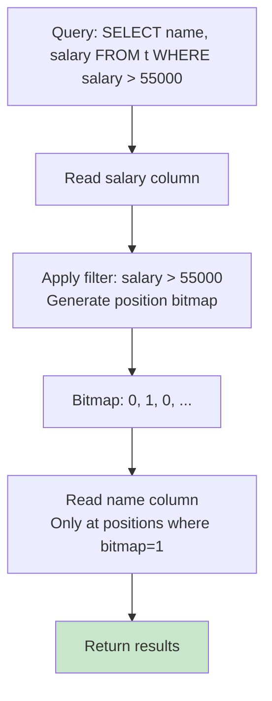
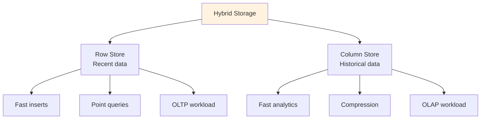

# Column Stores

## Overview

Column-oriented (columnar) storage stores data **column-by-column** rather than row-by-row. This is fundamentally different from traditional row stores and provides massive performance benefits for **analytical (OLAP) queries** that read few columns across many rows. Column stores are the foundation of modern data warehouses (Snowflake, Redshift, ClickHouse, Apache Parquet).

## Detailed Explanation

### Row Store vs. Column Store



### Physical Layout Comparison

**Row Store:**
```
Page 1:
┌────┬───────┬──────────┬─────────┐
│ 1  │ Alice │ a@ex.com │ 50000   │  ← Row 1
├────┼───────┼──────────┼─────────┤
│ 2  │ Bob   │ b@ex.com │ 60000   │  ← Row 2
├────┼───────┼──────────┼─────────┤
│ 3  │ Charlie│ c@ex.com│ 55000   │  ← Row 3
└────┴───────┴──────────┴─────────┘
```

**Column Store:**
```
id Column:      name Column:    email Column:     salary Column:
┌────┐          ┌─────────┐     ┌──────────┐     ┌───────┐
│ 1  │          │ Alice   │     │ a@ex.com │     │ 50000 │
├────┤          ├─────────┤     ├──────────┤     ├───────┤
│ 2  │          │ Bob     │     │ b@ex.com │     │ 60000 │
├────┤          ├─────────┤     ├──────────┤     ├───────┤
│ 3  │          │ Charlie │     │ c@ex.com │     │ 55000 │
└────┘          └─────────┘     └──────────┘     └───────┘
```

### Why Column Stores are Faster for Analytics

**Query:** `SELECT AVG(salary) FROM employees`

**Row Store:**
```
Must read entire rows (all 4 columns) from disk
I/O: Read 4 columns × N rows = 4N data
Only uses 1 column (salary) → 75% wasted I/O
```

**Column Store:**
```
Read only the salary column
I/O: Read 1 column × N rows = N data
4x less I/O than row store!
```

### Compression Benefits

Column stores achieve much better compression because data in a single column has the same type and often similar values:



**Compression Techniques:**

| Technique | How It Works | Best For |
|-----------|-------------|----------|
| **Run-Length Encoding (RLE)** | Store value + count | Sorted columns, low cardinality |
| **Dictionary Encoding** | Map values to small integers | String columns, medium cardinality |
| **Delta Encoding** | Store differences between values | Sorted numeric columns |
| **Bit-Packing** | Use minimum bits per value | Small-range integers |
| **Frame of Reference** | Store base + offsets | Clustered numeric values |

**Dictionary Encoding Example:**
```
Original: ["California", "Texas", "California", "New York", "Texas", "California"]

Dictionary: {0: "California", 1: "Texas", 2: "New York"}

Encoded: [0, 1, 0, 2, 1, 0]  → Each value is just 2 bits!

Storage savings: 10 bytes per string → 2 bits per value
```

### Query Execution in Column Stores



**Vectorized Execution:**
Instead of processing one tuple at a time, column stores process **batches** (vectors) of values:

```python
# Tuple-at-a-time (row store)
for row in table:
    if row.salary > 55000:
        result.append(row.name)

# Vectorized (column store)
salary_batch = read_column_batch("salary", 0, 10000)  # 10K values at once
mask = salary_batch > 55000  # SIMD-optimized comparison
name_batch = read_column_batch("name", 0, 10000)
result = apply_mask(name_batch, mask)  # Filter using bitmask
```

**Benefits of vectorized execution:**
- CPU cache friendly (sequential access)
- SIMD instructions (process 4-8 values at once)
- Reduced function call overhead

### Column Store Indexes

Column stores use specialized indexes:

| Index Type | Description | Use Case |
|------------|-------------|----------|
| **Zone Map** | Min/max per block of rows | Skip blocks during scans |
| **Bitmap Index** | Bit array per distinct value | Low-cardinality columns |
| **Bloom Filter** | Probabilistic set membership | Point queries |

**Zone Maps:**
```
Salary column, divided into blocks of 1000 rows:

Block 0: min=30000, max=52000  → Skip for salary > 55000
Block 1: min=48000, max=71000  → Must scan
Block 2: min=55000, max=89000  → Must scan
Block 3: min=62000, max=95000  → Must scan

Query: WHERE salary > 55000
→ Skip Block 0 entirely (1000 rows without reading them!)
```

### Hybrid Approaches

Some systems combine row and column storage:



**Examples:**
- **Oracle In-Memory**: Dual-format (row + column)
- **SQL Server Columnstore**: Row store for OLTP + columnstore for analytics
- **Hybrid Transactional/Analytical Processing (HTAP)**: TiDB, SingleStore

### Real-World Column Store Systems

| System | Type | Key Feature |
|--------|------|-------------|
| **Apache Parquet** | File format | Industry standard for data lakes |
| **Apache Arrow** | In-memory format | Columnar in-memory for data processing |
| **ClickHouse** | Database | Fastest open-source OLAP |
| **Amazon Redshift** | Data warehouse | Columnar, MPP |
| **Snowflake** | Cloud data warehouse | Auto-scaling, columnar |
| **Google BigQuery** | Serverless DW | Columnar, serverless |
| **Apache Druid** | Real-time analytics | Columnar + inverted index |
| **Cassandra** | NoSQL | Column-family store |

### Row Store vs. Column Store Comparison

| Criterion | Row Store | Column Store |
|-----------|-----------|--------------|
| **OLTP (point queries)** | ⭐ Excellent | ❌ Poor |
| **OLAP (aggregations)** | ❌ Poor | ⭐ Excellent |
| **Compression** | Low | ⭐ High (10-100x) |
| **Insert speed** | ⭐ Fast | ❌ Slower (batch) |
| **Update speed** | ⭐ Fast | ❌ Very slow |
| **Single-row retrieval** | ⭐ Read 1 row | ❌ Read N columns |
| **Column aggregation** | ❌ Read all rows | ⭐ Read 1 column |
| **Best for** | Transactional | Analytical |

## Interview Questions

### Q1: Why are column stores faster for analytical queries?
**Answer:** Three reasons:
1. **I/O efficiency** — Only reads the columns needed, not entire rows. `SELECT AVG(salary)` reads only the salary column.
2. **Compression** — Same-type data compresses 10-100x better, reducing I/O further.
3. **Vectorized processing** — Operations on arrays of same-type values are CPU-cache friendly and enable SIMD instructions.

For a table with 100 columns where a query uses 3, column stores read 3% of the data vs. 100% for row stores.

### Q2: Why are column stores bad for OLTP?
**Answer:** OLTP queries typically read/write entire rows (e.g., `INSERT INTO orders VALUES (1, 'Alice', 100, ...)`). In a column store, this requires writing to 4+ separate column files. Point lookups (`SELECT * WHERE id = 1`) require reading all columns from different locations. The overhead of reconstructing rows from multiple columns makes column stores 5-10x slower for OLTP.

### Q3: What is dictionary encoding and why is it effective?
**Answer:** Dictionary encoding maps repeated values to small integer IDs. For a column with 1 million rows but only 50 distinct values, each value can be stored as a 6-bit integer instead of a variable-length string. This provides:
1. **Compression** — 6 bits vs. potentially hundreds of bits per value
2. **Faster comparisons** — Integer comparison is faster than string comparison
3. **Grouping** — GROUP BY becomes grouping on integer keys

### Q4: What is a zone map and how does it help?
**Answer:** A zone map stores min/max values for each block (typically 1000-10000 rows) of a column. When a query has a range predicate (e.g., `salary > 55000`), the system checks the zone map first. If a block's max is below the threshold, the entire block is skipped without reading it. This can eliminate 90%+ of data for selective queries.

### Q5: What is HTAP and how does it work?
**Answer:** HTAP (Hybrid Transactional/Analytical Processing) systems support both OLTP and OLAP on the same data. Approaches include:
1. **Dual format** — Maintain both row and column copies (Oracle In-Memory)
2. **Delta store** — Row store for recent inserts, periodically merged into columnar storage
3. **Real-time replication** — Row store for OLTP, replicate to column store for OLAP

HTAP eliminates the ETL pipeline between operational and analytical systems.

## Common Mistakes

- ❌ **Using column stores for OLTP** — Point queries and updates are terrible
- ❌ **Assuming column stores are always better for analytics** — For queries touching many columns, row stores may be comparable
- ❌ **Ignoring compression overhead** — Decompression adds CPU cost
- ❌ **Not considering data freshness** — Column stores often batch inserts, causing data lag
- ❌ **Confusing column-family stores (Cassandra) with column stores** — They're different! Cassandra is a wide-column NoSQL store, not a true columnar store.

## Summary

| Aspect | Row Store | Column Store |
|--------|-----------|--------------|
| **Storage unit** | Entire row | Single column |
| **Compression** | 2-3x | 10-100x |
| **OLTP** | ⭐ Fast | ❌ Slow |
| **OLAP** | ❌ Slow | ⭐ Fast |
| **Best for** | Transactional systems | Data warehouses, analytics |

Column stores are the foundation of modern analytics. Understanding the trade-offs between row and column storage is essential for system design interviews.

## Cross-References

- [File Organization](./file-organization.md) — traditional row-oriented storage
- [Record Formats](./record-formats.md) — how rows are stored in row stores
- [Buffer Management](./buffer-management.md) — page-level caching
- [Query Processing](../query-processing/) — how queries execute differently on column stores
- [Redis](../caching/redis.md) — in-memory data structure store
