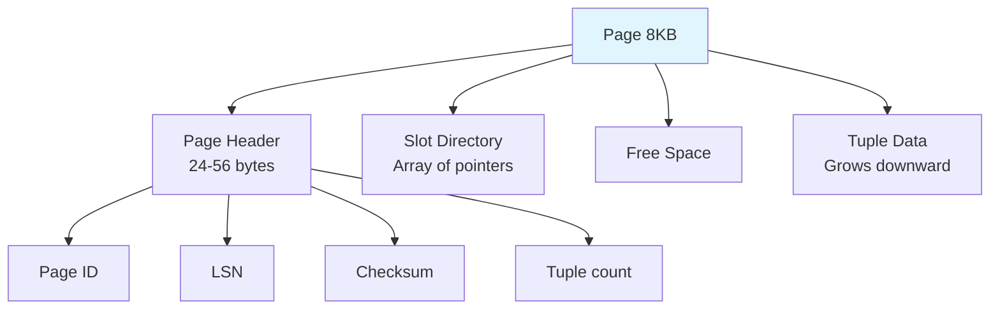
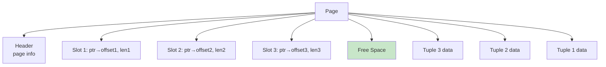
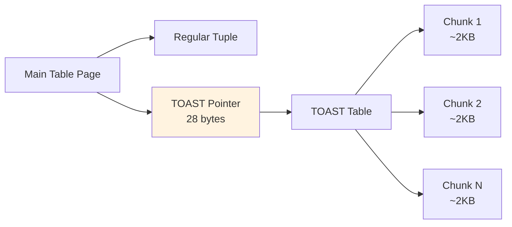

# Record Formats

## Overview

Record Format defines how individual rows (tuples) are stored within a database page. The format must handle fixed-length fields, variable-length fields (VARCHAR, TEXT), NULL values, and updates that change row size. The choice of record format affects storage efficiency, update performance, and scan speed.

## Detailed Explanation

### Page Structure Overview



### Fixed-Length Records

When all columns have fixed sizes (e.g., INT, CHAR(10), DATE), records have uniform length.

```
Table: employees (id INT, name CHAR(10), salary FLOAT)
Record size: 4 + 10 + 8 = 22 bytes

Page with 4-byte header, 10 slots:
┌────────────────────────────────────┐
│ Header (4 bytes)                   │
├────────────────────────────────────┤
│ [id=1][name=Alice  ][salary=50000] │ Record 0 (offset 4)
│ [id=2][name=Bob    ][salary=60000] │ Record 1 (offset 26)
│ [id=3][name=Charlie][salary=55000] │ Record 2 (offset 48)
│ [id=4][name=_______][salary=0    ] │ Record 3 (deleted)
│ ...                                │
└────────────────────────────────────┘
```

**Operations:**
- **Insert**: Find first empty slot, write record
- **Delete**: Mark slot as empty (or shift records)
- **Update**: Write in-place (same size)

**Advantages:** Simple, fast random access (offset = slot × record_size)
**Disadvantages:** Wastes space for short values, can't handle variable-length data

### Variable-Length Records

Real-world data has variable-length fields (VARCHAR, TEXT, BLOB). Two main approaches:

#### Approach 1: Fixed-Size Slots with Offsets

```
Slot Directory (at end of page, grows backward):
┌──────────────────────────────────────────┐
│ Slot 0: offset=100, length=30           │
│ Slot 1: offset=130, length=45           │
│ Slot 2: offset=175, length=20           │
│ Slot 3: offset=0, length=0 (deleted)    │
├──────────────────────────────────────────┤
│ Free space                               │
├──────────────────────────────────────────┤
│ [Record 2 data - 20 bytes]              │
│ [Record 1 data - 45 bytes]              │
│ [Record 0 data - 30 bytes]              │
└──────────────────────────────────────────┘
```

#### Approach 2: Slotted Page Format (PostgreSQL-style)



**Slotted page structure:**
```
┌─────────────────────────────────────┐
│ Header:                             │
│   pd_lsn: LSN of last change       │
│   pd_checksum: Page checksum        │
│   pd_lower: End of slot directory   │
│   pd_upper: Start of tuple data     │
│   pd_special: Special space start   │
├─────────────────────────────────────┤
│ Slot 0: (offset=2040, length=40)   │ ← Grows forward ↓
│ Slot 1: (offset=2000, length=40)   │
│ Slot 2: (offset=1960, length=30)   │
│ Slot 3: (offset=0, length=0) [free]│
├─────────────────────────────────────┤
│ FREE SPACE                          │
├─────────────────────────────────────┤
│ Tuple 2 data (30 bytes)            │ ← Grows upward ↑
│ Tuple 1 data (40 bytes)            │
│ Tuple 0 data (40 bytes)            │
└─────────────────────────────────────┘

pd_lower → end of slots
pd_upper → start of tuples
Free space = pd_upper - pd_lower
```

**Advantages of slotted pages:**
- Records can be moved within the page (compaction) without changing record IDs
- Variable-length records handled efficiently
- No external fragmentation within a page
- Tuple IDs (page, slot) remain stable even after compaction

### Record Header

Each tuple typically has a header before the data:

```
Tuple Header (PostgreSQL: 23 bytes):
┌──────────────────────────────┐
│ t_xmin (4 bytes)             │  Transaction that inserted
│ t_xmax (4 bytes)             │  Transaction that deleted/updated
│ t_cid (4 bytes)              │  Command ID
│ t_ctid (6 bytes)             │  Current tuple ID (page, offset)
│ t_infomask (2 bytes)         │  Status bits (nulls, visibility)
│ t_hoff (1 byte)              │  Header offset to user data
├──────────────────────────────┤
│ NULL bitmap (variable)       │  Bit per column: 1=NULL
├──────────────────────────────┤
│ Column data (variable)       │  Actual values
└──────────────────────────────┘
```

### NULL Representation

NULL values must be stored efficiently since they have no data:

**NULL Bitmap Approach:**
```
Table: (id INT, name VARCHAR, email VARCHAR, phone VARCHAR)
Record: (42, "Alice", NULL, "555-1234")

NULL bitmap: [0, 0, 1, 0]  (email is NULL)
Data: [42][5|"Alice"][skip email]["555-1234"]

Savings: No space allocated for NULL columns
```

### TOAST (The Oversized-Attribute Storage Technique)

PostgreSQL uses TOAST for values that don't fit on a regular page:



**TOAST strategies:**
| Strategy | Description |
|----------|-------------|
| **PLAIN** | No compression, no external storage |
| **EXTENDED** | Compress first, then external if still too big (default) |
| **EXTERNAL** | Store externally, no compression |
| **MAIN** | Compress, store inline if fits |

**Threshold:** Values larger than ~2KB trigger TOAST storage.

### InnoDB Record Format (MySQL)

MySQL InnoDB uses a different approach with **compact** and **redundant** formats:

```
Compact Format:
┌──────────────────────────────┐
│ Variable-length field lengths│  (1-2 bytes per VAR field)
├──────────────────────────────┤
│ NULL bitmap                  │  (1 bit per nullable column)
├──────────────────────────────┤
│ Record header (5 bytes)      │
├──────────────────────────────┤
│ System fields (DB_TRX_ID,    │
│   DB_ROLL_PTR) - 13 bytes   │
├──────────────────────────────┤
│ User column data             │
└──────────────────────────────┘
```

### Record Movement and Pointers

When a record is updated and grows beyond its page, it may need to move:

```
Before update:
  Page 1, Slot 3 → Record (40 bytes)

After update (grows to 60 bytes, doesn't fit):
  Option 1: Move to page with space, leave forwarding pointer
  Option 2: HOT update (Heap Only Tuple) - same page if possible

HOT Update (PostgreSQL):
  Old tuple: [42, "Alice", "alice@old.com"] → marked dead
  New tuple: [42, "Alice", "alice@new-longer-domain.com"] → same page
  Index unchanged (HOT avoids index update)
```

## Interview Questions

### Q1: What is a slotted page and why is it used?
**Answer:** A slotted page has a slot directory at the top (growing forward) and tuple data at the bottom (growing backward), with free space in between. Each slot is a fixed-size entry pointing to a variable-length tuple. This design:
1. Supports variable-length records efficiently
2. Allows tuple compaction without changing tuple IDs (page, slot#)
3. Enables efficient deletion (just mark slot as empty)
4. Is used by PostgreSQL, SQL Server, and many other systems

### Q2: How does PostgreSQL handle updates to variable-length columns?
**Answer:** PostgreSQL uses **MVCC** — an update creates a new tuple version (on the same or different page) and marks the old version as dead. If the new version is too large for the current page, it's placed on a different page. A **HOT (Heap Only Tuple)** update keeps both versions on the same page when possible, avoiding index updates. Dead tuples are eventually cleaned up by **VACUUM**.

### Q3: What is TOAST and when is it used?
**Answer:** TOAST (The Oversized-Attribute Storage Technique) handles values too large for a regular page (~8KB). When a row has a column value exceeding ~2KB, TOAST stores it externally in a separate TOAST table, broken into ~2KB chunks. The main table stores a 28-byte TOAST pointer. TOAST can also compress values. This allows PostgreSQL to handle TEXT/BLOB values of any size while keeping main table pages efficient.

### Q4: Why is a NULL bitmap used instead of storing special NULL values?
**Answer:** A NULL bitmap uses one bit per nullable column, which is extremely compact (8 columns = 1 byte). The alternative — storing a special sentinel value for each type — wastes space and is type-dependent. The bitmap approach:
1. Uses minimal space (1 bit per column)
2. Works for any data type
3. Allows quick NULL checking without parsing column data
4. Is standard across all major databases

### Q5: What happens to tuple pointers when records are moved within a page?
**Answer:** With slotted pages, tuple pointers (page, slot#) remain valid even when the actual data moves. The slot directory entry is updated to point to the new location, but the slot number doesn't change. External references (from indexes) use (page, slot#) and don't need updating. This is a major advantage of the slotted page design.

## Common Mistakes

- ❌ **Assuming fixed-length records** — Real databases use variable-length formats
- ❌ **Ignoring NULL storage overhead** — NULLs have overhead (bitmap) but save data space
- ❌ **Not understanding TOAST** — Large values aren't stored inline
- ❌ **Forgetting about record headers** — Each tuple has 20+ bytes of header overhead
- ❌ **Confusing logical and physical row IDs** — TID (page, slot) can change after updates

## Summary

| Format | Use Case | Example |
|--------|----------|---------|
| **Fixed-length** | Uniform columns (INT, CHAR) | Simple systems |
| **Slotted page** | Variable-length, MVCC | PostgreSQL, SQL Server |
| **Compact format** | Variable-length, clustered | MySQL InnoDB |
| **TOAST** | Oversized values | PostgreSQL TEXT/BLOB |

Record format design balances storage efficiency, update performance, and scan speed. Slotted pages with NULL bitmaps are the dominant approach in modern RDBMS.

## Cross-References

- [File Organization](./file-organization.md) — how pages are organized into files
- [Buffer Management](./buffer-management.md) — how pages are cached in memory
- [Column Stores](./column-stores.md) — alternative column-oriented storage
- [WAL](../internals/wal.md) — how record changes are logged
- [MVCC](../internals/engines.md) — multi-version concurrency control


## Cross References

- [File Organization](../dbms/storage/file-organization.md)
- [File Concepts (OS)](../os/filesystems/file-concepts.md)
- [Column Stores](../dbms/storage/column-stores.md)
