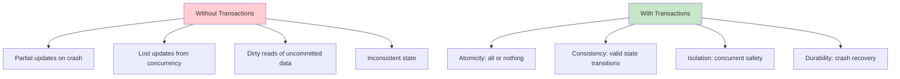
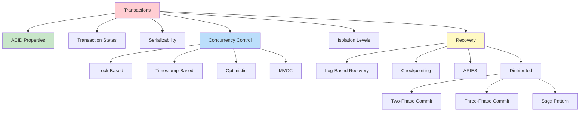

# Transactions and Concurrency Control

## Overview

A **transaction** is a logical unit of work that consists of one or more database operations (reads and writes) that must be executed atomically. Transactions ensure that the database remains in a consistent state even in the presence of failures and concurrent access. The study of transactions covers ACID properties, concurrency control mechanisms, isolation levels, and recovery techniques.

## Why Transactions Matter



## Transaction Example

```sql
-- Bank transfer: debit A, credit B
BEGIN TRANSACTION;

UPDATE Accounts SET balance = balance - 100 WHERE account_id = 'A';
UPDATE Accounts SET balance = balance + 100 WHERE account_id = 'B';

-- Verify no negative balance
SELECT balance FROM Accounts WHERE account_id = 'A';
-- If balance < 0, ROLLBACK

COMMIT;  -- Both updates succeed, or neither does
```

If the system crashes after debiting A but before crediting B, the ROLLBACK restores A's original balance.

## Topics Covered



## Concurrency Problems

When multiple transactions execute simultaneously without proper control:

### 1. Lost Update

```
T1: Read(A) → A=100
T2: Read(A) → A=100
T1: A = A + 10 → Write(A) → A=110
T2: A = A + 20 → Write(A) → A=120
-- T1's update is lost! Should be 130
```

### 2. Dirty Read

```
T1: Write(A) → A=200 (uncommitted)
T2: Read(A) → A=200 (reads uncommitted data)
T1: ROLLBACK → A=100 (original)
-- T2 used invalid data!
```

### 3. Non-Repeatable Read

```
T1: Read(A) → A=100
T2: Write(A) → A=200, COMMIT
T1: Read(A) → A=200 (different from first read!)
```

### 4. Phantom Read

```
T1: SELECT COUNT(*) FROM Orders WHERE status='pending' → 5
T2: INSERT INTO Orders (status) VALUES ('pending'), COMMIT
T1: SELECT COUNT(*) FROM Orders WHERE status='pending' → 6 (phantom!)
```

## Schedules

A **schedule** is a sequence of operations from concurrent transactions that maintains the order within each transaction.

### Serial Schedule
Operations of different transactions don't interleave.
```
T1: R(A) W(A) R(B) W(B) | T2: R(A) W(A) R(B) W(B)
```

### Non-Serial Schedule
Operations interleave.
```
T1: R(A) | T2: R(A) | T1: W(A) | T2: W(A)
```

### Serializable Schedule
A non-serial schedule that produces the same result as some serial schedule.

## Interview Questions

### Beginner

**Q1: What is a transaction?**
A: A transaction is a logical unit of work that consists of one or more database operations. It must be atomic (all-or-nothing), consistent (valid state), isolated (concurrent safety), and durable (survives crashes).

**Q2: What are ACID properties?**
A: **Atomicity**: All operations succeed or all fail. **Consistency**: Database moves from one valid state to another. **Isolation**: Concurrent transactions don't interfere. **Durability**: Committed changes survive crashes.

**Q3: What is a dirty read?**
A: Reading data that has been modified by another transaction but not yet committed. If the modifying transaction rolls back, the read data becomes invalid.

### Intermediate

**Q4: What is the difference between serializability and isolation levels?**
A: Serializability is the strongest correctness guarantee — the schedule is equivalent to some serial execution. Isolation levels (READ UNCOMMITTED, READ COMMITTED, REPEATABLE READ, SERIALIZABLE) are practical implementations that trade some correctness for performance.

**Q5: What is a phantom read?**
A: When a transaction re-executes a query and finds new rows inserted by another committed transaction. Example: first query returns 5 rows, second query returns 6 rows because another transaction inserted a row between the two reads.

### Advanced

**Q6: How do modern databases achieve both consistency and performance?**
A: Through MVCC (Multi-Version Concurrency Control) — readers don't block writers and vice versa. Each transaction sees a consistent snapshot. Combined with optimistic concurrency control for write conflicts, this provides high throughput with strong isolation.

## Cross-References

- [ACID Properties](acid.md)
- [Transaction States](states.md)
- [Serializability](serializability.md)
- [Concurrency Control](concurrency-control.md)
- [Isolation Levels](isolation-levels.md)
- [Recovery](recovery.md)
- [Distributed Transactions](distributed.md)
