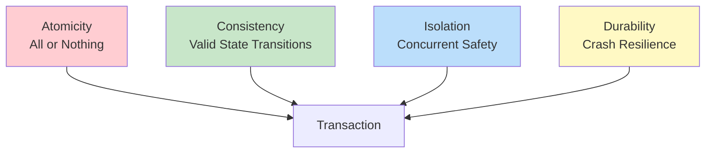
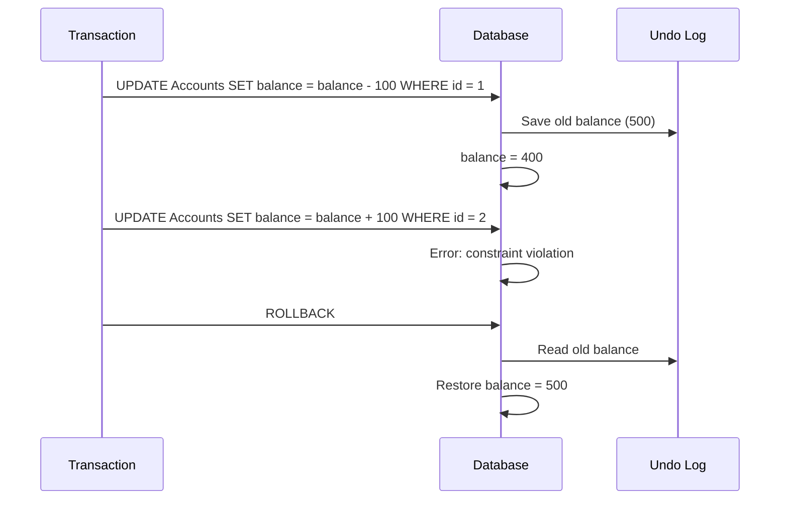
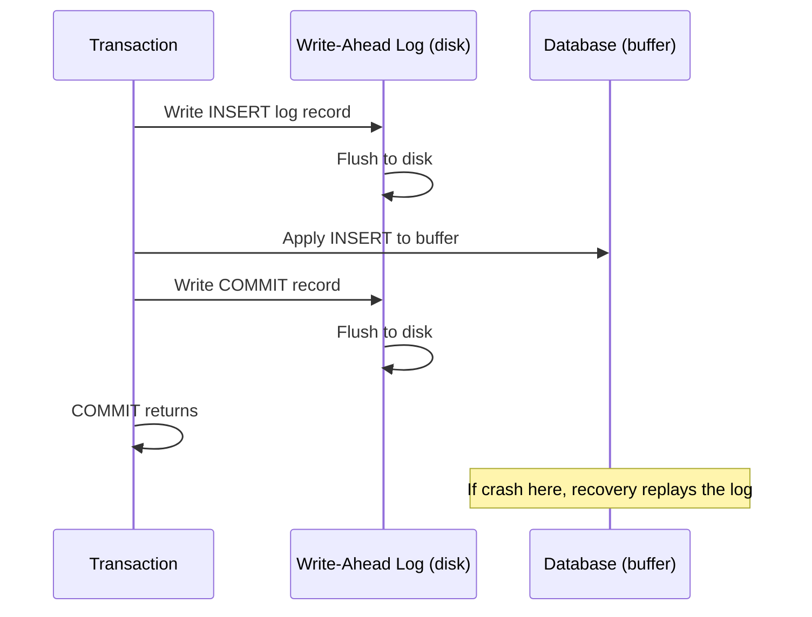
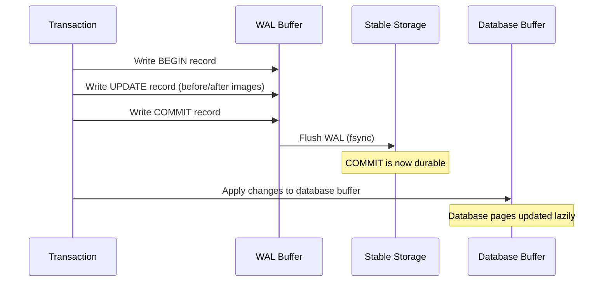
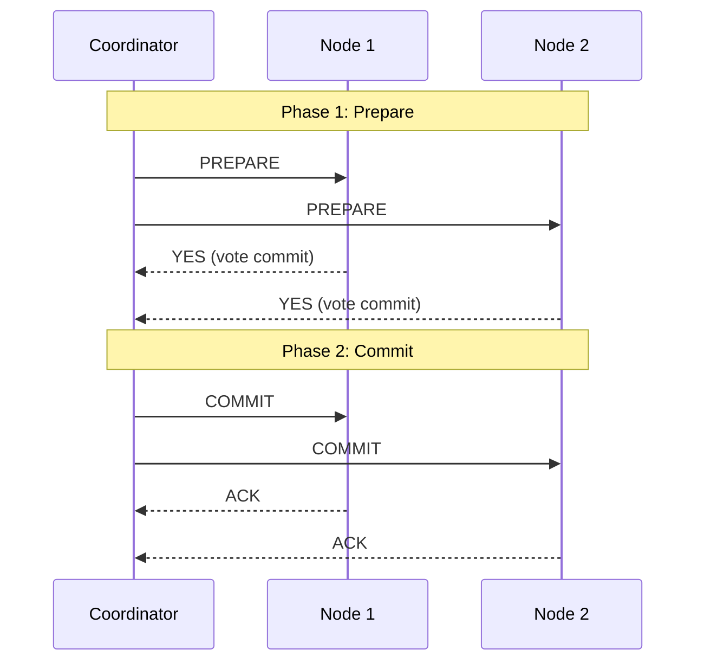

# ACID Properties

## Overview

**ACID** is an acronym for four properties that guarantee reliable processing of database transactions. These properties ensure that the database remains consistent despite errors, crashes, and concurrent access.

## The Four Properties



## Atomicity

**"All or nothing"** — A transaction's operations either all succeed or all fail. If any operation fails, the entire transaction is rolled back.

### Implementation Mechanism
- **Undo logging**: Before modifying data, the original value is written to a log. On rollback, the log is used to restore original values.
- **Shadow paging**: The database maintains a shadow copy of pages. On commit, the shadow is updated; on abort, the shadow is discarded.

### Example

```sql
BEGIN;
UPDATE Accounts SET balance = balance - 100 WHERE id = 1;  -- Succeeds
UPDATE Accounts SET balance = balance + 100 WHERE id = 2;  -- Fails (constraint violation)
ROLLBACK;  -- Both operations rolled back, no money lost
```



## Consistency

**"Valid state transitions"** — A transaction brings the database from one consistent state to another. All constraints (PK, FK, CHECK, triggers) must be satisfied before and after the transaction.

### What Consistency Ensures
- Primary key uniqueness
- Foreign key referential integrity
- CHECK constraints
- Trigger-based invariants
- Application-level business rules (partially)

### Example

```sql
-- Consistency rule: total balance across all accounts must be constant
-- Before: Account A = 500, Account B = 300, Total = 800

BEGIN;
UPDATE Accounts SET balance = balance - 100 WHERE id = 'A';  -- A = 400
UPDATE Accounts SET balance = balance + 100 WHERE id = 'B';  -- B = 400
COMMIT;
-- After: Total = 800 ✅ (consistency maintained)
```

**Note**: Consistency is partially the application's responsibility. The DBMS enforces structural constraints; the application must enforce business rules.

## Isolation

**"Concurrent safety"** — Concurrent transactions appear to execute in isolation. The intermediate state of one transaction is not visible to others.

### Concurrency Problems Prevented

| Problem | Description | Isolation Level Required |
|---|---|---|
| Dirty Read | Read uncommitted data | READ COMMITTED |
| Non-Repeatable Read | Same query, different result | REPEATABLE READ |
| Phantom Read | New rows appear between reads | SERIALIZABLE |
| Lost Update | Concurrent writes overwrite | REPEATABLE READ |

### Implementation Mechanisms
- **Locking**: 2PL (Two-Phase Locking)
- **MVCC**: Multi-Version Concurrency Control
- **Timestamp ordering**: Each transaction gets a timestamp

See: [Isolation Levels](isolation-levels.md), [Concurrency Control](concurrency-control.md)

## Durability

**"Crash resilience"** — Once a transaction is committed, its changes persist even if the system crashes immediately after.

### Implementation Mechanism
- **Write-Ahead Logging (WAL)**: All changes are written to a log on stable storage BEFORE being applied to the database. On crash recovery, the log is replayed.
- **Force-at-commit**: All log records for a transaction are forced to stable storage before COMMIT returns.

### Example

```sql
BEGIN;
INSERT INTO Orders VALUES (1001, 'Alice', 500.00);
COMMIT;
-- At this point, even if the server crashes, the order is guaranteed to exist
-- because the WAL was flushed to disk before COMMIT returned
```



## ACID in Practice

### RDBMS (PostgreSQL, MySQL, Oracle)

Full ACID support with configurable isolation levels. Uses WAL for durability, MVCC for isolation, and strict constraint enforcement for consistency.

### NoSQL (MongoDB, Cassandra, DynamoDB)

- **MongoDB**: ACID for single-document operations. Multi-document transactions available since v4.0 (with performance overhead).
- **Cassandra**: Tunable consistency (eventual, quorum, all). No cross-partition transactions.
- **DynamoDB**: ACID for single-item operations. Transactions for up to 100 items.

### NewSQL (CockroachDB, TiDB, Spanner)

Full ACID across distributed nodes using distributed consensus (Raft, Paxos).

## BASE Model (NoSQL Alternative)

| ACID | BASE |
|---|---|
| **A**tomicity | **B**asically **A**vailable |
| **C**onsistency | **S**oft state |
| **I**solation | **E**ventual consistency |
| **D**urability | — |

BASE sacrifices strong consistency for availability and partition tolerance (CAP theorem trade-off).

## Interview Questions

### Beginner

**Q1: What are ACID properties?**
A: Atomicity (all-or-nothing), Consistency (valid state transitions), Isolation (concurrent safety), Durability (crash resilience). They ensure database transactions are reliable.

**Q2: What is the difference between atomicity and durability?**
A: **Atomicity** ensures a transaction's operations all succeed or all fail — partial updates are rolled back. **Durability** ensures committed changes survive crashes — once committed, data is permanent.

**Q3: How does the database ensure durability?**
A: Through Write-Ahead Logging (WAL). Before any change is applied to the database, it's written to a log on stable storage. On crash recovery, the log is replayed to restore committed transactions.

### Intermediate

**Q4: Can a database be consistent but not durable?**
A: Yes. Consistency ensures valid state transitions during normal operation. Durability ensures those states persist after crashes. An in-memory database without persistence is consistent but not durable.

**Q5: How does PostgreSQL implement ACID?**
A: **Atomicity**: Uses MVCC — uncommitted changes are invisible; ROLLBACK discards the transaction's changes. **Consistency**: Constraint enforcement (PK, FK, CHECK, triggers). **Isolation**: MVCC with snapshot isolation. **Durability**: WAL with fsync before COMMIT.

**Q6: What's the relationship between ACID and CAP theorem?**
A: ACID focuses on single-node transaction guarantees. CAP theorem applies to distributed systems — you can have at most 2 of: Consistency, Availability, Partition tolerance. Traditional RDBMS prioritizes C and A; distributed NoSQL often sacrifices C for A and P.

### Advanced

**Q7: How do distributed databases achieve ACID across nodes?**
A: Distributed ACID requires:
- **Atomicity**: Two-phase commit (2PC) or consensus protocols (Paxos/Raft)
- **Consistency**: Distributed constraint checking, consensus on state
- **Isolation**: Distributed lock management or distributed MVCC
- **Durability**: Replication (synchronous for strong durability, asynchronous for performance)

Examples: Google Spanner uses TrueTime + Paxos; CockroachDB uses Raft + serializable isolation.

**Q8: Design a system that guarantees exactly-once processing for a message queue with database writes.**
A:
```sql
-- Idempotency table
CREATE TABLE ProcessedMessages (
    message_id VARCHAR(255) PRIMARY KEY,
    processed_at TIMESTAMP DEFAULT NOW()
);

-- Transaction with idempotency check
BEGIN;
INSERT INTO ProcessedMessages (message_id) VALUES ('msg-123')
ON CONFLICT (message_id) DO NOTHING;

-- Only process if this is a new message
INSERT INTO Orders (customer_id, amount)
SELECT 'cust-1', 500.00
WHERE EXISTS (SELECT 1 FROM ProcessedMessages WHERE message_id = 'msg-123'
              AND processed_at > NOW() - INTERVAL '5 minutes');
COMMIT;
```

## Deep Dive: Isolation Issues in Practice

### Dirty Read — Full Walkthrough

A dirty read occurs when a transaction reads data that has been modified by another concurrent transaction that has not yet committed. If the writing transaction rolls back, the reading transaction has based decisions on data that never officially existed.

```
T1 (Transfer $100 from A to B):    T2 (Reporting query):
  BEGIN;                              BEGIN;
  UPDATE accounts SET                  SELECT SUM(balance)
    balance = balance - 100            FROM accounts;
  WHERE id = 'A';                      -- Reads: A=400, B=300
  -- A is now 400 (uncommitted)        -- Total = 700 ← DIRTY!
  UPDATE accounts SET                  COMMIT;
    balance = balance + 100
  WHERE id = 'B';
  -- ERROR! Constraint violation
  ROLLBACK;
  -- A back to 500, B stays 300
  -- Total should be 800

  Result: T2 reported total=700, but actual total=800
  T2's decision was based on data that was rolled back.
```

**Prevention:** READ COMMITTED or higher isolation level.

### Non-Repeatable Read — Full Walkthrough

A non-repeatable read occurs when a transaction reads the same row twice and gets different values because another transaction modified and committed changes between the reads.

```
T1 (Balance check):                 T2 (Fee deduction):
  BEGIN;                              BEGIN;
  SELECT balance FROM accounts        UPDATE accounts
  WHERE id = 'A';                     SET balance = balance - 50
  -- Returns: 1000                    WHERE id = 'A';
                                      COMMIT;
  -- T2 committed here
  SELECT balance FROM accounts
  WHERE id = 'A';
  -- Returns: 950 ← Different!
  -- T1 can't trust its own reads
  COMMIT;

  Problem: T1 saw two different values for the same row.
  If T1 was computing a loan eligibility based on balance,
  the result depends on WHICH read you use.
```

**Prevention:** REPEATABLE READ or higher isolation level.

### Phantom Read — Full Walkthrough

A phantom read occurs when a transaction re-executes a query and finds new rows that were inserted (or deleted) by another committed transaction.

```
T1 (Sum report):                    T2 (New order):
  BEGIN;                              BEGIN;
  SELECT COUNT(*), SUM(amount)        INSERT INTO orders
  FROM orders                         (customer_id, amount)
  WHERE status = 'pending';           VALUES ('C1', 500);
  -- Returns: 5 rows, $2000 total    COMMIT;

  -- T2 committed here
  SELECT COUNT(*), SUM(amount)
  FROM orders
  WHERE status = 'pending';
  -- Returns: 6 rows, $2500 total ← Phantom!
  COMMIT;

  Problem: The aggregate result changed mid-transaction.
  If T1 was allocating budget based on pending orders,
  it may have allocated insufficient funds.
```

**Prevention:** SERIALIZABLE isolation level (or SELECT ... FOR UPDATE in some systems).

### Lost Update — Full Walkthrough

A lost update occurs when two transactions read the same data, make modifications based on that read, and one transaction's write overwrites the other's.

```
T1 (Increment counter):             T2 (Increment counter):
  BEGIN;                              BEGIN;
  SELECT counter FROM metrics         SELECT counter FROM metrics
  WHERE name = 'page_views';          WHERE name = 'page_views';
  -- Returns: 100                     -- Returns: 100
  counter = 100 + 1                   counter = 100 + 1
  UPDATE metrics SET counter = 101    UPDATE metrics SET counter = 101
  WHERE name = 'page_views';          WHERE name = 'page_views';
  COMMIT;                             COMMIT;

  Final value: 101 (should be 102)
  One increment was LOST.
```

**Prevention:** REPEATABLE READ (with locking), SELECT ... FOR UPDATE, or optimistic concurrency control.

## Deep Dive: Write-Ahead Logging (WAL)

WAL is the fundamental mechanism that makes both atomicity and durability possible.



**WAL Rules (Write-Ahead Logging Protocol):**
1. **Rule 1:** The log record for a change must be written to stable storage BEFORE the corresponding data page is flushed.
2. **Rule 2:** The commit log record must be written to stable storage BEFORE the COMMIT returns to the caller.
3. **Rule 3:** Before a dirty page is flushed, all log records that affect that page must be flushed.

### ARIES Recovery (Algorithm for Recovery and Isolation Exploiting Semantics)

Modern databases use ARIES for crash recovery:

```
Recovery has three phases:

1. Analysis Phase:
   - Scan WAL from last checkpoint
   - Determine which transactions were active at crash
   - Identify dirty pages in the buffer pool

2. Redo Phase:
   - Replay ALL log records (committed AND uncommitted)
   - Restore database to exact state at crash
   - Idempotent: replaying twice has same effect

3. Undo Phase:
   - Roll back all transactions that were active at crash
   - Process undo records in reverse order
   - Write compensation log records (CLRs)
```

## Deep Dive: Distributed ACID

### Two-Phase Commit (2PC)



**2PC Problem — Blocking:**
```
If coordinator crashes after PREPARE:
  - Nodes voted YES and are in "prepared" state
  - They CANNOT commit (no decision received)
  - They CANNOT abort (might violate atomicity)
  - They must BLOCK until coordinator recovers
  - This can last for hours!
```

**Solution: 3PC (Three-Phase Commit)** adds a pre-commit phase, but it's rarely used due to network partition issues. Modern systems use Paxos/Raft instead.

### Distributed ACID in Practice

| System | Atomicity | Consistency | Isolation | Durability |
|--------|-----------|-------------|-----------|------------|
| **CockroachDB** | Raft groups | Serializable | MVCC + SSI | Raft replication |
| **TiDB** | Per-region Raft | Snapshot Isolation | MVCC | Raft replication |
| **Spanner** | 2PC + Paxos | External consistency | MVCC + TrueTime | Paxos replication |
| **YugabyteDB** | Raft groups | Serializable | MVCC | Raft replication |

## Common Mistakes

- Assuming consistency is fully handled by the DBMS (application must enforce business rules)
- Not understanding that isolation levels trade correctness for performance
- Confusing atomicity with durability
- Not using transactions for multi-statement operations
- Committing too frequently (transaction overhead) or too infrequently (holding locks too long)
- Assuming 2PC provides the same guarantees as consensus (2PC is blocking, consensus is not)
- Forgetting that "ACID" means different things in different databases (e.g., MongoDB's single-document vs multi-document ACID)

## Summary

| Property | Guarantee | Mechanism |
|---|---|---|
| Atomicity | All or nothing | Undo log, shadow paging |
| Consistency | Valid state transitions | Constraints, triggers |
| Isolation | Concurrent safety | Locking, MVCC, timestamps |
| Durability | Crash resilience | WAL, force-at-commit |

## Cross-References

- [Transaction States](states.md) — Transaction lifecycle
- [Isolation Levels](isolation-levels.md) — Isolation trade-offs
- [Concurrency Control](concurrency-control.md) — Implementing isolation
- [Recovery](recovery.md) — Implementing durability
- [Serializability](serializability.md) — Strongest isolation guarantee
