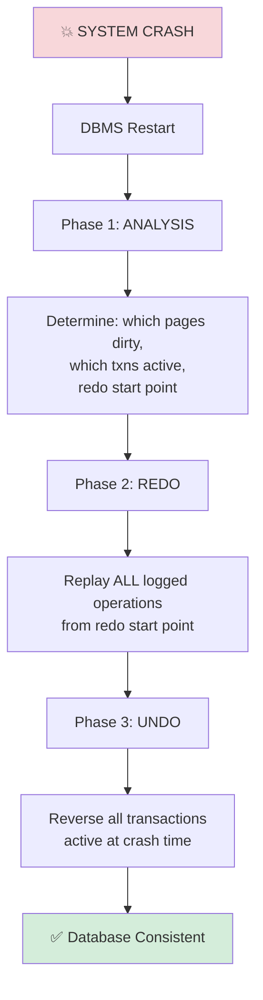
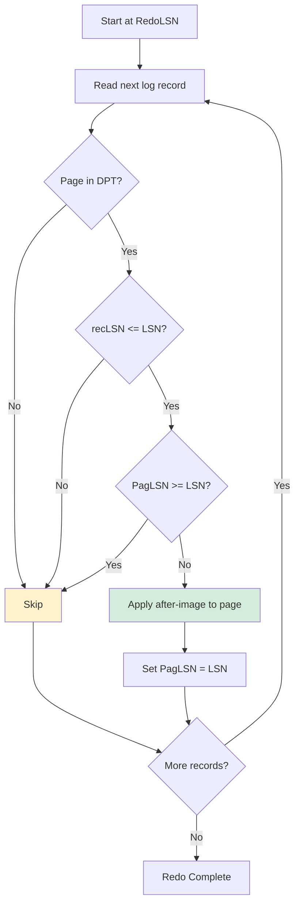
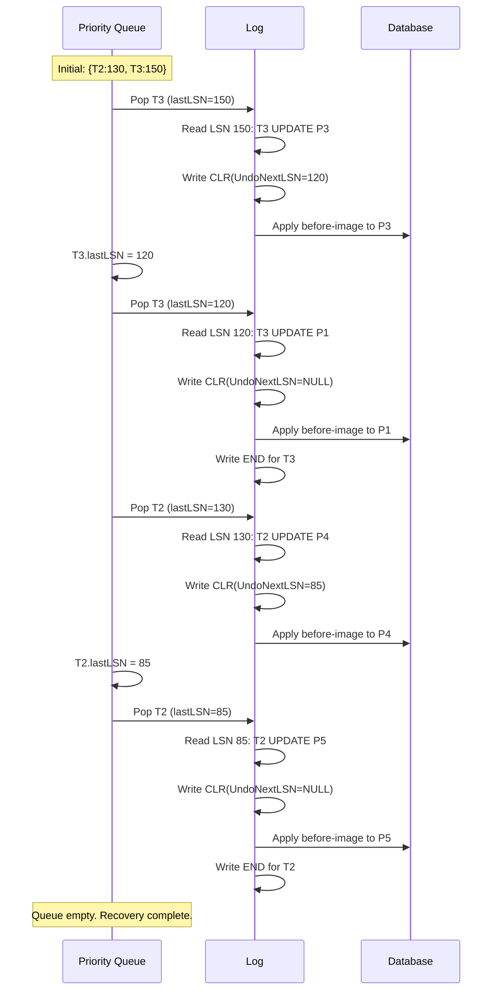

# ARIES Recovery Algorithm

## Overview

ARIES (Algorithm for Recovery and Isolation Exploiting Semantics) is the **de facto standard** recovery algorithm used by most modern databases including IBM DB2, PostgreSQL, MySQL InnoDB, Oracle, and SQL Server. Developed by C. Mohan et al. at IBM Research in 1992.

ARIES combines three key principles:
1. **Write-Ahead Logging (WAL)**: Log before data
2. **Repeating History**: During redo, replay all operations to reconstruct the exact crash state
3. **Logging Changes During Undo**: Record undo operations (CLRs) for idempotent recovery

## The Three Phases of ARIES



## Phase 1: Analysis

### Purpose

The analysis phase scans the log **forward** from the last checkpoint to determine:
1. Which transactions were active at crash time (need undo)
2. Which pages were dirty at crash time (need redo)
3. The starting point for the redo phase

### Algorithm

```
Input: Last checkpoint record in log
Output: DirtyPageTable, TransactionTable, RedoLSN

1. Start from last checkpoint
   - Initialize DirtyPageTable from checkpoint's DPT
   - Initialize TransactionTable from checkpoint's ATT

2. Scan log forward to end of log:
   
   For each log record:
     UPDATE(P):
       Add P to DirtyPageTable if not present
         recLSN(P) = min(recLSN(P), LSN)
       Update TransactionTable:
         lastLSN(T) = LSN
         status(T) = ACTIVE
     
     COMMIT(T):
       Remove T from TransactionTable
     
     ABORT(T):
       Set status(T) = ABORTED
       Update lastLSN(T) = LSN
     
     END(T):
       Remove T from TransactionTable
     
     CLR(T):
       Update TransactionTable:
         lastLSN(T) = LSN

3. RedoLSN = min(recLSN) over all pages in DirtyPageTable
   If DirtyPageTable is empty, RedoLSN = end of log
```

### Example

```
Checkpoint at LSN 100:
  DPT: {P1: recLSN=80, P3: recLSN=90}
  ATT: {T1: lastLSN=95, T2: lastLSN=85}

Log after checkpoint:
  LSN 110: <T1, UPDATE, P2, ...>
  LSN 120: <T3, UPDATE, P1, ...>
  LSN 130: <T2, UPDATE, P4, ...>
  LSN 140: <T1, COMMIT>
  LSN 150: <T3, UPDATE, P3, ...>
  >>> CRASH <<<
  
Analysis result:
  DirtyPageTable: {P1:80, P3:90, P2:110, P4:130}
  TransactionTable: {T2: lastLSN=130, T3: lastLSN=150}
  RedoLSN = min(80, 90, 110, 130) = 80
```

## Phase 2: Redo

### Purpose

The redo phase **repeats history** — it replays all logged operations from RedoLSN forward, regardless of whether the transaction committed. This reconstructs the exact state at the moment of the crash.

### Why Redo ALL (Not Just Committed)?

ARIES replays **everything** because:
- It reconstructs the **exact crash state**, including uncommitted changes
- This is simpler than selectively redoing only committed transactions
- The undo phase will clean up uncommitted changes afterward

### Algorithm

```
For each log record LSN from RedoLSN to end of log:
  
  Skip if:
    - Page P not in DirtyPageTable
    - Page P's recLSN > LSN (page was dirtied after this record)
    - Page P is in DirtyPageTable AND page_P.PagLSN >= LSN
      (page already has this change applied)
  
  Otherwise:
    Apply after-image to page P
    Set page_P.PagLSN = LSN
```

### Redo Check Details

```
For each UPDATE log record (LSN, P, afterImg):
  
  1. Is P in DirtyPageTable?
     No → Skip (page not dirty at crash)
  
  2. Is recLSN(P) <= LSN?
     No → Skip (page was dirtied after this record)
  
  3. Is page_P.PagLSN >= LSN?
     Yes → Skip (page already has this update)
     No → APPLY after-image, set PagLSN = LSN
```

### Mermaid Diagram: Redo Phase



## Phase 3: Undo

### Purpose

The undo phase **rolls back** all transactions that were active at crash time (in the TransactionTable after analysis).

### Algorithm

```
1. Collect all transactions from TransactionTable
2. Build a priority queue ordered by lastLSN (highest first)

3. While priority queue is not empty:
   a. Pop transaction T with highest lastLSN
   b. Process log record at lastLSN(T):
      
      If UPDATE:
        - Write CLR with:
            UndoNextLSN = PrevLSN of the record being undone
        - Apply before-image to page
        - Update lastLSN(T) = CLR's LSN
      
      If CLR:
        - Update lastLSN(T) = UndoNextLSN
      
      If ABORT:
        - Write END record for T
        - Remove T from queue
      
      If PrevLSN is NULL:
        - Write ABORT record for T (if not already)
        - Write END record for T
        - Remove T from queue
   
   d. If lastLSN(T) is not NULL, re-insert T into queue
      Else, write END record and remove T
```

### Why Process by Highest LSN?

Processing the transaction with the highest LSN first ensures that the most recent changes are undone first. This is important for correctness — if multiple transactions modified the same page, undoing in reverse order maintains consistency.

### Compensation Log Records (CLRs)

CLRs are the key innovation of ARIES. When undoing an update, ARIES writes a CLR that records:
- What was undone
- The next record to undo (UndoNextLSN)

CLRs are **never undone** — they are redo-only. If a crash occurs during undo, the CLR tells recovery what was already undone.

```
CLR = {
    LSN: 1200
    TxnID: T2
    Type: CLR
    PageID: P3
    UndoNextLSN: 800  // Next record to undo for T2
    After-Image: restored_value  // What we restored
}
```

### Mermaid Diagram: Undo Phase



## Complete ARIES Example

### Execution and Crash

```
Initial state: P1=100, P2=200, P3=300

Checkpoint at LSN 100:
  DPT: {P1: recLSN=100}
  ATT: {T1: lastLSN=100}

Log after checkpoint:
  LSN 100: <T1, UPDATE, P1, Before=100, After=150>
  LSN 110: <T2, UPDATE, P2, Before=200, After=250>
  LSN 120: <T1, UPDATE, P3, Before=300, After=350>
  LSN 130: <T2, UPDATE, P1, Before=150, After=175>
  LSN 140: <T1, COMMIT>
  >>> CRASH <<<
```

### Phase 1: Analysis

```
Start from checkpoint at LSN 100:
  Initial DPT: {P1:100}
  Initial ATT: {T1: lastLSN=100}

Scan forward:
  LSN 100: T1 UPDATE P1 → DPT={P1:100}, ATT={T1:100}
  LSN 110: T2 UPDATE P2 → DPT={P1:100, P2:110}, ATT={T1:100, T2:110}
  LSN 120: T1 UPDATE P3 → DPT={P1:100, P2:110, P3:120}, ATT={T1:120, T2:110}
  LSN 130: T2 UPDATE P1 → DPT={P1:100, P2:110, P3:120}, ATT={T1:120, T2:130}
  LSN 140: T1 COMMIT → ATT={T2:130}

Result:
  DirtyPageTable: {P1:100, P2:110, P3:120}
  TransactionTable: {T2: lastLSN=130}
  RedoLSN = min(100, 110, 120) = 100
```

### Phase 2: Redo

```
Scan from LSN 100 to end of log:

LSN 100: T1 UPDATE P1
  P1 in DPT? Yes. recLSN(100) <= 100? Yes. PagLSN(P1) < 100? Yes.
  → REDO: Apply P1=150, PagLSN(P1)=100

LSN 110: T2 UPDATE P2
  P2 in DPT? Yes. recLSN(110) <= 110? Yes. PagLSN(P2) < 110? Yes.
  → REDO: Apply P2=250, PagLSN(P2)=110

LSN 120: T1 UPDATE P3
  P3 in DPT? Yes. recLSN(120) <= 120? Yes. PagLSN(P3) < 120? Yes.
  → REDO: Apply P3=350, PagLSN(P3)=120

LSN 130: T2 UPDATE P1
  P1 in DPT? Yes. recLSN(100) <= 130? Yes. PagLSN(P1)=100 < 130? Yes.
  → REDO: Apply P1=175, PagLSN(P1)=130

Redo complete. Database state: P1=175, P2=250, P3=350
```

### Phase 3: Undo

```
Active transactions: {T2: lastLSN=130}

Process T2 at LSN 130 (UPDATE P1, Before=150):
  Write CLR: <T2, CLR, Page=P1, UndoNextLSN=110>
  Apply before-image: P1 = 150
  T2.lastLSN = 110

Process T2 at LSN 110 (UPDATE P2, Before=200):
  Write CLR: <T2, CLR, Page=P2, UndoNextLSN=NULL>
  Apply before-image: P2 = 200
  T2.lastLSN = NULL

Write <T2, ABORT>
Write <T2, END>

Final state: P1=150, P2=200, P3=350
(T1's changes preserved, T2's changes undone)
```

## ARIES and Concurrency

ARIES works with concurrent transactions because:

1. **Logging is per-transaction**: Each transaction has its own log chain (PrevLSN)
2. **Redo replays everything**: Order doesn't matter for redo — it reconstructs the crash state
3. **Undo processes highest LSN first**: Ensures correct ordering of undos
4. **CLRs are idempotent**: If crash during undo, CLRs prevent double-undo

## Interview Questions

### Beginner

**Q1: What are the three phases of ARIES?**
A: (1) Analysis — scan log to determine active transactions, dirty pages, and redo start point. (2) Redo — replay all logged operations from redo start point. (3) Undo — reverse all uncommitted transactions.

**Q2: Why does ARIES redo ALL operations, not just committed ones?**
A: To reconstruct the exact state at crash time. This is simpler and more robust than selectively redoing. The undo phase handles uncommitted changes.

**Q3: What is a CLR in ARIES?**
A: A Compensation Log Record records an undo operation. It has an UndoNextLSN pointing to the next record to undo. CLRs are never themselves undone (redo-only), ensuring idempotent recovery.

### Intermediate

**Q4: What is the purpose of the analysis phase?**
A: Analysis determines: (1) Which transactions need undo (active at crash), (2) Which pages might need redo (dirty at crash), (3) Where to start the redo scan (minimum recLSN). This bounds the work for redo and undo phases.

**Q5: How does ARIES ensure idempotent recovery?**
A: Through CLRs. If a crash occurs during undo, the CLR records what was undone. On re-recovery, the CLR tells us to skip that undo. Without CLRs, undoing the same operation twice could corrupt data.

**Q6: What is the role of PagLSN in the redo phase?**
A: PagLSN records the LSN of the last update applied to a page. During redo, if PagLSN >= LSN of a log record, that change is already on disk and can be skipped. This ensures idempotent redo.

### Advanced / FAANG-Level

**Q7: How would you optimize ARIES for a system with very large buffer pools (e.g., 1TB buffer pool)?**
A: (1) The Dirty Page Table can become very large — use a hash table for O(1) lookup. (2) Checkpoint more frequently to keep DPT small. (3) Use physiological redo (log page-level operations, not byte-level) to reduce log size. (4) Implement parallel redo — partition dirty pages among multiple redo threads. (5) Use fuzzy checkpointing to avoid pausing for checkpoint. (6) Consider logical undo for complex operations (e.g., B-tree page splits).

**Q8: Explain the difference between physical redo and physiological redo in ARIES.**
A: Physical redo applies exact byte-level changes (before/after images of page regions). Physiological redo applies logical operations at a higher level (e.g., "insert key K at position P on page X"). Physiological redo is more compact and can handle structural changes (like page splits) more efficiently. ARIES typically uses physiological redo.

**Q9: A system using ARIES crashes during the undo phase. Explain what happens during recovery.**
A: (1) Analysis phase runs again — finds transactions still active (partially undone). (2) Redo phase replays everything from RedoLSN, including CLRs from the previous undo attempt. This is safe because CLRs are idempotent. (3) Undo phase resumes from where it left off. The UndoNextLSN in CLRs tells recovery exactly where to continue undoing. This is the key insight of ARIES — CLRs make undo crash-safe.

**Q10: How does ARIES handle logical operations like B-tree page splits that can't be undone by simply applying a before-image?**
A: ARIES uses **logical undo** for such operations. Instead of logging a before-image, it logs the logical operation (e.g., "delete key K from B-tree"). During undo, it performs the logical inverse (e.g., "delete key K" even if it's now on a different page due to splits). This requires the operation to be repeatable and idempotent. A CLR with the logical undo information is written, and the UndoNextLSN skips past the entire logical operation.

## Common Mistakes

1. **Confusing redo and undo order** — Redo scans forward (oldest to newest); undo processes highest LSN first (newest to oldest).

2. **Not understanding "repeating history"** — ARIES redoes ALL operations, including those of uncommitted transactions. This is intentional, not a bug.

3. **Forgetting CLRs during undo** — Without CLRs, a crash during undo would require re-undoing everything, potentially corrupting data.

4. **Misunderstanding PagLSN check** — The `PagLSN >= LSN` check in redo is for idempotency. If the page already has the change, don't apply it again.

5. **Not handling checkpoint end records** — If using fuzzy checkpoints, the analysis phase must handle both checkpoint begin and end records correctly.

## Summary

| Phase | Direction | Purpose | Key Data Structure |
|---|---|---|---|
| Analysis | Forward | Determine active txns, dirty pages, redo start | DPT, ATT |
| Redo | Forward | Reconstruct crash state | DPT, PagLSN |
| Undo | Backward | Reverse uncommitted transactions | Priority Queue, CLRs |

| Key Concept | Detail |
|---|---|
| WAL | Log before data |
| Repeating History | Redo everything to reach crash state |
| CLRs | Record undo ops; never undone |
| PagLSN | Per-page LSN for idempotent redo |
| recLSN | Oldest log record that dirtied a page |

## Cross-References

- [Transaction Recovery](./recovery.md) — Recovery fundamentals
- [Log-based Recovery](./log-recovery.md) — WAL and log record details
- [Checkpointing](./checkpointing.md) — How ARIES uses checkpoints
- [MVCC](./mvcc.md) — How ARIES interacts with MVCC
- [B+ Tree Index](../indexing/b-plus-tree.md) — Index recovery with ARIES


## Cross References

- [WAL](../dbms/internals/wal.md)
- [Recovery](../dbms/transactions/recovery.md)
- [Checkpointing](../dbms/transactions/checkpointing.md)
- [Buffer Pool](../dbms/caching/buffer-pool.md)
