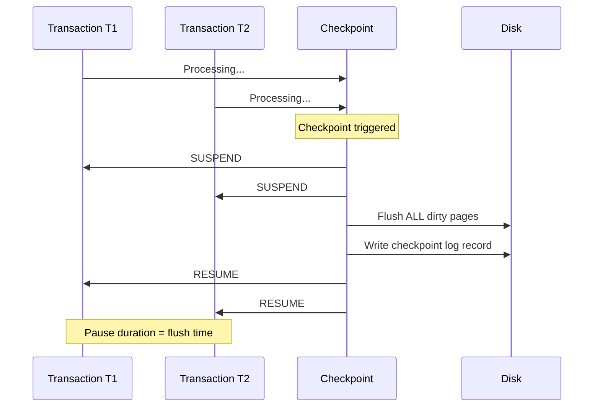
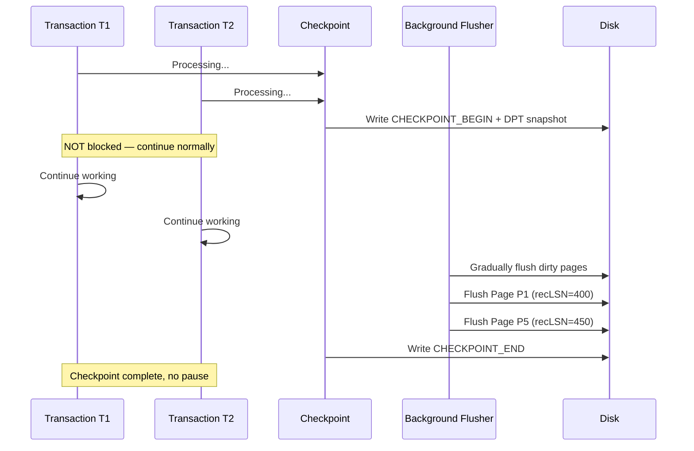
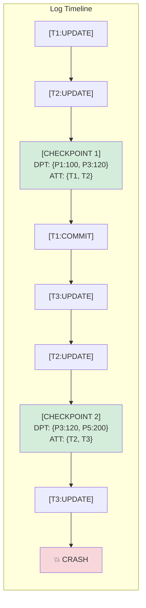

# Checkpointing

## Overview

Checkpointing is a mechanism that **limits the amount of work** the recovery process must do after a crash. Without checkpoints, recovery would need to scan the entire log from the beginning. Checkpoints periodically record the database state, allowing recovery to start from the most recent checkpoint rather than the beginning of time.

## Why Checkpoints are Needed

```
Without checkpoints:
  Log: [T1 op] [T2 op] [T3 op] ... [T1 op] ... [T1000 op] ... [CRASH]
  Recovery: Scan ENTIRE log from beginning → O(n) where n = total operations ever

With checkpoints (every 1000 ops):
  Log: [checkpoint_1] ... [checkpoint_2] ... [checkpoint_3] ... [CRASH]
  Recovery: Scan from checkpoint_3 → O(1000) operations
```

## What a Checkpoint Records

A checkpoint captures:

1. **Active Transaction Table (ATT)**: List of transactions that were active at checkpoint time
2. **Dirty Page Table (DPT)**: List of buffer pool pages that were dirty at checkpoint time, with their `recLSN`

```
Checkpoint Record = {
    ActiveTransactions: [
        {TxnID: T1, lastLSN: 500, status: ACTIVE},
        {TxnID: T3, lastLSN: 480, status: ACTIVE}
    ],
    DirtyPages: [
        {PageID: P1, recLSN: 400},
        {PageID: P5, recLSN: 450}
    ]
}
```

## Sharp Checkpoints

### How Sharp Checkpoints Work

A sharp checkpoint **freezes** the entire system, writes the checkpoint, then resumes.

```
1. SUSPEND all transactions
2. Flush ALL dirty pages to disk
3. Write checkpoint record to log
4. RESUME transactions
```

### Mermaid Diagram: Sharp Checkpoint



### Advantages and Disadvantages

| Aspect | Detail |
|---|---|
| Simplicity | Very simple to implement |
| Recovery | Only need to scan from last checkpoint |
| **Pause duration** | **Long** — must flush all dirty pages |
| **Throughput impact** | **Severe** — all transactions blocked during flush |

### When to Use

- Small databases with few dirty pages
- Systems that can tolerate periodic pauses
- Embedded databases (SQLite uses sharp checkpoints)

## Fuzzy Checkpoints

### How Fuzzy Checkpoints Work

A fuzzy checkpoint **doesn't freeze the system**. Instead, it:
1. Records the current Dirty Page Table and Active Transaction Table
2. Writes a checkpoint begin record
3. Flushes dirty pages **gradually** in the background
4. Writes a checkpoint end record

Transactions continue executing during the checkpoint.

```
1. Write CHECKPOINT_BEGIN record (with DPT snapshot)
2. Continue normal processing (transactions not blocked)
3. Gradually flush dirty pages whose recLSN < checkpoint's snapshot point
4. Write CHECKPOINT_END record
```

### Mermaid Diagram: Fuzzy Checkpoint



### Advantages and Disadvantages

| Aspect | Detail |
|---|---|
| **Pause duration** | **Minimal** — only writing checkpoint records |
| **Throughput impact** | **Low** — transactions not blocked |
| Complexity | More complex to implement |
| Recovery | Must scan from checkpoint begin, redo/undo appropriately |

### Fuzzy Checkpoint Recovery

After a crash during a fuzzy checkpoint:
- Some dirty pages from the checkpoint may not have been flushed
- Recovery starts from the **begin** of the last completed checkpoint
- Uses the DPT to determine which pages need redo

```
Recovery with fuzzy checkpoint:
1. Find last completed CHECKPOINT_END in log
2. Read DPT from CHECKPOINT_BEGIN
3. RedoScanStart = min(recLSN) in DPT
4. Proceed with standard ARIES recovery
```

## Checkpoint Frequency

### Trade-off

```
Frequent checkpoints:
  ✓ Shorter recovery time (less log to scan)
  ✗ Higher overhead during normal operation (more I/O)

Infrequent checkpoints:
  ✓ Less overhead during normal operation
  ✗ Longer recovery time (more log to scan)
```

### Tuning Parameters

```sql
-- PostgreSQL: checkpoint settings
checkpoint_timeout = 5min          -- Maximum time between checkpoints
max_wal_size = 1GB                 -- Force checkpoint if WAL exceeds this
checkpoint_completion_target = 0.9 -- Spread flush over this fraction of interval

-- MySQL InnoDB: checkpoint settings
innodb_log_file_size = 48MB        -- Larger log = less frequent checkpoints
innodb_flush_log_at_trx_commit = 1 -- Force log flush at commit
```

### Automatic Checkpoint Triggers

Most databases trigger checkpoints when:
1. **Time-based**: `checkpoint_timeout` interval elapsed
2. **Size-based**: WAL exceeds `max_wal_size`
3. **Transaction-based**: After N transactions
4. **Manual**: `CHECKPOINT` command

## Mermaid Diagram: Checkpoint Placement in Log



Recovery starts from CP2:
- RedoScanStart = min(recLSN in CP2's DPT) = 120
- Scan log from LSN 120 to end
- Undo T2 and T3 (active at crash, no commit record)

## Non-Quiescent Checkpoints

A **quiescent checkpoint** waits for all active transactions to complete before taking the checkpoint. This ensures a clean snapshot but can cause long delays.

A **non-quiescent checkpoint** (fuzzy checkpoint) takes the checkpoint while transactions are active, using the DPT and ATT to track the state.

## Interview Questions

### Beginner

**Q1: What is the purpose of checkpointing?**
A: Checkpointing limits the amount of log that recovery must scan after a crash. It periodically records the database state, so recovery starts from the most recent checkpoint instead of the beginning of the log.

**Q2: What is the difference between sharp and fuzzy checkpoints?**
A: Sharp checkpoints freeze all transactions, flush all dirty pages, then resume. Fuzzy checkpoints record the state without freezing transactions, flushing dirty pages gradually in the background. Fuzzy checkpoints are used in production systems.

**Q3: What information does a checkpoint record contain?**
A: The Dirty Page Table (which pages are dirty with their recLSN) and the Active Transaction Table (which transactions are active with their lastLSN).

### Intermediate

**Q4: How does checkpoint frequency affect recovery time?**
A: More frequent checkpoints mean less log to scan during recovery (shorter recovery time) but more overhead during normal operation. Less frequent checkpoints reduce normal overhead but increase recovery time.

**Q5: What is recLSN and why is it important?**
A: recLSN is the LSN of the first log record that dirtied a page. During recovery redo, we only need to process log records from the minimum recLSN forward — anything before that is guaranteed to be on disk.

**Q6: How do automatic checkpoints work in PostgreSQL?**
A: PostgreSQL triggers checkpoints based on `checkpoint_timeout` (default 5min) and `max_wal_size` (default 1GB). The background checkpointer gradually flushes dirty pages during the checkpoint interval, using `checkpoint_completion_target` to spread the I/O load.

### Advanced / FAANG-Level

**Q7: Design a checkpoint strategy for a database with 1TB of data and 10GB of buffer pool.**
A: Use fuzzy checkpoints with adaptive frequency. (1) Base interval: checkpoint every 5 minutes or when WAL exceeds 2GB. (2) During checkpoint, flush dirty pages using SCAN-based approach (flush pages with oldest recLSN first). (3) Use `checkpoint_completion_target=0.9` to spread flush over 90% of the interval. (4) Monitor checkpoint write rate — if it exceeds disk throughput, increase interval. (5) Consider parallel checkpoint flushing (multiple I/O threads). (6) Use direct I/O to avoid double-buffering.

**Q8: What happens if the system crashes during a fuzzy checkpoint?**
A: Recovery works correctly because: (1) The checkpoint begin record contains the DPT snapshot, which is written before any page flushes begin. (2) If crash happens before checkpoint end, recovery uses the previous completed checkpoint. (3) If crash happens after checkpoint begin but before end, the DPT from checkpoint begin is valid — it's a conservative set (may include pages already flushed, but that's safe for redo).

**Q9: How would you implement checkpointing in a distributed database?**
A: Global checkpoints require coordination: (1) Use a 2-phase approach: coordinator sends PREPARE_CHECKPOINT to all nodes; each node takes a local checkpoint and responds; coordinator writes GLOBAL_CHECKPOINT record. (2) Alternatively, use Chandy-Lamport algorithm for consistent global snapshots. (3) Each node's checkpoint is independent, but the global checkpoint must be consistent — all nodes must see the same set of committed transactions. (4) Use logical timestamps (hybrid logical clocks) to coordinate.

## Common Mistakes

1. **Too infrequent checkpoints** — Recovery takes minutes or hours. Set reasonable timeouts.

2. **Too frequent checkpoints** — Checkpoint I/O competes with normal I/O, degrading throughput. Monitor checkpoint timing.

3. **Not monitoring checkpoint duration** — Long checkpoints indicate dirty page accumulation or slow I/O. Monitor `pg_stat_bgwriter` (PostgreSQL) or `SHOW INNODB STATUS` (MySQL).

4. **Assuming checkpoints flush all data** — Fuzzy checkpoints only flush dirty pages. Uncommitted dirty pages may still be in the buffer pool.

5. **Ignoring WAL size between checkpoints** — If WAL grows too large between checkpoints, disk space runs out. Set `max_wal_size` appropriately.

## Summary

| Aspect | Sharp Checkpoint | Fuzzy Checkpoint |
|---|---|---|
| Freeze transactions | Yes | No |
| Flush dirty pages | All at once | Gradually in background |
| Throughput impact | High (pause) | Low |
| Implementation | Simple | Complex |
| Used by | SQLite | PostgreSQL, MySQL, Oracle |
| Recovery start | From checkpoint | From checkpoint begin |

## Cross-References

- [Transaction Recovery](./recovery.md) — Why recovery is needed
- [Log-based Recovery](./log-recovery.md) — WAL and undo/redo
- [ARIES](./aries.md) — How ARIES uses checkpoints
- [MVCC](./mvcc.md) — Checkpoint and MVCC snapshot interaction
- [B+ Tree](../indexing/b-plus-tree.md) — Checkpoint and index recovery
