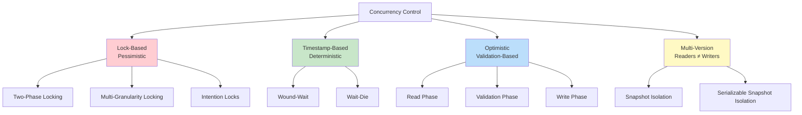
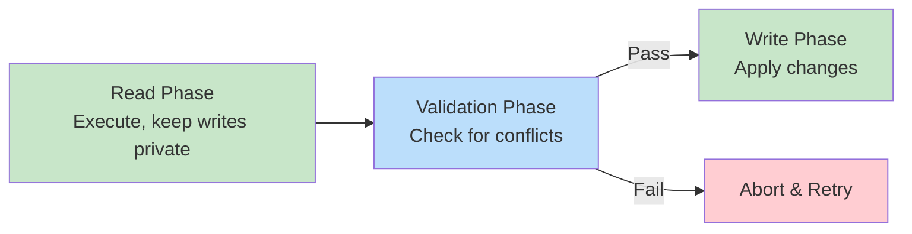
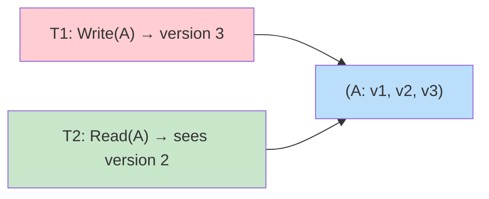

# Concurrency Control

## Overview

**Concurrency Control** mechanisms ensure that concurrent transactions execute without interfering with each other, maintaining database consistency. The goal is to allow maximum concurrency (throughput) while ensuring correctness (serializability or chosen isolation level).

## Concurrency Control Approaches



## 1. Lock-Based Concurrency Control

Transactions acquire **locks** on data items before accessing them. Two types:
- **Shared lock (S)**: For reads — multiple transactions can hold simultaneously
- **Exclusive lock (X)**: For writes — only one transaction can hold

### Lock Compatibility Matrix

| Held ↓ \ Requested → | S | X |
|---|---|---|
| **S** | ✅ Compatible | ❌ Conflict |
| **X** | ❌ Conflict | ❌ Conflict |

### Two-Phase Locking (2PL)

Guarantees conflict serializability:
1. **Growing phase**: Acquire locks, never release
2. **Shrinking phase**: Release locks, never acquire

Variants:
- **Basic 2PL**: Release locks during shrinking phase (can cause cascading aborts)
- **Strict 2PL**: Hold all X locks until commit/abort (prevents cascading aborts)
- **Rigorous 2PL**: Hold ALL locks until commit/abort (simplest, most common)

See: [Lock-Based](lock-based.md)

## 2. Timestamp-Based Concurrency Control

Each transaction gets a **timestamp** at start. Each data item has:
- **RT(X)**: Read timestamp — largest timestamp of transactions that read X
- **WT(X)**: Write timestamp — largest timestamp of transactions that wrote X
- **BTS(X)**: Backup timestamp (for Thomas Write Rule)

### Rules

**Read(X) by Ti (TS = ts):**
- If ts < WT(X): **Rollback** Ti (reading a future write)
- If ts ≥ WT(X): Allow read, set RT(X) = max(RT(X), ts)

**Write(X) by Ti (TS = ts):**
- If ts < RT(X): **Rollback** Ti (would violate a read that already happened)
- If ts < WT(X): **Ignore** write (Thomas Write Rule — Ti's write is obsolete)
- Otherwise: Allow write, set WT(X) = ts

### Example

```
T1 (ts=10): R(A), W(A), R(B), W(B)
T2 (ts=20): R(A), W(A)

T1:R(A) → RT(A)=10 ✅
T1:W(A) → WT(A)=10 ✅
T2:R(A) → ts=20 ≥ WT(A)=10 ✅, RT(A)=20
T2:W(A) → ts=20 ≥ WT(A)=10 ✅, WT(A)=20
```

See: [Timestamp-Based](timestamp-based.md)

## 3. Optimistic Concurrency Control (OCC)

Assumes conflicts are rare. Transactions execute without locks, then validate at commit time.

### Three Phases



**Validation**: Check if the transaction's reads are still valid (no other transaction wrote to read set during execution).

See: [Optimistic](optimistic.md)

## 4. Multi-Version Concurrency Control (MVCC)

Maintains **multiple versions** of each data item. Readers see a consistent **snapshot** without blocking writers.



**Key insight**: Readers never block writers, and writers never block readers. This is the most widely used approach in modern databases.

See: [MVCC](mvcc.md)

## Comparison

| Aspect | Lock-Based | Timestamp | Optimistic | MVCC |
|---|---|---|---|---|
| Blocking | Yes (readers block writers) | No | No | No (readers) |
| Deadlocks | Possible | Impossible | Impossible | Rare |
| Overhead | Lock management | Timestamp tracking | Validation | Version storage |
| Best for | High contention | Predictable workloads | Low contention | Mixed workloads |
| Used by | SQL Server (lock mode) | Academic | OCC-based systems | PostgreSQL, MySQL InnoDB |

## Interview Questions

### Beginner

**Q1: What is concurrency control?**
A: Mechanisms that manage simultaneous access to the database by multiple transactions, ensuring correctness (serializability) while maximizing throughput. Approaches: lock-based, timestamp-based, optimistic, and MVCC.

**Q2: What is the difference between pessimistic and optimistic concurrency control?**
A: **Pessimistic** (lock-based): Assumes conflicts will happen, prevents them with locks. **Optimistic**: Assumes conflicts are rare, allows transactions to proceed without locks, validates at commit time. Pessimistic is better for high contention; optimistic for low contention.

**Q3: What are shared and exclusive locks?**
A: **Shared (S)**: For reads — multiple transactions can hold simultaneously. **Exclusive (X)**: For writes — only one transaction can hold. S and X conflict with each other; two S locks are compatible.

### Intermediate

**Q4: How does MVCC avoid read-write conflicts?**
A: MVCC maintains multiple versions of each data item. Readers access an older consistent snapshot while writers create new versions. Since readers don't need the current version, they don't block writers and vice versa.

**Q5: What is the Thomas Write Rule?**
A: In timestamp-based concurrency control, if a transaction Ti tries to write X but there's already a later write (WT(X) > TS(Ti)), Ti's write is ignored (it's obsolete). This avoids unnecessary aborts and improves throughput.

**Q6: When would you choose optimistic over lock-based concurrency?**
A: When conflicts are rare (read-heavy workloads, short transactions, few concurrent writers). Optimistic avoids lock overhead but pays a cost on abort-and-retry when conflicts do occur. High-contention scenarios waste resources on frequent retries.

### Advanced

**Q7: Compare the approaches for a social media feed system.**
A: **Recommendation**: MVCC (PostgreSQL-style):
- Read-heavy workload (users read feeds, rarely write)
- Readers shouldn't block writers (new posts shouldn't wait for readers)
- Snapshot isolation is sufficient (don't need strict serializability for feeds)
- Writers (new posts) can create new versions without blocking reads

**Q8: How does Serializable Snapshot Isolation (SSI) work?**
A: SSI (PostgreSQL) builds on MVCC snapshot isolation and adds detection of "dangerous structures" — patterns of rw-dependencies that could lead to non-serializable results. It tracks read/write dependencies between transactions and aborts transactions that form cycles. It's optimistic: no locks for reads, conflict detection at commit time.

## Common Mistakes

- Using table-level locks when row-level locks suffice (reduces concurrency)
- Not considering deadlock detection/prevention with lock-based approaches
- Choosing optimistic concurrency for high-contention workloads (frequent retries)
- Not understanding that MVCC requires periodic vacuuming (old versions accumulate)
- Confusing isolation level with concurrency control mechanism

## Summary

| Mechanism | Principle | Pros | Cons |
|---|---|---|---|
| Lock-Based | Prevent conflicts | Strong guarantees | Blocking, deadlocks |
| Timestamp | Order by time | No deadlocks, no blocking | Cascading aborts |
| Optimistic | Validate at commit | No blocking | Wasted work on abort |
| MVCC | Multiple versions | No read-write blocking | Storage overhead |

## Cross-References

- [Lock-Based](lock-based.md) — 2PL and locking details
- [Timestamp-Based](timestamp-based.md) — Timestamp ordering protocol
- [Optimistic](optimistic.md) — OCC protocol
- [MVCC](mvcc.md) — Multi-version concurrency
- [Isolation Levels](isolation-levels.md) — Practical concurrency trade-offs
- [Serializability](serializability.md) — Correctness criterion


## Cross References

- [Lock-Based](lock-based.md)
- [MVCC](mvcc.md)
- [Optimistic](optimistic.md)
- [Timestamp-Based](timestamp-based.md)
- [Mutex (OS)](../../os/synchronization/mutex.md)
