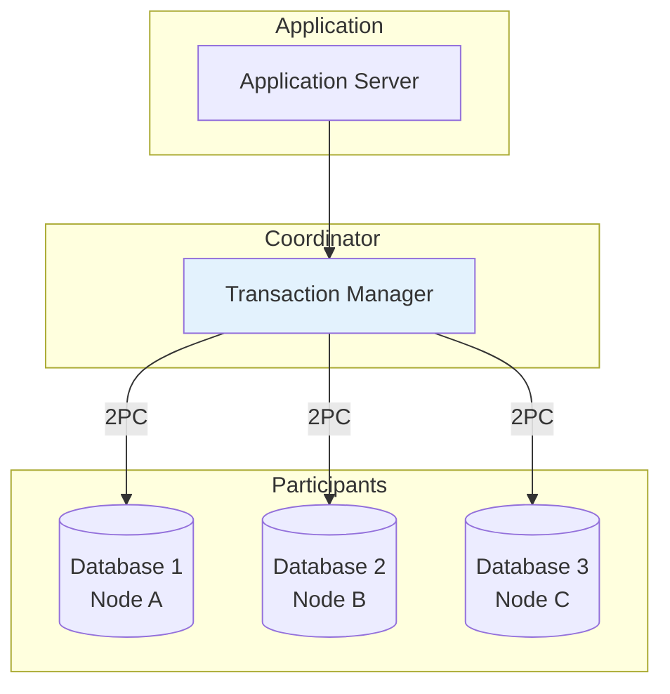
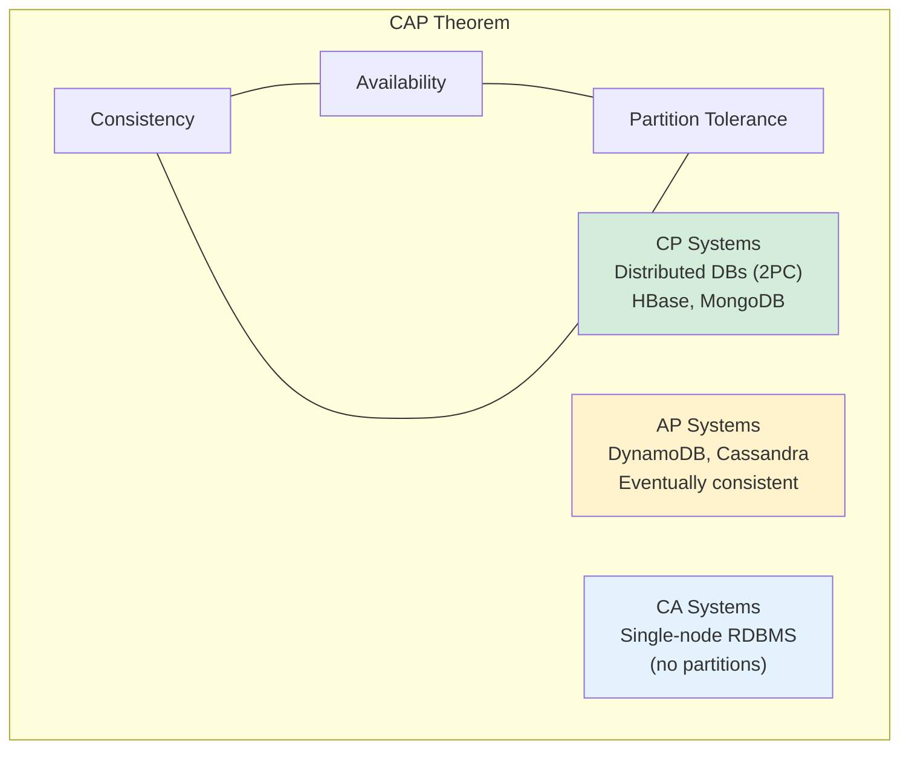
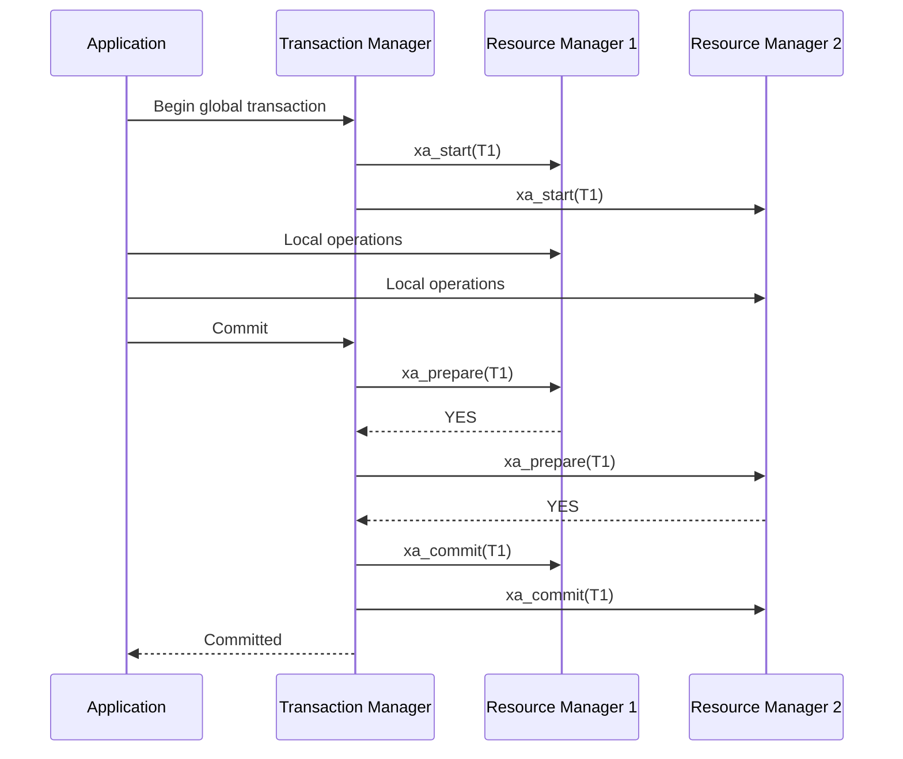

# Distributed Transactions

## Overview

A distributed transaction is a transaction that **spans multiple databases, services, or nodes** in a distributed system. Unlike local transactions that operate on a single database, distributed transactions must maintain ACID properties across network boundaries, partial failures, and heterogeneous systems.

## Why Distributed Transactions?

Modern applications are rarely monolithic. A single business operation may involve:

```
"Transfer $100 from Account A (Bank DB) to Account B (Another Bank DB)"

Steps:
  1. Debit Account A in Bank1's database
  2. Credit Account B in Bank2's database
  3. Record the transaction in a ledger database

All three must succeed or all must fail → Distributed transaction
```

## Challenges of Distributed Transactions

### Network Partitions
Nodes may lose communication. A node can't tell if another node crashed or just can't be reached.

### Partial Failure
Some nodes may succeed while others fail. Without coordination, the system can end up in an inconsistent state.

### Lack of Global Clock
No perfectly synchronized clock across nodes. Ordering events across nodes is fundamentally hard.

### Heterogeneous Systems
Different databases, different protocols, different capabilities.

## Mermaid Diagram: Distributed Transaction Architecture



## Distributed Transaction Models

### Two-Phase Commit (2PC)
The most common protocol. Coordinator asks all participants to prepare, then commits or aborts based on votes. **Blocking protocol** — participants may block if coordinator fails.

→ See [Two-Phase Commit](./two-phase-commit.md) for details.

### Three-Phase Commit (3PC)
Non-blocking extension of 2PC that adds a pre-commit phase. Reduces blocking but adds complexity and is rarely used in practice.

→ See [Three-Phase Commit](./three-phase-commit.md) for details.

### Saga Pattern
Breaks a distributed transaction into a sequence of local transactions, each with a compensating transaction. Non-blocking and suitable for microservices.

→ See [Saga Pattern](./saga.md) for details.

### Paxos Commit
Uses Paxos consensus to replicate the coordinator's decision, eliminating the single point of failure. Used in Google Spanner.

### Calvin / Deterministic Databases
Pre-orders transactions deterministically, eliminating the need for distributed coordination at commit time. Used in FaunaDB.

## CAP Theorem and Distributed Transactions

The CAP theorem states that a distributed system can only guarantee two of three properties:
- **Consistency (C)**: All nodes see the same data
- **Availability (A)**: Every request gets a response
- **Partition Tolerance (P)**: System works despite network partitions

Distributed transactions traditionally prioritize **CP** (consistency over availability). When a partition occurs, the system blocks or rejects requests rather than risking inconsistency.



## Consistency Models

### Strong Consistency
All reads reflect the most recent write. Achieved with 2PC, synchronous replication.

### Eventual Consistency
All replicas converge to the same value eventually. Used in AP systems like Cassandra.

### Causal Consistency
Operations that are causally related are seen in the same order by all nodes.

### Linearizability
The strongest model — operations appear to execute atomically at some point between their invocation and response. Requires consensus protocols like Raft or Paxos.

## Distributed Transaction Isolation

### Cross-Database Isolation

Local isolation levels (Read Committed, Repeatable Read) only apply within a single database. For distributed transactions:

- **Distributed Read Committed**: Each node's reads are locally consistent, but cross-node reads may see inconsistent states
- **Distributed Snapshot Isolation**: Requires global snapshot coordination
- **Distributed Serializability**: Requires 2PC + local serializability

### Global Snapshots

Achieving a consistent global snapshot across nodes requires:
1. All nodes take local snapshots simultaneously (hard without global clock)
2. Use a global timestamp (hybrid logical clocks in Spanner)
3. Use a 2-phase snapshot protocol

## X/Open XA Standard

The XA standard defines a standard interface for distributed transactions:

```
Components:
  - Application Program (AP): Executes business logic
  - Transaction Manager (TM): Coordinates the distributed transaction
  - Resource Managers (RM): Individual databases/services

XA Functions:
  xa_open()      - Open resource manager
  xa_close()     - Close resource manager
  xa_start()     - Start a transaction branch
  xa_end()       - End a transaction branch
  xa_prepare()   - Prepare to commit (phase 1)
  xa_commit()    - Commit (phase 2)
  xa_rollback()  - Rollback
```



## Interview Questions

### Beginner

**Q1: What is a distributed transaction?**
A: A distributed transaction is a transaction that spans multiple databases or services. It must maintain ACID properties across network boundaries, ensuring all participants either commit or abort together.

**Q2: Why are distributed transactions harder than local transactions?**
A: Because of network partitions, partial failures, lack of global clock, and heterogeneous systems. Coordinating commit decisions across nodes requires additional protocols like 2PC.

**Q3: What is the CAP theorem?**
A: A distributed system can guarantee at most two of: Consistency, Availability, Partition Tolerance. Distributed transaction systems typically sacrifice availability during partitions (CP systems).

### Intermediate

**Q4: What is the XA standard?**
A: XA is a standard for distributed transaction processing that defines interfaces between a Transaction Manager and Resource Managers. It's the standard way to implement 2PC in Java (JTA/JTS) and other platforms.

**Q5: How do distributed transactions affect performance?**
A: Significantly. 2PC requires multiple round trips between coordinator and participants. Participants hold locks during the prepare phase. Network latency adds to commit time. Use distributed transactions only when necessary.

**Q6: What alternatives exist to 2PC for distributed consistency?**
A: (1) Saga pattern — compensating transactions instead of atomic commit; (2) Eventual consistency with conflict resolution; (3) Consensus-based commit (Paxos, Raft); (4) Deterministic databases (Calvin); (5) Synchronous replication.

### Advanced / FAANG-Level

**Q7: Design a distributed transaction system for a global e-commerce platform with millions of transactions per second.**
A: (1) Avoid distributed transactions where possible — design bounded contexts that minimize cross-service transactions. (2) For necessary distributed transactions, use Saga pattern with idempotent operations. (3) For strong consistency requirements, use consensus-based replication (Raft) within a region. (4) For cross-region, use conflict-free replicated data types (CRDTs) or last-writer-wins. (5) Implement circuit breakers to prevent cascade failures. (6) Use event sourcing for auditability and replay.

**Q8: How does Google Spanner achieve distributed serializability?**
A: Spanner uses TrueTime (GPS + atomic clocks) for globally synchronized timestamps. Transactions get commit timestamps that are consistent with real-time ordering. It uses 2PC within a Paxos group for each shard, and TrueTime ensures that if T1 commits before T2 starts, T1's timestamp < T2's timestamp. This achieves external consistency (linearizability) across globally distributed data.

**Q9: You have a microservices architecture and need to update 5 services atomically. What approach do you recommend and why?**
A: Avoid 2PC (too brittle in microservices). Use Saga pattern: (1) Define each service's local transaction and compensating transaction. (2) Use orchestration (central coordinator) for complex flows, choreography (events) for simpler flows. (3) Ensure all operations are idempotent. (4) Implement dead letter queues for failed compensations. (5) Monitor saga completion rates and latency. (6) Design for eventual consistency — accept that intermediate states are visible and handle them in the UI/business logic.

## Common Mistakes

1. **Using distributed transactions everywhere** — They're expensive. Design bounded contexts to minimize cross-service transactions.

2. **Ignoring network partitions** — 2PC blocks when the coordinator fails. Have a timeout and recovery strategy.

3. **Not making operations idempotent** — In distributed systems, retries are common. Operations must be safe to retry.

4. **Treating distributed transactions like local ones** — They're fundamentally different. Account for network latency, partial failures, and coordination overhead.

5. **Not monitoring distributed transactions** — Track prepare/commit latency, abort rates, and participant timeouts.

## Summary

| Aspect | Detail |
|---|---|
| Definition | Transaction spanning multiple databases/services |
| Key challenges | Network partitions, partial failure, no global clock |
| Protocols | 2PC, 3PC, Saga, Paxos Commit |
| Standard | X/Open XA |
| Trade-off | Consistency vs Availability (CAP theorem) |
| Alternative | Saga pattern for microservices |

## Cross-References

- [Two-Phase Commit](./two-phase-commit.md) — The standard distributed commit protocol
- [Three-Phase Commit](./three-phase-commit.md) — Non-blocking extension
- [Saga Pattern](./saga.md) — Microservices-friendly alternative
- [Isolation Levels](./isolation-levels.md) — Isolation in distributed context
- [Recovery](./recovery.md) — Recovery in distributed systems


## Cross References

- [Two-Phase Commit](../dbms/transactions/two-phase-commit.md)
- [CAP Theorem](../distributed/fundamentals/cap.md)
- [Consistency Models](../distributed/fundamentals/consistency.md)
- [Sharding](../dbms/distributed/sharding.md)
- [Saga Pattern](../dbms/transactions/saga.md)
