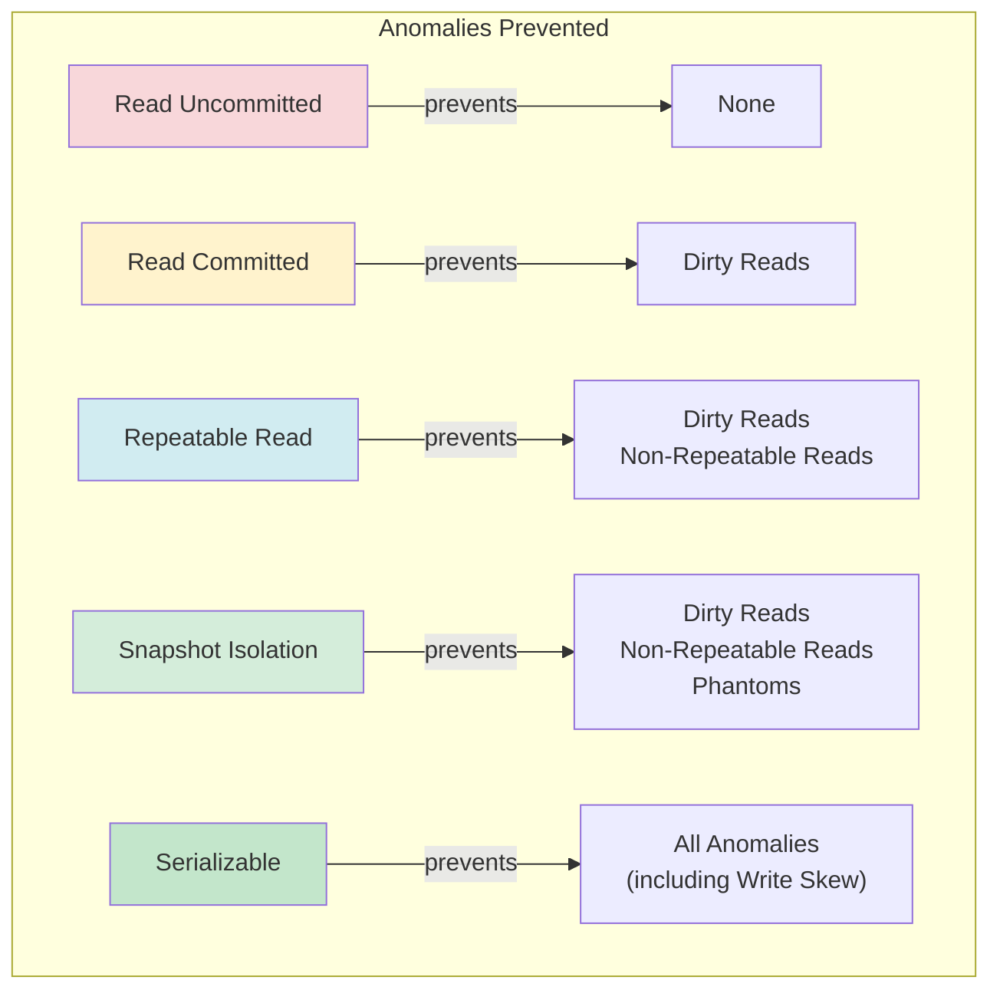
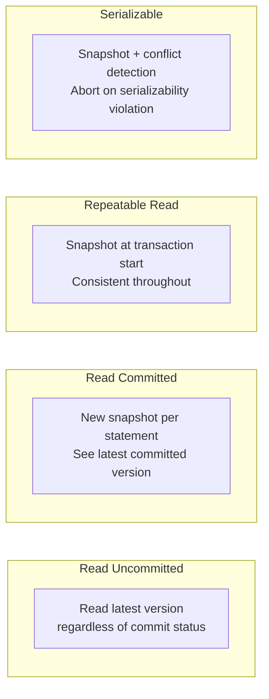

# Isolation Levels

## Overview

Isolation levels define **how much a transaction is shielded from the effects of concurrent transactions**. Higher isolation = fewer anomalies but lower concurrency. Lower isolation = more concurrency but potential data inconsistencies.

The SQL standard defines four isolation levels. Modern databases add Snapshot Isolation and Serializable Snapshot Isolation (SSI) as practical alternatives.

## The Four SQL Standard Isolation Levels

### Read Uncommitted

The lowest isolation level. Transactions can see data written by uncommitted transactions.

- **Dirty reads**: YES
- **Non-repeatable reads**: YES
- **Phantom reads**: YES
- **Use case**: Almost never used in practice. Some reporting systems where approximate data is acceptable.

```sql
SET TRANSACTION ISOLATION LEVEL READ UNCOMMITTED;

-- T1: writes but doesn't commit
BEGIN;
UPDATE accounts SET balance = 0 WHERE id = 1;

-- T2: reads uncommitted data
SET TRANSACTION ISOLATION LEVEL READ UNCOMMITTED;
SELECT balance FROM accounts WHERE id = 1;
-- Returns 0 — dirty read!
```

### Read Committed

Each statement sees only data committed before that statement began. The default in PostgreSQL and Oracle.

- **Dirty reads**: NO
- **Non-repeatable reads**: YES
- **Phantom reads**: YES

```sql
SET TRANSACTION ISOLATION LEVEL READ COMMITTED;

-- T1 reads balance = 1000
SELECT balance FROM accounts WHERE id = 1;  -- 1000

-- T2 updates and commits
UPDATE accounts SET balance = 900 WHERE id = 1;
COMMIT;

-- T1 reads again — sees new value (non-repeatable read)
SELECT balance FROM accounts WHERE id = 1;  -- 900
```

### Repeatable Read

All reads within a transaction see a consistent snapshot from the transaction's start. The default in MySQL InnoDB.

- **Dirty reads**: NO
- **Non-repeatable reads**: NO
- **Phantom reads**: Depends on implementation (NO in PostgreSQL with MVCC, YES in some other systems)

```sql
SET TRANSACTION ISOLATION LEVEL REPEATABLE READ;

-- T1 reads
SELECT balance FROM accounts WHERE id = 1;  -- 1000

-- T2 updates and commits
UPDATE accounts SET balance = 900 WHERE id = 1;
COMMIT;

-- T1 reads again — same snapshot
SELECT balance FROM accounts WHERE id = 1;  -- 1000 (consistent)
```

### Serializable

The highest SQL standard level. Transactions behave as if executed one after another (serially).

- **Dirty reads**: NO
- **Non-repeatable reads**: NO
- **Phantom reads**: NO
- **Implementation**: 2PL (traditional) or SSI (PostgreSQL)

```sql
SET TRANSACTION ISOLATION LEVEL SERIALIZABLE;

-- Both transactions run concurrently
-- T1: SELECT SUM(balance) FROM accounts;  -- 5000
-- T2: INSERT INTO accounts (balance) VALUES (100); COMMIT;
-- T1: SELECT SUM(balance) FROM accounts;  -- 5000 (no phantom)

-- If T2 tries to commit and would create a serializability violation:
-- ERROR: could not serialize access due to concurrent update
```

## Snapshot Isolation (SI)

Not part of the SQL standard but used by most modern databases. Each transaction reads from a **consistent snapshot** taken at transaction start.

- **Dirty reads**: NO
- **Non-repeatable reads**: NO
- **Phantom reads**: NO
- **Write skew**: YES (anomaly not prevented by SI alone)

### Write Skew Example

```
Two doctors on call, at least one must always be on call.

T1 (Dr. Alice):                    T2 (Dr. Bob):
  SELECT COUNT(*) FROM on_call      SELECT COUNT(*) FROM on_call
  WHERE status = true;              WHERE status = true;
  → Returns 2 (safe to leave)       → Returns 2 (safe to leave)
  
  UPDATE on_call SET status = false  UPDATE on_call SET status = false
  WHERE doctor = 'Alice';            WHERE doctor = 'Bob';
  COMMIT;                            COMMIT;
  
Result: Both off call! Constraint violated.
```

Snapshot Isolation allows this because each transaction sees its own snapshot (both on call) and writes to different rows.

## Read Phenomena Explained

### Dirty Read
Reading data written by an uncommitted transaction that later rolls back.

```
T1: UPDATE balance = 0 (not committed)
T2: SELECT balance → 0 (dirty read)
T1: ROLLBACK (balance should be 1000)
→ T2 made decisions based on data that never existed
```

### Non-Repeatable Read
Reading the same row twice within a transaction and getting different values.

```
T1: SELECT balance WHERE id=1 → 1000
T2: UPDATE balance = 900 WHERE id=1; COMMIT;
T1: SELECT balance WHERE id=1 → 900
→ T1's second read contradicts its first
```

### Phantom Read
A query returns different rows when re-executed because another transaction inserted/deleted matching rows.

```
T1: SELECT * FROM orders WHERE amount > 100 → 5 rows
T2: INSERT INTO orders (amount) VALUES (200); COMMIT;
T1: SELECT * FROM orders WHERE amount > 100 → 6 rows
→ New row appeared (phantom)
```

### Lost Update
Two transactions read the same data, modify it, and one update overwrites the other.

```
T1: SELECT balance WHERE id=1 → 1000
T2: SELECT balance WHERE id=1 → 1000
T1: UPDATE balance = 1100 (+100); COMMIT;
T2: UPDATE balance = 1050 (+50); COMMIT;
→ T1's +100 is lost. Final balance = 1050 (should be 1150)
```

### Write Skew
Two transactions read overlapping data, make disjoint writes based on the read, and violate a constraint.

(See example above with doctors)

## Mermaid Diagram: Isolation Level Comparison



## Mermaid Diagram: How Each Level Works



## Implementation Mechanisms

### Read Uncommitted
No special mechanism needed. Read the latest version of data, ignoring locks.

### Read Committed
- **Lock-based**: Release read locks after each statement (not at commit)
- **MVCC-based**: Take a new snapshot at the start of each statement

### Repeatable Read
- **Lock-based**: Hold all read locks until transaction end
- **MVCC-based**: Take one snapshot at transaction start, use it for all reads

### Serializable
- **2PL (Two-Phase Locking)**: Strict lock protocol, potential deadlocks
- **SSI (Serializable Snapshot Isolation)**: Track read-write dependencies, abort on dangerous structures

## PostgreSQL Specifics

PostgreSQL implements all four SQL standard levels, but with MVCC optimizations:

```
Read Uncommitted → Treated as Read Committed (MVCC makes dirty reads impossible)
Read Committed   → New snapshot per statement
Repeatable Read  → Snapshot at transaction start
Serializable     → SSI (Serializable Snapshot Isolation)
```

### SSI in PostgreSQL

SSI tracks three types of dependencies between transactions:
- **rw-dependency**: T1 reads data that T2 later writes
- **wr-dependency**: T1 writes data that T2 later reads
- **ww-dependency**: T1 and T2 write the same data

A **dangerous structure** is a cycle of rw-dependencies (rw-rw cycle). SSI detects these and aborts one transaction.

```sql
-- Enable SSI
BEGIN TRANSACTION ISOLATION LEVEL SERIALIZABLE;

-- T1 and T2 both read from accounts
-- T1 modifies accounts, T2 modifies orders
-- If their read-write dependencies form a cycle → one aborts
```

## MySQL InnoDB Specifics

```
READ UNCOMMITTED → Possible dirty reads (reads latest version)
READ COMMITTED   → New Read View per statement
REPEATABLE READ  → Read View at first read (default)
SERIALIZABLE     → All plain reads converted to SELECT ... LOCK IN SHARE MODE
```

### Gap Locks in REPEATABLE READ

InnoDB uses **gap locks** to prevent phantom reads at REPEATABLE READ level. Gap locks lock the range between index records, preventing inserts into that range.

```sql
-- T1: REPEATABLE READ
SELECT * FROM employees WHERE age BETWEEN 20 AND 30;
-- Acquires gap lock on (20, 30) range

-- T2: Cannot insert age=25 (blocked by gap lock)
INSERT INTO employees (name, age) VALUES ('Bob', 25);
-- Waits until T1 commits
```

## Comparison Table

| Level | Dirty Read | Non-Repeatable | Phantom | Write Skew | Performance |
|---|---|---|---|---|---|
| Read Uncommitted | ✅ Possible | ✅ Possible | ✅ Possible | ✅ Possible | Highest |
| Read Committed | ❌ Prevented | ✅ Possible | ✅ Possible | ✅ Possible | High |
| Repeatable Read | ❌ Prevented | ❌ Prevented | ⚠️ Varies | ✅ Possible | Medium |
| Snapshot Isolation | ❌ Prevented | ❌ Prevented | ❌ Prevented | ✅ Possible | Medium |
| Serializable | ❌ Prevented | ❌ Prevented | ❌ Prevented | ❌ Prevented | Lowest |

## Interview Questions

### Beginner

**Q1: What are the four SQL isolation levels?**
A: Read Uncommitted, Read Committed, Repeatable Read, and Serializable. Each prevents progressively more read anomalies but may reduce concurrency.

**Q2: What is a dirty read?**
A: Reading data that has been modified by another transaction but not yet committed. If the other transaction rolls back, the read data becomes invalid.

**Q3: What is the default isolation level in PostgreSQL? MySQL?**
A: PostgreSQL defaults to Read Committed. MySQL InnoDB defaults to Repeatable Read.

**Q4: What is the difference between non-repeatable read and phantom read?**
A: Non-repeatable read: same row returns different values on re-read (update). Phantom read: re-executing a query returns different rows (insert/delete by another transaction).

### Intermediate

**Q5: How does PostgreSQL implement Repeatable Read differently from the SQL standard?**
A: PostgreSQL uses MVCC snapshots. At REPEATABLE READ, it takes a snapshot at transaction start and uses it for all reads. This actually prevents phantoms too (unlike the SQL standard definition), making it equivalent to Snapshot Isolation.

**Q6: What is write skew and which isolation levels prevent it?**
A: Write skew occurs when two transactions read overlapping data, then write to disjoint sets based on those reads, violating a constraint. Only Serializable prevents it. Snapshot Isolation does not.

**Q7: How does MySQL InnoDB prevent phantoms at REPEATABLE READ?**
A: Using gap locks. When a transaction performs a range query, InnoDB locks the gaps between index records in that range, preventing other transactions from inserting rows that would match the query.

**Q8: Why does PostgreSQL treat READ UNCOMMITTED as READ COMMITTED?**
A: Because MVCC guarantees that readers only see committed versions. Even at READ UNCOMMITTED, you can't read uncommitted data — the MVCC visibility rules prevent it. So READ UNCOMMITTED behaves identically to READ COMMITTED.

### Advanced / FAANG-Level

**Q9: Design a system that provides Serializable isolation without 2PL.**
A: Use Serializable Snapshot Isolation (SSI). Key components: (1) MVCC snapshots for consistent reads; (2) Dependency tracking — maintain a graph of rw-dependencies between transactions; (3) Dangerous structure detection — look for rw-rw cycles (T1 reads X, T2 writes X; T2 reads Y, T1 writes Y); (4) Abort one transaction in the cycle. Advantages: no read locks, no deadlocks, readers never block writers. Disadvantages: false positives (aborting transactions that wouldn't actually violate serializability), overhead of dependency tracking.

**Q10: You observe that a system running at READ COMMITTED has data inconsistencies that shouldn't occur at SERIALIZABLE. How do you identify and fix the issue without upgrading isolation level?**
A: (1) Identify the anomaly — likely write skew or lost update. (2) For lost updates: use SELECT ... FOR UPDATE to lock rows before reading and modifying. (3) For write skew: use explicit locks or unique constraints to enforce the invariant. (4) Example: `SELECT * FROM on_call WHERE status = true FOR UPDATE` — this forces serialization on the read. (5) Alternatively, use advisory locks for application-level coordination. (6) Consider using SELECT ... FOR SHARE for read-modify-write patterns where you need to prevent concurrent updates but allow concurrent reads.

**Q11: Explain the trade-offs between SSI (PostgreSQL) and 2PL-based Serializable in terms of performance, abort rates, and anomaly detection.**
A: SSI: No read locks, readers never block. Higher abort rates due to false positives (dependency tracking may flag safe executions). Performance degrades gracefully under read-heavy workloads. Aborted transactions can be retried. 2PL: Fewer false positives (locks provide exact conflict detection). Readers block writers (shared locks). Deadlocks possible, requiring detection/restart. Under high concurrency, lock contention degrades throughput. SSI is better for read-heavy workloads; 2PL may be better for write-heavy workloads with high contention.

## Common Mistakes

1. **Assuming REPEATABLE READ prevents all anomalies** — Write skew is possible at REPEATABLE READ and even SNAPSHOT ISOLATION.

2. **Not understanding your database's implementation** — PostgreSQL's REPEATABLE READ is actually Snapshot Isolation. MySQL's REPEATABLE READ uses gap locks. Oracle doesn't support REPEATABLE READ (only READ COMMITTED and SERIALIZABLE).

3. **Using SERIALIZABLE everywhere "just to be safe"** — SERIALIZABLE has significant performance overhead. Use it only when you truly need it. Most applications work fine with READ COMMITTED + explicit locks where needed.

4. **Ignoring lock escalation** — In 2PL-based systems, too many row locks can escalate to table locks, causing massive contention.

5. **Confusing isolation level with consistency** — Isolation levels prevent read anomalies but don't guarantee application-level invariants. Use constraints, triggers, or application logic for that.

## Summary

| Level | Key Property | Default In | Use When |
|---|---|---|---|
| Read Uncommitted | No guarantees | (rarely) | Approximate reads OK |
| Read Committed | No dirty reads | PostgreSQL, Oracle | Most OLTP applications |
| Repeatable Read | Consistent snapshot | MySQL InnoDB | Need consistent reads |
| Snapshot | Consistent snapshot + no phantoms | PostgreSQL RR | Read-heavy, need consistency |
| Serializable | Full serial order | — | Critical consistency requirements |

## Cross-References

- [MVCC](./mvcc.md) — How MVCC implements snapshots for isolation levels
- [Optimistic Concurrency Control](./optimistic.md) — OCC and Snapshot Isolation
- [Recovery](./recovery.md) — How isolation interacts with recovery
- [Two-Phase Locking](./two-phase-commit.md) — 2PL as an implementation mechanism for Serializable
- [Distributed Transactions](./distributed.md) — Isolation in distributed systems


## Cross References

- [ACID](acid.md)
- [MVCC](mvcc.md)
- [Serializability](serializability.md)
- [Concurrency Control](concurrency-control.md)
- [Consistency Models](../../distributed/fundamentals/consistency.md)
