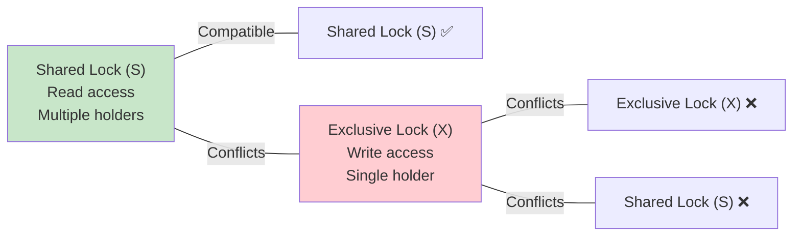
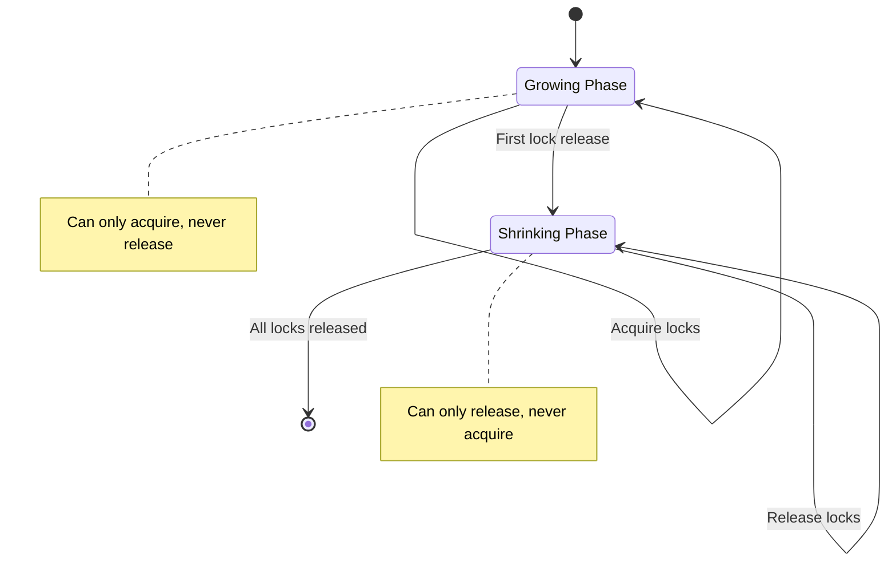
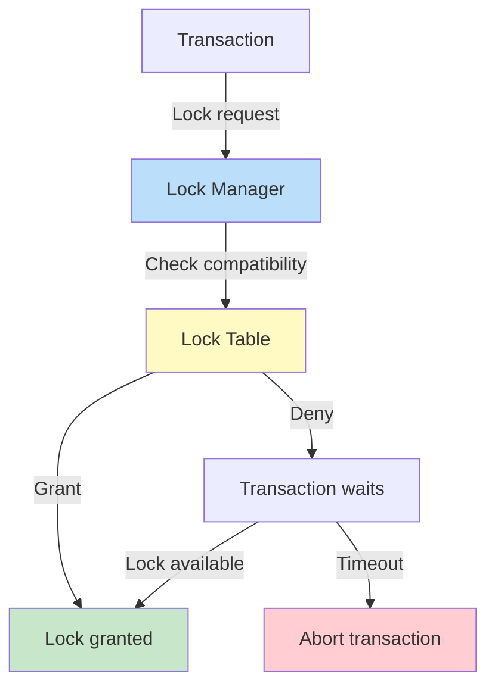
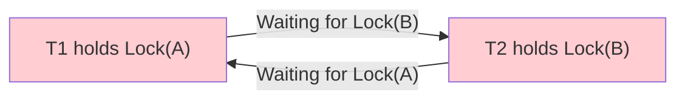
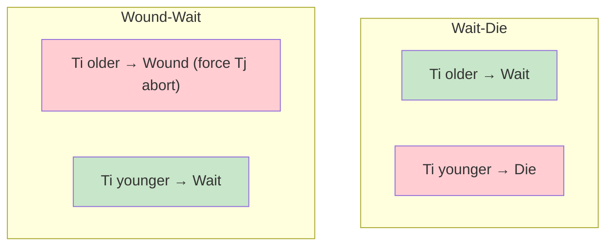

# Lock-Based Concurrency Control

## Overview

**Lock-based concurrency control** uses locks to prevent conflicting operations from executing simultaneously. The most widely used protocol is **Two-Phase Locking (2PL)**, which guarantees conflict serializability. Modern databases use sophisticated locking with multiple lock types and granularities.

## Lock Types

### Binary Locks
- **Locked** or **Unlocked** — too restrictive for practical use

### Shared/Exclusive Locks



| Operation | Lock Required |
|---|---|
| Read(X) | Shared (S) or Exclusive (X) |
| Write(X) | Exclusive (X) |

### Lock Compatibility Matrix

| Held ↓ \ Requested → | **S** | **X** |
|---|---|---|
| **S** | ✅ Grant | ❌ Wait |
| **X** | ❌ Wait | ❌ Wait |

## Two-Phase Locking (2PL)

### Basic 2PL



**Rules:**
1. **Growing phase**: Transaction may acquire locks but cannot release any
2. **Shrinking phase**: Transaction may release locks but cannot acquire any
3. All transactions follow 2PL → schedule is conflict serializable

### Strict 2PL

Hold all **exclusive** locks until commit/abort. Prevents:
- Dirty reads
- Cascading aborts
- Non-repeatable reads

```sql
T1: S-Lock(A), R(A), X-Lock(B), R(B), W(B)
    -- All X locks held until COMMIT/ABORT
T1: COMMIT → release all locks
```

### Rigorous 2PL

Hold **ALL** locks (shared and exclusive) until commit/abort. Simplest to implement and most commonly used.

```sql
T1: S-Lock(A), R(A), X-Lock(B), R(B), W(B)
    -- ALL locks held until COMMIT
T1: COMMIT → release all locks
```

## Lock Implementation

### Lock Manager



### Lock Table Structure

```
Data Item | Lock Type | Waiting Transactions
    A     |     S     | T1, T2 (granted), T3 (waiting)
    B     |     X     | T4 (granted)
    C     |     S     | T5 (granted)
```

## Deadlocks

### What is a Deadlock?

Two or more transactions wait for each other to release locks, creating a cycle.



### Deadlock Prevention

#### Wait-Die (Older waits for younger)
- If TS(Ti) < TS(Tj): Ti **waits** for Tj
- If TS(Ti) > TS(Tj): Ti **dies** (aborts)

#### Wound-Wait (Older wounds younger)
- If TS(Ti) < TS(Tj): Ti **wounds** Tj (forces abort)
- If TS(Ti) > TS(Tj): Ti **waits**



| Protocol | Older Transaction | Younger Transaction |
|---|---|---|
| Wait-Die | Waits | Aborts |
| Wound-Wait | Forces abort | Waits |

**Key difference**: Wait-Die has the older transaction waiting (may wait forever). Wound-Wait has the younger transaction waiting (will eventually proceed when older finishes).

### Deadlock Detection

Build a **wait-for graph**:
- Node: Transaction
- Edge: Ti → Tj means Ti is waiting for Tj

**Deadlock exists if the graph has a cycle.**

```sql
-- Database maintains wait-for graph
-- Periodic check for cycles
-- If cycle found: choose a victim (youngest, least work done) and abort
```

### Deadlock Avoidance

Use timeouts: if a transaction waits too long for a lock, assume deadlock and abort.

```sql
-- PostgreSQL: lock_timeout
SET lock_timeout = '5s';
-- If lock not acquired in 5 seconds, transaction is aborted
```

## Multi-Granularity Locking

Lock at different granularities: database → table → page → row → column.

### Intention Locks

Before locking a row with S or X, acquire **intention locks** on parent objects:

| Lock | Meaning |
|---|---|
| **IS** (Intent Shared) | Intention to lock a descendant with S |
| **IX** (Intent Exclusive) | Intention to lock a descendant with X |
| **SIX** (Shared + Intent Exclusive) | S on current, IX on descendants |

### Compatibility Matrix (with Intention Locks)

| Held ↓ \ Requested → | **IS** | **IX** | **S** | **SIX** | **X** |
|---|---|---|---|---|---|
| **IS** | ✅ | ✅ | ✅ | ✅ | ❌ |
| **IX** | ✅ | ✅ | ❌ | ❌ | ❌ |
| **S** | ✅ | ❌ | ✅ | ❌ | ❌ |
| **SIX** | ✅ | ❌ | ❌ | ❌ | ❌ |
| **X** | ❌ | ❌ | ❌ | ❌ | ❌ |

### Lock Escalation

When too many row locks are held, **escalate** to a table lock to reduce lock manager overhead.

```sql
-- SQL Server: lock escalation threshold (default: 5000 locks)
ALTER TABLE Employees SET (LOCK_ESCALATION = TABLE);  -- Escalate to table lock
ALTER TABLE Employees SET (LOCK_ESCALATION = AUTO);    -- Let SQL Server decide
ALTER TABLE Employees SET (LOCK_ESCALATION = DISABLE); -- Never escalate
```

## Interview Questions

### Beginner

**Q1: What is 2PL?**
A: Two-Phase Locking is a concurrency control protocol where each transaction has two phases: growing (acquire locks only) and shrinking (release locks only). It guarantees conflict serializability — if all transactions follow 2PL, the schedule is equivalent to some serial execution.

**Q2: What is a deadlock?**
A: A situation where two or more transactions wait for each other to release locks, creating a cycle. Neither can proceed. Solution: detect the cycle and abort one transaction (the victim), or prevent deadlocks using wait-die/wound-wait protocols.

**Q3: What is the difference between strict and rigorous 2PL?**
A: **Strict 2PL**: Holds exclusive (write) locks until commit/abort; shared (read) locks can be released earlier. **Rigorous 2PL**: Holds ALL locks until commit/abort. Rigorous is simpler and more common in practice.

### Intermediate

**Q4: How does lock escalation work?**
A: When a transaction acquires too many fine-grained locks (e.g., thousands of row locks), the lock manager escalates to a coarser lock (e.g., table lock). This reduces lock management overhead but reduces concurrency. Threshold is typically configurable (SQL Server default: 5000 locks).

**Q5: Compare wait-die and wound-wait.**
A: **Wait-Die**: Older transaction waits for younger; younger aborts immediately if it can't get a lock. **Wound-Wait**: Older transaction forces younger to abort; younger waits if older holds the lock. Wound-Wait is generally preferred because younger transactions eventually proceed (they wait for older to finish), while in Wait-Die, older transactions may repeatedly wait.

**Q6: What are intention locks?**
A: Intention locks (IS, IX, SIX) are placed on higher-level objects (tables, pages) to signal that a transaction intends to lock a lower-level object (rows). They prevent other transactions from acquiring conflicting locks at the higher level without checking every row. Example: Before locking a row with X, the transaction acquires IX on the table.

### Advanced

**Q7: Design a lock manager for a distributed database.**
A: Key components:
1. **Centralized lock table**: Maps data items → lock info (type, holders, waiters)
2. **Deadlock detection**: Global wait-for graph across nodes; cycle detection via BFS
3. **Lock migration**: When data moves between nodes, lock state must transfer
4. **Distributed 2PL**: Each node manages locks for its local data; coordinator manages global locks
5. **Recovery**: After node failure, locks must be reacquired or released consistently

**Q8: How do databases like PostgreSQL avoid traditional locking for reads?**
A: PostgreSQL uses **MVCC** — readers access a snapshot of the data (older version) without acquiring locks. Writers create new versions. Locks are only needed for write-write conflicts. This eliminates read-write blocking entirely. Combined with SSI (Serializable Snapshot Isolation), PostgreSQL achieves serializability without traditional 2PL for reads.

## Common Mistakes

- Using table-level locks when row-level locks would allow more concurrency
- Not handling deadlocks (letting transactions wait forever)
- Holding locks too long (not committing promptly)
- Not understanding that 2PL can cause deadlocks (inherent trade-off)
- Lock escalation causing unexpected blocking
- Not using lock timeouts

## Summary

| Lock Protocol | Prevents | Guarantees | Issue |
|---|---|---|---|
| Basic 2PL | Lost updates | Conflict serializability | Cascading aborts, deadlocks |
| Strict 2PL | + Dirty reads | + No cascading aborts | Deadlocks |
| Rigorous 2PL | + Non-repeatable reads | + Simple semantics | Deadlocks, lower concurrency |
| Wait-Die | Deadlocks (prevention) | No cycles | Older transactions wait |
| Wound-Wait | Deadlocks (prevention) | No cycles | Younger transactions wait |

## Cross-References

- [Concurrency Control](concurrency-control.md) — Overview of all approaches
- [Isolation Levels](isolation-levels.md) — Locking behavior per level
- [MVCC](mvcc.md) — Lock-free reads
- [Deadlocks](concurrency-control.md#deadlocks) — Detection and prevention
- [Serializability](serializability.md) — What 2PL guarantees
