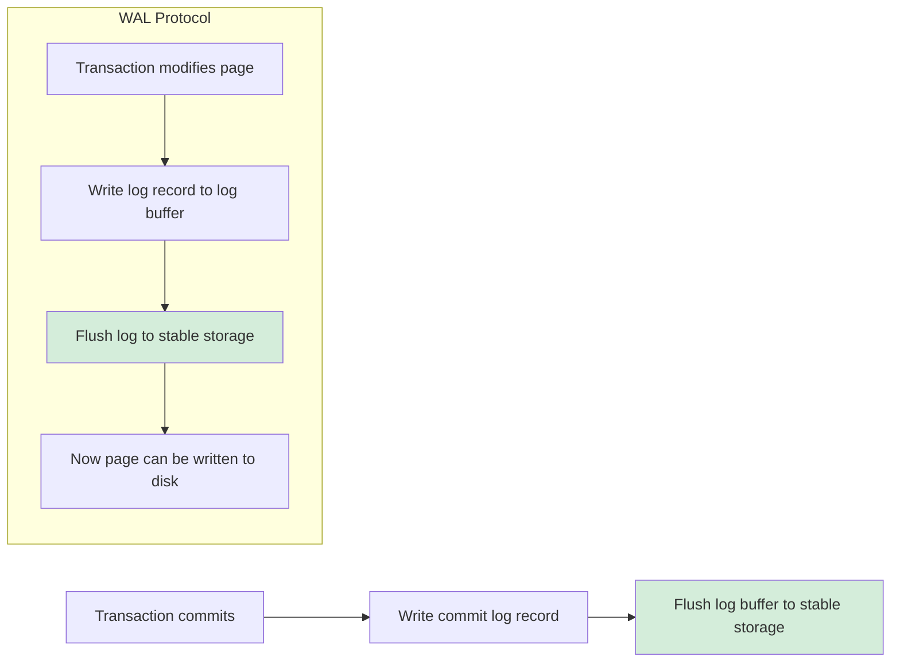
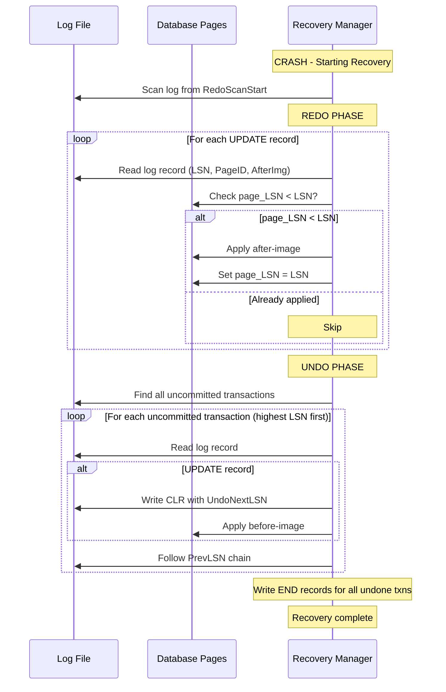
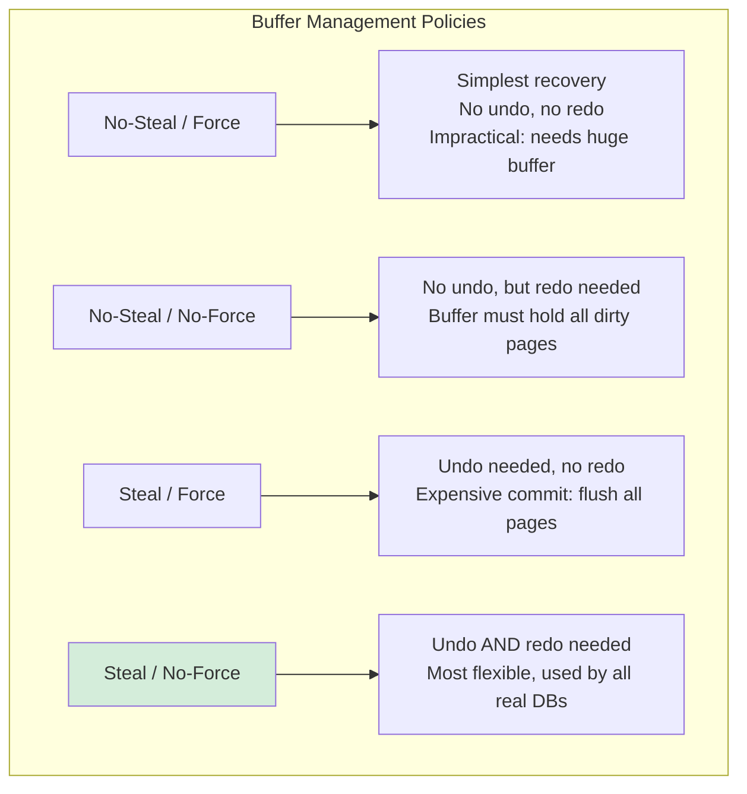

# Log-based Recovery

## Overview

Log-based recovery is the **standard mechanism** used by virtually all modern databases to ensure transaction atomicity and durability. The database maintains a **log** (also called a journal or write-ahead log) that records all changes before they are applied to the database. After a crash, the log is used to undo uncommitted transactions and redo committed ones.

## Write-Ahead Logging (WAL)

### The WAL Protocol

WAL is the foundational protocol. It states:

> **Before** any page of the database is written to stable storage, the log records describing the changes to that page must already be on stable storage.

### WAL Rules (ARIES variant)

1. **Undo-logging rule**: The log record for an update must be written to stable storage **before** the corresponding data page is written to disk.

2. **Commit rule**: All log records of a transaction must be on stable storage **before** the commit record is written.

3. **Force-at-commit**: At commit time, all log records up to and including the commit record must be flushed to stable storage (force-log-at-commit).



### Why WAL Works

Without WAL, a crash could leave the database in a state where:
- A committed transaction's changes are lost (not yet on disk)
- An uncommitted transaction's changes are on disk (can't undo)

WAL guarantees that the log always contains enough information to recover.

## Log Record Structure

```
┌─────────────────────────────────────────────────┐
│ Log Record                                       │
├─────────────────────────────────────────────────┤
│ LSN          │ Log Sequence Number (unique ID)   │
│ TxnID        │ Transaction ID                     │
│ PrevLSN      │ Previous LSN for this transaction  │
│ Type         │ UPDATE / CLR / COMMIT / ABORT / ...│
│ PageID       │ Target page identifier              │
│ Offset       │ Offset within page                  │
│ Before-Image │ Old value (for undo)                │
│ After-Image  │ New value (for redo)                │
│ UndoNextLSN  │ Next record to undo (CLR only)     │
└─────────────────────────────────────────────────┘
```

### LSN (Log Sequence Number)

- Monotonically increasing
- Physically identifies a log record's position
- Used as a "logical timestamp" throughout recovery

```
LSN 1000 → Log record at position 1000
LSN 1044 → Next log record at position 1044
```

### PrevLSN

Each transaction maintains a **chain** of its log records via `PrevLSN`. This enables efficient undo traversal without scanning the entire log.

```
T1's log chain:
  LSN 1000 (UPDATE A) ← PrevLSN: NULL
  LSN 1044 (UPDATE B) ← PrevLSN: 1000
  LSN 1088 (UPDATE C) ← PrevLSN: 1044
  LSN 1132 (COMMIT)   ← PrevLSN: 1088
```

## Redo: Re-applying Committed Changes

### What is Redo?

Redo **re-applies** the after-image of log records for committed transactions. This ensures that changes made by committed transactions that weren't flushed to disk before the crash are not lost.

### When is Redo Needed?

```
Timeline:
  T1 modifies page P (LSN=100)
  T1's log record flushed to disk (LSN=100 on disk) ✓
  Page P NOT yet flushed to disk ✗
  >>> CRASH <<<
  
After crash:
  Page P on disk has OLD values
  But T1 was committed (log proves it)
  → REDO T1's change to page P
```

### Redo Process

```
for each log record LSN from RedoScanStart to end of log:
    if LSN.type == UPDATE:
        if page_LSN < LSN:  // Page hasn't been updated yet
            apply after-image to page
            set page_LSN = LSN
        else:
            skip (already applied)
```

### Redo Scan Start Point

We don't need to scan the entire log. Start from the **oldest recLSN** in the Dirty Page Table at the last checkpoint. All changes before this point are guaranteed to be on disk.

```
DirtyPageTable at checkpoint:
  Page1: recLSN = 500
  Page3: recLSN = 320
  Page7: recLSN = 180

RedoScanStart = min(recLSN) = 180
```

## Undo: Reversing Uncommitted Changes

### What is Undo?

Undo **reverses** the before-image of log records for uncommitted transactions (those that were active at crash time).

### When is Undo Needed?

```
Timeline:
  T2 modifies page Q (LSN=200)
  >>> CRASH <<<
  
After crash:
  T2 has no COMMIT or ABORT record in log
  → T2 was uncommitted at crash time
  → UNDO T2's change to page Q
```

### Undo Process

```
ActiveTransactions = all TxnIDs without COMMIT/END records in log

while ActiveTransactions is not empty:
    pick Txn with highest lastLSN
    process log record at lastLSN:
        if UPDATE:
            write CLR (compensation log record)
            apply before-image to page
        follow PrevLSN to next record for this transaction
        if ABORT record reached:
            remove from ActiveTransactions
```

### Compensation Log Records (CLR)

When undoing a change, we write a CLR to record what was undone. This is critical for:

1. **Idempotent undo**: If we crash during undo, the CLR tells us what was already undone
2. **Never undone**: CLRs are never themselves undone (they are "redo-only")
3. **UndoNextLSN**: Points to the next record to undo, enabling efficient skipping

```
CLR = {
    LSN: 1200
    TxnID: T2
    Type: CLR
    UndoNextLSN: 800   // Skip to this LSN for next undo
    PageID: Q
    After-Image: old_value_of_Q  // The value we restored
}
```

## Mermaid Diagram: Redo and Undo Process



## Force vs No-Force, Steal vs No-Steal

These policies define when dirty pages are written to disk:

### Force vs No-Force
- **Force**: All pages modified by a transaction must be flushed at commit (no redo needed)
- **No-Force**: Pages may remain dirty after commit (redo needed if crash before flush)

### Steal vs No-Steal
- **Steal**: Dirty pages of uncommitted transactions may be flushed (undo needed)
- **No-Steal**: Dirty pages of uncommitted transactions are never flushed (no undo needed)



**All modern databases use Steal/No-Force** because:
- Steal: Allows buffer manager to evict dirty pages of uncommitted transactions (memory efficiency)
- No-Force: Avoids flushing all pages at commit (performance)

## Detailed Example

### Normal Execution

```
Log:
  LSN 100: <T1, UPDATE, Page A, Before=100, After=200>
  LSN 104: <T1, UPDATE, Page B, Before=50, After=150>
  LSN 108: <T2, UPDATE, Page C, Before=300, After=400>
  LSN 112: <T1, COMMIT>
  LSN 116: <T2, UPDATE, Page D, Before=500, After=600>
  >>> CRASH (T2 not committed) <<<
```

### Recovery

```
Analysis Phase:
  - T1: COMMITTED (LSN 112)
  - T2: ACTIVE (no COMMIT record)
  - Dirty pages: A(100), B(104), C(108), D(116)
  - RedoScanStart = min(recLSN) = 100

Redo Phase (scan from LSN 100 to end):
  LSN 100: Page A. Check page_A.LSN < 100? → Yes → REDO (apply after=200)
  LSN 104: Page B. Check page_B.LSN < 104? → Yes → REDO (apply after=150)
  LSN 108: Page C. Check page_C.LSN < 108? → Yes → REDO (apply after=400)
  LSN 116: Page D. Check page_D.LSN < 116? → Yes → REDO (apply after=600)

Undo Phase:
  Active: T2 (lastLSN = 116)
  
  Process LSN 116 (T2, UPDATE D):
    Write CLR: <T2, CLR, UndoNextLSN=108>
    Apply before-image: D = 500
  
  Process LSN 108 (T2, UPDATE C):
    Write CLR: <T2, CLR, UndoNextLSN=NULL>
    Apply before-image: C = 300
  
  Write <T2, END>
  
Recovery complete.
Final state: A=200, B=150, C=300, D=500
(T1's changes preserved, T2's changes undone)
```

## Interview Questions

### Beginner

**Q1: What is Write-Ahead Logging?**
A: WAL is a protocol requiring that log records for changes must be written to stable storage before the corresponding data pages are written to disk. This ensures recovery has enough information to undo or redo any change.

**Q2: What is the difference between redo and undo?**
A: Redo re-applies committed transactions' changes that weren't flushed to disk (ensures durability). Undo reverses uncommitted transactions' changes that were flushed to disk (ensures atomicity).

**Q3: What is a log sequence number (LSN)?**
A: A monotonically increasing identifier for log records. It serves as a physical address for the log record and a logical timestamp for ordering operations.

### Intermediate

**Q4: Why do we need Compensation Log Records (CLRs)?**
A: CLRs record undo operations. They ensure idempotent recovery — if a crash occurs during undo, the CLR tells us what was already undone. CLRs are never themselves undone (they are redo-only).

**Q5: What are the Steal/No-Force policies?**
A: Steal: dirty pages of uncommitted transactions can be flushed to disk (requires undo). No-Force: dirty pages of committed transactions need not be flushed at commit (requires redo). All real databases use Steal/No-Force for flexibility.

**Q6: How does PrevLSN help during undo?**
A: PrevLSN forms a chain of log records for each transaction, ordered by LSN. During undo, we follow this chain backwards, skipping unrelated records. Without it, we'd need to scan the entire log.

### Advanced / FAANG-Level

**Q7: How would you optimize WAL writes for high-throughput OLTP?**
A: (1) Group commit — batch multiple transactions' log writes into one fsync; (2) Use asynchronous I/O with `O_DIRECT` to bypass OS page cache; (3) Place log on dedicated fast storage (NVMe); (4) Compress log records; (5) Use hardware offload (e.g., Intel DSA for memcpy); (6) Implement log pipelining — overlap log writes with transaction processing. PostgreSQL's WAL implementation uses group commit since 9.2.

**Q8: A system uses WAL but the log disk is 10x slower than the data disk. What are the implications?**
A: WAL is the bottleneck since every transaction must wait for log flush before commit. Mitigations: (1) Group commit amortizes the flush cost; (2) Asynchronous commit (risk losing committed transactions on crash); (3) Reduce log record size (minimal logging); (4) Use battery-backed write cache on the log disk; (5) Consider commit batching at the application level. The fundamental issue is that WAL makes the log disk the single point of write throughput.

**Q9: Design a log-structured storage engine that avoids random writes entirely.**
A: Use an LSM-tree approach with WAL: (1) All writes go to an in-memory buffer (memtable) with WAL; (2) When memtable is full, flush it as an immutable sorted string table (SSTable) — sequential write; (3) Background compaction merges SSTables — also sequential; (4) WAL ensures durability of memtable contents; (5) After memtable flush, WAL entries for that data can be discarded. This converts all random writes to sequential writes. Used by LevelDB, RocksDB, Cassandra.

## Common Mistakes

1. **Not flushing log on commit** — Without `fsync()`, the OS may buffer the log in page cache. A crash loses unflushed log records, violating durability.

2. **Forcing data pages at commit** — This defeats the purpose of WAL. With WAL, you only need to flush the log, not the data pages.

3. **Not using PrevLSN chains** — Without chains, undo must scan the entire log, which is extremely slow for large logs.

4. **Ignoring group commit** — Individual fsync per transaction kills throughput. Group commit batches multiple transactions' log writes.

5. **Placing log and data on same disk** — Log writes are sequential, data writes are random. Mixing them causes seek overhead.

## Summary

| Concept | Detail |
|---|---|
| WAL Protocol | Log before data; ensures recovery information survives |
| Redo | Re-applies committed changes not on disk |
| Undo | Reverses uncommitted changes on disk |
| CLR | Records undo operations; never undone themselves |
| PrevLSN | Chain of transaction's log records for efficient undo |
| Steal/No-Force | Allow flushing uncommitted pages + no flush at commit |

## Cross-References

- [Transaction Recovery](./recovery.md) — Overview of recovery concepts
- [Checkpointing](./checkpointing.md) — How checkpoints bound recovery work
- [ARIES](./aries.md) — Complete recovery algorithm using WAL
- [MVCC](./mvcc.md) — MVCC and recovery interaction
- [Distributed Transactions](./distributed.md) — WAL in distributed systems
