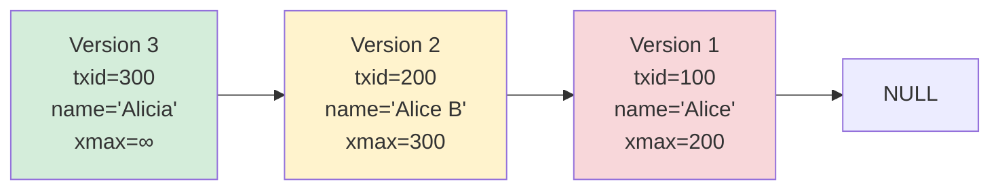
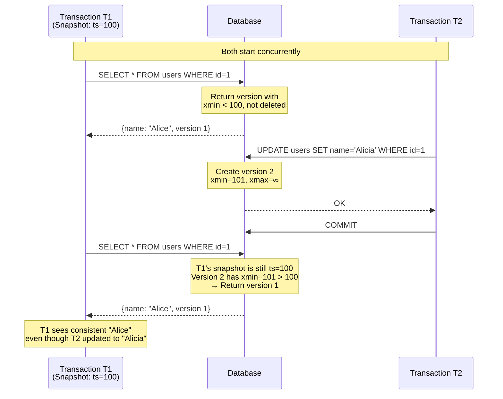
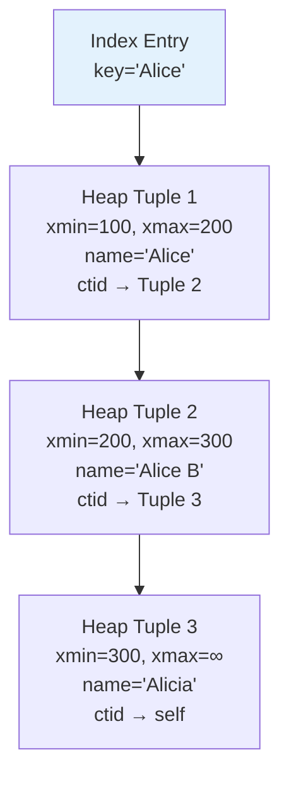
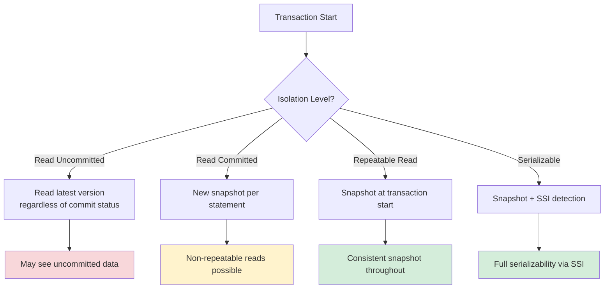

# Multi-Version Concurrency Control (MVCC)

## Overview

Multi-Version Concurrency Control (MVCC) is a concurrency control technique used by most modern databases (PostgreSQL, MySQL InnoDB, Oracle, SQL Server) to allow **multiple transactions to access the same data simultaneously** without blocking each other.

The core idea: instead of overwriting data in place, **every write creates a new version**. Readers access a consistent snapshot of older versions while writers create new ones. Readers never block writers, and writers never block readers.

## Why MVCC?

Traditional locking (2PL) has a fundamental problem: readers and writers block each other. In read-heavy workloads, this creates massive contention.

```
Without MVCC:
  T1 reads row X → acquires shared lock
  T2 wants to write X → waits for T1 to release lock
  T1 is slow → T2 waits longer → throughput drops

With MVCC:
  T1 reads version 1 of row X (no lock needed)
  T2 writes version 2 of row X (doesn't block T1)
  T1 continues reading version 1
  → No blocking, no waiting
```

## Core Concepts

### Versions

Every tuple (row) has multiple versions. Each version records:

- The **data** at that point in time
- **Transaction ID** that created it (`xmin`)
- **Transaction ID** that deleted/invalidated it (`xmax`)

```
Row: (id=1, name="Alice")
  Version 1: xmin=100, xmax=105, data="Alice"
  Version 2: xmin=105, xmax=∞, data="Alicia"
```

### Snapshots

A snapshot is a **consistent view of the database** at a point in time. When a transaction starts, it takes a snapshot that determines which row versions are visible.

A snapshot contains:
- `xmin`: All transactions with ID < xmin are visible (committed)
- `xmax`: All transactions with ID ≥ xmax are invisible (not yet committed)
- `xip_list`: List of in-progress transaction IDs at snapshot time

```
Snapshot S = {xmin=100, xmax=200, in_progress=[150, 167]}

Visibility rules for a version (simplified; see code below for full rules):
  - Created before snapshot (xmin < snapshot.xmax) AND creator was committed (xmin not in in_progress)
  - AND (not deleted (xmax = INVALID) OR deleted after snapshot (xmax ≥ snapshot.xmax)
        OR deleter was still in-progress at snapshot time (xmax in in_progress))
```

### Version Chains

Versions of the same row form a **linked list** (chain), from newest to oldest.



## Visibility Rules (PostgreSQL MVCC)

```python
def is_visible(version, snapshot):
    # Rule 1: Was the creating transaction committed?
    if version.xmin >= snapshot.xmax:
        return False  # Created after snapshot
    if version.xmin in snapshot.in_progress:
        return True  # Own write — a transaction always sees its own uncommitted changes
    
    # Rule 2: Was the deleting transaction committed?
    if version.xmax == INVALID:
        return True  # Not deleted
    if version.xmax in snapshot.in_progress:
        return True  # Deleter still running (old version visible)
    if version.xmax >= snapshot.xmax:
        return True  # Deleted after snapshot
    
    return False  # Deleted before snapshot
```

## Read Phenomena Prevention

MVCC naturally prevents several read phenomena:

| Phenomenon | MVCC Prevention |
|---|---|
| Dirty Read | Readers see only committed versions |
| Non-Repeatable Read | Snapshot ensures same versions throughout |
| Phantom Read | Depends on isolation level (Snapshot: yes, Read Committed: no) |
| Lost Update | Detected via version checks |

## Mermaid Diagram: MVCC Read-Write Interaction



## PostgreSQL MVCC Implementation

### Heap Tuple Header

Each row in PostgreSQL has a 23-byte header:

```
struct HeapTupleHeaderData {
    union {
        HeapTupleFields t_heap;
        DatumTupleFields t_datum;
    } t_choice;
    
    ItemPointerData t_ctid;     // Current tuple ID (self or updated version)
    uint16 t_infomask2;         // Number of attributes + flags
    uint16 t_infomask;          // Various boolean flags
    uint8 t_hoff;               // Header offset
    // Null bitmap, alignment padding, user data follow
};
```

Key fields:
- `t_xmin`: Insert transaction ID
- `t_xmax`: Delete/lock transaction ID
- `t_ctid`: Points to the updated version (for UPDATE chains)
- `t_infomask`: Flags like `HEAP_XMIN_COMMITTED`, `HEAP_XMAX_INVALID`

### Index Pointers

Indexes point to the **physical location** (TID) of the heap tuple. When a row is updated:

1. New tuple version is written to heap
2. Old tuple's `t_ctid` points to new version
3. Index entries point to the **original** tuple
4. Readers follow the `ctid` chain to find the visible version



### VACUUM

Old versions accumulate and must be cleaned up. PostgreSQL's VACUUM:

1. Scans tables for dead tuples (no active snapshot needs them)
2. Marks their space as reusable
3. Updates visibility maps and free space maps

```
-- Manual vacuum
VACUUM tablename;

-- Full vacuum (rewrites table, reclaims disk space)
VACUUM FULL tablename;

-- Autovacuum (automatic background process)
-- Configured via autovacuum_* parameters
```

## InnoDB MVCC Implementation (MySQL)

InnoDB uses a different approach:

### Undo Logs

Instead of keeping old versions in the heap, InnoDB stores old versions in **undo logs** (rollback segments).

```
Current row in table: {name: "Alicia", roll_pointer → undo log}
Undo log record: {name: "Alice", roll_pointer → older undo log}
Older undo log: {name: "Alice A", roll_pointer → NULL}
```

### Read View

InnoDB creates a Read View at transaction start (REPEATABLE READ) or statement start (READ COMMITTED).

```
ReadView {
    m_low_limit_id    // Newest active transaction + 1
    m_up_limit_id     // Oldest active transaction
    m_ids[]           // List of active transaction IDs
    m_creator_trx_id  // This transaction's ID
}
```

### Visibility Check (InnoDB)

```python
def is_visible(version_trx_id, read_view):
    if version_trx_id == read_view.m_creator_trx_id:
        return True  # A transaction always sees its own uncommitted writes
    
    if version_trx_id < read_view.m_up_limit_id:
        return True  # Committed before oldest active txn
    
    if version_trx_id >= read_view.m_low_limit_id:
        return False  # Started after read view created
    
    if version_trx_id in read_view.m_ids:
        return False  # Was active when read view created
    
    return True  # Committed before read view
```

## Comparison: PostgreSQL vs MySQL InnoDB MVCC

| Aspect | PostgreSQL | MySQL InnoDB |
|---|---|---|
| Version storage | In heap (same table) | In undo logs (separate) |
| Index updates | Indexes point to old version | Indexes always point to latest |
| VACUUM | Required to clean dead tuples | Undo log cleanup via purge |
| Long transaction impact | Bloats table, prevents VACUUM | Bloats undo log |
| HOT updates | Heap-Only Tuples skip index update | Not needed (indexes point to latest) |
| TOAST | Large data stored out-of-line | BLOB/TEXT stored separately |

## Isolation Levels and MVCC

MVCC supports different isolation levels by choosing **when to take snapshots**:



## Index-Only Scans and Visibility Map

PostgreSQL maintains a **visibility map** that tracks which heap pages contain only tuples visible to all transactions. This enables:

- **Index-only scans**: If a page is all-visible, the index scan can skip the heap fetch
- **Faster VACUUM**: Skip all-visible pages during vacuuming

```sql
-- Check visibility map
SELECT pg_visibility('tablename');

-- Enable/disable index-only scan
SET enable_indexonlyscan = on;
EXPLAIN SELECT id FROM users WHERE id > 100;
```

## Common Problems

### 1. Table Bloat (PostgreSQL)

Dead tuples accumulate if VACUUM can't clean them (long-running transactions hold old snapshots).

```sql
-- Find bloated tables
SELECT schemaname, tablename, 
       n_dead_tup, n_live_tup,
       round(n_dead_tup::numeric / GREATEST(n_live_tup, 1) * 100, 2) AS dead_pct
FROM pg_stat_user_tables
WHERE n_dead_tup > 1000
ORDER BY n_dead_tup DESC;
```

### 2. Transaction ID Wraparound

PostgreSQL uses 32-bit transaction IDs. After ~2 billion transactions, IDs wrap around. VACUUM must process all tables before this happens.

```sql
-- Check transaction ID age
SELECT datname, age(datfrozenxid) FROM pg_database;

-- Force freeze to prevent wraparound
VACUUM FREEZE tablename;
```

### 3. Long-Running Read Transactions

A long-running transaction prevents VACUUM from cleaning old versions, causing bloat.

```sql
-- Find long-running transactions
SELECT pid, now() - xact_start AS duration, query
FROM pg_stat_activity
WHERE state != 'idle'
ORDER BY duration DESC;
```

## Interview Questions

### Beginner

**Q1: What is MVCC and why is it used?**
A: MVCC maintains multiple versions of each data item so that readers can access a consistent snapshot without blocking writers. This eliminates reader-writer contention, improving concurrency in read-heavy workloads.

**Q2: How does MVCC prevent dirty reads?**
A: Each transaction reads from a snapshot that only includes versions created by transactions that committed before the snapshot was taken. Uncommitted versions are invisible.

**Q3: What is a snapshot in MVCC?**
A: A snapshot defines which transaction versions are visible. It includes the minimum active transaction ID, the next transaction ID to be assigned, and a list of currently active transactions.

### Intermediate

**Q4: How does PostgreSQL's MVCC differ from MySQL InnoDB's?**
A: PostgreSQL stores old versions directly in the heap (table), while InnoDB stores them in undo logs. PostgreSQL indexes point to specific heap tuples (may need chain following), while InnoDB indexes always point to the latest version and traverse undo logs for older versions.

**Q5: What is the HOT update optimization in PostgreSQL?**
A: Heap-Only Tuple (HOT) updates avoid creating new index entries when the update doesn't change any indexed columns. The new version is stored on the same heap page, and the old version's `ctid` points to it. This reduces index maintenance overhead.

**Q6: Why does PostgreSQL need VACUUM?**
A: Because old row versions remain in the heap after updates/deletes. VACUUM reclaims this space by identifying dead tuples (no active snapshot needs them) and marking their space as reusable. Without VACUUM, tables would grow indefinitely.

**Q7: What is a visibility map?**
A: A bitmap that tracks which heap pages contain only tuples visible to all transactions. It enables index-only scans (skip heap fetch for all-visible pages) and helps VACUUM skip pages that don't need cleaning.

### Advanced / FAANG-Level

**Q8: A PostgreSQL database shows increasing table bloat despite autovacuum running. How do you diagnose?**
A: (1) Check for long-running transactions that prevent VACUUM from cleaning: `SELECT * FROM pg_stat_activity WHERE xact_start < now() - interval '1 hour'`. (2) Check `pg_stat_user_tables.n_dead_tup` vs `n_live_tup`. (3) Look at `age(datfrozenxid)` for wraparound risk. (4) Check autovacuum settings — `autovacuum_vacuum_cost_delay` might be too high, throttling VACUUM. (5) Check for replication slots holding old snapshots. Fix: kill long transactions, tune autovacuum, or run manual VACUUM.

**Q9: How does Snapshot Isolation in MVCC handle write-write conflicts that could violate serializability?**
A: Snapshot Isolation uses first-committer-wins: if two concurrent transactions write to the same item, the second committer detects the conflict and aborts. However, SI can still suffer from write skew (anomalies where two transactions read overlapping data and write to disjoint sets). PostgreSQL's Serializable Snapshot Isolation (SSI) adds dependency tracking to detect dangerous structures (rw-antidependency cycles) and aborts to ensure true serializability.

**Q10: Design a garbage collection strategy for an MVCC system with long-running analytical queries.**
A: (1) Track the oldest active snapshot across all connections. (2) Only garbage-collect versions older than this snapshot. (3) Implement snapshot leasing — analytical queries get a snapshot lease with a max duration. (4) Use epoch-based reclamation: assign versions to epochs, retire epochs when all readers in that epoch are done. (5) Consider tiered storage — move old versions to cheaper storage before deleting. (6) Implement cooperative GC where readers signal when they're done with a snapshot.

**Q11: How would you implement MVCC for a distributed database spanning multiple nodes?**
A: Each node maintains local versions. Global consistency requires: (1) Globally unique transaction IDs (hybrid logical clocks or centralized ID generator). (2) Distributed snapshots — a global snapshot must be consistent across nodes. Use timestamp-based approach: snapshot at timestamp T includes all versions with commit_ts ≤ T. (3) Cross-node visibility — use 2PC for distributed commits, with global commit timestamp assignment. (4) Garbage collection must be coordinated — a version is only GC-able when all nodes' oldest snapshot is newer. Systems like CockroachDB, TiDB, and YugabyteDB implement variants of this.

## Common Mistakes

1. **Ignoring VACUUM in PostgreSQL** — Not running VACUUM (or disabling autovacuum) leads to table bloat, slower queries, and eventually transaction ID wraparound shutdown.

2. **Long-running transactions in MVCC systems** — They prevent garbage collection of old versions, causing bloat and degraded performance. Kill idle-in-transaction sessions.

3. **Assuming MVCC = Serializable** — Default MVCC (Snapshot Isolation) doesn't prevent write skew. You need Serializable Snapshot Isolation (SSI) or explicit locking for true serializability.

4. **Not understanding snapshot timing** — Read Committed takes a new snapshot per statement; Repeatable Read takes one per transaction. This affects what data you see.

5. **Index bloat in PostgreSQL** — Updated indexed columns create new index entries. Old index entries are only cleaned by VACUUM. Monitor index bloat with `pgstattuple`.

## Summary

| Aspect | Detail |
|---|---|
| Core idea | Maintain multiple versions; readers see consistent snapshots |
| Reader-writer blocking | None — readers see old versions, writers create new ones |
| Version storage | PostgreSQL: heap; InnoDB: undo logs |
| Garbage collection | VACUUM (PostgreSQL), purge (InnoDB) |
| Isolation support | Read Uncommitted to Serializable |
| Trade-off | Storage overhead for old versions + GC complexity |

## Cross-References

- [Isolation Levels](./isolation-levels.md) — How MVCC implements different isolation levels
- [Optimistic Concurrency Control](./optimistic.md) — MVCC + validation = multi-version OCC
- [Recovery](./recovery.md) — How MVCC interacts with WAL and recovery
- [B+ Tree Index](../indexing/b-plus-tree.md) — Index structure used with MVCC
- [Checkpointing](./checkpointing.md) — Checkpoints and MVCC snapshot management
