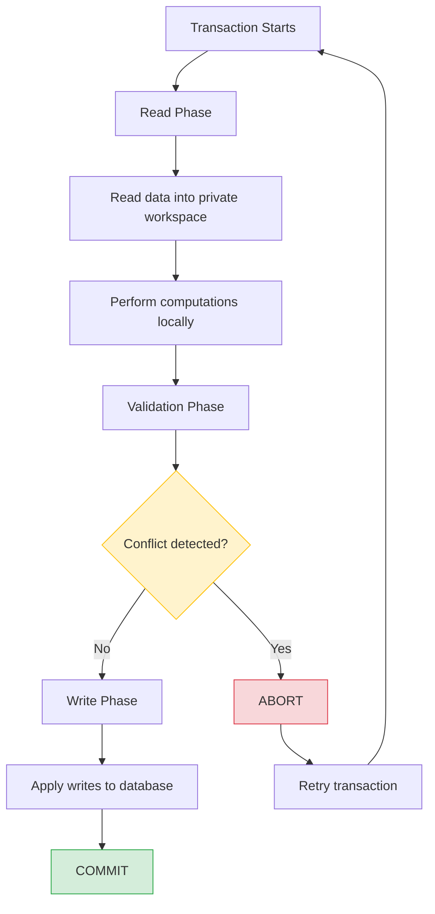
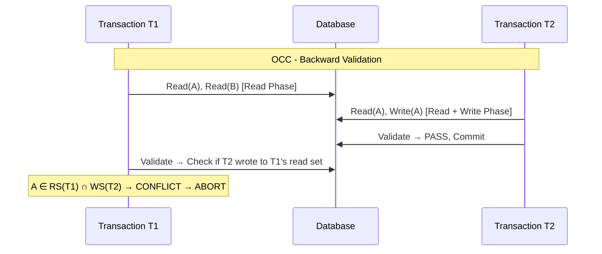

# Optimistic Concurrency Control (OCC)

## Overview

Optimistic Concurrency Control (OCC) is a concurrency control method that assumes conflicts between transactions are **rare**. Instead of locking data during execution, OCC allows transactions to proceed without locks and validates them at commit time. If a conflict is detected, the transaction is aborted and retried.

OCC is "optimistic" because it bets that most transactions won't conflict — the cost of occasional restarts is lower than the overhead of continuous locking.

## When to Use OCC

| Scenario | Why OCC Works |
|---|---|
| Read-heavy workloads | Few writes mean few conflicts |
| Low contention | Transactions rarely touch the same data |
| Short transactions | Small window for conflicts |
| Distributed systems | Avoids distributed lock overhead |
| In-memory databases | Fast retry makes restarts cheap |

**Avoid OCC when:**
- Write contention is high (frequent conflicts → frequent restarts)
- Transactions are long-running (larger conflict window)
- Retry cost is expensive (e.g., heavy computations)

## Three Phases of OCC

Every OCC transaction goes through three phases:

### 1. Read Phase

The transaction reads data from the database and performs computations in a **private workspace** (local copies of data). All writes are buffered — not applied to the database yet.

```
T1: read(A) → local copy A'
T1: read(B) → local copy B'
T1: A' = A' + 100
T1: B' = B' - 100
```

### 2. Validation Phase

At commit time, the system checks whether the transaction's operations **conflict** with any other committed transaction. There are two validation strategies:

#### Backward Validation
Check if any transaction that **committed during** this transaction's execution wrote to items this transaction read or wrote.

#### Forward Validation
Check if any **active (in-progress)** transaction has read items that this transaction wrote.

```
Validation checks:
- Read set intersection with write sets of concurrent transactions
- Write set intersection with read sets of concurrent transactions
```

**Validation timestamp ordering:**
Each transaction gets a timestamp at validation. The system ensures the serial order defined by these timestamps is equivalent to some serial execution.

```
Transaction Ti validates against all Tj where:
  start(Ti) < commit(Tj) < validation(Ti)
  
Check: RS(Ti) ∩ WS(Tj) = ∅
(RS = Read Set, WS = Write Set)
```

### 3. Write Phase

If validation succeeds, the transaction's buffered writes are applied to the database. This is typically done atomically.

```
If validation passes:
  apply A' → database
  apply B' → database
  commit
Else:
  abort and retry
```

## Detailed Example

### Successful Transaction

```
T1 (Read Phase):
  1. Read balance_A = 1000 → local copy
  2. Read balance_B = 500 → local copy
  3. Compute: balance_A' = 900, balance_B' = 600

T1 (Validation Phase):
  4. Check: No concurrent transaction modified balance_A or balance_B
  5. Validation PASSES

T1 (Write Phase):
  6. Write balance_A = 900
  7. Write balance_B = 600
  8. COMMIT
```

### Conflicting Transaction

```
T1 (Read Phase):          T2 (Read Phase):
  Read X = 10               Read X = 10
  Compute X' = 20           Compute X' = 30

T2 (Validation):
  No conflicts → PASSES

T2 (Write Phase):
  Write X = 30 → COMMIT

T1 (Validation):
  Check: T1 read X, T2 wrote X during T1's execution
  CONFLICT DETECTED → ABORT and RETRY
```

## Mermaid Diagram: OCC Flow



## Mermaid Diagram: Backward vs Forward Validation



## Comparison: OCC vs Pessimistic Locking

| Aspect | OCC (Optimistic) | Pessimistic Locking |
|---|---|---|
| Lock acquisition | None during execution | Before read/write |
| Conflict detection | At commit time | At lock request time |
| Overhead under low contention | Low | Medium (lock management) |
| Overhead under high contention | High (frequent restarts) | Medium (waiting) |
| Deadlock possible? | No | Yes |
| Starvation possible? | Yes (lucky transactions keep winning) | Possible |
| Best for | Read-heavy, low contention | Write-heavy, high contention |

## Variants of OCC

### Timestamp-based Validation
Uses timestamps to order transactions. Each transaction gets `start_TS`, `validation_TS`, and `commit_TS`. Validation ensures serializability by checking timestamp ordering.

### Multi-version OCC
Maintains multiple versions of each data item. Readers access older versions without blocking writers. Used in systems like PostgreSQL's MVCC.

### Partition-based OCC
Divides data into partitions. Validation only checks conflicts within the same partition, reducing validation overhead.

## Code Example: Simple OCC Implementation

```python
class OCCManager:
    def __init__(self):
        self.db = {}            # Shared database
        self.committed = []     # List of (commit_ts, read_set, write_set)
        self.timestamp = 0
    
    def begin_transaction(self):
        self.timestamp += 1
        return Transaction(self.timestamp)
    
    def read(self, txn, key):
        txn.read_set.add(key)
        if key in txn.local_writes:
            return txn.local_writes[key]
        return self.db.get(key)
    
    def write(self, txn, key, value):
        txn.write_set.add(key)
        txn.local_writes[key] = value
    
    def validate_and_commit(self, txn):
        # Backward validation
        for (c_ts, c_rs, c_ws) in self.committed:
            if c_ts > txn.start_ts:
                # c committed after txn started
                if txn.read_set & c_ws:
                    return False  # Conflict: txn read something c wrote
        
        # Validation passed — apply writes
        for key, value in txn.local_writes.items():
            self.db[key] = value
        
        self.committed.append(
            (txn.start_ts, txn.read_set, txn.write_set)
        )
        return True

class Transaction:
    def __init__(self, start_ts):
        self.start_ts = start_ts
        self.read_set = set()
        self.write_set = set()
        self.local_writes = {}
```

## Interview Questions

### Beginner

**Q1: What is Optimistic Concurrency Control?**
A: OCC is a concurrency control method that assumes conflicts are rare. Transactions execute without locks, reading data into a private workspace, and validate at commit time. If a conflict is found, the transaction aborts and retries.

**Q2: What are the three phases of OCC?**
A: (1) Read Phase — read data into local workspace; (2) Validation Phase — check for conflicts at commit time; (3) Write Phase — apply buffered writes to the database if validation passes.

**Q3: When does OCC perform well?**
A: OCC performs best in read-heavy workloads with low contention and short transactions, where conflicts are genuinely rare.

**Q4: Can OCC cause deadlocks?**
A: No. Since OCC doesn't use locks, deadlocks are impossible. However, starvation is possible if a transaction keeps getting aborted by others.

### Intermediate

**Q5: What is the difference between backward and forward validation?**
A: Backward validation checks if any transaction that **already committed** during this transaction's execution wrote to items this transaction read. Forward validation checks if any **currently active** transaction has read items this transaction is about to write. Backward is simpler; forward allows more flexibility in handling conflicts (e.g., cascade aborts).

**Q6: How does OCC ensure serializability?**
A: By assigning timestamps at validation time and ensuring the read/write sets of concurrent transactions don't produce non-serializable histories. The validation ensures that the execution is equivalent to a serial order defined by commit timestamps.

**Q7: What is the "phantom problem" in OCC and how is it handled?**
A: A phantom occurs when a transaction's read set changes between read and validation (new rows inserted by another transaction). OCC handles this by including predicate-based reads in the validation set — checking not just specific items but the results of range queries.

**Q8: How does OCC compare to MVCC?**
A: MVCC maintains multiple versions so readers never block writers. OCC validates at commit time without versions. Some systems combine both — multi-version OCC maintains versions and validates to ensure consistency.

### Advanced / FAANG-Level

**Q9: How would you implement OCC for a distributed database?**
A: In a distributed setting, each node does local validation, then a coordinator performs global validation. The key challenge is ensuring consistent read sets across nodes. Approaches: (1) Send read/write sets to a central validator; (2) Use partition-level validation with distributed timestamps; (3) Combine with 2PC for atomic writes. Systems like Calvin and Spanner use deterministic ordering to avoid traditional OCC validation.

**Q10: What happens to starvation in OCC under high contention?**
A: Under high contention, the same transaction may keep getting aborted (livelock/starvation). Solutions: (1) Exponential backoff with jitter on retry; (2) Priority-based validation (older transactions get priority); (3) Switch to pessimistic locking after N failed retries (adaptive concurrency control); (4) Use wait-die or wound-wait schemes for ordering retries.

**Q11: A system uses OCC and you notice throughput collapses at 80% write contention. How do you diagnose and fix it?**
A: Diagnosis: Profile abort rates — if >50% of transactions are restarting, OCC overhead dominates. The quadratic cost of repeated retries under high contention causes collapse. Fix: (1) Implement adaptive concurrency control — switch to 2PL when contention exceeds a threshold; (2) Use partition-based OCC to reduce the conflict domain; (3) Consider timestamp ordering (e.g., MVTO) instead of pure validation-based OCC; (4) Batch conflicting writes to reduce the number of conflicting transactions.

**Q12: Design an OCC system that supports long-running read-only transactions without blocking writers.**
A: Use multi-version OCC: writers create new versions, readers access snapshot versions from their start timestamp. Validation only checks write-write conflicts. Long readers never block writers because they read old versions. Garbage collect versions older than the oldest active reader's timestamp. This is essentially how PostgreSQL's MVCC works.

## Common Mistakes

1. **Using OCC for write-heavy workloads** — Frequent conflicts cause excessive restarts, degrading performance worse than pessimistic locking.

2. **Not handling phantom reads** — Only checking specific items in the read set misses new rows inserted by concurrent transactions. Include predicate ranges in validation.

3. **Infinite retry loops** — Without backoff or retry limits, a transaction can starve forever. Always implement exponential backoff and a maximum retry count.

4. **Large read sets** — Transactions that read many items have a high probability of conflict. Keep transactions short and read sets small.

5. **Ignoring the cost of validation** — For large databases, scanning committed transaction logs for conflicts can be expensive. Use efficient data structures (e.g., bloom filters) for conflict detection.

## Summary

| Aspect | Detail |
|---|---|
| Strategy | Assume conflicts are rare; validate at commit |
| Phases | Read → Validation → Write |
| Locking | None during execution |
| Deadlocks | Impossible (no locks) |
| Best for | Read-heavy, low contention, short transactions |
| Weakness | High contention causes restart storms |
| Serializability | Ensured via timestamp-ordered validation |

## Cross-References

- [Isolation Levels](./isolation-levels.md) — OCC typically achieves Snapshot Isolation or Serializable
- [MVCC](./mvcc.md) — Multi-version OCC combines versioning with optimistic validation
- [Two-Phase Locking](../indexing/) — The pessimistic alternative to OCC
- [Distributed Transactions](./distributed.md) — OCC challenges in distributed systems
- [Recovery](./recovery.md) — How OCC interacts with logging and recovery


## Cross References

- [MVCC](../dbms/transactions/mvcc.md)
- [Timestamp-Based](../dbms/transactions/timestamp-based.md)
- [CAS (OS)](../os/synchronization/cas.md)
- [Lock-Free (OS)](../os/synchronization/lock-free.md)
