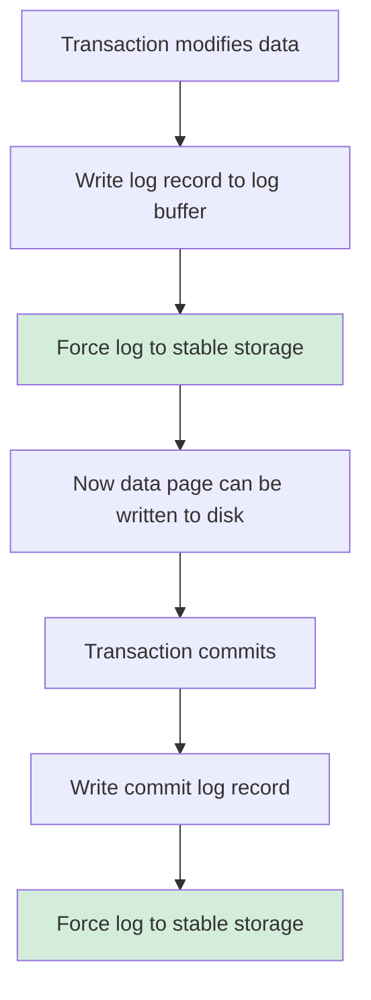
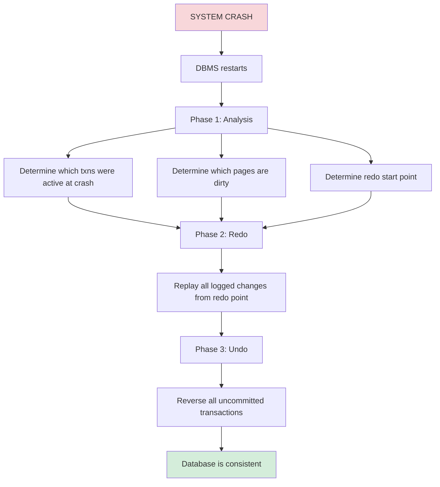

# Transaction Recovery

## Overview

Transaction recovery ensures that a database remains **consistent despite failures**. When a system crashes, transactions may be partially completed — some operations succeeded, others didn't. Recovery mechanisms bring the database back to a consistent state where:

1. All **committed** transactions' effects are present (Durability)
2. All **uncommitted** transactions' effects are removed (Atomicity)

## Why Recovery is Needed

```
Scenario: Transfer $100 from Account A to Account B

Step 1: Debit A (balance: 1000 → 900) ✓ Written to disk
        >>> SYSTEM CRASH <<<
Step 2: Credit B (balance: 500 → 600) ✗ Never executed

Without recovery:
  A lost $100, B didn't receive it — INCONSISTENT

With recovery:
  Detect incomplete transaction → Undo Step 1
  A's balance restored to 1000 — CONSISTENT
```

## Types of Failures

### Transaction Failures
- **Logical errors**: Constraint violations, deadlocks, application errors
- **System errors**: Overflow, resource exhaustion

### System Failures
- **Software crashes**: OS crash, DBMS crash, power failure
- **Affects**: Volatile storage (RAM) lost, stable storage (disk) survives

### Media Failures
- **Disk failure**: Head crash, corruption
- **Affects**: Stable storage (disk) lost
- **Solution**: Backups, RAID, replication

## Recovery Fundamentals

### ACID Properties and Recovery

Recovery primarily ensures **Atomicity** and **Durability**:

- **Atomicity**: Either all operations of a transaction happen, or none do
- **Durability**: Once committed, effects persist even after crashes

### Stable vs Volatile Storage

```
┌─────────────────┐     ┌─────────────────┐
│  Volatile        │     │  Stable          │
│  (RAM/Buffer)    │     │  (Disk/SSD)      │
│                  │     │                  │
│  - Buffer pool   │────▶│  - Data files    │
│  - Log buffer    │────▶│  - Log files     │
│  - Active txns   │     │  - Checkpoints   │
│                  │     │                  │
│  LOST on crash   │     │  SURVIVES crash  │
└─────────────────┘     └─────────────────┘
```

## Recovery Approaches

### 1. Deferred Update

Writes are **buffered** and only applied to the database at commit time.

```
Transaction T:
  Read A (from disk)
  Modify A in buffer
  Read B (from disk)
  Modify B in buffer
  COMMIT → flush all modifications to disk atomically
```

**Advantages:**
- Simple recovery: uncommitted transactions have no effect on disk
- Only need to handle partial commits (redo)

**Disadvantages:**
- High commit overhead (many writes at once)
- Large buffer requirements

### 2. Immediate Update

Modifications are applied to the database **during** the transaction (before commit).

```
Transaction T:
  Read A (from disk)
  Modify A → write to buffer → flush to disk
  Read B (from disk)
  Modify B → write to buffer → flush to disk
  COMMIT
```

**Requires:**
- **Undo** capability to reverse uncommitted changes after crash
- **Redo** capability to re-apply committed changes not yet on disk

### 3. Write-Ahead Logging (WAL)

The **standard approach** used by all modern databases. Before any change is written to the database, the change is recorded in a log.

**WAL Rule:**
> The log record for a change must be written to stable storage **before** the corresponding data page is written to disk.

```
WAL Protocol:
1. Transaction modifies page P in buffer
2. Write log record to log buffer
3. Flush log record to stable storage (force log)
4. Only THEN may page P be written to disk
```



## Log Records

A typical log record contains:

```
Log Record = {
    LSN:        Log Sequence Number (unique, monotonically increasing)
    TxnID:      Transaction identifier
    PrevLSN:    Previous log record for this transaction
    Type:       UPDATE / COMMIT / ABORT / CLR / ...
    PageID:     Page being modified
    Offset:     Offset within page
    BeforeImg:  Old value (for undo)
    AfterImg:   New value (for redo)
}
```

### Types of Log Records

| Type | Purpose | Content |
|---|---|---|
| UPDATE | Data modification | Before image + After image |
| COMMIT | Transaction committed | TxnID |
| ABORT | Transaction aborted | TxnID |
| CLR (Compensation Log Record) | Undo operation record | Undo info + UndoNextLSN |
| CHECKPOINT | Recovery marker | Active txn list + dirty page list |
| END | Transaction fully completed | TxnID |

### LSN (Log Sequence Number)

The LSN is a monotonically increasing identifier for log records. It serves as:
- A **physical address** for locating log records
- A **logical clock** for ordering operations
- A **checkpoint marker** for recovery

```
LSN typically encodes: (file_number, offset_in_file)
Example: LSN 0x00000001/000001A8 = file 1, offset 424
```

## Key Recovery Concepts

### Dirty Page Table

Tracks which buffer pool pages have been modified but not yet flushed to disk.

```
DirtyPageTable = {
    Page1: recLSN = 100  (LSN of first log record that dirtied this page)
    Page3: recLSN = 250
    Page7: recLSN = 180
}
```

`recLSN` (recovery LSN) is the **oldest** log record that dirtied the page. Any log records before `recLSN` are already on disk for that page.

### Transaction Table

Tracks currently active transactions and their state.

```
TransactionTable = {
    T1: {status: ACTIVE,  lastLSN: 500}
    T2: {status: ACTIVE,  lastLSN: 320}
    T3: {status: COMMITTED, lastLSN: 280}
}
```

## Mermaid Diagram: Recovery Process Overview



## Interview Questions

### Beginner

**Q1: What is the purpose of transaction recovery?**
A: Recovery ensures the database returns to a consistent state after a failure. It guarantees atomicity (all or nothing for transactions) and durability (committed data persists through crashes).

**Q2: What is the difference between undo and redo in recovery?**
A: Undo reverses the effects of uncommitted transactions (removes partial changes). Redo re-applies the effects of committed transactions that may not have reached disk before the crash.

**Q3: What is Write-Ahead Logging?**
A: WAL is a protocol requiring that log records for changes must be written to stable storage before the corresponding data pages are written to disk. This ensures that recovery has enough information to either redo or undo any change.

### Intermediate

**Q4: Why can't we just use checkpoints instead of WAL?**
A: Checkpoints reduce the amount of log to scan but don't eliminate the need for WAL. Without WAL, if a dirty page is flushed before its log record, we lose the ability to undo or redo that change. WAL ensures the log always has enough information.

**Q5: What happens to a transaction that was in progress when the system crashed?**
A: It is rolled back (undone). The recovery process identifies all transactions that were active at crash time (no COMMIT or ABORT record in the log) and reverses their changes using before images.

**Q6: What is a Compensation Log Record (CLR)?**
A: A CLR records an undo operation. It's written when recovery undoes an update. CLRs have an `UndoNextLSN` pointing to the next record to undo, enabling efficient undo processing. CLRs are never themselves undone (they are redo-only).

### Advanced / FAANG-Level

**Q7: How does the WAL protocol interact with fsync and disk scheduling?**
A: WAL requires that log records are on stable storage before data pages are written. This means `fsync()` on the log file must complete before dirty pages can be flushed. To minimize overhead: (1) Group commit — batch multiple transactions' log writes into one fsync; (2) Use O_DIRECT or async I/O to avoid double-buffering; (3) Place log and data on separate disks to parallelize I/O. The fsync cost is often the bottleneck — NVMe SSDs significantly reduce this.

**Q8: A database system loses its log file due to disk corruption. What happens?**
A: Without the log, recovery is impossible using WAL. Options: (1) Restore from backup + replay from replication stream; (2) If using synchronous replication, the replica has the data; (3) Accept data loss since last checkpoint. This is why log files are often on RAID or mirrored storage, and why `archive_mode` in PostgreSQL archives WAL to separate storage.

**Q9: Design a recovery system for a distributed database where nodes crash independently.**
A: Each node maintains its own WAL. Global consistency requires: (1) 2PC for distributed commits — coordinator's decision must be durable before participants commit; (2) Each node recovers independently using local WAL; (3) After local recovery, nodes may need to reconcile with the coordinator's decision (e.g., if coordinator committed but node crashed before receiving the decision, query coordinator during recovery); (4) Use 3PC or Paxos commit to avoid blocking on coordinator failure.

## Common Mistakes

1. **Not flushing log on commit** — If the commit record isn't on stable storage, the transaction's durability isn't guaranteed. Always force log on commit.

2. **Confusing undo and abort** — Abort is the decision to roll back; undo is the physical process of reversing changes. A transaction may be aborted but not yet fully undone.

3. **Ignoring checkpoint frequency** — Too infrequent checkpoints mean long recovery times. Too frequent checkpoints waste I/O. Tune based on recovery time objectives.

4. **Not placing log on separate disk** — Log writes are sequential; data writes are random. Mixing them on the same disk hurts both.

## Summary

| Concept | Detail |
|---|---|
| Purpose | Ensure atomicity and durability after failures |
| WAL Protocol | Log before data; ensures undo/redo information survives |
| Log Records | Update, Commit, Abort, CLR, Checkpoint |
| Recovery Phases | Analysis → Redo → Undo |
| Dirty Pages | Modified in buffer but not flushed to disk |
| LSN | Monotonically increasing identifier for log records |

## Cross-References

- [Log-based Recovery](./log-recovery.md) — Detailed WAL, undo/redo mechanisms
- [Checkpointing](./checkpointing.md) — How checkpoints speed up recovery
- [ARIES](./aries.md) — The complete recovery algorithm
- [MVCC](./mvcc.md) — How MVCC interacts with recovery
- [Distributed Transactions](./distributed.md) — Recovery in distributed systems
