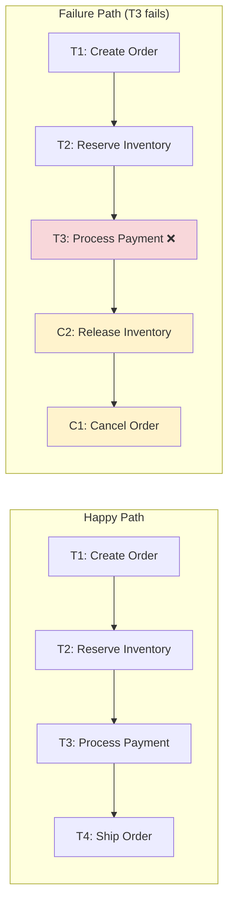
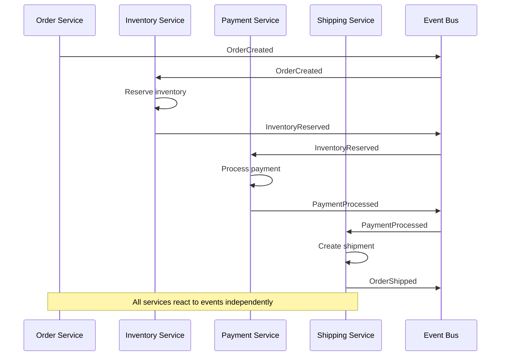
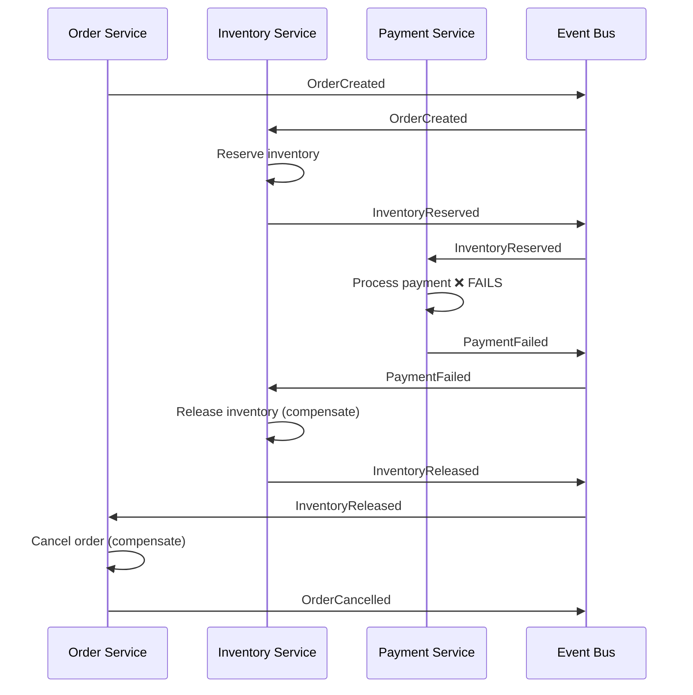
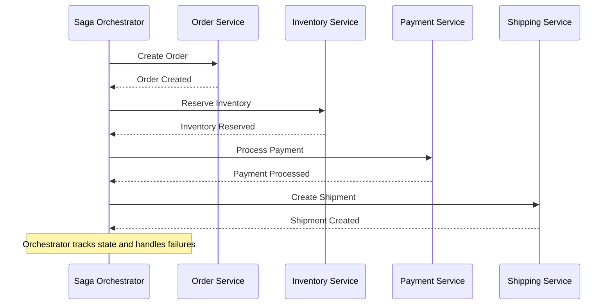
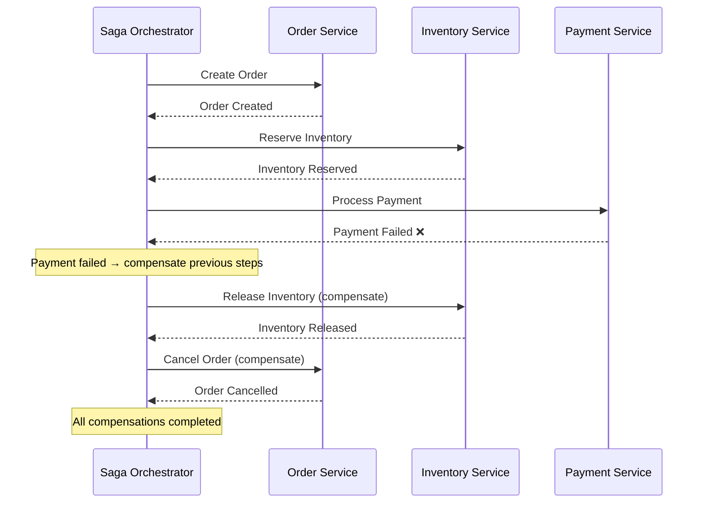
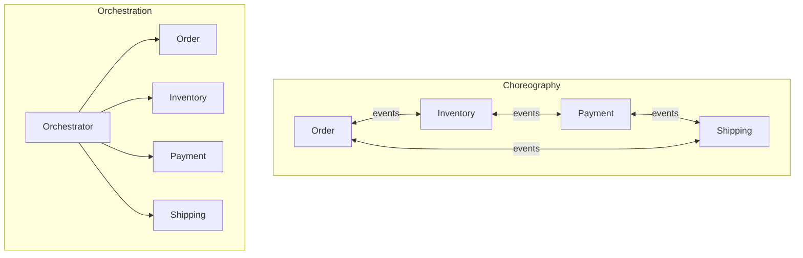
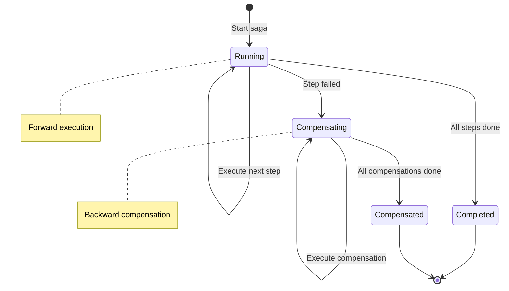

# Saga Pattern

## Overview

The Saga pattern is a **design pattern for managing distributed transactions** across microservices. Instead of using a single distributed transaction (like 2PC), a Saga breaks the transaction into a sequence of **local transactions**, each with a corresponding **compensating transaction** that can undo its effects if something goes wrong.

Sagas are **eventually consistent** — intermediate states are visible, but the system converges to a consistent state either by completing all steps or executing compensating transactions.

## Why Sagas?

### Problems with 2PC in Microservices

```
2PC in Microservices:
  - Requires all services to support the same protocol (XA)
  - Long-running transactions hold locks across services
  - Coordinator is a single point of failure
  - Doesn't scale well with many participants
  - Tight coupling between services
```

### Saga Advantages

```
Sagas:
  ✓ Each service manages its own local transaction
  ✓ No distributed locks
  ✓ No coordinator failure blocking
  ✓ Services can use different databases
  ✓ Loose coupling via events
  ✗ Intermediate states are visible (eventual consistency)
  ✗ Compensating transactions can be complex
```

## Saga Structure

A Saga consists of a sequence of **steps** (T1, T2, ..., Tn), each with a **compensating transaction** (C1, C2, ..., Cn).

```
Forward execution: T1 → T2 → T3 → ... → Tn
Failure at T3:     T1 → T2 → T3(fails) → C2 → C1
```

### Mermaid Diagram: Saga Execution



## Two Implementation Approaches

### 1. Choreography-Based Saga

Each service listens for events and decides what to do next. There is **no central coordinator**.



#### Choreography Failure Handling



#### Advantages and Disadvantages of Choreography

| Advantages | Disadvantages |
|---|---|
| No single point of failure | Hard to understand overall flow |
| Loose coupling | Cyclic dependencies possible |
| Each service is autonomous | Difficult to track saga progress |
| Simple for 2-3 services | Complex for many services |

### 2. Orchestration-Based Saga

A central **orchestrator** (saga manager) coordinates the saga. It tells each service what to do and handles failures.



#### Orchestration Failure Handling



#### Advantages and Disadvantages of Orchestration

| Advantages | Disadvantages |
|---|---|
| Clear control flow | Orchestrator is a single point of failure |
| Easy to track saga state | Orchestrator can become complex |
| No cyclic dependencies | Tight coupling with orchestrator |
| Easier error handling | Extra network hop |

## Comparison: Choreography vs Orchestration



| Aspect | Choreography | Orchestration |
|---|---|---|
| Coupling | Loose | Medium |
| Complexity | Distributed | Centralized |
| Traceability | Hard | Easy |
| Failure handling | Each service decides | Orchestrator decides |
| Best for | Simple flows (2-3 services) | Complex flows (4+ services) |
| SPOF | No | Yes (orchestrator) |
| Cyclic deps | Possible | No |

## Compensating Transactions

### What is a Compensating Transaction?

A compensating transaction **semantically undoes** the effect of a previous transaction. It's not necessarily the exact reverse operation — it's an operation that produces an equivalent result to "not having done the original operation."

```
Original: Reserve 5 units of Product X
Compensate: Release 5 units of Product X

Original: Charge $100 to credit card
Compensate: Refund $100 to credit card

Original: Insert row into orders table
Compensate: Mark order as cancelled (soft delete)
```

### Properties of Compensating Transactions

1. **Semantic inverse**: Produces the same state as "not having done the original"
2. **Idempotent**: Safe to execute multiple times
3. **Composable**: Can be chained together
4. **Retryable**: Must succeed eventually (may need retries)

### Compensating vs Retrying

```
When to compensate:
  - Semantic error (payment declined, inventory unavailable)
  - Business logic failure
  - Timeout that means "won't happen"

When to retry:
  - Transient error (network timeout, service temporarily down)
  - Resource contention (deadlock)
  - Rate limiting
```

## Saga State Machine



## Idempotency in Sagas

Since network failures can cause retries, all saga operations must be **idempotent**:

```python
# Non-idempotent (BAD):
def reserve_inventory(order_id, product_id, quantity):
    inventory[product_id] -= quantity  # If retried, double deduction!

# Idempotent (GOOD):
def reserve_inventory(order_id, product_id, quantity):
    if already_processed(order_id):
        return success  # Already done, skip
    inventory[product_id] -= quantity
    mark_processed(order_id)
```

## Practical Example: E-Commerce Order

```
Saga: Place Order

Step 1: Order Service → Create order (status: PENDING)
  Compensate: Cancel order

Step 2: Inventory Service → Reserve items
  Compensate: Release items

Step 3: Payment Service → Charge payment
  Compensate: Refund payment

Step 4: Order Service → Confirm order (status: CONFIRMED)
  Compensate: Cancel order

Step 5: Notification Service → Send confirmation email
  Compensate: Send cancellation email
```

## Interview Questions

### Beginner

**Q1: What is the Saga pattern?**
A: The Saga pattern manages distributed transactions by breaking them into a sequence of local transactions, each with a compensating transaction. If a step fails, compensating transactions undo the effects of previous steps.

**Q2: What is a compensating transaction?**
A: A transaction that semantically undoes the effect of a previous transaction. For example, if the original operation reserved inventory, the compensating transaction releases it.

**Q3: What is the difference between choreography and orchestration?**
A: Choreography: each service reacts to events and decides what to do (no central coordinator). Orchestration: a central orchestrator tells each service what to do and handles failures.

### Intermediate

**Q4: When should you use choreography vs orchestration?**
A: Use choreography for simple flows with 2-3 services where loose coupling is important. Use orchestration for complex flows with 4+ services where you need clear control flow and easy error handling.

**Q5: Why must saga operations be idempotent?**
A: Because network failures can cause retries. If an operation isn't idempotent, retrying it could cause incorrect behavior (e.g., charging a customer twice).

**Q6: What happens if a compensating transaction fails?**
A: The orchestrator retries it. Compensating transactions must be designed to eventually succeed (idempotent, retryable). If all retries fail, manual intervention may be needed.

### Advanced / FAANG-Level

**Q7: Design a saga orchestrator that handles all failure modes.**
A: (1) Persist saga state in a durable store (database). (2) Use a state machine for each saga step (PENDING → RUNNING → COMPLETED/FAILED). (3) Implement retry with exponential backoff for transient failures. (4) Implement dead letter queue for permanently failed steps. (5) Use idempotency keys for all operations. (6) Implement timeout-based failure detection. (7) Support parallel steps where possible (with join points). (8) Emit metrics and events for monitoring.

**Q8: How do you handle the "lack of isolation" problem in sagas?**
A: Sagas have no isolation — intermediate states are visible. Solutions: (1) Semantic locks — mark resources as "in progress" (e.g., order status: PENDING). (2) Commutative updates — design operations that produce correct results regardless of order. (3) Pessimistic views — reorder saga steps to minimize the window of inconsistency. (4) Reread value — read the current value before overwriting (prevent lost updates). (5) Version files — track version numbers to detect conflicts.

**Q9: A saga has 10 steps. Step 7 fails. The compensation for step 3 (payment refund) takes 24 hours. How do you design around this?**
A: (1) Make the payment refund asynchronous — record the refund request and process it in the background. (2) Update the order status to "REFUND_PENDING" so the system knows the saga is in compensation. (3) Don't block the orchestrator waiting for the refund — poll for completion. (4) Design the compensation to be idempotent so retries are safe. (5) Consider breaking the saga into smaller sub-sagas where long-running compensations are at the end.

**Q10: Compare sagas with 2PC for a banking system that transfers money between accounts in different banks.**
A: 2PC: Strong consistency, all-or-nothing guarantee. But: blocking, requires XA support from both banks, holds locks, doesn't scale. Sagas: Eventually consistent, non-blocking. But: intermediate states visible (money debited but not yet credited), compensating transactions (refunds) can be complex. For banking: Use sagas with strong idempotency and audit trails. The debit and credit are separate local transactions. If credit fails, compensate with a refund. Accept eventual consistency with clear status tracking for users.

## Common Mistakes

1. **Not making operations idempotent** — Retries will cause incorrect behavior. Always use idempotency keys.

2. **Forgetting to compensate all side effects** — If a step sends an email, the compensation must handle that (send cancellation email).

3. **Tight coupling between services** — Choreography requires loose coupling via events. Don't have services call each other directly.

4. **Not persisting saga state** — If the orchestrator crashes, saga state is lost. Persist it to a database.

5. **Designing compensations that can't succeed** — Compensating transactions must be designed to eventually succeed. If they depend on external systems that may be down, implement retries with backoff.

6. **Ignoring the visibility of intermediate states** — Users may see "Order Pending" for a while. Design the UI to handle this gracefully.

## Summary

| Aspect | Detail |
|---|---|
| Pattern | Sequence of local transactions + compensating transactions |
| Consistency | Eventually consistent |
| Isolation | No isolation (intermediate states visible) |
| Implementation | Choreography (events) or Orchestration (central coordinator) |
| Key requirement | All operations must be idempotent |
| Best for | Microservices, long-running transactions |
| Trade-off | Availability over strong consistency |

## Cross-References

- [Distributed Transactions](./distributed.md) — Overview of distributed transactions
- [Two-Phase Commit](./two-phase-commit.md) — The protocol sagas replace
- [Isolation Levels](./isolation-levels.md) — Sagas have no isolation guarantees
- [Recovery](./recovery.md) — Recovery in saga-based systems
