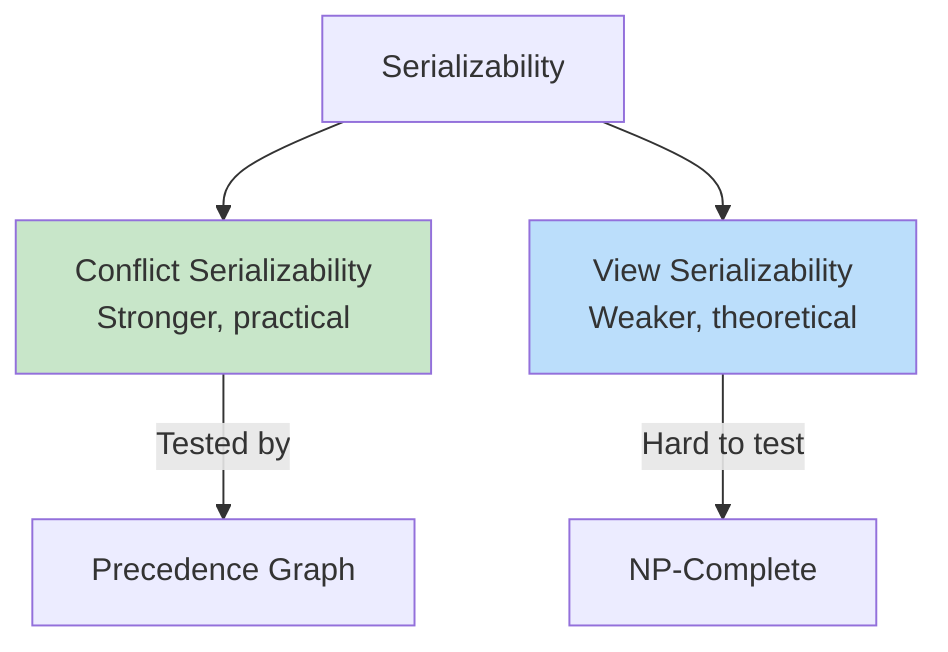
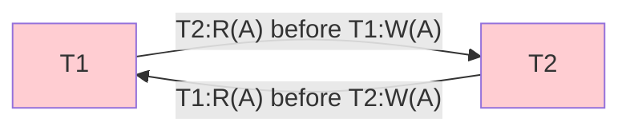

# Serializability

## Overview

**Serializability** is the gold standard for correctness in concurrent transaction execution. A schedule is **serializable** if it produces the same result as some serial (non-interleaved) execution of the same transactions. It ensures that concurrent execution doesn't introduce anomalies.

## Types of Serializability



## Serial vs Non-Serial Schedules

### Serial Schedule
Transactions execute one after another with no interleaving.

```
T1: R(A) W(A) R(B) W(B)
T2:                    R(A) W(A) R(B) W(B)
```

Always correct but poor throughput.

### Non-Serial Schedule
Operations from different transactions are interleaved.

```
T1: R(A)      W(A)           R(B) W(B)
T2:      R(A)      W(A) R(B)           W(B)
```

Better throughput but may produce incorrect results.

## Conflict Serializability

Two operations **conflict** if:
1. They belong to **different transactions**
2. They access the **same data item**
3. At least one is a **write**

### Conflicting Operations

| Op1 | Op2 | Conflict? |
|---|---|---|
| R(X) | R(X) | No (both reads) |
| R(X) | W(X) | Yes |
| W(X) | R(X) | Yes |
| W(X) | W(X) | Yes |

### Conflict Equivalence

Schedule S is **conflict equivalent** to schedule S' if:
1. Both involve the same transactions
2. Every pair of conflicting operations is ordered the same way in both schedules

### Conflict Serializability Test (Precedence Graph)

Build a **precedence graph** (also called serialization graph):
1. One node per transaction
2. Edge Ti → Tj if an operation in Ti conflicts with and precedes an operation in Tj

**The schedule is conflict serializable if and only if the precedence graph is acyclic.**

### Example 1: Conflict Serializable

```
T1: R(A) W(A) R(B) W(B)
T2:           R(A)      W(A)

Schedule: T1:R(A), T1:W(A), T2:R(A), T1:R(B), T1:W(B), T2:W(A)
```

Conflicts:
- T1:W(A) conflicts with T2:R(A) → T1 before T2
- T1:W(A) conflicts with T2:W(A) → T1 before T2

Graph: T1 → T2 (acyclic) → **Conflict serializable** ✅

Equivalent serial order: T1, T2

### Example 2: Not Conflict Serializable

```
T1: R(A) W(A)
T2: R(A) W(A)

Schedule: T1:R(A), T2:R(A), T1:W(A), T2:W(A)
```

Conflicts:
- T1:R(A) vs T2:W(A) → T1 before T2
- T2:R(A) vs T1:W(A) → T2 before T1

Graph: T1 → T2 AND T2 → T1 (cycle!) → **Not conflict serializable** ❌

This is the classic **lost update** problem.



## View Serializability

A schedule S is **view equivalent** to a serial schedule S' if:
1. Same initial reads: If Ti reads the initial value of X in S, it does so in S'
2. Same write-read: If Ti reads a value of X written by Tj in S, it does so in S'
3. Same final writes: The transaction that performs the final write on X in S also does so in S'

**View serializability is more general** than conflict serializability — every conflict-serializable schedule is view-serializable, but not vice versa.

**Testing view serializability is NP-complete** — no efficient algorithm exists.

## Recoverability

A schedule is **recoverable** if transactions commit only after all transactions whose writes they read have committed.

### Types

| Type | Description |
|---|---|
| **Recoverable** | Tj reads Ti's data → Ti commits before Tj |
| **Cascadeless** | Tj reads Ti's data only after Ti commits (no cascading aborts) |
| **Strict** | Tj reads/writes Ti's data only after Ti commits or aborts |

```
-- Not recoverable:
T1: W(A)
T2:      R(A)    -- reads T1's uncommitted write
T2:           COMMIT
T1:                ROLLBACK  -- T2 used dirty data!

-- Cascadeless:
T1: W(A) COMMIT
T2:              R(A) COMMIT  -- reads only committed data
```

## Locking and Serializability

### Two-Phase Locking (2PL)

2PL guarantees conflict serializability:
1. **Growing phase**: Transaction acquires locks, never releases
2. **Shrinking phase**: Transaction releases locks, never acquires

If all transactions follow 2PL, the schedule is conflict serializable.

**Problem**: 2PL can cause **deadlocks**.

See: [Lock-Based Concurrency Control](lock-based.md)

## Interview Questions

### Beginner

**Q1: What is serializability?**
A: A schedule is serializable if it produces the same result as some serial execution of the transactions. It's the correctness criterion for concurrent transactions — ensuring that interleaving doesn't introduce anomalies.

**Q2: What is a conflict in transaction scheduling?**
A: Two operations conflict if they are from different transactions, access the same data item, and at least one is a write. Two reads don't conflict. A read-write or write-write pair does conflict.

**Q3: What is the difference between conflict and view serializability?**
A: Conflict serializability requires that conflicting operations are ordered the same way. View serializability only requires that the read-from and final-write relationships are preserved. Conflict serializability is a subset of view serializability and is efficiently testable.

### Intermediate

**Q4: How do you test for conflict serializability?**
A: Build a precedence graph: one node per transaction, edge Ti → Tj if an operation in Ti conflicts with and precedes an operation in Tj. If the graph is acyclic, the schedule is conflict serializable. The topological sort gives the equivalent serial order.

**Q5: What is the difference between cascadeless and strict schedules?**
A: **Cascadeless**: A transaction only reads data after the writing transaction commits (prevents cascading aborts). **Strict**: A transaction only reads OR writes data after the writing transaction commits or aborts (stricter, prevents all dirty reads and writes). Strict schedules are the easiest to implement with locks.

**Q6: Can a schedule be view-serializable but not conflict-serializable?**
A: Yes. Classic example: T1:W(A), T2:W(A), T3:W(A) where the final write is by T3. Any order of the three transactions that preserves T3 as the final writer is view-serializable but may not be conflict-serializable due to cycles in the precedence graph.

### Advanced

**Q7: Prove that 2PL guarantees conflict serializability.**
A: Assume all transactions follow 2PL. Suppose the precedence graph has a cycle: T1 → T2 → ... → Tn → T1. For edge Ti → Tj, Ti must have held a lock on some item X that Tj later locked. In 2PL, Ti acquired its lock before Tj. In the shrinking phase, Ti releases locks after all acquisitions. So Ti's lock on X was acquired before Tj's. For the cycle to exist, T1's lock on X1 before T2, T2's lock on X2 before T3, ..., Tn's lock on Xn before T1. But T1 must have released Xn (to allow Tn to lock it) before acquiring X1 — violating the growing phase requirement. Contradiction. ∎

**Q8: How do modern databases balance serializability with performance?**
A: Most databases default to lower isolation levels (READ COMMITTED or REPEATABLE READ) and let applications choose SERIALIZABLE when needed. Techniques:
- **MVCC**: Readers don't block writers, providing snapshot isolation
- **Optimistic concurrency**: Detect conflicts at commit time
- **SSI (Serializable Snapshot Isolation)**: PostgreSQL's approach — detects dangerous structures (rw-dependencies) that could cause non-serializable behavior
- **Fine-grained locking**: Row-level locks instead of table-level

## Common Mistakes

- Confusing serializability with isolation levels (they're related but different)
- Assuming all databases default to SERIALIZABLE (most don't)
- Not understanding that 2PL can cause deadlocks
- Thinking view serializability is efficiently testable (it's NP-complete)
- Ignoring recoverability — even serializable schedules can be non-recoverable

## Summary

| Concept | Description | Testability |
|---|---|---|
| Conflict serializability | Equivalent to serial via conflict ordering | Polynomial (precedence graph) |
| View serializability | Equivalent to serial via read/write relationships | NP-complete |
| 2PL | Protocol guaranteeing conflict serializability | N/A (protocol, not test) |
| Recoverable | Commits depend on read-from commits | Check at runtime |
| Cascadeless | No reading uncommitted data | Check at runtime |
| Strict | No reading/writing uncommitted data | Check at runtime |

## Cross-References

- [Concurrency Control](concurrency-control.md) — Implementing serializability
- [Lock-Based](lock-based.md) — 2PL protocol
- [Isolation Levels](isolation-levels.md) — Practical serializability
- [MVCC](mvcc.md) — Snapshot isolation


## Cross References

- [Isolation Levels](../dbms/transactions/isolation-levels.md)
- [Concurrency Control](../dbms/transactions/concurrency-control.md)
- [Lock-Based](../dbms/transactions/lock-based.md)
- [Critical Section (OS)](../os/synchronization/critical-section.md)
