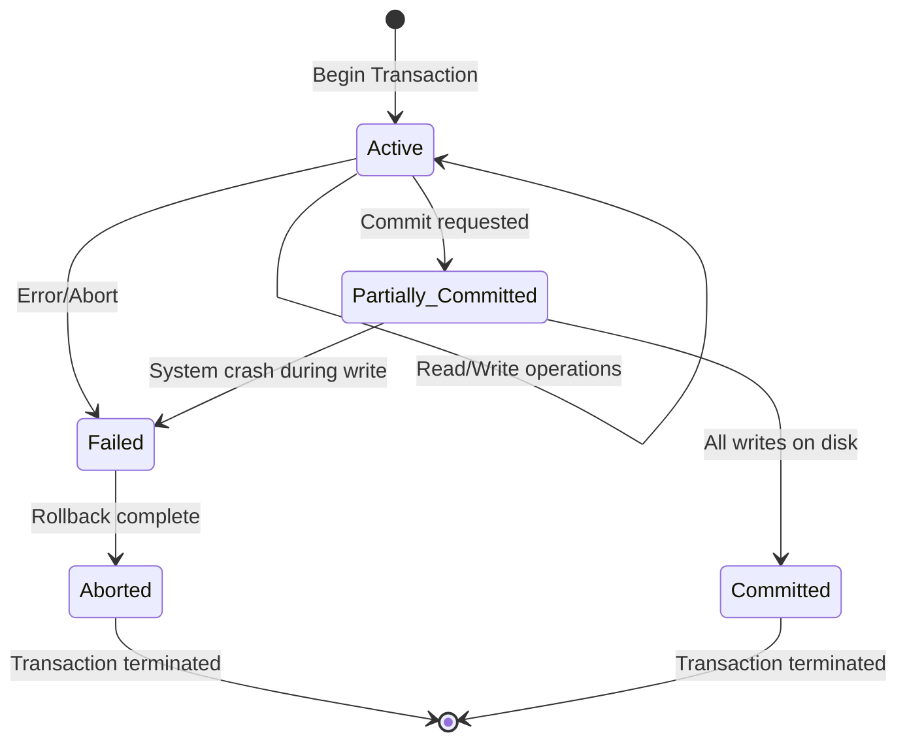
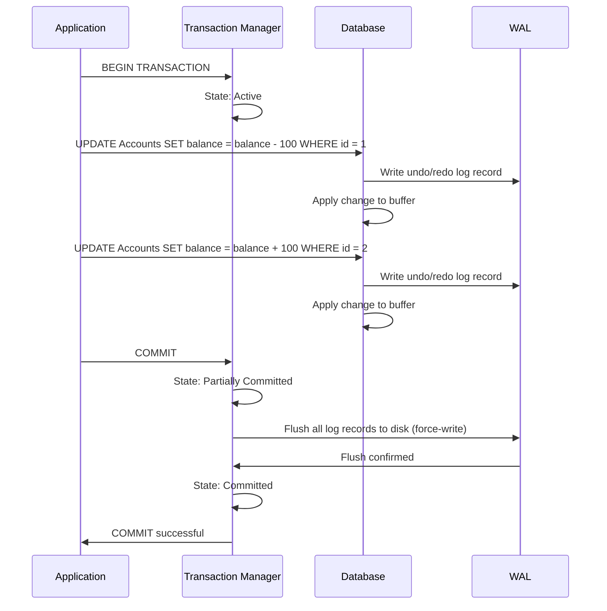

# Transaction States

## Overview

A transaction goes through several **states** during its lifecycle, from initiation to completion (commit or abort). Understanding these states is essential for grasping how the DBMS manages transactions, handles failures, and ensures ACID properties.

## Transaction State Diagram



## States in Detail

### 1. Active

The transaction is **currently executing**. Operations (READ, WRITE) are being performed. The transaction remains in this state until it either commits or encounters an error.

```sql
BEGIN;  -- Transaction enters Active state
SELECT balance FROM Accounts WHERE id = 1;   -- Active: read
UPDATE Accounts SET balance = balance - 50 WHERE id = 1;  -- Active: write
UPDATE Accounts SET balance = balance + 50 WHERE id = 2;  -- Active: write
```

### 2. Partially Committed

The transaction has executed its final operation (COMMIT statement issued), but the changes have **not yet been permanently written** to the database. The system is in the process of ensuring durability.

```sql
COMMIT;  -- Enters Partially Committed state
-- Changes are in the WAL buffer, not yet flushed to disk
-- If system crashes NOW, the transaction might be lost
```

### 3. Committed

The transaction has **successfully completed** and all changes are **permanently stored** on stable storage. The ACID properties are fully satisfied.

```sql
COMMIT;
-- After WAL flush to disk → Committed state
-- Changes are permanent and visible to other transactions
```

### 4. Failed

The transaction has **failed** due to an error (constraint violation, deadlock, system crash, explicit abort). It can no longer proceed.

```sql
BEGIN;
UPDATE Accounts SET balance = balance - 1000 WHERE id = 1;
-- ERROR: insufficient funds (CHECK constraint violation)
-- Transaction enters Failed state
```

### 5. Aborted

The transaction has been **rolled back** — all its changes have been undone. The database is restored to the state before the transaction began.

```sql
ROLLBACK;  -- Enters Aborted state
-- All changes undone using undo log
-- Database restored to consistent state before the transaction
```

After abort, the system may:
- **Restart the transaction** (automatic retry)
- **Report the error** to the application
- **Terminate** the transaction entirely

## Transaction Lifecycle Example



## Crash Scenarios

### Crash During Active State
- Transaction was not committed
- On recovery: transaction is **rolled back** (undo)

### Crash During Partially Committed
- COMMIT was issued but log not flushed
- On recovery: transaction may be **rolled back** (undo) if log is incomplete
- Or **replayed** (redo) if log is complete but DB not updated

### Crash After Committed
- Changes are durable (log was flushed)
- On recovery: transaction is **redone** if needed

## Implicit vs Explicit Transactions

```sql
-- Explicit transaction
BEGIN;
INSERT INTO Orders VALUES (1, 'Alice', 100);
COMMIT;

-- Implicit transaction (auto-commit)
INSERT INTO Orders VALUES (2, 'Bob', 200);
-- Each statement is its own transaction (auto-committed)

-- MySQL: set auto-commit off
SET autocommit = 0;
-- Now all statements need explicit COMMIT
```

## Savepoints

Savepoints allow **partial rollback** within a transaction.

```sql
BEGIN;

INSERT INTO Orders VALUES (1, 'Alice', 100);
SAVEPOINT sp1;

INSERT INTO OrderItems VALUES (1, 'Widget', 2);
-- Error occurs
ROLLBACK TO sp1;  -- Undo only the OrderItems insert

-- Try again
INSERT INTO OrderItems VALUES (1, 'Gadget', 1);
COMMIT;  -- Order + corrected OrderItems committed
```

## Interview Questions

### Beginner

**Q1: What are the states of a transaction?**
A: Active (executing), Partially Committed (COMMIT issued, not yet durable), Committed (changes permanent), Failed (error occurred), Aborted (rolled back to consistent state).

**Q2: What happens if the system crashes during a transaction?**
A: If the transaction was in Active state, it's rolled back during recovery. If in Partially Committed state, the recovery system checks the WAL — if the log is complete, it redoes the transaction; if incomplete, it undoes it.

**Q3: What is a savepoint?**
A: A marker within a transaction that allows partial rollback. You can roll back to a savepoint without aborting the entire transaction. Useful for error handling in complex transactions.

### Intermediate

**Q4: What is the difference between Partially Committed and Committed states?**
A: Partially Committed means the COMMIT statement was issued but changes aren't yet guaranteed on disk. Committed means all changes are flushed to stable storage (WAL on disk). The gap between these states is where crashes can cause transaction loss.

**Q5: How does the database ensure atomicity across multiple statements?**
A: The transaction manager tracks all changes made by the transaction. If any statement fails or the transaction is rolled back, all changes are undone using the undo log. The undo log contains the before-images of all modified data.

**Q6: Can a committed transaction be rolled back?**
A: No. Once a transaction reaches the Committed state, its changes are permanent. This is the durability guarantee. To "undo" a committed transaction, you must execute a new compensating transaction.

### Advanced

**Q7: Explain the protocol for ensuring a transaction reaches Committed state.**
A: The **Force-at-commit** protocol:
1. Transaction executes operations, generating log records
2. COMMIT issued → Partially Committed state
3. All log records for this transaction are **forced to disk** (fsync)
4. Once force-write succeeds → Committed state
5. Database buffer changes can be written to disk later (No-Force policy)

This ensures durability: if crash occurs after step 3, the transaction can be redone from the log.

**Q8: How do distributed transactions handle state transitions?**
A: In distributed transactions (2PC):
1. Coordinator sends PREPARE to all participants
2. Each participant votes YES (ready to commit) or NO
3. If all vote YES → coordinator sends COMMIT → all participants commit
4. If any vote NO → coordinator sends ABORT → all participants abort
5. State transitions must be logged at each node for recovery

## Common Mistakes

- Confusing Partially Committed with Committed
- Not understanding that COMMIT doesn't immediately write data to the database (it writes to the WAL)
- Using auto-commit mode without realizing each statement is a separate transaction
- Not using savepoints for complex transactions with potential partial failures
- Assuming rollback is always possible (DDL is auto-committed in most databases)

## Summary

| State | Description | Next State(s) |
|---|---|---|
| Active | Executing operations | Partially Committed, Failed |
| Partially Committed | COMMIT issued, not yet durable | Committed, Failed |
| Committed | Changes permanent | (Terminal) |
| Failed | Error occurred | Aborted |
| Aborted | Rolled back | (Terminal, may retry) |

## Cross-References

- [ACID Properties](acid.md) — What transactions guarantee
- [Recovery](recovery.md) — Handling crashes
- [Concurrency Control](concurrency-control.md) — Managing concurrent transactions
- [Isolation Levels](isolation-levels.md) — Isolation trade-offs
