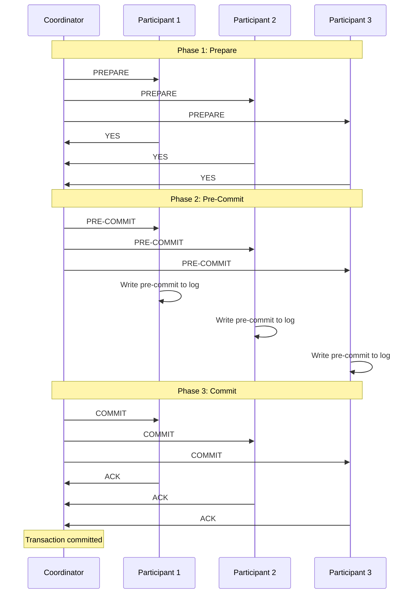
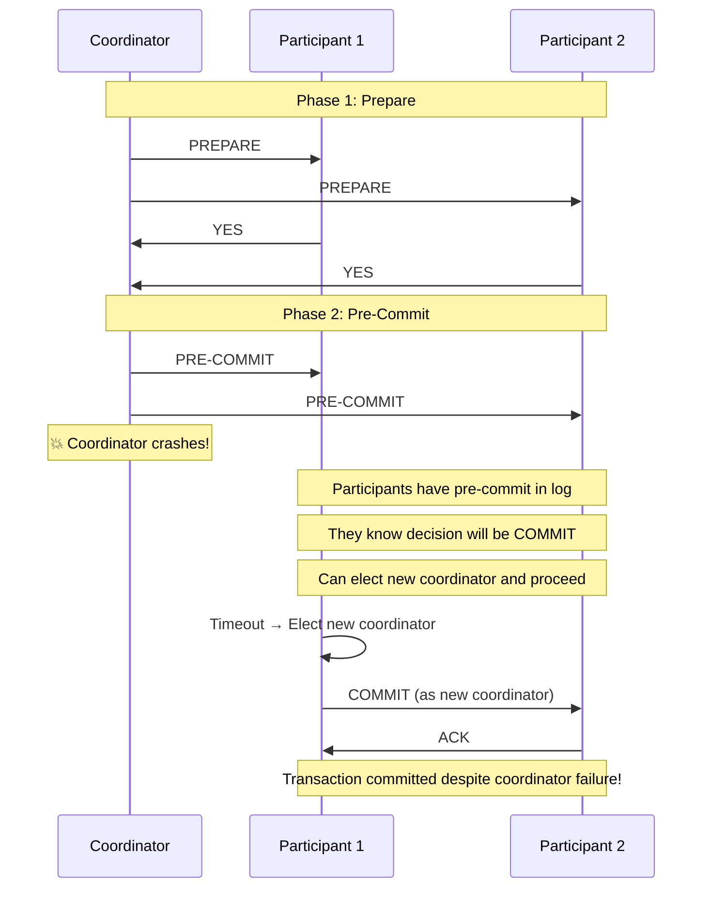
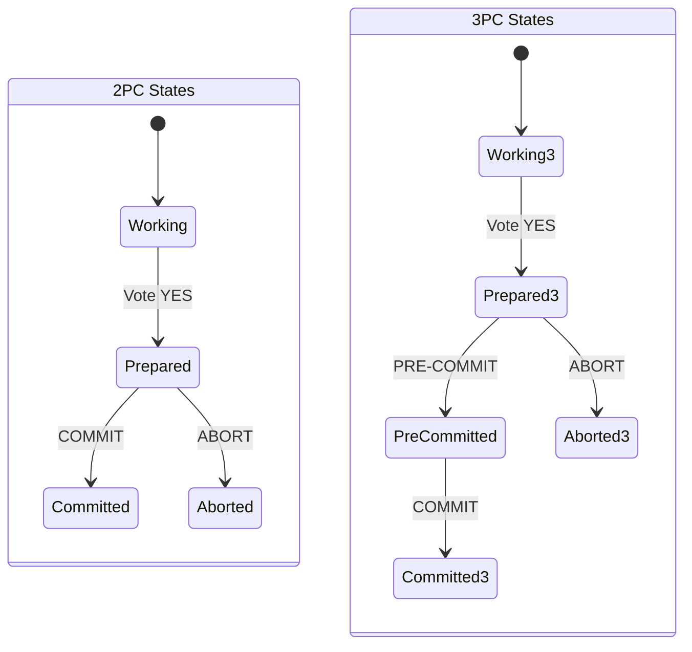
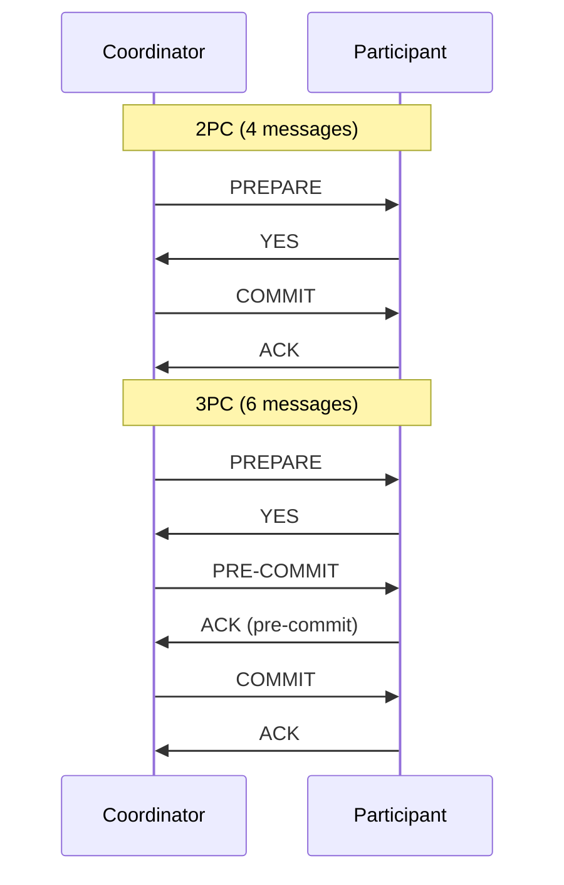

# Three-Phase Commit (3PC)

## Overview

Three-Phase Commit (3PC) is a **non-blocking distributed commit protocol** designed to address 2PC's main weakness: blocking when the coordinator fails. 3PC adds a third phase (pre-commit) between prepare and commit, ensuring that participants can reach a consistent decision even if the coordinator fails.

However, 3PC is **rarely used in practice** due to its complexity, performance overhead, and assumptions about network behavior that may not hold in real systems.

## Why 3PC? The Problem with 2PC

In 2PC, if the coordinator fails after receiving all votes but before sending the decision, participants who voted YES are **blocked**. They promised to commit but don't know the decision.

```
2PC Problem:
  Coordinator receives all YES votes
  Coordinator crashes BEFORE sending COMMIT/ABORT
  Participants: "We promised YES, but what's the decision?"
  → BLOCKED until coordinator recovers
```

## The Three Phases

### Phase 1: Prepare (Voting Phase)

Same as 2PC. Coordinator asks: "Can you commit?"

```
Coordinator → All Participants: "PREPARE"
  Participant checks if it can commit
  Response: "YES" or "NO"
```

### Phase 2: Pre-Commit (NEW)

If all participants voted YES, the coordinator sends a PRE-COMMIT message **before** sending the actual COMMIT. This is the key addition.

```
Coordinator → All Participants: "PRE-COMMIT"
  Participant:
    - Writes pre-commit to log
    - Knows the decision will be COMMIT
    - Can now safely abort if coordinator fails
```

### Phase 3: Commit/Abort

Coordinator sends the final decision.

```
Coordinator → All Participants: "COMMIT" or "ABORT"
  Participant acknowledges
```

## Mermaid Diagram: 3PC Happy Path



## Mermaid Diagram: 3PC with Coordinator Failure



## How 3PC Avoids Blocking

The key insight: **all participants reach the same state before the coordinator sends the decision**.

```
In 2PC:
  State after Phase 1: Some participants in PREPARED state
  If coordinator fails: PREPARED participants are blocked (don't know decision)

In 3PC:
  State after Phase 2: ALL participants in PRE-COMMITTED state
  If coordinator fails: PRE-COMMITTED participants know decision is COMMIT
  They can elect a new coordinator and send COMMIT
```

### State Diagram Comparison



## Coordinator Failure Handling

### Case 1: Coordinator Fails Before Pre-Commit

```
Participants in PREPARED state → Timeout → Elect new coordinator
New coordinator asks participants for their state
If any participant voted NO → ABORT
If all voted YES but none have PRE-COMMIT → Re-run Phase 1
```

### Case 2: Coordinator Fails After Pre-Commit

```
Participants in PRE-COMMITTED state → Timeout → Elect new coordinator
New coordinator sees all in PRE-COMMIT → Send COMMIT
```

### Case 3: Coordinator Fails Between Pre-Commit and Commit

```
Some participants have PRE-COMMIT, others don't
New coordinator:
  - If any participant has PRE-COMMIT → All must COMMIT
  - If no participant has PRE-COMMIT → Can safely ABORT
```

## Participant Failure Handling

### Participant Fails Before Voting
- Coordinator times out → Abort

### Participant Fails After Voting YES, Before Pre-Commit
- On recovery, check log
- If no PRE-COMMIT record → Contact coordinator for decision
- Coordinator may have aborted (if it didn't get all YES votes)

### Participant Fails After Pre-Commit
- On recovery, read PRE-COMMIT from log
- Decision is COMMIT → Proceed to commit

## Network Partitions

### The Problem with 3PC and Partitions

3PC assumes a **synchronous network** — messages are guaranteed to be delivered within a known timeout. In reality, network partitions can violate this assumption.

```
Scenario: Network partition during 3PC

Partition A: Coordinator + P1
Partition B: P2 + P3

P2 and P3 timeout → Elect new coordinator in Partition B
New coordinator in B: "All in PRE-COMMIT → COMMIT"

Meanwhile, coordinator in A: "I'll ABORT because P2, P3 didn't respond"

Result: INCONSISTENCY! P1 aborted, P2, P3 committed.
```

This is why 3PC is rarely used in practice — it doesn't handle network partitions correctly without additional mechanisms (like Paxos).

## Comparison: 2PC vs 3PC

| Aspect | 2PC | 3PC |
|---|---|---|
| Phases | 2 (Prepare, Commit) | 3 (Prepare, Pre-Commit, Commit) |
| Blocking | Yes (coordinator failure) | No (in theory) |
| Messages | 4n | 6n |
| Latency | 2 RTT | 3 RTT |
| Coordinator failure | Participants block | Participants can proceed |
| Network partition | Safe (blocks) | Unsafe (inconsistency possible) |
| Practical use | Widely used (XA) | Rarely used |
| Assumptions | None about network timing | Synchronous network |

## Mermaid Diagram: 2PC vs 3PC Message Flow



## Why 3PC is Rarely Used

1. **Network partition vulnerability**: 3PC can produce inconsistent states during partitions, which are common in real networks.

2. **Performance overhead**: 50% more messages and one extra RTT compared to 2PC.

3. **Complexity**: More states, more failure modes, harder to implement correctly.

4. **Paxos/Raft are better**: Consensus protocols like Paxos and Raft handle both coordinator failure and network partitions correctly.

5. **2PC + recovery is practical**: Most systems use 2PC with timeout-based recovery, which works well enough in practice.

## Interview Questions

### Beginner

**Q1: What is 3PC and how does it differ from 2PC?**
A: Three-Phase Commit adds a pre-commit phase between prepare and commit. This ensures all participants know the decision before the coordinator sends it, preventing blocking when the coordinator fails.

**Q2: What problem does 3PC solve?**
A: 2PC's blocking problem. In 2PC, if the coordinator fails after receiving all votes, participants who voted YES are blocked. 3PC's pre-commit phase ensures participants can determine the decision even if the coordinator fails.

**Q3: Why is 3PC rarely used in practice?**
A: Because it doesn't handle network partitions correctly. In a partition, different groups of participants may reach different decisions (some commit, some abort), violating atomicity.

### Intermediate

**Q4: How does 3PC avoid blocking?**
A: By ensuring all participants reach the same state (PRE-COMMITTED) before the coordinator sends the decision. If the coordinator fails, participants in PRE-COMMITTED state know the decision is COMMIT and can elect a new coordinator to send it.

**Q5: What assumption does 3PC make about the network?**
A: It assumes a synchronous network where messages are delivered within a known timeout. This assumption is violated by network partitions, which is why 3PC fails in practice.

**Q6: What alternatives exist to 3PC for non-blocking distributed commit?**
A: Paxos Commit and Raft Commit. These use consensus protocols to replicate the coordinator's decision, so any node can serve as coordinator. They handle network partitions correctly.

### Advanced / FAANG-Level

**Q7: How would you modify 3PC to handle network partitions?**
A: Use a consensus protocol (Paxos/Raft) to replicate the coordinator's decision to a quorum of nodes. Before sending PRE-COMMIT, the coordinator must get the decision accepted by a majority. If the coordinator fails, any node with the accepted decision can complete the protocol. This essentially becomes Paxos Commit, not 3PC.

**Q8: Compare the failure modes of 2PC, 3PC, and Paxos Commit.**
A: 2PC: Blocks on coordinator failure after votes. 3PC: Non-blocking if no network partitions, but inconsistent during partitions. Paxos Commit: Non-blocking and partition-tolerant, but requires majority availability. Trade-off: 2PC is simplest but blocking; 3PC is non-blocking but partition-unsafe; Paxos Commit is non-blocking and partition-safe but most complex.

**Q9: A distributed database claims to use 3PC for non-blocking commit. What questions would you ask to verify?**
A: (1) How do you handle network partitions during the pre-commit phase? (2) What happens if a participant in PRE-COMMITTED state can't reach any other participant? (3) Do you assume synchronous network behavior? (4) How do you handle the case where some participants receive PRE-COMMIT and others don't during a partition? (5) Do you use consensus (Paxos/Raft) for the coordinator decision? If yes, it's really Paxos Commit, not 3PC.

## Common Mistakes

1. **Assuming 3PC is always better than 2PC** — 3PC has higher overhead and doesn't handle partitions. In practice, 2PC with timeout-based recovery is often sufficient.

2. **Not considering network partitions** — 3PC's theoretical non-blocking property assumes no partitions. Real networks have partitions.

3. **Implementing 3PC without understanding its limitations** — Many implementations cut corners (e.g., not handling all failure modes) and end up worse than 2PC.

4. **Confusing non-blocking with fault-tolerant** — 3PC is non-blocking (participants can proceed) but not fault-tolerant (can produce inconsistent results during partitions).

5. **Using 3PC when Paxos/Raft would be better** — For true non-blocking commit with partition tolerance, use consensus-based protocols.

## Summary

| Aspect | Detail |
|---|---|
| Phases | Prepare → Pre-Commit → Commit/Abort |
| Goal | Non-blocking distributed commit |
| Blocking | No (in theory, assuming synchronous network) |
| Messages | 6n (50% more than 2PC) |
| Network partition | Unsafe — can produce inconsistency |
| Practical use | Rarely used; Paxos/Raft preferred |

## Cross-References

- [Two-Phase Commit](./two-phase-commit.md) — The blocking protocol 3PC extends
- [Distributed Transactions](./distributed.md) — Overview of distributed transactions
- [Saga Pattern](./saga.md) — Alternative to distributed commit protocols
- [Recovery](./recovery.md) — Recovery in distributed systems
