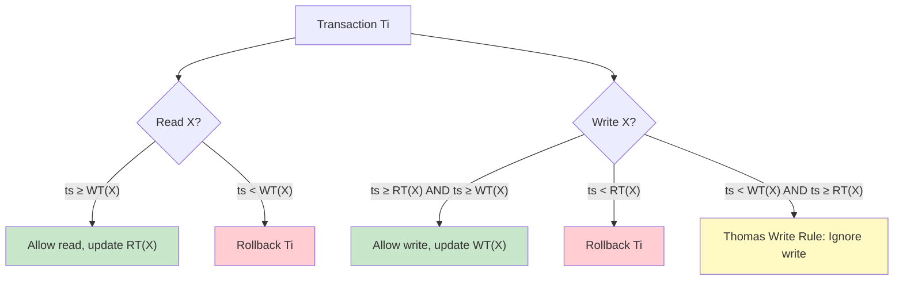

# Timestamp-Based Concurrency Control

## Overview

**Timestamp-based concurrency control** assigns each transaction a unique timestamp when it starts. The protocol uses these timestamps to order transactions and resolve conflicts deterministically — no locks, no deadlocks. Every conflict is resolved by comparing timestamps.

## Timestamps

Each transaction Ti gets a unique timestamp TS(Ti) at startup (monotonically increasing).

Each data item X maintains:
- **RT(X)**: Read Timestamp — largest TS of any transaction that successfully read X
- **WT(X)**: Write Timestamp — largest TS of any transaction that successfully wrote X
- **BTS(X)**: Backup Timestamp (optional, for Thomas Write Rule)

## Protocol Rules

### Read Rule

When Ti (TS = ts) reads X:
- If ts ≥ WT(X): **Allow** read, set RT(X) = max(RT(X), ts)
- If ts < WT(X): **Reject** and rollback Ti (would read a "future" value)

### Write Rule

When Ti (TS = ts) writes X:
- If ts ≥ RT(X) AND ts ≥ WT(X): **Allow** write, set WT(X) = ts
- If ts < RT(X): **Reject** and rollback Ti (would invalidate a read that already happened)
- If ts < WT(X) AND ts ≥ RT(X): Apply **Thomas Write Rule** — ignore the write (Ti's write is obsolete, a later transaction already wrote X)

## Example Walkthrough

```
T1 (ts=10), T2 (ts=20), T3 (ts=30)
Initial: RT(A)=0, WT(A)=0

T1:R(A) → ts=10 ≥ WT(A)=0 → ✅, RT(A)=10
T2:R(A) → ts=20 ≥ WT(A)=0 → ✅, RT(A)=20
T1:W(A) → ts=10 ≥ RT(A)=20? NO → ❌ Rollback T1 (would invalidate T2's read)
T2:W(A) → ts=20 ≥ RT(A)=20 → ✅, WT(A)=20
T3:R(A) → ts=30 ≥ WT(A)=20 → ✅, RT(A)=30
T3:W(A) → ts=30 ≥ RT(A)=30 AND WT(A)=20 → ✅, WT(A)=30
```

## Thomas Write Rule

When ts < WT(X) AND ts ≥ RT(X), Ti's write is **ignored** (not rejected, not rolled back).

**Reason**: A later transaction already wrote X. Ti's write would be overwritten anyway, so we skip it to avoid unnecessary aborts.

```
T1 (ts=10): W(A) → WT(A)=10
T2 (ts=20): W(A) → WT(A)=20
T3 (ts=15): W(A) → ts=15 < WT(A)=20 → Ignore (T3's write is obsolete)
```

## Timestamps vs Locks

| Aspect | Timestamp | Locking |
|---|---|---|
| Deadlocks | Impossible | Possible |
| Blocking | No waiting | Transactions wait |
| Conflict resolution | By timestamp order | By lock compatibility |
| Rollbacks | More frequent (restart) | Less frequent (wait) |
| Starvation | Possible (young transactions keep aborting) | Possible (lock waits) |

## Timestamp Ordering (Basic TO)



## Multiversion Timestamp Ordering

Maintain multiple versions of each data item. Each version has a write timestamp.

**Read(X) by Ti**: Read the version with the largest WT ≤ TS(Ti).

**Write(X) by Ti**: Create a new version with WT = TS(Ti). Requires checking that no transaction with timestamp between the previous version's WT and Ti's TS has read X.

This is essentially what MVCC does in practice.

## Starvation Problem

Young transactions (low timestamp) may keep getting aborted if older transactions keep writing the same data items.

**Solution**: Use **wound-wait** or **wait-die** to ensure eventual progress. Or use a **cautious waiting** scheme.

## Interview Questions

### Beginner

**Q1: How does timestamp-based concurrency control work?**
A: Each transaction gets a unique timestamp. Data items track the largest read and write timestamps. Operations are allowed only if the transaction's timestamp is consistent with these tracked timestamps. Conflicts are resolved by timestamp order — no locks needed.

**Q2: Can timestamp-based protocols have deadlocks?**
A: No. Transactions never wait for each other. If a conflict is detected, the transaction is immediately aborted and can be restarted with a new timestamp. No waiting means no deadlocks.

**Q3: What is the Thomas Write Rule?**
A: When a transaction tries to write a data item that has already been written by a later transaction, the write is silently ignored (not aborted). This avoids unnecessary restarts because the write would be overwritten anyway.

### Intermediate

**Q4: What is the disadvantage of timestamp-based concurrency?**
A: Transactions may be aborted and restarted frequently, especially with high contention. Each abort wastes all work done so far. Also, starvation is possible — a transaction may keep getting aborted if older transactions keep writing the same data.

**Q5: How does timestamp ordering differ from MVCC?**
A: Basic timestamp ordering uses a single version and aborts on conflicts. MVCC maintains multiple versions and allows readers to access older snapshots. MVCC is a practical evolution of multiversion timestamp ordering — it achieves similar benefits with less abort overhead.

**Q6: When would you choose timestamp-based over lock-based?**
A: When deadlocks must be absolutely avoided, when transactions are short and conflicts are rare, or when the overhead of lock management exceeds the cost of occasional aborts.

### Advanced

**Q7: Explain the multiversion timestamp protocol.**
A: Each data item X has versions X1, X2, ..., Xn with write timestamps WT(Xi). For read: Ti reads the version Xi with the largest WT(Xi) ≤ TS(Ti). For write: Ti creates a new version with WT = TS(Ti), but only if no transaction with TS between the last version's WT and Ti's TS has read X. This allows readers to always get a consistent snapshot without blocking.

**Q8: How do modern databases use timestamps in practice?**
A: PostgreSQL uses a transaction ID (XID) as a timestamp-like mechanism in its MVCC system. Each row has xmin (creator XID) and xmax (deleter XID). A transaction sees rows where xmin is committed and xmax is either not set or not committed. This is a practical implementation of multiversion timestamp ordering.

## Common Mistakes

- Thinking timestamp ordering eliminates all concurrency issues (starvation is still possible)
- Not understanding that Thomas Write Rule is an optimization, not a requirement
- Confusing transaction timestamps with data item timestamps
- Assuming timestamp ordering is always better than locking (depends on workload)

## Summary

| Aspect | Description |
|---|---|
| Conflict resolution | By transaction timestamp order |
| Deadlocks | Impossible (no waiting) |
| Starvation | Possible (young transactions may keep aborting) |
| Thomas Write Rule | Ignore obsolete writes instead of aborting |
| Best for | Short transactions, low contention, no-deadlock requirement |

## Cross-References

- [Concurrency Control](concurrency-control.md) — Overview
- [MVCC](mvcc.md) — Multiversion approach
- [Lock-Based](lock-based.md) — Alternative approach
- [Optimistic](optimistic.md) — Another non-blocking approach


## Cross References

- [MVCC](mvcc.md)
- [Optimistic Concurrency](optimistic.md)
- [Lamport Clocks](../../distributed/fundamentals/lamport.md)
- [Vector Clocks](../../distributed/fundamentals/vector-clocks.md)
