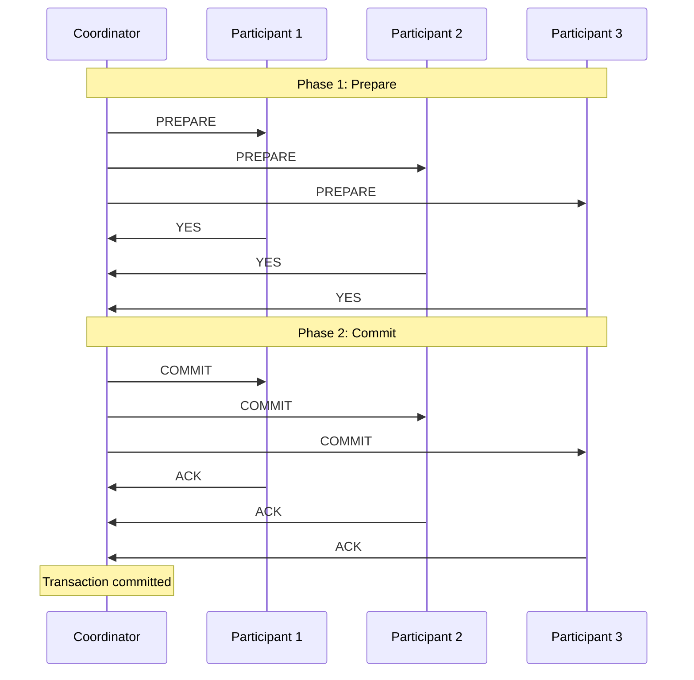
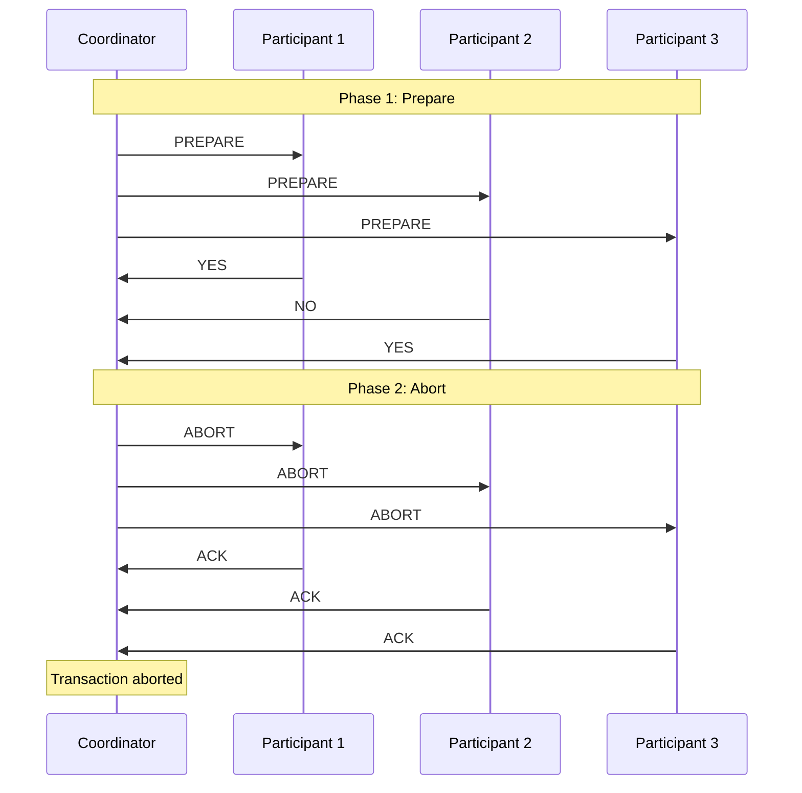
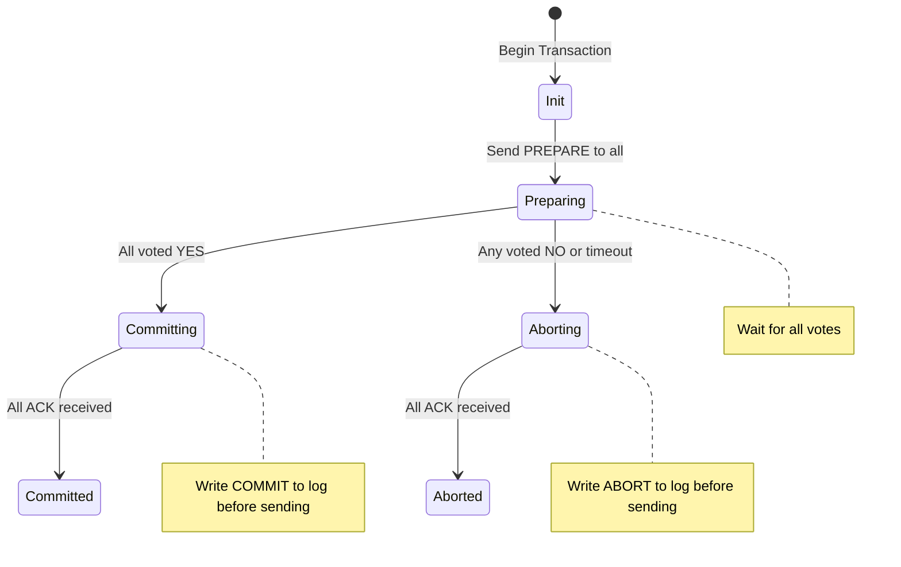
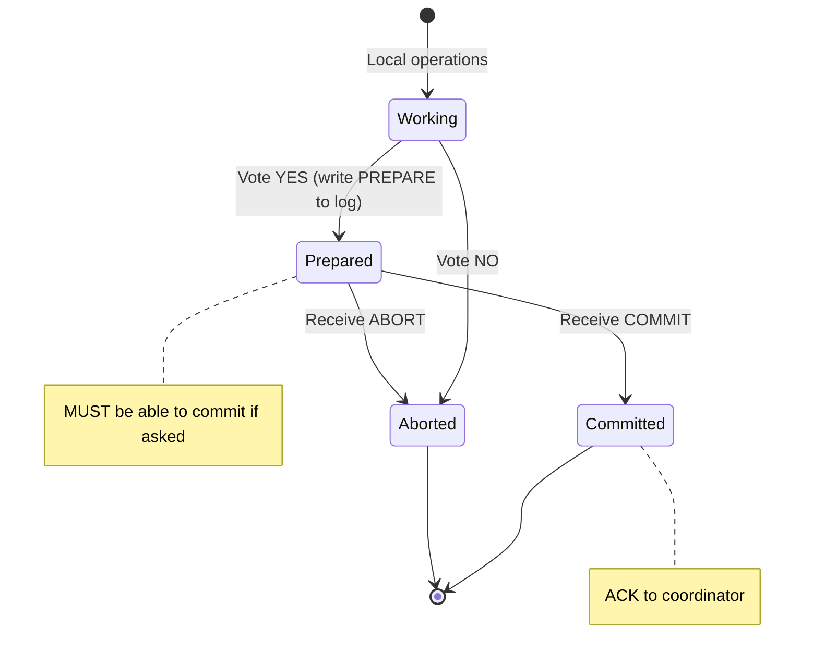
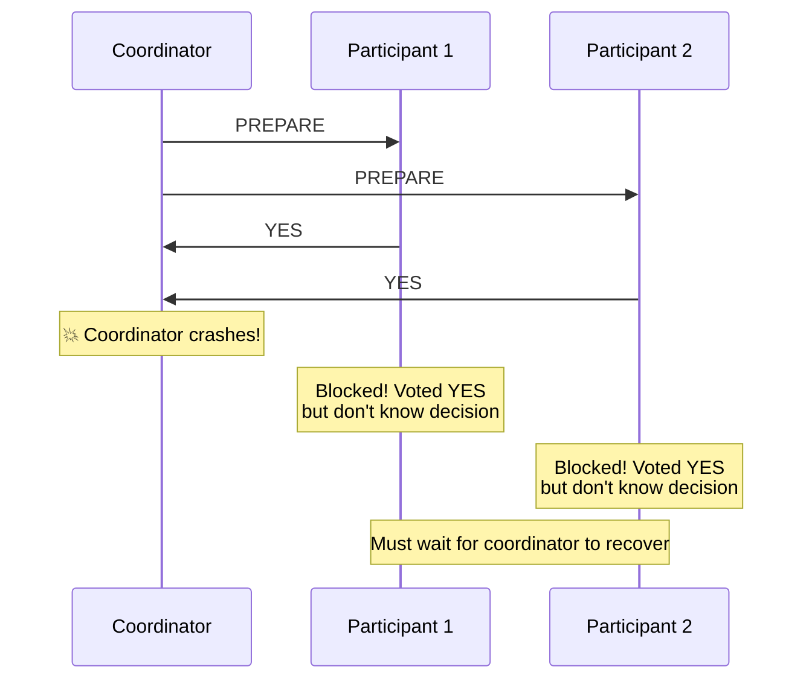

# Two-Phase Commit (2PC)

## Overview

Two-Phase Commit (2PC) is a **distributed consensus protocol** that ensures all participants in a distributed transaction either all commit or all abort. It's the most widely used protocol for distributed transaction management, implemented in the X/Open XA standard and used by databases, application servers, and message brokers.

## The Two Phases

### Phase 1: Prepare (Voting Phase)

The coordinator asks all participants: "Are you ready to commit?"

```
Coordinator → All Participants: "PREPARE"
  Participant checks:
    - Can it commit its local transaction?
    - Are all constraints satisfied?
    - Has it written all necessary log records?
  
  Response: "YES" (vote commit) or "NO" (vote abort)
```

If a participant votes YES, it **promises** to commit if the coordinator decides to commit. It cannot change its mind.

### Phase 2: Commit/Abort (Decision Phase)

The coordinator collects all votes:
- **All YES** → Coordinator decides COMMIT
- **Any NO** → Coordinator decides ABORT

The coordinator then sends the decision to all participants.

```
Coordinator → All Participants: "COMMIT" or "ABORT"
  Participants acknowledge: "ACK"
```

## Mermaid Diagram: 2PC Happy Path



## Mermaid Diagram: 2PC with Abort



## Detailed Protocol

### Coordinator State Machine



### Participant State Machine



## Coordinator Failure Scenarios

### Coordinator Fails Before Sending PREPARE
- Participants timeout → abort locally
- No ambiguity

### Coordinator Fails After Receiving All Votes, Before Sending Decision
- **This is the critical problem**
- Participants who voted YES are **blocked** — they can't commit (don't know decision) and can't abort (they promised to commit)
- This is why 2PC is called a **blocking protocol**



### Coordinator Fails After Sending Some COMMITs
- Some participants committed, others are uncertain
- On recovery, coordinator reads its log and re-sends decision

### Participant Fails Before Voting
- Coordinator times out → aborts transaction

### Participant Fails After Voting YES
- On recovery, participant reads its log
- If PREPARE record exists, contact coordinator for decision

## 2PC Recovery Protocol

```
Coordinator Recovery:
  1. Read log
  2. For each transaction with COMMIT record: re-send COMMIT to all participants
  3. For each transaction with ABORT record: re-send ABORT to all participants
  4. For each transaction with PREPARE record but no decision:
     - Re-send PREPARE and collect votes
     - (Or wait for participants to query)

Participant Recovery:
  1. Read log
  2. For each transaction with COMMIT record: it's committed
  3. For each transaction with ABORT record: it's aborted
  4. For each transaction with PREPARE record but no COMMIT/ABORT:
     - Contact coordinator for decision
     - If coordinator unreachable: wait (blocked!)
```

## Log Records in 2PC

```
Coordinator Log:
  <T, START>
  <T, PREPARE>         ← Before sending PREPARE messages
  <T, COMMIT> or <T, ABORT>  ← After collecting votes, before sending decision
  <T, END>             ← After all ACKs received

Participant Log:
  <T, START>
  <T, PREPARE>         ← Before voting YES (must be on stable storage)
  <T, COMMIT> or <T, ABORT>  ← After receiving decision
  <T, END>
```

### WAL in 2PC

The key WAL rules in 2PC:
1. Participant must write PREPARE to stable storage **before** voting YES
2. Coordinator must write COMMIT/ABORT to stable storage **before** sending decision

## Performance Characteristics

### Latency

```
2PC Latency = 2 × (max network RTT) + participant processing time

Phase 1: Coordinator → Participants (1 RTT) + prepare processing
Phase 2: Coordinator → Participants (1 RTT) + commit processing

Total: 4 network round trips (2 per phase)
```

### Throughput Impact

- Participants hold locks during prepare → commit gap
- Coordinator is a bottleneck (all decisions go through it)
- No parallelism between phases (sequential)

### Message Complexity

```
Messages: 4n (where n = number of participants)
  Phase 1: n PREPARE + n YES/NO = 2n
  Phase 2: n COMMIT/ABORT + n ACK = 2n
```

## Variants of 2PC

### Presumed Abort (PA)
If a participant inquired about an unknown transaction, the coordinator presumes it was aborted. This saves log writes for abort cases.

### Presumed Commit (PC)
If inquired about an unknown transaction, presume it was committed. Saves log writes for commit cases (common in practice).

### Linear Commit
Participants form a linear chain. Each participant forwards the prepare to the next, and votes flow back. Reduces coordinator bottleneck but increases latency.

## Interview Questions

### Beginner

**Q1: What is 2PC?**
A: Two-Phase Commit is a distributed consensus protocol with two phases: (1) Prepare — coordinator asks all participants if they can commit; (2) Commit/Abort — if all vote yes, coordinator sends commit; otherwise abort. Ensures all participants reach the same decision.

**Q2: Why does 2PC need two phases?**
A: The first phase ensures all participants can commit (they promise to do so). The second phase executes the decision. Without the first phase, a participant might commit while another aborts, violating atomicity.

**Q3: What happens if a participant votes NO?**
A: The coordinator aborts the transaction and sends ABORT to all participants. Even participants who voted YES must abort.

### Intermediate

**Q4: Why is 2PC called a blocking protocol?**
A: If the coordinator crashes after receiving all votes but before sending the decision, participants who voted YES are blocked. They promised to commit but don't know the decision. They must wait for the coordinator to recover.

**Q5: What is the presumed abort optimization?**
A: If a participant inquires about an unknown transaction, the coordinator presumes it was aborted. This avoids writing an abort log record for every abort, reducing I/O. Safe because abort is the default.

**Q6: How does 2PC handle network partitions?**
A: Poorly. If a participant can't reach the coordinator, it's blocked. Timeouts can trigger local abort, but if the coordinator later decides commit, inconsistency results. This is the fundamental limitation of 2PC.

### Advanced / FAANG-Level

**Q7: How would you reduce the blocking time of 2PC when the coordinator fails?**
A: (1) Use a backup coordinator that replicates the coordinator's log; (2) Use 3PC (adds pre-commit phase) — but it's rarely used in practice due to complexity; (3) Use Paxos commit — replicate the coordinator's decision using Paxos; (4) Implement coordinator election — participants elect a new coordinator; (5) Use timeout-based recovery — participants query each other for the decision.

**Q8: Design a 2PC implementation that handles coordinator failover.**
A: (1) Replicate coordinator state to standby using synchronous replication. (2) Standby monitors coordinator health via heartbeat. (3) On coordinator failure, standby becomes active coordinator. (4) Read replicated log to determine pending decisions. (5) Re-send decisions to participants. (6) Handle split-brain using fencing tokens (epoch numbers). Participants reject decisions from old coordinators.

**Q9: Compare 2PC with Paxos-based commit. When would you use each?**
A: 2PC: Simpler, fewer messages, but blocking on coordinator failure. Use when: low failure rate, fast coordinator recovery, acceptable blocking time. Paxos commit: Non-blocking, more complex, more messages (O(n²) vs O(n)). Use when: high availability requirements, long coordinator recovery time, intolerable blocking. Google Spanner uses Paxos commit within shards + 2PC across shards.

**Q10: A system uses 2PC across 3 databases. One database is 10x slower than the others. How does this affect overall throughput?**
A: 2PC latency is bounded by the slowest participant. The slow database: (1) increases prepare phase latency (must wait for it to vote); (2) holds locks on other participants during the prepare-commit gap; (3) may cause timeouts. Solutions: (1) Remove the slow database from the 2PC (use saga instead); (2) Increase timeout for the slow participant; (3) Use parallel prepare (send all PREPAREs simultaneously); (4) Fix the slow database (index tuning, hardware upgrade).

## Common Mistakes

1. **Not logging PREPARE before voting YES** — If a participant votes YES without logging, a crash after voting loses the promise, potentially leading to inconsistent state.

2. **Ignoring the coordinator single point of failure** — The coordinator's crash blocks all participants. Always have a recovery strategy.

3. **Setting timeouts too short** — Premature timeouts cause unnecessary aborts. Set timeouts based on expected latency + safety margin.

4. **Not making participant operations idempotent** — The coordinator may re-send COMMIT/ABORT during recovery. Participants must handle duplicates.

5. **Using 2PC across unreliable networks** — 2PC doesn't handle network partitions well. For unreliable networks, consider Saga or eventual consistency.

## Summary

| Aspect | Detail |
|---|---|
| Phases | 1. Prepare (voting) 2. Commit/Abort (decision) |
| Guarantee | All participants reach same decision |
| Blocking | Yes — participants block if coordinator fails after votes |
| Messages | 4n (n = participants) |
| Latency | 2 × network RTT + processing |
| Standard | X/Open XA |
| Limitation | Coordinator failure causes blocking |

## Cross-References

- [Distributed Transactions](./distributed.md) — Overview of distributed transactions
- [Three-Phase Commit](./three-phase-commit.md) — Non-blocking extension
- [Saga Pattern](./saga.md) — Alternative to 2PC
- [Recovery](./recovery.md) — How 2PC interacts with recovery
- [ARIES](./aries.md) — Recovery algorithm used with 2PC
