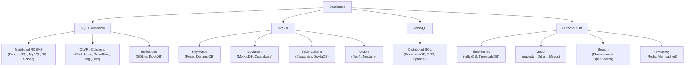
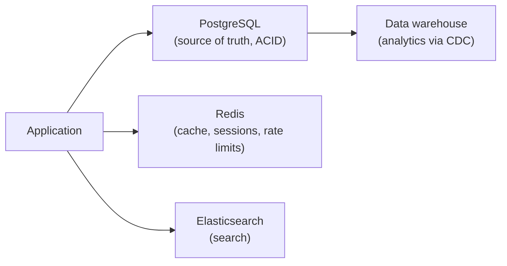

# Types of Databases: SQL and NoSQL

## Overview

There is no single "best database" — there are **families** of databases optimized for different data shapes, workloads, and consistency needs. This page is the **map**: it catalogs the SQL and NoSQL families, real products in each, what they're good at, and how to choose. Each family links to a deeper page in this book.

Two orthogonal dimensions classify most databases:

1. **Data model** — relational (tables), key-value, document, wide-column, graph, vector...
2. **Workload** — OLTP (transactions), OLAP (analytics), search, real-time...

## The SQL / Relational Family

**Core idea**: data in tables (rows + columns) with a fixed schema, joined via foreign keys, queried with SQL, transactions with ACID guarantees.

| Sub-type | Products | Best for | Limitations |
|---|---|---|---|
| **Traditional RDBMS** | PostgreSQL, MySQL, SQL Server, Oracle, MariaDB | OLTP apps, financial data, anything needing ACID + complex queries | Vertical scaling; joins get expensive at massive scale |
| **OLAP / Columnar** | ClickHouse, Snowflake, BigQuery, Redshift, DuckDB | Analytics, BI, aggregations over billions of rows | Not for high-frequency point writes |
| **Embedded SQL** | SQLite, DuckDB | Local/single-process storage, tools, mobile, analytics-on-files | Single-writer, not for high concurrency |
| **Distributed SQL (NewSQL)** | CockroachDB, TiDB, YugabyteDB, Google Spanner | SQL + ACID that scales horizontally across nodes | Operational complexity; consistency costs latency |

- Traditional RDBMS: see [Relational Model](./relational-model/README.md) and [SQL](./sql/README.md).
- OLAP/columnar: see [OLTP vs OLAP & Data Warehousing](./analytics/README.md).
- NewSQL: see [NewSQL](./nosql/newsql.md) and [Distributed Databases](./distributed/README.md).

## The NoSQL Family

**Core idea**: non-relational models optimized for scale, flexible schemas, and specific access patterns — trading away (or relaxing) relational joins and strict ACID. See [NoSQL Overview](./nosql/README.md) for the full treatment.

| Type | Model | Products | Best for | Watch out |
|---|---|---|---|---|
| **Key-Value** | Opaque value by key | Redis, Memcached, DynamoDB, etcd, RocksDB | Caches, sessions, leader election, lookups by ID | No queries by value, no joins |
| **Document** | JSON/BSON documents | MongoDB, Couchbase, Firestore, CouchDB | Flexible-schema apps, catalogs, content, event logs | Joins/aggregations awkward; multi-doc transactions limited |
| **Wide-Column** | Rows keyed by partition + sorted columns | Cassandra, ScyllaDB, HBase, Bigtable | Write-heavy time-series-ish data, event logs at scale | No real joins; query by partition key |
| **Graph** | Nodes + edges | Neo4j, Amazon Neptune, ArangoDB, JanusGraph | Social networks, fraud detection, recommendation, dependency graphs | Traversal-heavy; not for generic OLTP |

Each has a deep page: [Key-Value](./nosql/key-value.md), [Document](./nosql/document.md), [Column-Family](./nosql/column-family.md), [Graph](./nosql/graph.md).

## Purpose-Built Databases

| Type | Products | Best for | Notes |
|---|---|---|---|
| **Time-Series** | InfluxDB, TimescaleDB, Prometheus, QuestDB, kdb+ | Metrics, IoT sensor data, monitoring | Append-heavy, downsampling/retention, time-bucket queries |
| **Vector** | pgvector, Qdrant, Milvus, Pinecone, Weaviate | RAG, semantic search, embeddings, similarity | See [Vector Databases](../llm/llm-serving/vector-databases.md) |
| **Search** | Elasticsearch, OpenSearch, Solr | Full-text search, log analytics | Inverted index, relevance ranking, aggregations |
| **In-Memory** | Redis, Memcached | Caches, real-time counters, pub/sub, rate limiting | RAM-bound; persistence is secondary |
| **Multi-model** | ArangoDB, Couchbase, Cosmos DB, OrientDB | Multiple access patterns from one system | Adds complexity; often weaker at each model |
| **Geospatial** | PostGIS (Postgres), MongoDB Geo | Location queries, maps | Often better as an extension of an RDBMS |
| **Ledger** | Hyperledger Fabric, QLDB | Audit trails, tamper-evident records | Niche |

## How to Choose

### By workload

| You need | Reach for |
|---|---|
| Transactions, ACID, complex joins | PostgreSQL / MySQL |
| Scale + SQL + ACID across nodes | CockroachDB / TiDB / Spanner |
| Analytics / BI / aggregations | ClickHouse / Snowflake / BigQuery |
| Cache / sessions / counters | Redis |
| Flexible-schema app data | MongoDB / Couchbase |
| Write-heavy event/activity logs at scale | Cassandra / ScyllaDB |
| Relationships / graph traversal | Neo4j |
| Semantic search / RAG | pgvector / Qdrant / Milvus |
| Full-text search | Elasticsearch / OpenSearch |
| Metrics / monitoring | Prometheus / TimescaleDB |

### The three-question test

1. **Does the data fit tables with fixed relationships?** → SQL.
2. **Do you need horizontal scale and flexible schema?** → NoSQL (document/wide-column).
3. **Is there one dominant access pattern?** → the purpose-built store that nails it.

### Common production stack (the "default" combo)

Most real systems are **polyglot** — not one database, but the right one per job, with data moving between them (CDC/ETL).

## Big Picture Comparison

| Database | Model | Schema | Scaling | Consistency | Query | Best for |
|---|---|---|---|---|---|---|
| PostgreSQL | Relational | Fixed | Vertical (+replicas) | ACID strong | SQL + joins | General OLTP |
| MySQL | Relational | Fixed | Vertical (+replicas) | ACID strong | SQL + joins | Web apps |
| SQLite | Relational | Fixed | Single process | ACID | SQL | Embedded/tools |
| ClickHouse | Columnar OLAP | Fixed | Horizontal | Snapshot | SQL analytics | Aggregations |
| Snowflake | Columnar OLAP | Fixed | Horizontal (elastic) | Snapshot | SQL | Cloud warehouse |
| Redis | Key-value | None | Cluster | Eventual/simple | GET/SET + types | Cache, counters |
| DynamoDB | Key-value/doc | Flexible | Horizontal | Eventual (or strong) | Key + secondary index | Serverless scale |
| MongoDB | Document | Flexible | Horizontal | Eventual (or strong) | JSON queries | Flexible apps |
| Cassandra | Wide-column | Flexible | Horizontal | Eventual/tunable | CQL by key | Write-heavy scale |
| ScyllaDB | Wide-column | Flexible | Horizontal | Eventual/tunable | CQL | High-perf Cassandra |
| Neo4j | Graph | Flexible | Vertical (clusters) | ACID | Cypher traversal | Graph analytics |
| CockroachDB | Relational (NewSQL) | Fixed | Horizontal | Strong (Raft) | SQL | Scale + ACID |
| TiDB | Relational (NewSQL) | Fixed | Horizontal | Strong (Raft) | SQL | Scale + ACID |
| InfluxDB | Time-series | Flexible | Horizontal | Eventual | Flux | Metrics |
| Elasticsearch | Search | Flexible | Horizontal | Near-real-time | Lucene queries | Full-text |
| pgvector | Vector (Postgres ext) | Fixed | Vertical (+replicas) | ACID | SQL + ANN | RAG at modest scale |
| Qdrant / Milvus | Vector | Flexible | Horizontal | Eventual | ANN + filters | RAG at scale |

## Interview Questions

### Q: How do you choose between SQL and NoSQL for a new system?

Ask about **data shape, relationships, consistency, and scale**. Fixed relational data with joins and ACID → SQL. Flexible schemas, horizontal scale, or a specific access pattern → NoSQL. If you need both SQL semantics and scale → NewSQL (CockroachDB/TiDB/Spanner). Most answers should end with "and we'd probably use a combination" — polyglot persistence is the norm.

### Q: What are the four main types of NoSQL databases?

**Key-value** (Redis, DynamoDB — lookup by key), **document** (MongoDB, Couchbase — JSON documents, flexible schema), **wide-column** (Cassandra, ScyllaDB, HBase — rows by partition key, write-scalable), and **graph** (Neo4j, Neptune — nodes and edges for relationships). They trade relational joins/ACID for scale, flexibility, and specific query patterns.

### Q: When would you use a columnar (OLAP) database instead of a traditional RDBMS?

When the workload is **analytics**: aggregations and scans over millions/billions of rows using few columns. Columnar storage reads only needed columns with 5–10×+ compression, enabling sub-second scans that a row-oriented OLTP database would choke on. Use a columnar store (ClickHouse/Snowflake/BigQuery) fed by CDC/ETL from the OLTP source — see [OLTP vs OLAP](./analytics/README.md).

### Q: What is NewSQL?

NewSQL databases (CockroachDB, TiDB, Spanner) provide the **SQL interface and ACID transactions of a relational database with horizontal scaling** — typically via consensus replication (Raft/Paxos) and distributed transactions. They target the gap where traditional RDBMS can't scale and NoSQL can't give you SQL/ACID. Trade-off: distributed-transaction cost and operational complexity.

### Q: Why would you use a graph database?

When **relationships are the primary query dimension** — social graphs, fraud rings, recommendation, dependency/impact analysis. Traversing multi-hop relationships is natural in a graph DB (Neo4j Cypher) but requires expensive recursive joins in SQL. For generic OLTP with occasional relationships, an RDBMS with indexes is usually simpler.

### Q: What is polyglot persistence?

Using **multiple database technologies** in one system, each chosen for its workload: Postgres for source-of-truth OLTP, Redis for caching, Elasticsearch for search, a warehouse for analytics, a vector DB for RAG. Data moves between them via CDC/ETL. The trade-off: more moving parts, eventual-consistency boundaries, and operational cost — justified when each store pays for itself.

## References

- DB-Engines ranking (popularity by category) — https://db-engines.com/en/ranking
- Martin Fowler: *NosqlDefinition / PolyglotPersistence* — https://martinfowler.com/bliki/PolyglotPersistence.html
- AWS: Choosing an AWS database service — https://aws.amazon.com/products/databases/
- Microsoft: Choose a data store (Azure architecture) — https://learn.microsoft.com/en-us/azure/architecture/guide/technology-choices/data-store-overview

## Related Topics

- [DBMS Overview](./overview.md) — what a DBMS is
- [Relational Model](./relational-model/README.md) — SQL foundations
- [NoSQL Overview](./nosql/README.md) — NoSQL deep dives
- [NewSQL](./nosql/newsql.md) — distributed SQL
- [OLTP vs OLAP & Data Warehousing](./analytics/README.md) — analytical stores
- [Vector Databases](../llm/llm-serving/vector-databases.md) — embeddings/similarity
- [Distributed Databases](./distributed/README.md) — sharding, replication, CAP
