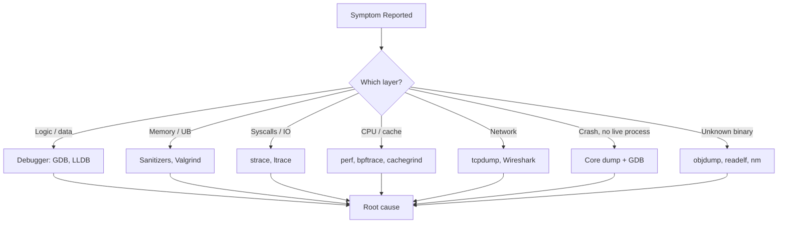
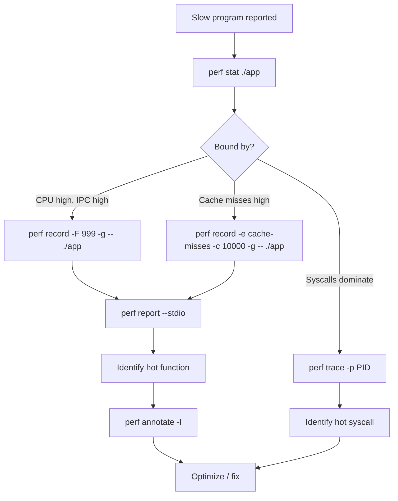

# Developer Tools

Developer tools are the magnifying glass through which we inspect programs that misbehave. This page is the deep-dive companion to [`debugging/tools.md`](./tools.md): where that page lists commands, this page explains **how each tool actually works**, when to reach for it, and how to read its output critically. It covers Section 40 of `index.md`: debuggers (GDB, LLDB), memory tools (Valgrind, sanitizers), system-level tracers (strace, ltrace, perf, bpftrace), network analyzers (tcpdump, Wireshark), binary inspection (binutils), and postmortem analysis (core dumps, crash debugging).

A central theme: **every tool trades off overhead, fidelity, and intrusiveness**. A debugger that pauses the program changes timing; a sanitizer that instruments every load costs 2× throughput; a tracer that records every syscall produces gigabytes of data. The expert's skill is picking the tool whose overhead is acceptable for the bug at hand.

## Tool Landscape

The tools group into four families by what they observe:

| Family | Observes | Representative Tools | Overhead |
|--------|----------|----------------------|----------|
| **Debuggers** | Program state (variables, stack, registers) | GDB, LLDB | Pauses execution; high intrusiveness |
| **Memory & UB tools** | Memory correctness, undefined behavior | Valgrind, ASan, UBSan, TSan, MSan | 2–20× slowdown |
| **System tracers** | Syscalls, signals, CPU events, kernel probes | strace, ltrace, perf, bpftrace | 1–30% (perf) to 5–50× (strace) |
| **Binary & network tools** | Static artifacts, packets on the wire | objdump, readelf, nm, tcpdump, Wireshark | Offline or capture-only |

Choosing correctly starts by knowing which layer the bug lives in. A use-after-free is invisible to strace but obvious to ASan. A missed cache is invisible to ASan but obvious to perf/cachegrind. A retransmission storm is invisible to gdb but obvious to tcpdump.



---

## Native Debuggers

A native debugger operates by interacting with the OS's process-tracing facility (the `ptrace(2)` syscall on Linux, `Mach exceptions` on macOS) and reading debug information (DWARF on ELF, dSYM on Mach-O) produced by the compiler. When you set a breakpoint, the debugger overwrites the target instruction with a trap (`int3` on x86) and remembers the original byte; when the trap fires, the debugger restores the byte, single-steps, and re-arms the trap.

### GDB (GNU Debugger)

GDB is the standard debugger on Linux, documented in the [GDB manual](https://sourceware.org/gdb/current/onlinedocs/gdb/). Beyond basic stepping, the features that matter for serious work are:

- **Breakpoints** — `break`, `tbreak` (temporary), `rbreak regex` (set on every matching function), hardware breakpoints `hbreak` (limited count, survive shared library reloads).
- **Watchpoints** — `watch expr` (write), `rwatch` (read), `awatch` (read/write). Hardware watchpoints are limited to 4 on x86_64; software watchpoints single-step the program and are slow.
- **Conditional breakpoints** — `break file.c:42 if x > 1000`. The condition is evaluated after each hit; if false, execution resumes automatically. Beware: a slow condition on a hot breakpoint can make the program unusable.
- **Catchpoints** — `catch throw`, `catch syscall open`, `catch fork`. Stop on events rather than addresses.
- **Reverse debugging** — `record` then `reverse-continue`, `reverse-step`, `reverse-next`. GDB records a deterministic execution trace and replays it backward. Indispensable for bugs where the symptom is far from the cause: walk backward from the crash until the corrupted state first appears.
- **Scripting** — GDB's built-in command language supports `define` for macros; Python scripting (`python` block, or `--command=file.py`) gives full programmatic control over breakpoints, values, and backtraces. A common pattern is a Python script that walks every `struct list_head` in a process and validates invariants.
- **Pretty-printers** — Python classes registered via `gdb.pretty_printers.append` that render C++ STL containers, `std::string`, `boost::shared_ptr`, etc., in human-readable form instead of raw `_M_dataplus._M_p`.
- **Remote debugging** — `target remote host:port` connects to a `gdbserver` running on another machine (or in a container, or on an embedded target).

### LLDB

LLDB is the LLVM debugger, default on macOS, documented in the [LLDB Tutorial](https://lldb.llvm.org/use/tutorial.html) and [GDB to LLDB command map](https://lldb.llvm.org/use/map.html). It is built on the LLVM/Clang libraries, so its expression parser is the same as Clang's — meaning C++ expressions, lambdas, and implicit conversions work consistently with the compiler. Three commands cover 90% of daily use:

- `frame select N` / `frame variable` — switch stack frame and inspect its locals (replaces GDB's `frame N` + `info locals`).
- `variable` / `v` — fast path that reads DWARF without running an expression (so it never blocks on a futex or triggers side effects).
- `expression` / `p` — full Clang evaluation; can call functions, construct objects, and even define local lambdas. Use `expr --` to disambiguate from `p` when the expression starts with `-`.

### GDB vs LLDB Comparison

| Aspect | GDB | LLDB |
|--------|-----|------|
| **Default on** | Linux (gcc/g++) | macOS (clang), Xcode |
| **Expression parser** | Built-in, GCC-flavored | Clang (full C++17, lambdas) |
| **Scripting** | Python + Guile + built-in | Python + built-in (Lua in tree) |
| **Remote protocol** | `gdbserver`, RSP | `lldb-server`, GDB Remote Protocol compatible |
| **Reverse debugging** | Built-in (`record`/`reverse-*`) | Only via `process record` experimental; limited |
| **Pretty-printers** | Python `gdb.pretty_printers` | Python `lldb.formatters` + type summaries |
| **Multi-threaded stop** | `all-stop` (default) or `non-stop` | `all-stop` only (async mode is partial) |
| **Startup speed** | Slower (large symbol tables) | Faster (lazy symbol parsing) |
| **License** | GPL | LLVM Apache 2.0 (with LLVM exceptions) |

The practical rule: use GDB on Linux for `record`/`reverse-*` and mature Python pretty-printers for legacy STL; use LLDB on macOS, on embedded Apple platforms, and when you need to evaluate modern C++ expressions reliably.

```mermaid
flowchart LR
    USER["User command"] --> CLI["GDB/LLDB CLI"]
    CLI --> PTRACE["ptrace / Mach exceptions"]
    PTRACE --> PROC["Target process"]
    PROC -->|"stop / continue / step"| PTRACE
    PROC --> DWARF["Read DWARF debug info"]
    DWARF --> SYM["Resolve symbols and types"]
    SYM --> PP["Pretty-printers / formatters"]
    PP --> OUT["Human-readable state"]
    CLI --> PY["Python scripting layer"]
    PY --> BP["Breakpoint / watchpoint callbacks"]
    BP --> PTRACE
```



---

## Valgrind

Valgrind is a **binary instrumentation framework**: it JIT-translates every machine instruction the target program executes, inserting checks around memory operations. Because it never touches source code, it works on any ELF binary — including closed-source libraries. The cost is severe slowdown (20–50× for memcheck) and the inability to catch errors in kernel code or JIT-compiled regions it does not instrument. The [Valgrind docs](https://valgrind.org/docs/manual/manual.html) describe each tool in detail.

### Memcheck

The default tool. Tracks every byte of memory as one of four value-states (defined, undefined, uninitialized) and every block as one of three address-states (noaccess, free, allocated). On every load and store it verifies the address is valid and the value (when used in a branch or syscall) is defined. This catches:

- Use-after-free and double-free.
- Heap and stack buffer overflows (read and write).
- Reads of uninitialized memory that propagate into branches or syscalls.
- Leaks at exit (`--leak-check=full`): `definitely lost`, `indirectly lost`, `possibly lost`, `still reachable`.

The `--track-origins=yes` flag records where each uninitialized byte was first allocated, turning "Conditional jump depends on uninitialized value" into a useful origin trace.

### Cachegrind

Simulates a two-level (I1/D1/L2) cache hierarchy and a branch predictor. Reports cache misses, branch mispredictions, and instructions retired per source line. Useful for the "why is this loop 3× slower than I expect" question — but note the simulated cache is not your actual CPU's cache; treat absolute numbers as relative.

### Callgrind

Cachegrind plus call-graph recording. Produces `callgrind.out.<pid>` readable by `callgrind_annotate` (text) or KCachegrind/QCachegrind (GUI). Shows inclusive and exclusive cost per function and per call edge. The single best tool for answering "which function should I optimize first?" when overhead is acceptable.

### Helgrind and DRD

Both detect data races and lock-order errors in multi-threaded programs using the happens-before model. Helgrind additionally tracks lock acquisitions to detect potential deadlocks. They are complementary to ThreadSanitizer (below) but slower; TSan is preferred for new code, Valgrind's tools for binaries you cannot recompile.

### Massif

Heap profiler. Snapshots heap usage over time so you can see the peak and what allocation site caused it. `ms_print massif.out.<pid>` produces a text graph of heap growth; essential for tracking down memory growth that is not a leak (memory is freed at exit but balloons mid-run).

### Valgrind Tool Comparison

| Tool | Detects | Overhead | Typical Use |
|------|---------|----------|-------------|
| **memcheck** | Memory errors, leaks, uninit reads | 20–50× | Default; run before every release on test suite |
| **cachegrind** | Cache misses, branch mispredicts | 20–100× | Micro-optimizing hot loops |
| **callgrind** | Call graph + inclusive cost | 20–100× | Finding the function to optimize |
| **helgrind** | Data races, lock-order / deadlock | 20–50× | Threading bugs in binaries you can't recompile |
| **drd** | Data races, pthread misuse | 10–40× | Faster race detector than helgrind; same model |
| **massif** | Heap size over time | 10–30× | Memory-growth profiling, peak-RSS diagnosis |
| **lackey** | Instruction count, syscall trace | 10–20× | Baseline instrumentation / teaching |

---

## Sanitizers

Sanitizers are **compiler-inserted instrumentation**. Unlike Valgrind, they require recompilation but run at near-native speed because the checks are inlined into the program's own code. The [AddressSanitizer paper (Serebryani et al., USENIX ATC 2012)](https://www.usenix.org/system/files/conference/atc12/atc12-final39.pdf) introduced ASan; the [ThreadSanitizer paper (Serebryani & Iskhodzhanov, 2009)](https://research.google/pubs/pub35604/) describes the happens-before algorithm.

### AddressSanitizer (ASan)

ASan reserves a **shadow memory** region where every 8 bytes of application memory maps to 1 byte of shadow encoding its state (addressable, partially addressable, freed, poisoned redzone). Every load and store is preceded by a few inlined instructions that consult shadow and trap if the access is invalid. Redzones around every allocation catch overflows of any size, not just page-aligned ones. Quarantine queues hold recently freed blocks so use-after-free is detected reliably.

```mermaid
flowchart LR
    APP["App memory 8 bytes"] -->|"maps 8:1"| SHADOW["Shadow byte"]
    SHADOW -->|"0xFF"| POISON["Poisoned / redzone"]
    SHADOW -->"0x00" --> OK["Addressable"]
    SHADOW -->"0x01..0x07" --> PARTIAL["First N bytes valid"]
    SHADOW -->"0xFD" --> FREED["Freed / quarantine"]
    LOAD["Instrumented load"] --> CHECK["Read shadow byte"]
    CHECK -->|"poisoned"| TRAP["Report + abort"]
    CHECK -->"ok" --> MEM["Proceed with access"]
```

Compile: `gcc -g -fsanitize=address -fno-omit-frame-pointer -O1`. The 2× slowdown is acceptable in CI; many projects ship ASan-enabled canaries to detect memory bugs in production traffic.

### UndefinedBehaviorSanitizer (UBSan)

Catches undefined behavior the compiler can statically detect at runtime: signed integer overflow, shift by negative or too-large amount, null pointer dereference, alignment violations, division by zero, invalid enum casts, return from non-void function without a value. Compile with `-fsanitize=undefined` (or a subset like `-fsanitize=signed-integer-overflow,null,alignment`). UBSan is cheap (~2% overhead for the full set) and can be enabled by default in debug builds.

### ThreadSanitizer (TSan)

Detects data races using a happens-before graph over synchronization events (locks, atomics, thread create/join, futexes). Maintains per-memory-location metadata recording the most recent writer and concurrent readers; reports a race when an unsynchronized access violates the happens-before relation. Overhead is 5–15×. Incompatible with ASan (both want the shadow region); use `-fsanitize=thread` in dedicated builds.

### MemorySanitizer (MSan)

Detects use of uninitialized memory. Tracks every bit's initialization state in shadow memory; reports when an uninitialized value influences an observable behavior (branch, syscall, return). Only available with Clang. Catches a strict superset of what memcheck's `--track-origins=yes` catches, at much lower overhead — but only for code you can recompile with Clang.

### LeakSanitizer (LSan)

Detects memory leaks at process exit by walking the heap and checking reachability from globals, stack, and TLS. LSan is included by default in ASan; standalone use is `-fsanitize=leak`. Lighter than Valgrind's leak check, but does not catch mid-run leaks (memory freed just before exit is invisible).

### Sanitizer Comparison

| Sanitizer | Detects | Overhead | Compiler | Incompatible With |
|-----------|---------|----------|----------|-------------------|
| **ASan** | Heap/stack overflow, UAF, double-free, leaks (LSan) | ~2× | gcc, clang | TSan, MSan |
| **UBSan** | Signed overflow, null deref, shift, alignment, div0 | 1.02–1.10× | gcc, clang | (none; combines with ASan) |
| **TSan** | Data races, deadlocks (partial) | 5–15× | gcc, clang | ASan, MSan |
| **MSan** | Uninitialized reads | ~3× | clang only | ASan, TSan |
| **LSan** | Memory leaks at exit | <1% | gcc, clang | (default in ASan) |

Combine ASan + UBSan freely: `-fsanitize=address,undefined`. Never combine ASan with TSan or MSan — each reserves shadow memory differently.

---

## System Call Tracers

### strace

`strace` uses `ptrace` to intercept every syscall entry and exit, printing the syscall name, arguments (decoded structurally where possible), return value, and elapsed time. It is the fastest way to answer "what is this program actually doing right now?". Common patterns:

```bash
strace -e trace=openat,read,write ./app          # Filter to specific syscalls
strace -e trace=file ./app                       # All file-related syscalls
strace -p <pid> -f                               # Attach to running process, follow forks
strace -c ./app                                  # Summary table: count, total time, errors
strace -T -tt -o trace.log ./app                 # Per-syscall duration with µs timestamps
strace -e trace=network -s 1024 -xx ./app        # Hex-dump network data, no truncation
```

Caveat: `ptrace`-based tracing has high per-syscall overhead (a context switch per syscall). On a network-heavy program, strace can slow it 10–50×. For high-throughput scenarios prefer `perf trace` or bpftrace (below).

### ltrace

`ltrace` traces dynamic-library calls instead of syscalls. It hooks the PLT (Procedure Linkage Table) so it intercepts calls into shared libraries (`malloc`, `strlen`, `libc` functions, anything exported). Useful when you suspect a library is being called the wrong number of times or with bad arguments.

```bash
ltrace -e malloc+free ./app                      # Count alloc/free pairs
ltrace -e 'strlen@libc.so.6' ./app               # Filter by symbol and library
ltrace -S ./app                                  # Also show syscalls (combined view)
```

---

## perf

`perf` is the Linux profiler. It runs in-kernel via `perf_event_open(2)`, sampling at a configurable frequency (default 99 Hz per CPU) using hardware performance counters (PMU) when available. Because samples are taken by the kernel without stopping the program, overhead is typically 1–5%. The [perf wiki](https://perf.wiki.kernel.org/) is the canonical reference.

### `perf stat` — Counter Summary

Runs the program and prints hardware-counter statistics: cycles, instructions, cache misses, branch misses, context switches, page faults. Answers "is this CPU-bound, memory-bound, or branch-bound?" in one line.

```bash
perf stat ./app
perf stat -e cache-misses,cache-references,instructions ./app
```

### `perf record` — Sample Collection

Collects samples (instruction pointers, call stacks) into `perf.data`. Use `-F 999` to set the sample frequency to 999 Hz, `-g` to record call graphs (DWARF-based is more accurate than the default frame-pointer mode if the binary was compiled without `-fno-omit-frame-pointer`).

```bash
perf record -F 999 -g -- ./app
perf record -p <pid> -g -- sleep 30              # Profile a running process for 30s
perf record -e cache-misses -c 10000 -g -- ./app # Sample every 10000 cache misses
```

### `perf report` — Interactive TUI

Opens an ncurses browser over `perf.data`: sort by overhead, drill into call chains, annotate source with per-instruction sample counts. `--stdio` produces a text dump suitable for CI logs.

### `perf top` — Live Hotspots

Like `top` but for functions: shows live sample counts per symbol. Use `-p <pid>` to restrict to a process. Indispensable when chasing a production hot spot you can reproduce.

### `perf trace` — strace at speed

`perf trace` prints syscalls like strace but using the perf infrastructure — orders of magnitude lower overhead. Not as detailed (no struct decoding for every syscall) but does not destroy timing on hot paths.



---

## bpftrace

`bpftrace` is a high-level tracing language over eBPF. You write short one-liners that the bpftrace compiler turns into BPF bytecode, the kernel verifier checks for safety, and the kernel attaches to a probe (kprobe, tracepoint, USDT, perf event). The [bpftrace docs](https://github.com/bpftrace/bpftrace/blob/master/docs/index.md) list every probe and builtin.

### Probes

- `kprobe:func` / `kretprobe:func` — entry and return of any kernel function (when symbols are available).
- `tracepoint:subsys:event` — stable kernel tracepoints (preferred over kprobes for stability).
- `uprobe:/path:func` / `uretprobe` — user-space function entry/return.
- `profile:hz:99` / `interval:s:1` — time-based sampling.
- `software:cache-misses:100000` / `hardware:branches:1000000` — perf-counter driven.

### Maps and Actions

`@map[key] = count()`, `@hist[cpu] = hist(latency_ns)`, `printf("...")`, `stack()`, `ustack()`. Maps aggregate per-key; on Ctrl-C bpftrace prints all maps.

### Useful One-Liners

```bash
# Count syscalls by process name:
bpftrace -e 'tracepoint:raw_syscalls:sys_enter { @[comm] = count(); }'

# Distribution of syscall latency in microseconds:
bpftrace -e 'tracepoint:raw_syscalls:sys_enter { @ts[tid] = nsecs; }
             tracepoint:raw_syscalls:sys_exit /@ts[tid]/ {
               @us = hist((nsecs - @ts[tid]) / 1000); delete(@ts[tid]);
             }'

# File opens by pathname, with stack:
bpftrace -e 'tracepoint:syscalls:sys_enter_openat {
               printf("%s %s\n", comm, str(args->filename));
               @[ustack] = count();
             }'

# On-CPU flame-graph data for PID 1234:
bpftrace -e 'profile:hz:99 /pid == 1234/ { @[ustack, kstack] = count(); }'

# Block IO size histogram:
bpftrace -e 'tracepoint:block:block_rq_issue { @bytes = hist(args->bytes); }'
```

bpftrace's advantage over perf is **aggregation in the kernel** — you can trace every file open system-wide and only print the per-process totals, with no per-event overhead in user space.

---

## Network Analysis

### tcpdump

`tcpdump` captures packets using the kernel's `AF_PACKET` socket with a Berkeley Packet Filter (BPF) program attached. The filter runs in the kernel, so packets that do not match are dropped before they cross into user space. The [tcpdump man page](https://www.tcpdump.org/manpages/tcpdump.1.html) and [pcap-filter(7)](https://www.tcpdump.org/manpages/pcap-filter.7.html) document the filter language.

```bash
tcpdump -i eth0 -nn -tttt 'tcp port 443'                   # TLS traffic, no DNS, full timestamps
tcpdump -i any -nn 'host 10.0.0.5 and not port 22'         # All traffic to/from host except SSH
tcpdump -i eth0 -nn 'tcp[tcpflags] & tcp-syn != 0'         # Only SYN packets (connection opens)
tcpdump -i eth0 -nn 'tcp[tcpflags] & tcp-syn != 0 and tcp[tcpflags] & tcp-ack == 0'  # SYN, no ACK = initial SYNs
tcpdump -i eth0 -nn -A -s 0 'tcp port 80'                  # ASCII payload (HTTP)
tcpdump -i eth0 -w capture.pcap                             # Save to pcap for Wireshark
tcpdump -nn -r capture.pcap 'tcp port 443'                  # Read from a saved pcap, post-filter
```

Reading the filter: `tcp[tcpflags] & tcp-syn != 0` is a bitwise-AND on byte offset 13 (TCP flags) — BPF lets you write predicates on any byte of any header.

### Wireshark

Wireshark is the GUI counterpart: it opens pcaps from tcpdump, decodes hundreds of protocols (HTTP/2, gRPC, TLS handshake, DNS, QUIC, SMB, NFS, PostgreSQL wire protocol, …), and provides three orthogonal capabilities:

- **Capture filters** — same BPF language as tcpdump; applied at capture time.
- **Display filters** — a much richer Wireshark-specific language applied after capture, with full protocol dissection. `http.request.method == "POST"`, `tls.handshake.type == 1`, `dns.qry.name contains "example"`.
- **Follow stream** — reconstructs the full application-layer conversation (e.g., the entire HTTP request/response, or the unencrypted bytes of a TCP stream) so you can read it as text. The [Wireshark User's Guide](https://www.wireshark.org/docs/wsug_html_chunked/) covers each.

A common workflow: capture with `tcpdump -w` on a headless server (low overhead, no GUI), copy the pcap to your laptop, open in Wireshark (rich dissection, display filters, follow-stream).

---

## Binary Inspection Tools

These tools (part of GNU binutils, documented in the [binutils docs](https://sourceware.org/binutils/docs/)) inspect compiled artifacts without executing them. They are the first thing to reach for when given an unknown binary: "what is this, what does it link against, what symbols does it export?"

| Tool | Input | What It Shows | Typical Use |
|------|-------|---------------|-------------|
| **`file`** | Any file | Type (ELF, Mach-O, PE), architecture, dynamically/statically linked, stripped | First look at an unknown binary |
| **`readelf`** | ELF | Headers, sections, segments, dynamic info, relocations, DWARF | "Is this PIE? Is it stripped?" |
| **`objdump`** | ELF/Mach-O/etc. | Disassembly (`-d`), section dump (`-s`), relocations (`-r`), headers (`-x`) | Reading generated assembly |
| **`nm`** | Object/executable | Symbol table (functions, globals, with addresses) | "Is this symbol defined or undefined?" |
| **`ldd`** | Dynamic executable | Shared library dependencies and their resolved paths | "Why does it say library not found?" |
| **`objcopy`** | Object/executable | Copy/transform: strip symbols, extract section, change architecture | Building minimal embedded images |
| **`hexdump`** | Any file | Hex (and optional ASCII) view of bytes | Inspecting magic numbers, headers, padding |
| **`strings`** | Any file | Printable ASCII (or UTF) runs of ≥4 chars | Quick recon: error messages, paths, version strings |

```bash
file ./myapp                                     # ELF 64-bit LSB pie executable, x86-64, dynamically linked
readelf -h ./myapp                               # ELF header: type, machine, entry point
readelf -d ./myapp                               # Dynamic section: NEEDED libs, RPATH, RUNPATH
readelf -p .comment ./myapp                      # Compiler version string
objdump -d -M intel ./myapp | less               # Disassemble, Intel syntax
objdump -d -M intel --no-show-raw-insn ./myapp   # Hide hex bytes, cleaner output
nm -C ./myapp | grep ' T '                       # Defined text (code) symbols, demangled
nm -D ./myapp                                    # Dynamic symbols (what it exports/imports)
ldd ./myapp                                      # Resolve and print shared library deps
objcopy --strip-all ./myapp ./myapp.stripped     # Strip all symbols
objcopy --dump-section .rodata=rodata.bin ./myapp  # Extract a section to a file
hexdump -C ./myapp | head                        | Canonical hex+ASCII view
strings -n 8 ./myapp | grep -i version           # Find version strings
```

A useful diagnostic order when given a crashing binary: `file` → `ldd` (missing libs?) → `nm -D` (undefined symbols?) → `readelf -d` (RPATH set?) → `objdump -d` (where is the crash address?).

---

## Core Dumps and Postmortem Debugging

When a process crashes with a signal like `SIGSEGV` or `SIGABRT`, the kernel can write a **core dump**: a snapshot of the process's memory, register state, file descriptors, and thread list at the moment of death. Loading this in GDB gives you the same inspection capability as a live debugging session — minus the ability to continue execution.

### Enabling Core Dumps

```bash
ulimit -c unlimited                             # Current shell only; raises the core-file size limit
echo "* soft core unlimited" | sudo tee -a /etc/security/limits.conf   # Persistent for users
echo "* hard core unlimited" | sudo tee -a /etc/security/limits.conf
# Where the kernel writes core files (systemd distros commonly use systemd-coredump):
cat /proc/sys/kernel/core_pattern               # e.g. "|/usr/lib/systemd/systemd-coredump %P %u %g %s %t %c %h"
echo "/var/core/core.%e.%p.%t" | sudo tee /proc/sys/kernel/core_pattern  # Plain file with exe, pid, timestamp
sudo sysctl -w kernel.core_uses_pid=1           # Append .pid to filename
```

If `core_pattern` starts with `|`, the kernel pipes the dump to a handler (typically `systemd-coredump`, which stores it compressed and lets you retrieve it with `coredumpctl`). If it is a plain path, the kernel writes the file directly.

`coredumpctl` (systemd) workflow:

```bash
coredumpctl list                                 # List recent crashes
coredumpctl info <pid>                           # Show details for a specific crash
coredumpctl debug <pid>                          # Open in GDB directly (preferred on systemd distros)
coredumpctl dump <pid> -o core.<pid>             # Extract raw core file
```

### Analyzing a Core Dump

```bash
gdb ./myapp /var/core/core.myapp.12345.1700000000
# Inside GDB:
(gdb) bt                                         # Backtrace of the crashing thread
(gdb) thread apply all bt                        # All threads (look for the one that crashed)
(gdb) bt full                                    # Locals in every frame
(gdb) frame 3                                    # Switch to frame 3
(gdb) info locals                                # Locals in this frame
(gdb) info args                                  # Function arguments
(gdb) info registers                             # CPU registers at crash
(gdb) disassemble $pc-32 $pc+32                  # Disassemble around the crash
(gdb) x/16xw $rsp                                # Examine 16 words of stack
(gdb) info sharedlibrary                         # Loaded shared libs and their addresses
```

A critical prerequisite: the binary and shared libraries must retain their debug symbols and the exact build-id must match the core. Production binaries stripped of symbols yield useless backtraces — keep a separate debuginfo package and point GDB at it with `set debug-file-directory /usr/lib/debug`.

### Crash Debugging Workflow

1. **Capture the core** — ensure `ulimit -c` is unlimited and `core_pattern` writes somewhere useful *before* the crash. Postmortem is impossible without the dump.
2. **Reproduce the environment** — same binary, same libraries, same kernel if possible. `gdb`'s `set sysroot` lets you point at a different root filesystem for cross-environment debugging.
3. **Find the crashing thread** — `thread apply all bt`, look for `SIGSEGV` or the signal frame. Threads other than the crasher are usually noise unless they hold locks the crasher was waiting for.
4. **Walk backward** — `frame N` up the call stack; read locals and arguments at each level. Look for null pointers, freed pointers, or values that violate invariants.
5. **Correlate with logs** — match the timestamp and PID from the crash to your structured logs. The few seconds before the crash usually reveal the trigger.
6. **Form a hypothesis** — write down the suspected root cause before changing anything.
7. **Reproduce under a sanitizer** — rebuild with `-fsanitize=address,undefined` and re-run the failing input. If ASan fires, you have proof.

### Postmortem Mindset

Postmortem debugging is forensic science, not iterative development. You get one shot at the evidence; if you `rm` the core file you are done. Treat the core like a crime scene:

- **Make a backup** of the core, the binary, and all loaded shared libraries immediately.
- **Record the environment**: kernel version, glibc version, mount layout, environment variables, ulimits.
- **Do not "improve" the dump** by running commands that allocate memory; some GDB commands can perturb state if you are not careful.
- **Write down what you try**, in order, with the result. When the root cause is subtle you will need this history to backtrack.

---

## Interview Questions

1. **"Compare GDB and LLDB. Which would you choose for debugging a C++ program on Linux that uses `std::shared_ptr` heavily, and why?"**
   On Linux I would default to GDB for the mature Python pretty-printers that render `std::shared_ptr`, `std::vector`, and other STL containers; LLDB's equivalent formatters exist but are younger for non-Apple platforms. I would switch to LLDB if I needed to evaluate modern C++ expressions (lambdas, structured bindings) at the prompt, because LLDB's Clang-based expression parser handles them more reliably than GDB's built-in parser.

2. **"How does AddressSanitizer detect a use-after-free that Valgrind's memcheck might miss?"**
   ASan places every freed block into a quarantine queue and poisons its shadow bytes. Until the queue drains (typically megabytes of recent frees), any load into that region triggers a trap deterministically — even if the freed pointer has been overwritten with a similar value. Memcheck marks freed memory as invalid too, but it operates at the binary level without redzones around interior allocations and can miss small UAF reads if the access happens to land in still-valid adjacent memory. ASan's per-allocation redzones catch overflow into freed neighbors that memcheck may report as a different error class.

3. **"Your program runs 10× slower under strace. Why, and what would you use instead?"**
   strace uses `ptrace`, which traps on every syscall entry and exit, forces a context switch to the tracer, decodes the arguments, and returns. Each syscall now costs thousands of cycles of overhead instead of tens, so a syscall-heavy program slows dramatically. For high-throughput tracing I would switch to `perf trace` (kernel-side, sample-based) or bpftrace over `tracepoint:raw_syscalls:sys_enter` (kernel-aggregated, only summary crosses to user space). If I need full per-syscall detail, I would scope strace to a small filter (`-e trace=openat`) and a short time window.

4. **"You have a core dump from a production crash but the backtrace is garbage — every frame shows `??`. What went wrong?"**
   The binary (or one of its shared libraries) was stripped of DWARF debug info, so GDB cannot map instruction addresses back to source files. Fix: install the matching debuginfo package (on RPM distros, `debuginfo-install`; on Debian, the `-dbgsym` package), confirm the build-id in the core matches the binary's, and point GDB at the debug directory with `set debug-file-directory /usr/lib/debug`. If debuginfo is unavailable, you can still disassemble around `$pc` (`disassemble $pc-32 $pc+32`) and inspect raw memory, but symbolic backtraces are gone.

5. **"When would you use ThreadSanitizer vs Helgrind (Valgrind) for a data race?"**
   TSan when I can recompile the program with Clang or GCC and need to run the test suite repeatedly — TSan's 5–15× overhead is acceptable in CI and it reports races with high signal. Helgrind when I cannot recompile (third-party binary, library shipped without source) — it instruments the binary directly. TSan also produces cleaner, more actionable reports with a clearer happens-before explanation; Helgrind has more false positives on code that uses custom synchronization.

6. **"How does ASan's shadow memory work, and why is the slowdown only ~2×?"**
   ASan reserves a contiguous shadow region where each 8 bytes of application memory maps to one shadow byte encoding that region's state. The compiler inserts a short prologue before every load and store: it computes the shadow address (a shift and add), loads the shadow byte, and traps if poisoned. The check is 3–4 instructions inline, so per-access overhead is small; the 2× slowdown comes mostly from the larger working set (redzones around every allocation reduce cache density) and the quarantine queue preventing reuse of recently freed memory. The shadow layout is chosen so the address computation is a single `mov` plus `shr`.

7. **"A production service has high CPU but `perf top` shows the top function is `__memset_avx2`. How do you proceed?"**
   High CPU in `memset` almost always means a caller is zeroing memory it should not — usually a large struct or array initialization on a hot path. I would record with `perf record -F 999 -g` to capture call stacks, then `perf report` to find which caller is responsible. Once identified, I would check whether the zeroing is necessary (perhaps the memory is about to be fully overwritten anyway), whether the size can be reduced, or whether a calloc-style lazy zero would defer the cost.

8. **"Walk me through debugging a segfault that occurs once every 10,000 requests in production."**
   First, ensure core dumps are enabled and `core_pattern` writes to persistent storage — I need the dump from the next crash. Second, capture structured logs with correlation IDs so when the crash happens I can see the preceding 30 seconds of requests. Third, attempt reproduction under ASan+UBSan in staging with the same traffic replayed via shadow traffic; if ASan fires, the report points directly at the root cause. Fourth, when the core arrives, load it in GDB, find the crashing thread, walk the backtrace, and correlate the timestamp with the logs to identify the request pattern. Fifth, form a hypothesis, write a focused test that reproduces the bug under ASan, and fix only after the test fails before the fix and passes after.

---

## References

- [GDB Documentation](https://sourceware.org/gdb/current/onlinedocs/gdb/) — official manual covering breakpoints, watchpoints, reverse debugging, and Python scripting.
- [LLDB Tutorial](https://lldb.llvm.org/use/tutorial.html) and [GDB to LLDB Command Map](https://lldb.llvm.org/use/map.html) — official LLVM docs.
- [Valgrind User Manual](https://valgrind.org/docs/manual/manual.html) — covers memcheck, cachegrind, callgrind, helgrind, drd, massif.
- Serebryany, K., Bruening, D., Potapenko, A., & Vyukov, D. (2012). *AddressSanitizer: A Fast Address Sanity Checker.* USENIX ATC. [Paper](https://www.usenix.org/system/files/conference/atc12/atc12-final39.pdf)
- Serebryany, K., & Iskhodzhanov, T. (2009). *ThreadSanitizer — data race detection in practice.* WBIA. [Paper](https://research.google/pubs/pub35604/)
- [perf Wiki](https://perf.wiki.kernel.org/) — Linux perf events documentation.
- [bpftrace Documentation](https://github.com/bpftrace/bpftrace/blob/master/docs/index.md) — language reference and probe guide.
- [tcpdump(1)](https://www.tcpdump.org/manpages/tcpdump.1.html) and [pcap-filter(7)](https://www.tcpdump.org/manpages/pcap-filter.7.html).
- [Wireshark User's Guide](https://www.wireshark.org/docs/wsug_html_chunked/).
- [GNU Binutils Documentation](https://sourceware.org/binutils/docs/) — covers objdump, readelf, nm, ld, objcopy, strings.
- [coredumpctl(1)](https://www.freedesktop.org/software/systemd/man/coredumpctl.html) and [core(5)](https://man7.org/linux/man-pages/man5/core.5.html) — core dump management on systemd.
