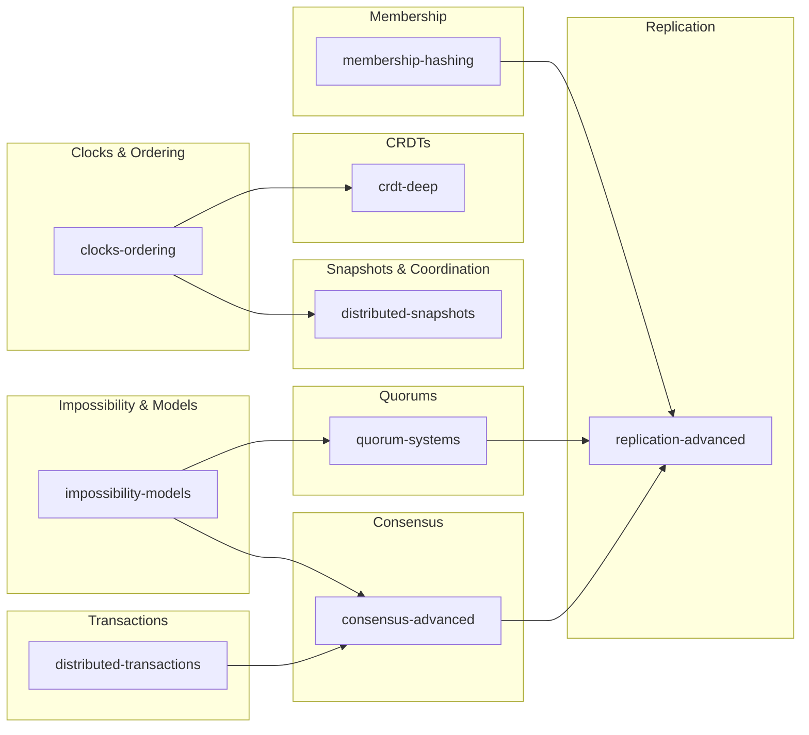

# Section C — Advanced Distributed Systems

> Topics 201–320: Master impossibility results, advanced consensus, CRDT internals, distributed transactions, and production-grade replication strategies.

## Prerequisites

This section builds on the fundamentals, consensus, replication, and partitioning sections. Ensure you're comfortable with:

- [FLP impossibility](../fundamentals/flp.md) and [CAP theorem](../fundamentals/cap.md)
- [Paxos](../consensus/paxos.md) and [Raft](../consensus/raft.md)
- [CRDT basics](../fundamentals/crdts.md) and [vector clocks](../fundamentals/vector-clocks.md)
- [Consistent hashing](../partitioning/consistent-hashing.md) and [quorum replication](../replication/quorum.md)

## Topic Map

## Reading Order

| Order | File | Core Focus | Depends On |
|-------|------|------------|------------|
| 1 | [impossibility-models.md](impossibility-models.md) | FLP deep dive, failure models, system synchrony | Fundamentals |
| 2 | [quorum-systems.md](quorum-systems.md) | Weighted/Byzantine quorums, intersection properties | Impossibility models |
| 3 | [clocks-ordering.md](clocks-ordering.md) | Advanced clocks, consistency models, TrueTime | Fundamentals |
| 4 | [crdt-deep.md](crdt-deep.md) | State/op/delta CRDTs, garbage collection | Clocks & ordering |
| 5 | [distributed-snapshots.md](distributed-snapshots.md) | Chandy-Lamport, mutual exclusion, termination | Clocks & ordering |
| 6 | [consensus-advanced.md](consensus-advanced.md) | Multi-Raft, HotStuff, EPaxos, pipelining | Quorums, snapshots |
| 7 | [replication-advanced.md](replication-advanced.md) | CRAQ, Merkle sync, hinted handoff, sloppy quorum | Consensus advanced |
| 8 | [membership-hashing.md](membership-hashing.md) | Hashing variants, SWIM, fencing, Redlock | Replication advanced |
| 9 | [distributed-transactions.md](distributed-transactions.md) | 2PC/3PC, Saga, outbox, exactly-once | Consensus, replication |

## Quick Comparison: What Makes This Section Different

| Aspect | Fundamentals Section | This Section |
|--------|---------------------|--------------|
| FLP | Statement & intuition | Proof sketch, partial sync escape, failure detector classes |
| Consistency | Definitions | TrueTime/Spanner, hybrid logical clocks, convergence proofs |
| CRDTs | G-Counter, LWW-Register | Delta-state CRDTs, op-based causality, GC strategies |
| Consensus | Raft/Paxos basics | Multi-Raft, HotStuff BFT, EPaxos, pipelining, RDMA |
| Replication | Primary-backup, chain | CRAQ, Merkle-tree anti-entropy, sloppy quorum, witness replicas |
| Hashing | Consistent hashing basics | Rendezvous/jump hashing, SWIM, lease-based fencing |
