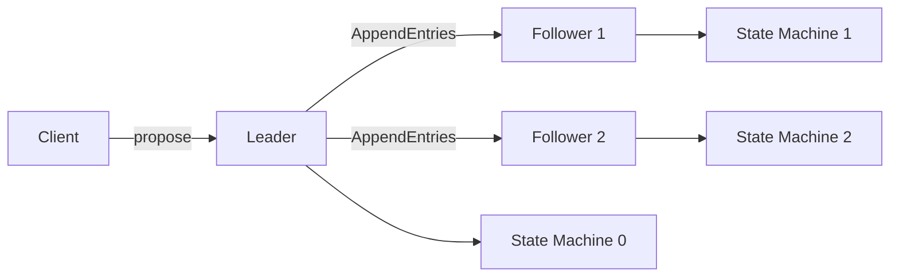

# Advanced Consensus Protocols

> **Reference papers**: Ongaro & Ousterhout (2014) Raft; Liskov & Cowling (2012) Viewstamped Replication; Dwork, Lynch & Stockmeyer (1988); Yin et al. (2019) HotStuff; Lamos et al. (2017) EPaxos

## Raft Deep Dive

See [Raft basics](../consensus/raft.md) for the introductory treatment. This section covers production-level concerns.

### Log Replication Details

The leader appends entries to its log and replicates them via `AppendEntries` RPCs. Each entry contains: `(term, index, command)`. Followers check **log consistency** via `prevLogIndex` and `prevLogTerm`:

```
Leader log:  [1:1] [1:2] [2:3] [2:4] [2:5]
                          ↑
Follower log: [1:1] [1:2] [1:3] [1:4]
                     ↑ prevLogIndex=2, prevLogTerm=1

Leader sends entries from index 3 onward
Follower checks: term at index 2 = 1 ✓
  → Accept entries, replace [1:3] [1:4] with [2:3] [2:4] [2:5]

If follower had [1:1] [1:2] [3:3] (different term at index 3):
  → Reject: term at index 2 = 1 ✓, but then leader would back up
  → Leader decrements nextIndex[follower] and retries
```

This **backtracking** approach ensures log consistency without requiring the follower to send its full log. The leader tries at most one extra round trip per conflicting entry.

### Raft Membership Changes

Raft uses a **two-phase approach** (joint consensus) to safely change cluster membership:

1. **Phase 1 (C_old,new)**: leader proposes a configuration transition to `C_old,new` (a joint configuration including both old and new members). This requires majority of both `C_old` and `C_new` to agree.
2. **Phase 2 (C_new)**: once `C_old,new` is committed, the leader proposes `C_new`. This requires majority of `C_new`.

```
  C_old = {A, B, C}
  C_new = {A, B, C, D, E}

  Phase 1: commit C_old,new = {A, B, C, D, E} (joint config)
           needs majority of {A,B,C} AND majority of {A,B,C,D,E}
           → at least 2 of old AND at least 3 of all 5
  Phase 2: commit C_new = {A, B, C, D, E}
           needs majority of {A,B,C,D,E} → at least 3
```

This prevents a situation where two leaders could be elected simultaneously — one by the old configuration and one by the new configuration.

### Raft Snapshots

As the log grows, Raft snapshots the state machine and discards log entries up to the snapshot point. The snapshot includes:
- The state machine state at a specific log index
- The term of the last included entry
- A membership configuration (for safety)

```
Log: [entry 1..1000] → snapshot up to index 1000 → log starts at 1001

InstallSnapshot RPC:
  leader → follower: {term, leaderId, lastIncludedIndex, lastIncludedTerm, offset, data[], done}
```

### Linearizability in Raft

Raft guarantees that **committed entries are never lost** and are **eventually applied** to all followers' state machines. However, **linearizability** (every operation appears atomic at a point in real time) requires additional care:

- **Read-only queries** from the leader might return stale data if a new leader has been elected but the old leader hasn't stepped down yet
- **Lease-based reads**: the leader holds a time-bounded lease (refreshed by heartbeats). If the lease hasn't expired, the leader knows it's still the leader and can serve reads without a log round trip
- **Read index**: leader checks with a quorum of followers before serving a read, ensuring it hasn't been deposed

### Multi-Raft

**Multi-Raft** shards the data into multiple independent Raft groups, each managing a subset of keys. This provides:
- **Parallelism**: different shards can process commands concurrently
- **Load balancing**: hot shards can be moved independently
- **Scalability**: total throughput scales with the number of groups

Used by: **CockroachDB** (ranges), **TiKV** (regions), **etcd** (single group in practice, but the library supports multi-group).

```
Key Space: [min, max)
  Shard 1: [a, g)    → Raft Group 1 on {N1, N2, N3}
  Shard 2: [g, n)    → Raft Group 2 on {N2, N3, N4}
  Shard 3: [n, z)    → Raft Group 3 on {N3, N4, N5}
```

## Paxos Variants

### Multi-Paxos

Classic Paxos decides a **single** value. Multi-Paxos extends it to a sequence by electing a **distinguished proposer** (leader) that can skip the Prepare phase for subsequent entries once it's established. The leader simply sends `Accept(message_id=seq, value=v)` for each new entry without re-running phase 1.

```
Phase 1 (once per leader):  PREARE(n) → PROMISE(n, accepted_n, accepted_v) from majority
Phase 2 (per entry):         ACCEPT(n, i, v) → ACCEPTED(n, i) from majority
  No prepare needed for entry i+1 (leader has highest promise number)
```

### Fast Paxos (Lamport, 2006)

Allows any node (not just the leader) to directly propose values to acceptors, reducing the common-case latency from 2 message delays to 1. However, it requires a larger quorum (`2/3` of acceptors instead of majority) and falls back to classic Paxos when collisions occur.

### Flexible Paxos (Howard, Malkhi, Spiegelman, 2016)

A key insight that the **Prepare quorum and Accept quorum don't need to be the same**, and they don't need to intersect with each other — only the Accept quorums need to intersect with each other. This enables protocols like Multi-Paxos where the leader can be a single node that doesn't participate in the accept quorum.

## BFT Consensus

### PBFT Deep Dive

See [PBFT basics](../consensus/pbft.md). Key production details:

- **3-phase commit**: PRE-PREPARE → PREPARE → COMMIT
- **View changes**: when the primary is suspected faulty, a new view is initiated
- **`2f + 1` messages for commit**: the replica counts `2f + 1` matching PREPARE/COMMIT messages
- **O(n²) communication**: each of `3f + 1` nodes sends to all others

### HotStuff (Yin et al., 2019)

**HotStuff** is a BFT consensus protocol used by **Meta's Diem (Libra) blockchain**. Its key innovation is a **linear communication pattern** (O(n) instead of O(n²)) achieved through pipelining.

#### Three-Phase Structure

```
Phase 1: PREPARE  → leader sends block to all
Phase 2: PRECOMMIT → gather `2f + 1` PREPARE votes, build QC (quorum certificate)
Phase 3: COMMIT    → leader sends PRECOMMIT with QC
Phase 4: DECIDE    → gather `2f + 1` PRECOMMIT votes with QC

All three phases have the same structure: gather votes, create QC, extend chain
```

#### BFT-2F Chain Rule

A block is decided when it has **two consecutive quorum certificates (QCs)** after it. This is because any two QCs that overlap by `f + 1` honest nodes form a commit rule — the `f + 1` honest nodes in the intersection guarantee that no competing branch can also get a QC.

```
Block B1 ←QC1← Block B2 ←QC2← Block B3
                         ↑
QC1 and QC2 overlap by ≥ f+1 honest nodes
→ B1 is decided (cannot be reverted)
```

#### Pipelining

HotStuff pipelines the three phases so that while block `i` is being prepared, block `i+1` is being pre-committed, and block `i+2` is being committed. This amortizes the 3-phase latency across multiple blocks:

- **Without pipelining**: 3 round trips per block
- **With pipelining**: 3 round trips for the first block, then 1 round trip per subsequent block

### Tendermint

Tendermint (used by Cosmos blockchain) is a BFT consensus protocol with:
- **Round-based** structure with incremental timeouts
- **Propose → Prevote → Precommit** phases per round
- **Locked value** mechanism: once a replica precommits a value, it "locks" on it and won't change in subsequent rounds (unless it sees a valid commit for a different value)
- **O(n²) communication** (broadcast in each phase)

### Narwhal & Bullshark

**Narwhal** is a mempool (transaction ordering) layer that is **BFT-based and leaderless** — any node can propose a batch of transactions. **Bullshark** sits on top of Narwhall and provides a DAG-based consensus protocol.

The key idea: Narwhall builds a **DAG of transaction batches** where each batch references previously known batches. Bullshark then orders this DAG using a total ordering rule that exploits the DAG structure for parallelism.

### EPaxos (Lamos et al., 2017)

**Egalitarian Paxos** exploits **command commutativity** to allow non-leader nodes to propose commands when those commands commute with pending commands. This reduces latency for geo-distributed systems where the leader might be far away.

- If a command **commutes** with all pending commands at a quorum, it can be committed in **1 round trip**
- If there are conflicts, it falls back to **2 round trips** (similar to classic Paxos)
- The "fast quorum" is smaller than the full quorum, enabling opportunistic fast paths

## Consensus Pipelining & Batching

### Batching

Most production consensus implementations batch multiple client commands into a single consensus entry:

- **Leader batching**: the leader collects commands for a short window (e.g., 1-2ms) before proposing, amortizing the per-entry overhead
- **Client-side batching**: clients bundle multiple operations into a single proposal
- **Effect**: can increase throughput by 10-100x at the cost of ~1-2ms additional latency

### Pipelining

Pipelining allows the leader to propose entry `i+1` before entry `i` is committed:

```
Without pipelining:
  [Propose 1] → [Commit 1] → [Propose 2] → [Commit 2]
  Latency per entry: 2 RTT

With pipelining:
  [Propose 1] → [Propose 2] → [Propose 3] → ...
      ↓ commit 1   ↓ commit 2   ↓ commit 3
  First entry: 2 RTT, subsequent: amortized to ~1 RTT
```

### RDMA-Accelerated Consensus

RDMA (Remote Direct Memory Access) enables zero-copy network transfer by having the NIC directly read/write remote memory. This dramatically reduces consensus latency:

- **Classic TCP**: ~50-100μs per message (kernel overhead, copies)
- **RDMA**: ~2-5μs per message (bypasses kernel, zero-copy)

Libpaxos and research systems have shown that RDMA-accelerated Paxos can achieve **millions of proposals/second** on a single LAN. However, RDMA's benefits diminish in WAN settings where network latency dominates.

### Consensus Under Partitions

During a network partition, consensus protocols prioritize **safety over liveness**:

- The majority partition continues making progress
- The minority partition's leader steps down (or cannot achieve quorum)
- When the partition heals, the minority catches up via log replication

For **multi-leader** or **sharded** systems, partitions can cause some shards to be available and others not. Systems like CockroachDB return errors for keys whose Raft group is in the minority partition.

## Atomic Broadcast & Total Order Broadcast

**Atomic broadcast** (also called total order broadcast) guarantees that all correct processes deliver the same set of messages in the same order. It is **equivalent to consensus** (they can implement each other):

```
Consensus → Atomic Broadcast:
  For each proposed value, run consensus, then broadcast the decided value

Atomic Broadcast → Consensus:
  Proposer atomically broadcasts its value
  Each process decides the first value it atomically delivers
```

**ZooKeeper's Zab** is essentially an atomic broadcast protocol. The leader sequences all writes and followers apply them in the leader's order.

## State Machine Replication (SMR)

SMR is the application pattern built on top of consensus: all replicas execute the same sequence of commands on deterministic state machines. The consensus layer ensures all replicas agree on the command sequence; the state machine layer ensures deterministic execution produces the same result.



### SMR and Linearizability

SMR provides **sequential consistency** (same order on all replicas) but not necessarily **linearizability** (real-time ordering). To achieve linearizability:
1. The leader must not serve reads from its state machine without confirming it's still leader
2. Or use read-index / lease-based reads as described above

## Protocol Comparison

| Protocol | Fault Model | Communication | Latency (steady) | Throughput | Production Use |
----------|-------------|---------------|-------------------|-----------|----------------|
| Raft | Crash | O(n) | 1 RTT | High | etcd, CockroachDB, TiKV |
| Multi-Paxos | Crash | O(n) | 1 RTT (pipelined) | High | Google Chubby, Spanner |
| PBFT | Byzantine | O(n²) | 3 RTT | Low | Hyperledger Fabric |
| HotStuff | Byzantine | O(n) pipelined | 1 RTT (pipelined) | High | Diem/Libra |
| Tendermint | Byzantine | O(n²) | 2 RTT | Medium | Cosmos, Binance Chain |
| EPaxos | Crash | O(n) | 1-2 RTT | High (if commutative) | Research |

> **Interview Angle**: "Why does HotStuff have O(n) communication while PBFT has O(n²)?" PBFT requires every replica to broadcast its vote to every other replica in each phase (prepare, commit), giving O(n²) total messages. HotStuff instead has replicas send their votes only to the leader, who aggregates them into a single quorum certificate (a threshold signature) and broadcasts that. The QC is a single constant-size message, reducing the total to O(n) messages per phase. This is enabled by threshold signatures — a cryptographic primitive where `f + 1` signatures can be combined into a single compact signature. Cross-reference: [PBFT basics](../consensus/pbft.md) for the O(n²) structure.