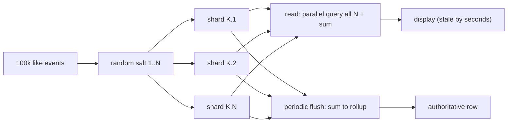

# Hot Keys, Salting, and Sharded Counters

Partitioning spreads *distinct* keys across nodes. It does nothing — can do
nothing — about traffic concentrated on **one** key: `hash(key)` is
deterministic, so every request for a viral post's counter lands on the same
partition and the same leader no matter how many nodes the cluster has. Hot
keys are the workload-shape failure that survives scaling out, and they have
their own mitigation toolkit: salting, caching, hierarchical aggregation,
CRDT counters, key-serialized queues, and key-level admission control.
Foundations are in [Partitioning](../partitioning/README.md),
[Hash Partitioning](../partitioning/hash.md),
[Range Partitioning](../partitioning/range.md), and
[Database Sharding](../../dbms/advanced/database-sharding.md); the
reshard-machinery connection is
[Online Resharding](../../dbms/advanced/online-resharding.md).

## The anatomy of a hot key

Uniform hashing guarantees a uniform distribution *of keys*. Traffic is a
separate, much heavier-tailed distribution: a few keys carry an extreme
share of requests. When one key's request rate exceeds what a single
partition (one leader, one lock manager, one network path) can serve, the
system throttles that key — and often its neighbors sharing the partition —
even though the cluster is half idle. GCP's Datastore best practices
document the failure precisely as *hotspotting*: "at high enough write
rates, the database will start to encounter contention, higher latency, or
other errors," and warn that even a system that will eventually split the
key space "will still see high write latencies for a period of time" after
a sudden spike.

Two directions of hotness, two different toolkits:

| | Read-hot key | Write-hot key |
|---|---|---|
| Shape | fan-*out* read storm: one object read by millions (celebrity profile, viral post body, config row) | fan-*in* write storm: millions of writes targeting one object (view counter, likes, rate-limit bucket) |
| Why hashing fails | every read still routes to the key's partition | every increment contends on one row/counter |
| First-line fix | cache the value near readers (TTL, coalescing), add read replicas | salt/shard the counter across keys |
| Fundamental limit | origin still needs one authoritative copy | read path must aggregate N shards |

The two classic social-graph patterns show both directions at once. A
celebrity posts once (one write) and millions of followers' timeline builds
read that one object — a read storm amortizable by caching. The same post's
*like counter* receives one write per liker — a write storm where caching
does nothing, because every cached copy still needs the same underlying
increment. Counters are the canonical write-hot key, and the rest of this
page is mostly about them.

## The mitigation toolkit

### Key salting / write sharding

Replace one hot write key `K` with `N` physical keys `K.1 ... K.N` and pick
the suffix at random (or round-robin) per increment. AWS's DynamoDB guide
describes the canonical version: "add a random number to the end of the
partition key values... for a partition key that represents today's date,
you might choose a random number between 1 and 200... Because you are
randomizing the partition key, the writes to the table on each day are
spread evenly across multiple partitions. This results in better
parallelism and higher overall throughput. However, to read all the items
for a given day, you would have to query the items for all the suffixes and
then merge the results."

Mechanics and choices:

- **Choosing N.** N must cover the *peak* second, not the average:
  `N ≥ peak QPS ÷ sustainable per-key rate`. Undershooting leaves the hot
  key hot (all salted keys may still hash to nearby partitions in
  fixed-slot systems); overshooting multiplies read cost, since **every
  read becomes an N-way scatter-gather** — N point queries plus a sum. The
  cost is real: a counter read that was one GET becomes N GETs, and a
  display that refreshes per impression multiplies it again. AWS's
  alternative, *calculated* suffixes (hash of an attribute you query on),
  trades write spreading for direct per-item access.
- **When to fan out.** Salting is for write-hot *aggregate* keys where
  exact per-key placement has no query value. Never salt a key whose
  identity is the point (a config row, a lock) — you would have to fan out
  the coordination you were trying to scale.
- **Changing N.** Raising N under fire is itself a micro-reshard: old
  suffixes drain before new ones take over, with the same epoch/cutover
  discipline as [Online Resharding](../../dbms/advanced/online-resharding.md).

Failure modes: N too small (still hot), N too large (N× read cost and
tail latency on every aggregate read), broken uniqueness (a "like" must
still dedupe per user *somewhere* — salting the counter does not salt the
identity table), and monitoring blindness — one key's dashboard splits
into N half-empty series unless you pre-aggregate the metric.

### Local caching + TTL (the read-side answer)

For read-hot keys, put a TTL'd copy at every replica, edge, or process.
Two properties matter:

- **How stale may it be?** Worst case ≈ `TTL + generation time + propagation`.
  A 5-second TTL on a per-replica counter makes reads locally served and
  bounds displayed drift to seconds — acceptable for view counts, not for
  billing.
- **Coalescing.** On expiry, one request re-fetches while the rest reuse
  the in-flight result (single-flight/request coalescing — see
  [Advanced Caching](../../dbms/caching/advanced-caching.md)). Without it,
  an expiring hot key re-creates the storm it was caching against — the
  cache-stampede/dogpile effect. Jitter TTLs so N replicas do not expire in
  the same millisecond.

Failure modes: staleness compounding across layers (edge TTL × service TTL
× replica TTL) and the inversion where a shared proxy's *cache entry*
becomes the hot key.

### Hierarchical aggregation (two-level counters)

Insert a level between the firehose and the authoritative row: shards (or
edges) own local deltas, and a periodic job flushes `sum(local) →
authoritative row`. Reads then use `authoritative + recent local deltas`,
and the authoritative write rate drops from per-event to per-flush. This is
exactly the shape of Firebase's distributed counters (a counter document
with a subcollection of shards, "the value of the counter is the sum of the
value of the shards... write throughput increases linearly with the number
of shards") combined with a rollup job. Failure modes: flush backlog under sustained spike (the rollup must itself
be sharded), double counting if recompute re-reads already-flushed deltas
(checkpoint the flush position), and rollup contention — the flush is a
fan-in again, just 1000× smaller.

### CRDT counters (the principled version)

A G-Counter is the sharded counter with correct merge semantics: each
replica owns a slot, increment touches only your slot, and merge is
elementwise `max` — commutative, associative, idempotent, so retries,
reordering, and duplicate gossip deliveries are all harmless (the
state-based merge rules in [CRDTs](../fundamentals/crdts.md)). A PN-Counter
adds a G-Counter of decrements for bidirectional counts. Why it fits hot
keys: increments are pure local writes (no coordination), merges are
monotonic and idempotent, and the slot count is bounded by *replica count*,
not by event count. The subtleties are metadata growth (per-replica slots —
the GC problem in [CRDT Internals](./crdt-deep.md)) and read cost (a full
merge to display). Delta-state CRDTs shrink the transfer to just the recent
deltas. If your sharded counter can be read stale and merged eventually, a
CRDT is the version of it that cannot be corrupted by retry storms.

### Queue-serialized per-key processing

If per-key events can tolerate a small delay, route them through a
partitioned log: Kafka's producer maps `key → partition` by hashing the
key, so all events for hot key `K` land on one partition and are processed
**serially** by one consumer, which batches them into a single periodic
write (`UPDATE ... SET views = views + 5000`). This converts 100k tiny
transactions into 1 aggregate write per flush and gives you natural
backpressure. Failure modes: the hot key's partition is the new hotspot — one consumer
owns the viral post while 99 partitions idle (scale by sub-keying inside
the consumer, which is salting again); consumer lag grows under spike;
and the sink must be idempotent across rebalances or you double-apply
batches (see [Kafka](../messaging/kafka.md) on offset semantics).

### Load shedding and admission control at the key level

When demand exceeds what salting plus caching can absorb, degrade
deliberately instead of randomly: per-key token buckets at the edge,
priority ordering (shed *view* increments before *like* increments), and
probabilistic sampling — count 1 in 10 increments as +10. Counting accuracy
becomes an explicit product decision instead of an accident (the key-level
slice of [Backpressure](../../interview/system-design/backpressure.md)).
Detection first: DynamoDB's Contributor Insights identifies "the most
frequently accessed and throttled keys in your table or index at a glance"
— put hot-key alerting on partition-level metrics before you need it.

## Sharded counters deep dive

**DynamoDB pattern.** The write-sharding page's date-partition example
(`2014-07-09.1` ... `2014-07-09.200`) is the template: write
`UPDATE shard SET c = c + 1 WHERE id = K.i` for random `i ∈ [1,N]`; read by
querying all N suffixes in parallel and summing. The read-side fan-out is
the price; "merge the results" must happen in your application.

**Redis pattern: INCR by shard with periodic compaction.** Keep `K:0..K:N-1`
as string counters and `INCR K:i` (atomic; Redis executes single-threaded
per instance, which is why sharding matters — one hot key pins one core).
A compactor periodically sums the shards and writes the rollup. The race:
an increment landing between the read and any "reset" is lost, so *never
reset shards in place* — keep accumulating and let epoch keys handle
expiry, or make reset an atomic `GETDEL` per shard and accept the in-flight
delta as part of the next epoch. Note `INCR` is limited to 64-bit signed
integers — sharding is for *throughput*, not overflow.

**Correct read-time merge.** Exact total = sum of all shards (N-way
scatter-gather; cost grows with N). Approximate total = read a subset of
shards and extrapolate, or track the display value via the rollup plus a
sampled correction — bounded error, constant read cost. For *unique*
viewers, counting is the wrong tool entirely: use sketches
([Sketch Algorithms](../../dbms/advanced/sketch-algorithms.md)) — HyperLogLog
gives distinct counts at constant memory with ~1-2% error, which is the
difference between a mergeable approximate answer and a wrong exact one.

**Idempotency of increments on retry.** `c = c + 1` is not idempotent: a
client retry after a timeout double-counts. Options, in increasing cost:
(1) accept the overcount (bounded by retry rate; usually fine for view
counters); (2) attach a unique increment ID and let the shard dedupe via a
short-TTL set; (3) make the counter event-sourced — append
`(counter_id, uuid, delta)` events and fold them idempotently, compacting
old events into the rollup.

**Counter resets and epoch keys.** Per-day counters with salt+date —
`likes:2024-07-09:i` — make cardinality bounded, give every shard a natural
expiration (a TTL on the shard keys is the tombstone: unexpired shards
participate in the sum, expired ones are gone), and prevent cross-day
contamination in the merge. The epoch boundary is the only safe place to
change N: day `d` uses N shards, day `d+1` uses N+8 — no live migration, no
lockstep cutover. This is the cheap alternative to rescuing an existing hot
key by resharding.

## Interview problems

### Problem 1 — View counter for a viral video, with exactness tiers

Design view counting for a video that hits 500k concurrent viewers, with
three levels of exactness and when each is acceptable.

- **Tier 1 — eventual/approximate (display).** Views are a marketing
  number; nobody audits ±0.5%. Salt the counter (N=32–128 per traffic),
  batch client heartbeats, dedupe cheaply (TTL'd per-session keys), read
  the rollup refreshed every few seconds. Staleness: seconds.
- **Tier 2 — strong approximation (recommendations, A/B).** Same event
  stream, but fold through sketches: HyperLogLog for unique viewers,
  sampled weighted counts for quality filtering. Constant memory, ~1%
  error, mergeable across shards and days.
- **Tier 3 — exact (payout, audit, contracts).** Money changes hands, so
  the counter becomes a ledger: append `(video_id, session_id, uuid)`
  events (idempotency key) through the partitioned log, fold with dedup,
  compact into per-hour rollups, reconcile shard sums against the ledger
  periodically. Exactness costs an event log plus dedup storage — applied
  only to the slice of data money depends on.

The interview answer is the *tiering*, not the architecture: exactness is a
cost dial, and each tier names its consumer.

### Problem 2 — Rate-limiting a celebrity API key globally

One API key (one partner, one viral client) is allowed 60,000 requests/minute
across your global fleet of 60 edge nodes. A global limit on one key is a
fan-in on one counter — the same hot-key problem in a compliance costume.

- **Naive central counter:** every request does `INCR`+`EXPIRE` on one Redis
  key. The key's traffic is bounded by the limit itself (60k/min ≈ 1k/s —
  one Redis instance handles it), *but* every request now pays a WAN round
  trip to the counter region, and the counter is on the critical path of
  the exact traffic most likely to spike.
- **Two-tier allocated buckets (the answer):** split the global budget into
  per-edge token buckets — 60 nodes × 1,000 req/min — filled locally,
  re-synced centrally every few seconds with rebalancing (edges under load
  borrow from idle edges). Admission is local (no added latency); the
  central sync is approximate, so global enforcement is
  "limit ± allocation skew for one sync interval." Choose the skew your
  contract tolerates: 60k ± 3% for 5-second sync.
- **Failure modes:** allocation drift under burst (one edge spends its
  minute in 10 seconds — local bucket absorbs it, global momentarily
  exceeded), cold-start after edge restart (start at borrowed-minimum, not
  full budget), and per-key *throttling telemetry* — you need
  per-key metrics back from every edge or you cannot see the celebrity at
  all.

### Problem 3 — "Likes" spike to 100k QPS on one post

- **Why the naive design dies:** one row, `UPDATE posts SET likes = likes+1`,
  is a single lock-serialized write path with one WAL append per like.
  Row-update throughput on a single hot row tops out orders of magnitude
  below 100k/s, and every retry amplifies the queue.
- **Salt it:** `likes:{post}:{0..N-1}`. Choose N from the per-shard
  sustainable rate: at ~1k QPS per shard, N = 128 gives headroom for the
  100k/s spike with burst factor ~1.25. Each increment is one tiny
  transaction on a *cold* row; contention drops to per-shard row locks.
- **Reads:** the UI shows a periodically refreshed sum — a scheduled job
  queries all 128 shards in parallel and writes the rollup every few
  seconds. A user tapping "like" gets optimistic UI; the count catches up
  in seconds. Per-user dedup lives in `likes_by_user(post, user)` — a
  unique constraint, not the counter — so salting the aggregate never
  permits double-likes.
- **Retry safety:** increments are retried by the client library on
  timeout; either accept the bounded overcount (display number) or attach
  the user's unique-constraint success as the increment's precondition —
  the counter only moves for rows that were actually inserted.
- **After the spike:** day-epoch keys (`likes:{post}:{date}:{i}`) expire
  the shards; the rollup row keeps the history. The 128 shard keys are
  tombstoned by TTL, and the per-user table carries the audit truth.

## Key Takeaways

- Hash partitioning balances *keys*, not *traffic*; a hot key pins one
  partition regardless of cluster size.
- Read-hot keys are a caching problem (TTL + coalescing); write-hot keys
  are a placement problem (salting) or a semantics problem (CRDT).
- Salting trades write contention for read fan-out: N is set by peak
  traffic ÷ per-key rate, and every read pays N queries.
- Retryable increments are not idempotent by default — decide where the
  dedup lives, or decide to accept the drift, explicitly.
- Epoch keys (salt + date) bound cardinality, provide safe expiry, and are
  the only free place to change N.

## Cross-References

- [Partitioning](../partitioning/README.md), [Hash Partitioning](../partitioning/hash.md), [Range Partitioning](../partitioning/range.md) — the distribution layer hot keys break.
- [Database Sharding](../../dbms/advanced/database-sharding.md) — shard keys, routing, and why hotspots motivate shard splits.
- [Online Resharding](../../dbms/advanced/online-resharding.md) — moving load when salting alone is not enough; changing N under traffic.
- [CRDTs](../fundamentals/crdts.md) and [CRDT Internals](./crdt-deep.md) — G/PN-Counter merge semantics, delta-state transfer, metadata GC.
- [Sketch Algorithms](../../dbms/advanced/sketch-algorithms.md) — approximate distinct counting for unique-view metrics.
- [Kafka](../messaging/kafka.md) — key-to-partition routing behind queue-serialized per-key processing.
- [Backpressure](../../interview/system-design/backpressure.md) — system-level overload management; this page is its key-level slice.
- [Analytics Platform](../../interview/system-design/real-world/analytics-platform.md) — where the event streams feeding counters land.

## References

- G. DeCandia et al., "[Dynamo: Amazon's Highly Available Key-value Store](https://www.allthingsdistributed.com/files/amazon-dynamo-sosp2007.pdf)", *SOSP 2007* (DOI 10.1145/1294261.1294281) — §4.4 versioning/overflow and the fallback-node clock-growth problem.
- AWS DynamoDB Developer Guide, "[Use write sharding to distribute workloads evenly](https://docs.aws.amazon.com/amazondynamodb/latest/developerguide/bp-partition-key-sharding.html)" — random vs calculated suffixes and the read-side merge cost.
- AWS DynamoDB Developer Guide, "[Analyzing data access using CloudWatch Contributor Insights](https://docs.aws.amazon.com/amazondynamodb/latest/developerguide/contributorinsights.html)" — identifying most-frequently accessed and throttled keys.
- Firebase (Google), "[Distributed counters](https://firebase.google.com/docs/firestore/solutions/counters)" — shard subcollection, sum-on-read, linear write scaling, per-shard update rate.
- Google Cloud, "[Cloud Datastore best practices](https://cloud.google.com/datastore/docs/best-practices)" — hotspotting: causes, the ramp-traffic rule, and eventual key-space splitting.
- Redis, "[INCR](https://redis.io/docs/latest/commands/incr/)" — atomic 64-bit increment semantics; single-threaded execution per instance.
- Apache Kafka, [Documentation](https://kafka.apache.org/documentation/) — producer key→partition hashing (`#producerapi`), offset/retry semantics.
