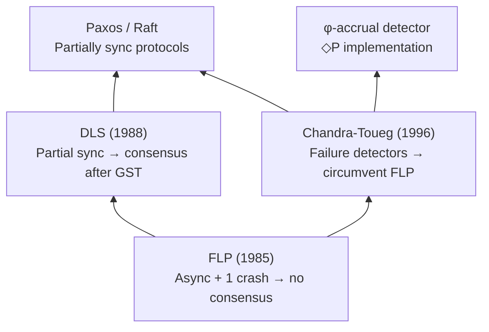

# Impossibility Models & Failure Detectors

> **Reference papers**: Fischer, Lynch & Paterson (1985); Dwork, Lynch & Stockmeyer (1988); Chandra & Toueg (1996)

## FLP Impossibility: Proof Sketch

The FLP theorem (Fischer, Lynch, Paterson, 1985) states: **no deterministic consensus protocol can guarantee safety and liveness in an asynchronous system with even one crash failure**.

### System Model

- **Asynchronous**: no bounds on message delay or relative process speeds
- **Crash-stop**: a process may halt and never recover
- **Consensus**: every correct process must decide on the same value, and that value must have been proposed by some process

### Proof Intuition

The proof proceeds by contradiction. Assume a deterministic protocol `A` solves consensus. We show that starting from any *bivalent* configuration (one where the decision is not yet determined), there always exists an adjacent bivalent configuration reachable by some admissible execution. This means the protocol can be kept in bivalent states forever by an adversarial scheduler.

```
  Configuration Space
  ┌──────────────────────────────────┐
  │  Bivalent  →  Bivalent  →  ... │  ← adversary keeps system here
  │     ↓             ↓              │
  │  Univ 0      Univ 1             │
  └──────────────────────────────────┘
```

The key step uses the **bivalency lemma**: from any bivalent configuration `C`, there exists a process `p` such that both `C` with `p`'s next step and `C` with a delayed step from `p` remain bivalent. The adversary schedules `p` last, ensuring the system never commits to univalent.

### Formal Trace

1. Define `val(C, e)` as the set of possible decision values from configuration `C` under execution `e`
2. Bivalent: `|val(C, e)| = 2`; Univalent: `|val(C, e)| = 1`
3. Every initial configuration is bivalent (since input is not fixed)
4. Show: from any bivalent config, an adjacent bivalent config is reachable
5. Therefore, no protocol can guarantee termination

> **Interview Angle**: "How does FLP differ from CAP?" FLP is about async + 1 crash; CAP is about network partition + availability vs consistency. FLP says you *can't* guarantee both safety and liveness; CAP says during a partition you must choose which to sacrifice. FLP is a theorem (proven); CAP is a tradeoff framework (with caveats like PACELC).

## System Synchrony Classes

### Fully Asynchronous

No timing assumptions whatsoever. Messages may be delayed arbitrarily. The FLP result applies directly. Real-world examples: the internet at its worst.

### Synchronous

Known upper bounds on message delay (`Δ`), processing time, and clock drift. In a synchronous system with `f < n/2` crash failures, consensus *is* solvable (e.g., via synchronous round-by-round protocols like the Ben-Or variant with synchronous rounds).

### Partially Synchronous (DLS, 1988)

The **Dwork-Lynch-Stockmeyer (DLS)** model introduces partial synchrony — the critical escape hatch from FLP. There are two equivalent formulations:

1. **GST model**: there exists an unknown *Global Stabilization Time* (GST) after which the system becomes synchronous (bounds hold). Before GST, anything goes.
2. **Unknown bound model**: bounds on message delay exist but are unknown to the protocol.

```
  Time →
  ──┬──────────────┬────────────────────────
    │   ASYNC      │    SYNCHRONOUS          
    │  (anything)  │   (bounds hold)         
    └─── GST ──────┘                         
```

Virtually all practical consensus protocols (Paxos, Raft, PBFT, HotStuff) operate in the partially synchronous model. They guarantee safety always and liveness only after GST.

| Model | Consensus Solvable? | Practical Use |
|-------|---------------------|---------------|
| Fully Async | No (FLP) | Theoretical baseline |
| Synchronous | Yes (deterministic rounds) | BFT in fixed-round settings |
| Partially Sync | Yes (after GST) | Paxos, Raft, Tendermint |

## Failure Detectors (Chandra-Toueg, 1996)

Chandra and Toueg showed that **weakest failure detectors** that solve consensus in async systems can be classified hierarchically. Failure detectors are oracles that provide hints about which processes have crashed.

### Failure Detector Hierarchy

```mermaid
graph TD
    P[&#x1F7E2; Perfect &#40;P&#41;] --> S[&#x1F7E1; Strong &#40;S&#41;]
    P --> W[&#x1F534; Weak &#40;W&#41;]
    S --> W
    S --> Q[&#x1F7E0; Strong &#40;&#x3A9;&#41;]
    W --> Q
```



### Perfect Failure Detector (P)

- **Completeness**: eventually detects every crashed process
- **Accuracy**: never suspects a correct process
- Requires synchronous links to implement; not realistic for large systems
- Used in: synchronous round protocols, theoretical analysis

### Eventually Perfect Failure Detector (◇P)

- **Completeness**: eventually detects every crashed process (strong completeness)
- **Accuracy**: there exists a time after which it never suspects a correct process (eventual strong accuracy)
- **Weakest** for solving consensus with crash failures
- Implemented via timeouts with adaptive estimation (e.g., Raft's election timeout, φ-accrual failure detector in Akka/Swift)
- Raft's heartbeat mechanism is essentially an ◇P implementation

### Strong Failure Detector (S)

- **Completeness**: eventually detects every crashed process
- **Accuracy**: never suspects a correct process
- A weaker form: eventually strong (◇S) exists

### Weak Failure Detector (W)

- **Completeness**: eventually, some correct process is never suspected by any correct process
- Weaker than S; sufficient for some problems (e.g., mutual exclusion)

### Eventually Strong Failure Detector (◇S / Ω)

- **Accuracy**: eventually, some correct process is never suspected
- **Completeness**: every crashed process is eventually suspected
- Equivalent to ◇P for consensus
- φ-accrual detector (Hayashibara et al., 2004) approximates this by maintaining a probability distribution of inter-arrival times and suspecting when the cumulative probability of a heartbeat being late exceeds a threshold

### Failure Detector Implementations

```python
# Phi-accrual failure detector (simplified)
class PhiAccrualDetector:
    def __init__(self, max_samples=100):
        self.heartbeat_window = Window(max_samples)  # sliding window
        self.last_heartbeat = now()
    
    def heartbeat(self):
        interval = now() - self.last_heartbeat
        self.heartbeat_window.add(interval)
        self.last_heartbeat = now()
    
    def phi(self):
        # P(next_heartbeat > now - last_heartbeat | history)
        elapsed = now() - self.last_heartbeat
        return -log10(1 - self.heartbeat_window.cdf(elapsed))
    
    def is_alive(self, threshold=8.0):
        # phi grows as elapsed grows; threshold = suspicion level
        return self.phi() < threshold
```

> **Interview Angle**: "How does Raft handle failure detection?" Raft uses a heartbeat-based ◇P detector. Followers reset their election timer on each AppendEntries RPC. If the timer expires, they suspect the leader and start an election. The randomized timeout (150–300ms) prevents split votes. This is an eventually-perfect detector: crashed leaders will eventually not send heartbeats, and after GST, correct leaders' heartbeats arrive in time.

## Failure Models

### Crash-Stop

A process halts and never recovers. This is the simplest and most commonly assumed model. Once a process crashes, it sends no further messages. Protocols like Paxos and Raft handle this by maintaining a quorum of live processes.

### Crash-Recovery

A process may crash and later restart (potentially with stable storage). This model is more realistic — it's what real systems face. It requires:
- **Stable storage** (WAL, checkpoint) to persist state across crashes
- **Recovery protocols** to reintegrate the process
- Raft handles this via persistent log entries and the `prevLogIndex`/`prevLogIndex` consistency check during AppendEntries

### Omission Faults

A process may fail to send or receive messages that it is supposed to. This includes:
- **Send omission**: a message is not sent (but the process doesn't crash)
- **Receive omission**: a message is sent but not received
- **General omission**: both types
- This models network-level packet loss without process failure

### Byzantine (Arbitrary) Faults

A process may behave *arbitrarily* — sending contradictory messages, lying about its state, or colluding with other faulty processes. Byzantine faults subsume all other fault types. Handling `f` Byzantine faults requires at least `3f + 1` processes (vs. `2f + 1` for crash faults).

### Failure Model Comparison

| Model | Min Processes for `f` Faults | Practical Difficulty | Real-World Examples |
|--------|-----|------|------|
| Crash-stop | `f + 1` (for liveness: `2f + 1`) | Low | Process crash, OOM kill |
| Crash-recovery | `2f + 1` | Medium | VM restart, container reschedule |
| Omission | `2f + 1` | Medium | Network congestion, buffer overflow |
| Byzantine | `3f + 1` | High | Software bugs, compromised nodes, hardware faults |

> **Interview Angle**: "Why does Byzantine consensus need 3f+1 nodes?" With f Byzantine nodes, we need enough correct nodes to outvote them. In a vote with n nodes, f might lie and f correct nodes might be isolated by the liars' messages, leaving n - 2f correct nodes. We need n - 2f > f, so n > 3f, i.e., n ≥ 3f + 1.

## Network Partitions & Split Brain

### Network Partitions

A network partition occurs when communication between subsets of nodes is severed. In the CAP framework, this forces a choice between consistency (CP) and availability (AP).

### Split Brain

Split brain is the dangerous scenario where **both sides of a partition believe they are the authoritative leader** and accept writes independently. This leads to divergence that may be unreconcilable.

```
Before partition:          After partition:
┌─────────────┐           ┌──────────┐  ╳  ┌──────────┐
│  Leader A   │           │ Leader A │     │ Node C   │
│  Node B     │           │ Node B   │     │ Node D   │
│  Node C     │           └──────────┘     └──────────┘
│  Node D     │            Quorum: 2/4     "Who am I?"
└─────────────┘
```

### Preventing Split Brain

1. **Quorums**: require majority for both reads and writes; only one partition can achieve quorum
2. **Fencing tokens**: each leader gets a monotonically increasing token; stale leaders' writes are rejected
3. **Leases**: leaders hold time-bounded leases; a partitioned leader's lease expires, making writes invalid
4. **Witness nodes**: nodes that vote in quorums but don't serve data (CockroachDB uses this)
5. **Generation numbers / epochs**: each leader term has a unique ID; lower-term leaders are ignored (Raft's approach)

### Partition Recovery

After a partition heals, the system must reconcile divergent state:
- **Last-writer-wins (LWW)**: use timestamps to pick the winner (Dynamo)
- **Read repair / anti-entropy**: compare and merge using Merkle trees (Cassandra)
- **Version vectors**: detect conflicts and trigger application-level merge
- **Conflict-free replicated data types (CRDTs)**: mathematically guaranteed to converge

> **Interview Angle**: "How does CockroachDB handle network partitions?" CockroachDB uses Raft for consensus on each range. During a partition, only the majority partition can make progress. It also uses *lease holders* — a specific replica designated to serve reads without Raft round-trips. The lease has an expiration; if the lease holder is partitioned away, the lease expires and another replica acquires it. This prevents split brain because only the lease holder can serve consistent reads.

## Relationship Between Models



The progression is clear: FLP establishes the hard limit in pure asynchrony. The community found two escape routes — partial synchrony (DLS) and failure detectors (Chandra-Toueg). All production systems use one or both of these approaches.
