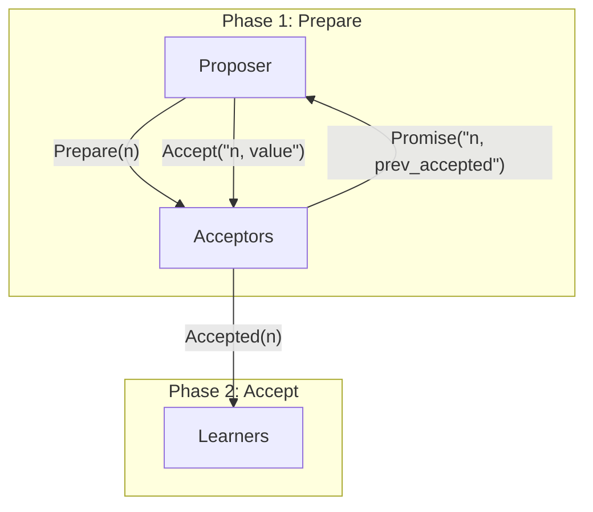
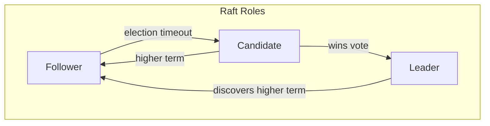
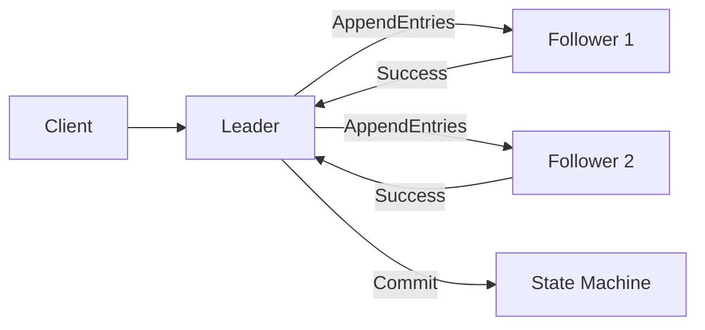

# Consensus Algorithms

## Overview

Consensus algorithms are fundamental to distributed systems. They allow a group of nodes to agree on a single value or state, even in the presence of failures. Understanding consensus is critical for designing reliable distributed systems.

## Why Consensus Matters

- **Leader election**: Choose a coordinator node
- **State replication**: Keep replicas consistent
- **Configuration management**: Agree on cluster configuration
- **Transaction commit**: Coordinate distributed transactions

## FLP Impossibility Theorem

The Fischer, Lynch, Paterson (FLP) theorem proves that in an asynchronous system, even a single faulty process makes consensus impossible to guarantee. In practice, we work around this with:
- Partial synchrony assumptions
- Failure detectors
- Randomization

## Paxos

### Overview

Paxos is the foundational consensus algorithm proposed by Leslie Lamport. It's notoriously difficult to understand and implement.

### Roles

| Role | Responsibility |
|------|---------------|
| **Proposer** | Proposes values, drives the protocol |
| **Acceptor** | Votes on proposals, stores accepted values |
| **Learner** | Learns the decided value |

### Two Phases

1. **Prepare**: Proposer sends prepare(n) to acceptors. Acceptors promise not to accept proposals numbered less than n.
2. **Accept**: If majority promises, proposer sends accept(n, value). Acceptors accept if they haven't promised higher.

### Multi-Paxos

- Single proposer becomes leader
- Skip Phase 1 for subsequent values
- Much higher throughput

## Raft

### Overview

Raft was designed to be more understandable than Paxos. It's used in etcd, Consul, CockroachDB, and many other systems.

### Key Concepts

| Role | Description |
|------|-------------|
| **Follower** | Passive, responds to RPCs |
| **Candidate** | Requests votes to become leader |
| **Leader** | Handles all client requests, replicates log |

### Leader Election

1. Follower doesn't hear from leader → becomes candidate
2. Increments term, votes for self, requests votes
3. Wins if majority votes for same term
4. Split vote → random timeout, retry

### Log Replication

1. Client sends command to leader
2. Leader appends to log, replicates to followers
3. Once majority acknowledges → commit
4. Apply to state machine, respond to client

### Safety Properties

- **Election safety**: At most one leader per term
- **Log matching**: If two logs have entry with same index and term, all preceding entries match
- **Leader completeness**: If entry committed in term, present in logs of leaders for all higher terms
- **State machine safety**: If server applies entry at index, no other server applies different entry at same index

## ZAB (ZooKeeper Atomic Broadcast)

Used by Apache ZooKeeper. Similar to Raft but with different terminology:
- **Leader election**: Similar to Raft
- **Discovery**: Leader learns latest state
- **Synchronization**: Followers sync with leader
- **Broadcast**: Normal operation, leader broadcasts proposals

## PBFT (Practical Byzantine Fault Tolerance)

Handles Byzantine (arbitrary) faults, not just crash faults.

| Algorithm | Fault Type | Faults Tolerated | Messages |
|-----------|-----------|-----------------|----------|
| Paxos/Raft | Crash | f < n/2 | O(n) |
| PBFT | Byzantine | f < n/3 | O(n²) |

### PBFT Phases

1. **Pre-prepare**: Leader assigns sequence number
2. **Prepare**: Nodes broadcast prepare messages
3. **Commit**: When 2f+1 prepares received, broadcast commit
4. **Reply**: When 2f+1 commits received, execute

## Comparison

| Feature | Paxos | Raft | ZAB | PBFT |
|---------|-------|------|-----|------|
| **Fault type** | Crash | Crash | Crash | Byzantine |
| **Faults tolerated** | f < n/2 | f < n/2 | f < n/2 | f < n/3 |
| **Leader** | Optional | Required | Required | Required |
| **Understandability** | Hard | Easy | Medium | Hard |
| **Used by** | Chubby | etcd, Consul | ZooKeeper | Blockchain |

## Real-World Implementations

| System | Algorithm | Use Case |
|--------|-----------|----------|
| **etcd** | Raft | Kubernetes configuration |
| **Consul** | Raft | Service discovery |
| **ZooKeeper** | ZAB | Coordination service |
| **CockroachDB** | Raft | Distributed SQL |
| **TiKV** | Raft | Distributed KV |
| **Chubby** | Paxos | Google lock service |

## Interview Questions

### Q1: Why is consensus hard in distributed systems?

Because of the FLP impossibility result: in a purely asynchronous system, even one faulty process makes consensus impossible to guarantee. We need partial synchrony or failure detectors.

### Q2: Raft vs Paxos?

Raft is designed for understandability. It decomposes consensus into leader election, log replication, and safety. Paxos is more general but harder to implement correctly. Most modern systems use Raft.

### Q3: How does Raft handle network partitions?

The partition with majority of nodes continues to operate (elects leader, commits entries). The minority partition becomes unavailable. When partition heals, the minority syncs with the majority's log.

### Q4: What is linearizability?

A consistency model where every operation appears to take effect atomically at some point between its invocation and response. It's the strongest single-object consistency model.

### Q5: CAP theorem in practice?

You can't have all three of Consistency, Availability, and Partition tolerance. Since partitions are unavoidable, the real choice is between CP (consistent but may be unavailable) and AP (available but may be inconsistent).

## Related Topics

- [CAP Theorem](../cap-theorem.md) — Fundamental trade-off
- [Distributed Storage](../../storage/distributed.md) — Storage systems
- [Distributed Databases](../../dbms/distributed/) — Database replication
- [System Design](../../interview/system-design/) — Designing distributed systems
