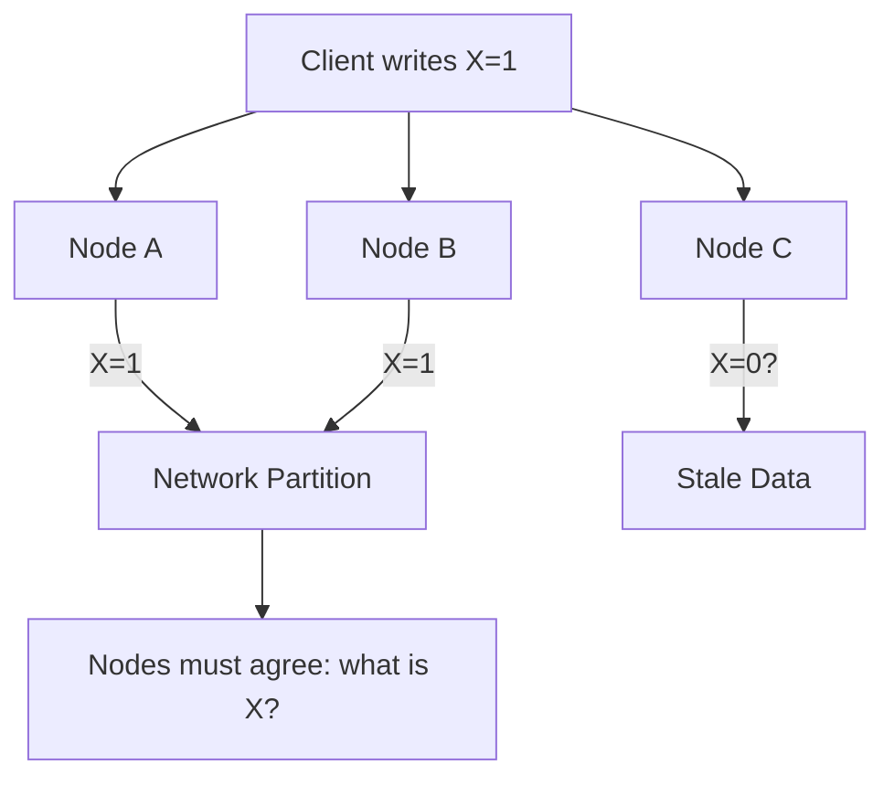
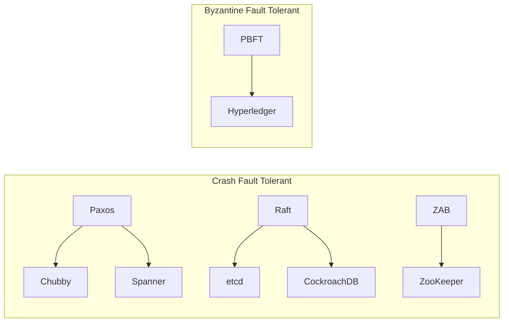

# Consensus Algorithms

## Overview

Consensus is the fundamental problem in distributed systems: how do multiple independent nodes agree on a single value or sequence of values? This is critical for maintaining consistency across replicas, electing leaders, and coordinating distributed transactions.

Without consensus, distributed systems cannot guarantee that all nodes see the same data or agree on the order of operations.

## Why Consensus Matters

In a distributed system, nodes can fail, messages can be lost or reordered, and network partitions can split the cluster. Consensus algorithms ensure that despite these failures, all non-faulty nodes eventually agree on the same value.

## The FLP Impossibility Result

Fischer, Lynch, and Paterson (1985) proved that **no deterministic consensus algorithm can guarantee agreement in an asynchronous system if even one process may crash**. This doesn't mean consensus is impossible — it means algorithms must use randomness, timeouts, or partial synchrony assumptions.

## Properties of Consensus

Every consensus algorithm must satisfy:

| Property | Description |
|----------|-------------|
| **Agreement** | All correct processes decide the same value |
| **Validity** | The decided value was proposed by some process |
| **Termination** | All correct processes eventually decide |
| **Integrity** | Each process decides at most once |

## Fault Tolerance Bounds

| Fault Type | Min Nodes for f faults |
|-----------|----------------------|
| Crash faults | 2f + 1 |
| Byzantine faults | 3f + 1 |

## Algorithm Comparison

| Algorithm | Fault Type | Communication | Leader-based | Used In |
|-----------|-----------|---------------|-------------|---------|
| **Paxos** | Crash | Multi-round | Optional | Google Chubby, Spanner |
| **Raft** | Crash | Multi-round | Yes | etcd, CockroachDB, TiKV |
| **ZAB** | Crash | Multi-round | Yes | ZooKeeper |
| **PBFT** | Byzantine | 3-phase | Yes | Hyperledger |

## Consensus in Practice

## Interview Questions

1. **What is the consensus problem in distributed systems?**
   - Multiple nodes must agree on a single value despite failures. The algorithm must guarantee agreement, validity, termination, and integrity.

2. **Why is consensus hard?**
   - The FLP impossibility result shows deterministic consensus is impossible in purely asynchronous systems with even one crash failure. Real systems use timeouts or partial synchrony.

3. **What's the difference between crash faults and Byzantine faults?**
   - Crash faults: nodes stop responding. Byzantine faults: nodes can behave arbitrarily (lie, send conflicting messages). Byzantine requires 3f+1 nodes; crash requires 2f+1.

4. **When do you need consensus vs. simple replication?**
   - Consensus is needed when you need strong consistency guarantees (linearizability). Simple replication (eventual consistency) suffices for availability-prioritized systems.

## Common Mistakes

- Confusing **consensus** with **replication** — consensus is about agreeing on values; replication is about copying data
- Assuming consensus is cheap — each consensus round requires multiple network round-trips
- Forgetting that **leader election** is itself a consensus problem
- Not considering **network partitions** when choosing a consensus algorithm

## Summary

Consensus is the backbone of distributed systems. Paxos, Raft, ZAB, and PBFT are the most important algorithms to understand. Each makes different trade-offs between fault tolerance, performance, and complexity.

## Cross-References

- [Paxos Algorithm](paxos.md) — The classic consensus protocol
- [Raft Consensus](raft.md) — Understandable consensus
- [ZooKeeper Atomic Broadcast](zab.md) — ZAB protocol
- [PBFT](pbft.md) — Byzantine fault tolerance
- [Primary-Backup Replication](../replication/primary-backup.md) — Uses consensus for failover
- [Quorum-Based Replication](../replication/quorum.md) — Related voting mechanisms
