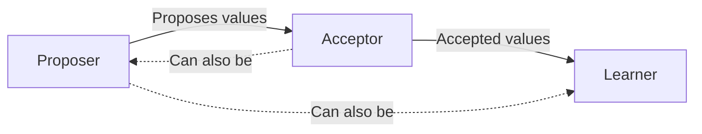
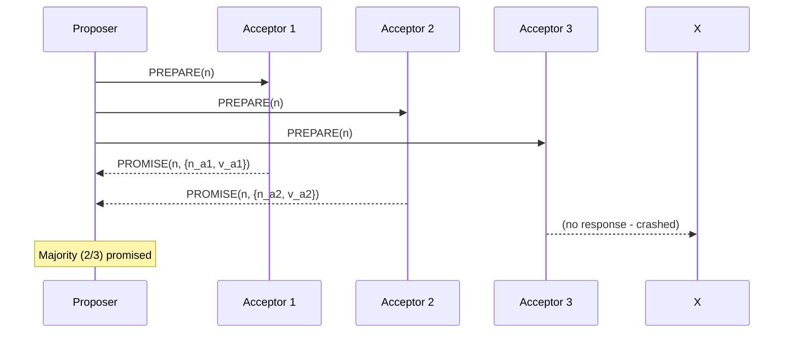
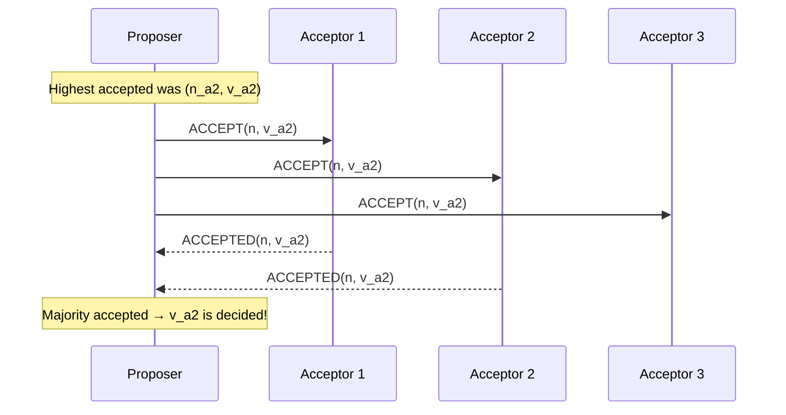
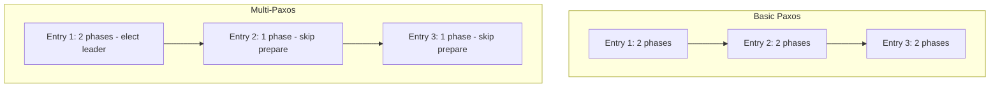
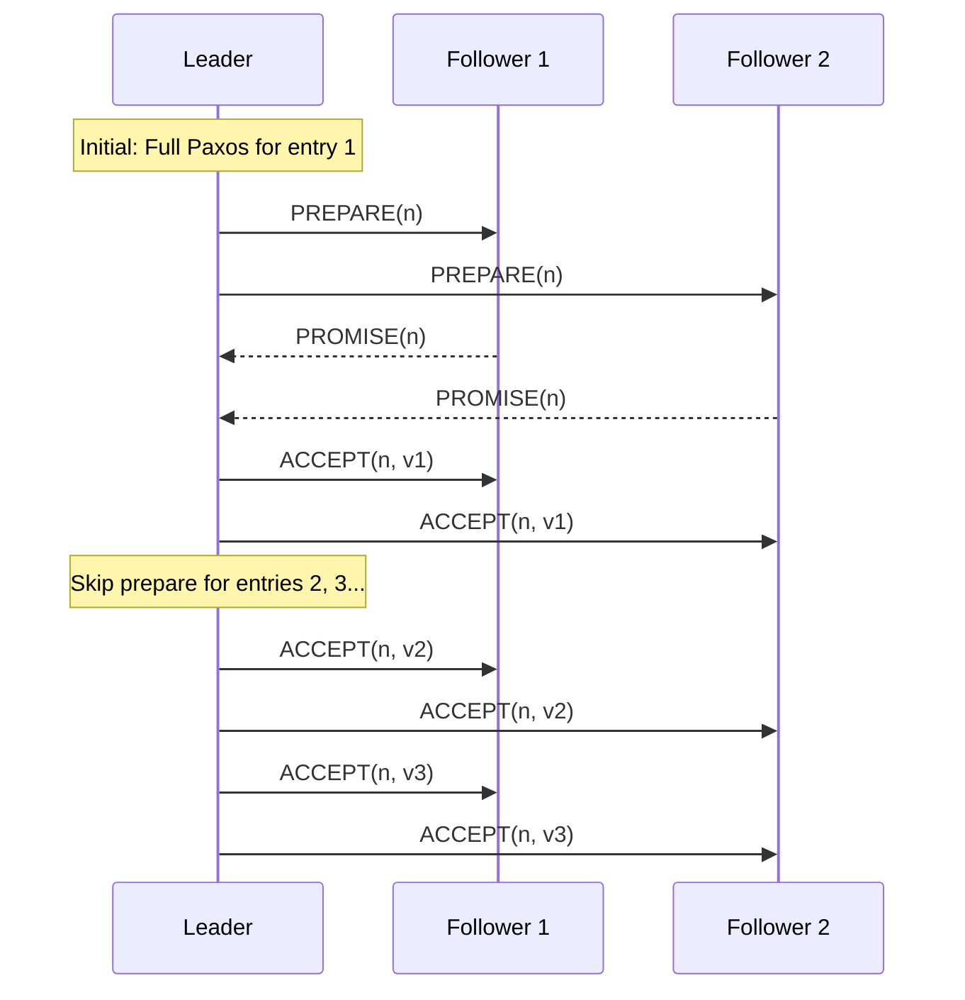
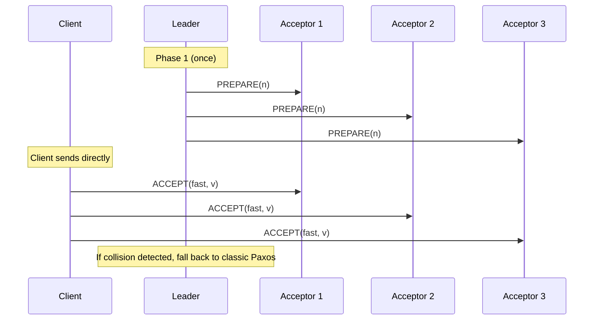

# Paxos Algorithm

## Overview

Paxos is the foundational consensus algorithm, first described by Leslie Lamport in 1989 (published 1998). It allows a distributed system to agree on a single value even if nodes crash or messages are lost. Despite its reputation for complexity, Paxos is the basis for many production systems including Google's Chubby lock service and Spanner database.

## The Problem

How do distributed nodes agree on one value when:
- Messages can be lost, duplicated, or reordered
- Nodes can crash and restart
- There is no global clock

## Roles in Paxos

Paxos defines three roles (a node can play multiple roles):



| Role | Responsibility |
|------|---------------|
| **Proposer** | Proposes a value and drives the consensus process |
| **Acceptor** | Votes on proposals; forms a quorum |
| **Learner** | Learns the decided value |

## The Two Phases

### Phase 1: Prepare

The proposer selects a proposal number `n` (must be unique and higher than any previous number) and sends a `PREPARE(n)` message to a majority of acceptors.



When an acceptor receives `PREPARE(n)`:
- If `n` is **higher** than any prepare it has responded to: it **promises** not to accept proposals numbered less than `n`, and returns the highest-numbered proposal it has accepted (if any)
- If `n` is **lower** than a prepare it already responded to: it **ignores** or sends a `NACK`

### Phase 2: Accept

If the proposer receives promises from a **majority** of acceptors, it sends `ACCEPT(n, v)` where:
- `v` is the value of the **highest-numbered proposal** among the promises received
- If no acceptor had accepted a proposal, the proposer can choose its own value



When an acceptor receives `ACCEPT(n, v)`:
- If it has **not promised** to ignore proposals numbered `n`: it **accepts** the proposal
- Otherwise: it **ignores** the request

### Phase 3: Learn (Optional)

Once a value is accepted by a majority, learners are notified of the decided value.

## Complete Paxos Example

```mermaid
sequenceDiagram
    participant P1 as Proposer 1 (n=1)
    participant P2 as Proposer 2 (n=2)
    participant A1 as Acceptor 1
    participant A2 as Acceptor 2
    participant A3 as Acceptor 3
    
    Note over P1: Phase 1: Prepare
    P1->>A1: PREPARE(1)
    P1->>A2: PREPARE(1)
    A1-->>P1: PROMISE(1, null)
    A2-->>P1: PROMISE(1, null)
    
    Note over P2: Higher proposal arrives
    P2->>A2: PREPARE(2)
    P2->>A3: PREPARE(2)
    A2-->>P2: PROMISE(2, null)
    A3-->>P2: PROMISE(2, null)
    
    Note over P1: Phase 2: Accept (using own value)
    P1->>A1: ACCEPT(1, "X")
    P1->>A2: ACCEPT(1, "X")
    A2 ignores (promised 2)
    A1-->>P1: ACCEPTED(1, "X")
    Note over P1: Only 1/3 accepted, no majority
    
    Note over P2: Phase 2: Accept
    P2->>A2: ACCEPT(2, "Y")
    P2->>A3: ACCEPT(2, "Y")
    A2-->>P2: ACCEPTED(2, "Y")
    A3-->>P2: ACCEPTED(2, "Y")
    Note over P2: 2/3 accepted → "Y" is decided!
```

## Multi-Paxos

Basic Paxos decides a single value. To agree on a **sequence of values** (a log), running Paxos for each entry is expensive. Multi-Paxos optimizes this:



### Key Optimizations

1. **Stable Leader**: A single proposer is elected as leader. Once elected, it skips Phase 1 for subsequent proposals.
2. **Log Replication**: Each entry in the log is a separate Paxos instance, but the leader only runs Phase 1 once.
3. **Leader Lease**: The leader maintains a lease to avoid conflicts.

### Multi-Paxos Flow



## Fast Paxos

Fast Paxos reduces latency by allowing clients to send values directly to acceptors, bypassing the leader:



**Trade-off**: Fast Paxos requires a larger quorum (⌈3n/4⌉+1 instead of ⌈n/2⌉+1) to handle collisions.

## Paxos vs. Raft

| Aspect | Paxos | Raft |
|--------|-------|------|
| Understandability | Complex | Designed for clarity |
| Leader | Optional (Multi-Paxos has one) | Mandatory |
| Log gaps | Allowed | Not allowed |
| Membership changes | Complex | Joint consensus |
| Implementation | Many variants | Single specification |

## Real-World Usage

| System | How Paxos is Used |
|--------|------------------|
| **Google Chubby** | Lock service using Multi-Paxos |
| **Google Spanner** | Replication across data centers |
| **Apache Cassandra** | Lightweight transactions use Paxos |
| **Microsoft Azure** | Azure SQL uses Paxos for replication |

## Interview Questions

1. **Explain the two phases of Paxos.**
   - Phase 1 (Prepare): Proposer sends PREPARE(n) to majority; acceptors promise not to accept lower-numbered proposals. Phase 2 (Accept): Proposer sends ACCEPT(n,v) to majority; value is decided if majority accepts.

2. **What happens if two proposers compete in Paxos?**
   - They can livelock by continuously overriding each other's proposals. Multi-Paxos solves this with a stable leader.

3. **Why does Paxos require a majority quorum?**
   - Any two majorities must overlap by at least one node, ensuring that if one majority accepted a value, a later majority will learn about it.

4. **What is the difference between Paxos and Multi-Paxos?**
   - Paxos decides one value. Multi-Paxos decides a sequence of values by electing a stable leader that skips Phase 1 for subsequent entries.

5. **How does Fast Paxos differ from classic Paxos?**
   - Fast Paxos allows clients to send directly to acceptors (1 fewer round-trip) but requires a larger quorum (3n/4+1) to handle collisions.

## Common Mistakes

- Thinking Paxos is simple — it's notoriously hard to implement correctly
- Confusing **proposal numbers** with **values** — proposal numbers are for ordering, values are the data
- Forgetting that Paxos requires **majority quorums**, not just any majority of nodes
- Assuming Paxos handles Byzantine faults — it only handles crash faults
- Not handling **dueling proposers** (livelock) in basic Paxos

## Summary

Paxos is the theoretical foundation of consensus in distributed systems. While complex, understanding its two-phase prepare-accept mechanism is essential. Multi-Paxos extends it to log replication with a stable leader, and Fast Paxos optimizes for latency. Most production systems use Raft (which is equivalent to Multi-Paxos) for its clarity.

## Cross-References

- [Consensus Overview](README.md) — Where Paxos fits in the landscape
- [Raft Consensus](raft.md) — A more understandable alternative
- [ZAB](zab.md) — ZooKeeper's similar protocol
- [Primary-Backup Replication](../replication/primary-backup.md) — Uses consensus for failover
- [Service Discovery](../microservices/discovery.md) — Often built on consensus (etcd uses Raft)
